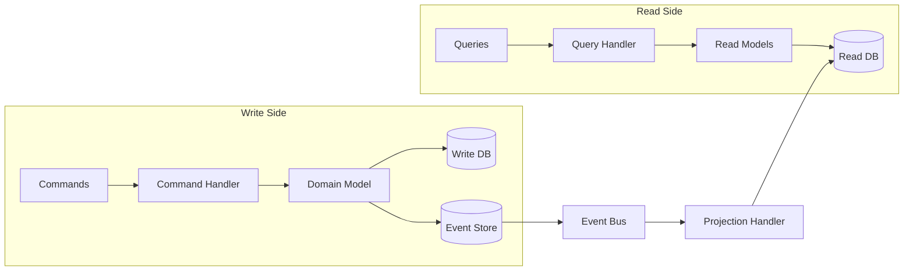

# Advanced Microservices Patterns Research

## Executive Summary

This document provides comprehensive research on advanced microservices patterns that go beyond basic architectural patterns. These patterns address complex distributed system challenges including distributed transactions, event-driven architectures, reliable messaging, and migration strategies.

## 1. Saga Pattern - Distributed Transaction Management

### Overview
The Saga pattern manages distributed transactions across multiple microservices by breaking them into a series of local transactions. Each service performs its local transaction and publishes events to trigger the next step.

### Implementation Approaches

#### Choreography-Based Saga
```yaml
Pattern: Event-driven coordination
Characteristics:
  - Decentralized control
  - Services communicate via events
  - No central coordinator
  - Higher service autonomy

Flow Example:
  Order Service → (OrderCreated) → 
  Payment Service → (PaymentProcessed) →
  Inventory Service → (ItemsReserved) →
  Shipping Service → (OrderShipped)
```

#### Orchestration-Based Saga
```yaml
Pattern: Centralized coordination
Characteristics:
  - Central saga orchestrator
  - Explicit transaction flow
  - Easier monitoring and debugging
  - Single point of failure risk

Components:
  - Saga Orchestrator
  - State Machine
  - Compensation Logic
  - Timeout Handlers
```

### Implementation Example
```javascript
// Saga Orchestrator Implementation
class OrderSaga {
  constructor(orderService, paymentService, inventoryService) {
    this.steps = [
      {
        name: 'CreateOrder',
        forward: (data) => orderService.create(data),
        compensate: (data) => orderService.cancel(data.orderId)
      },
      {
        name: 'ProcessPayment',
        forward: (data) => paymentService.charge(data),
        compensate: (data) => paymentService.refund(data.paymentId)
      },
      {
        name: 'ReserveInventory',
        forward: (data) => inventoryService.reserve(data),
        compensate: (data) => inventoryService.release(data.items)
      }
    ];
  }

  async execute(orderData) {
    const executedSteps = [];
    
    try {
      for (const step of this.steps) {
        const result = await step.forward(orderData);
        executedSteps.push({ step, result });
      }
      return { success: true, results: executedSteps };
    } catch (error) {
      // Compensate in reverse order
      for (const { step, result } of executedSteps.reverse()) {
        await step.compensate(result);
      }
      throw new SagaFailedException(error);
    }
  }
}
```

### Industry Case Studies

#### Uber's Distributed Transactions
- Uses choreography-based sagas for ride booking
- Each service (matching, pricing, payment) operates independently
- Compensation: Automatic refunds on cancellation
- Performance: Handles millions of transactions daily

#### Amazon's Order Management
- Orchestration-based approach for complex workflows
- Step Functions for saga orchestration
- Comprehensive compensation strategies
- Scalability: Processes billions of orders annually

### Common Pitfalls and Solutions

1. **Isolation Anomalies**
   - Problem: Dirty reads between saga transactions
   - Solution: Semantic locks and versioning

2. **Compensation Complexity**
   - Problem: Complex rollback scenarios
   - Solution: Idempotent operations and event sourcing

3. **Timeout Handling**
   - Problem: Long-running transactions timing out
   - Solution: Exponential backoff and dead letter queues

## 2. CQRS Pattern - Command Query Responsibility Segregation

### Overview
CQRS separates read and write operations into different models, optimizing each for their specific use cases.

### Architecture Components

```yaml
Write Side (Commands):
  - Command Handlers
  - Domain Model
  - Write Database
  - Event Store

Read Side (Queries):
  - Query Handlers
  - Read Models
  - Read Database
  - Materialized Views

Synchronization:
  - Event Bus
  - Projection Handlers
  - Eventually Consistent
```

### Implementation Architecture


### Performance Considerations

1. **Write Optimization**
   - Normalized schema for consistency
   - Transactional guarantees
   - Audit trail through event store

2. **Read Optimization**
   - Denormalized views
   - Caching strategies
   - Multiple read models for different use cases

### Real-World Implementation
```python
# Command Side
class CreateOrderCommand:
    def __init__(self, customer_id, items):
        self.customer_id = customer_id
        self.items = items

class OrderCommandHandler:
    def handle(self, command: CreateOrderCommand):
        # Business logic validation
        order = Order.create(command.customer_id, command.items)
        
        # Persist to write store
        self.order_repository.save(order)
        
        # Publish events
        events = order.get_uncommitted_events()
        self.event_bus.publish_batch(events)

# Query Side
class OrderReadModel:
    def __init__(self):
        self.projection_handlers = {
            'OrderCreated': self.handle_order_created,
            'OrderUpdated': self.handle_order_updated
        }
    
    def handle_order_created(self, event):
        # Update read model
        self.read_db.insert({
            'order_id': event.order_id,
            'customer_name': self.get_customer_name(event.customer_id),
            'total_amount': self.calculate_total(event.items),
            'status': 'CREATED'
        })
```

### Industry Examples

#### LinkedIn's Feed System
- Separate write path for post creation
- Multiple read models for different feed types
- Performance: Sub-100ms read latency at scale

#### Netflix's Viewing History
- Commands for recording views
- Specialized read models for recommendations
- Scale: Billions of events processed daily

## 3. Event Sourcing Pattern

### Overview
Event Sourcing persists the state of a business entity as a sequence of state-changing events, providing a complete audit trail and enabling temporal queries.

### Core Concepts

```yaml
Event Store:
  - Immutable event log
  - Sequential ordering
  - Event versioning
  - Partitioning strategy

Event Types:
  - Domain Events
  - Integration Events
  - System Events
  - Compensating Events

Event Schema:
  - Event ID (UUID)
  - Aggregate ID
  - Event Type
  - Event Data (JSON)
  - Timestamp
  - Version
  - Metadata
```

### Implementation Strategy

```javascript
// Event Store Implementation
class EventStore {
  constructor(database) {
    this.db = database;
    this.snapshots = new Map();
  }

  async append(aggregateId, events, expectedVersion) {
    const currentVersion = await this.getVersion(aggregateId);
    
    if (currentVersion !== expectedVersion) {
      throw new ConcurrencyException();
    }

    const eventsToStore = events.map((event, index) => ({
      aggregate_id: aggregateId,
      event_type: event.constructor.name,
      event_data: JSON.stringify(event),
      event_version: currentVersion + index + 1,
      timestamp: new Date(),
      metadata: {
        user_id: event.userId,
        correlation_id: event.correlationId
      }
    }));

    await this.db.transaction(async (trx) => {
      await trx('events').insert(eventsToStore);
      await this.updateSnapshot(aggregateId, events, trx);
    });
  }

  async getEvents(aggregateId, fromVersion = 0) {
    const events = await this.db('events')
      .where('aggregate_id', aggregateId)
      .where('event_version', '>', fromVersion)
      .orderBy('event_version');
    
    return events.map(e => this.deserialize(e));
  }

  async updateSnapshot(aggregateId, events, trx) {
    const snapshot = this.snapshots.get(aggregateId);
    
    if (!snapshot || events.length > 100) {
      // Create new snapshot
      const aggregate = await this.rebuild(aggregateId);
      await trx('snapshots').upsert({
        aggregate_id: aggregateId,
        data: JSON.stringify(aggregate),
        version: aggregate.version
      });
    }
  }
}
```

### Performance Optimizations

1. **Snapshotting**
   - Create snapshots every N events
   - Store in fast cache (Redis)
   - Rebuild from snapshot + recent events

2. **Event Streaming**
   - Use Kafka/Pulsar for event distribution
   - Parallel event processing
   - Event replay capabilities

3. **CQRS Integration**
   - Events feed read model projections
   - Asynchronous processing
   - Multiple specialized views

### Case Studies

#### Banking Systems (Event Store)
- Complete audit trail of all transactions
- Temporal queries for compliance
- Point-in-time account reconstruction
- Performance: 50,000 events/second

#### Gaming Industry (Minecraft Realms)
- Player action event sourcing
- Server state reconstruction
- Replay capabilities for debugging
- Scale: Millions of concurrent players

## 4. Outbox Pattern - Reliable Messaging

### Overview
The Outbox pattern ensures reliable message publishing in distributed systems by using local transactions to guarantee atomicity between database changes and message publishing.

### Implementation Architecture

```yaml
Components:
  - Business Entity Tables
  - Outbox Table
  - Message Relay
  - Dead Letter Queue
  - Monitoring Service

Flow:
  1. Begin Database Transaction
  2. Update Business Data
  3. Insert Message to Outbox
  4. Commit Transaction
  5. Message Relay publishes
  6. Mark as Processed
```

### Database Schema
```sql
-- Outbox table structure
CREATE TABLE outbox (
    id UUID PRIMARY KEY,
    aggregate_id VARCHAR(255) NOT NULL,
    aggregate_type VARCHAR(100) NOT NULL,
    event_type VARCHAR(100) NOT NULL,
    event_data JSONB NOT NULL,
    created_at TIMESTAMP NOT NULL DEFAULT NOW(),
    processed_at TIMESTAMP,
    retry_count INT DEFAULT 0,
    max_retries INT DEFAULT 3,
    error_message TEXT,
    INDEX idx_unprocessed (processed_at) WHERE processed_at IS NULL,
    INDEX idx_created (created_at)
);

-- Business transaction with outbox
BEGIN;
    -- Business logic
    INSERT INTO orders (id, customer_id, total) 
    VALUES ('123', '456', 99.99);
    
    -- Outbox entry
    INSERT INTO outbox (
        id, aggregate_id, aggregate_type, 
        event_type, event_data
    ) VALUES (
        gen_random_uuid(), '123', 'Order',
        'OrderCreated', '{"orderId": "123", "customerId": "456"}'
    );
COMMIT;
```

### Message Relay Implementation
```python
class OutboxRelay:
    def __init__(self, db, message_broker):
        self.db = db
        self.broker = message_broker
        self.batch_size = 100
    
    async def process_outbox(self):
        while True:
            try:
                # Fetch unprocessed messages
                messages = await self.db.fetch("""
                    SELECT * FROM outbox 
                    WHERE processed_at IS NULL 
                    AND retry_count < max_retries
                    ORDER BY created_at 
                    LIMIT $1
                    FOR UPDATE SKIP LOCKED
                """, self.batch_size)
                
                for message in messages:
                    try:
                        # Publish to message broker
                        await self.broker.publish(
                            topic=message['event_type'],
                            key=message['aggregate_id'],
                            value=message['event_data']
                        )
                        
                        # Mark as processed
                        await self.db.execute("""
                            UPDATE outbox 
                            SET processed_at = NOW() 
                            WHERE id = $1
                        """, message['id'])
                        
                    except Exception as e:
                        # Update retry count and error
                        await self.db.execute("""
                            UPDATE outbox 
                            SET retry_count = retry_count + 1,
                                error_message = $2
                            WHERE id = $1
                        """, message['id'], str(e))
                
                # Small delay between batches
                await asyncio.sleep(0.1)
                
            except Exception as e:
                logger.error(f"Outbox relay error: {e}")
                await asyncio.sleep(1)
```

### Performance Considerations

1. **Batch Processing**
   - Process multiple messages per query
   - Use connection pooling
   - Parallel processing with partitioning

2. **Database Optimizations**
   - Partial indexes on unprocessed messages
   - Periodic cleanup of processed messages
   - Table partitioning by date

3. **Monitoring and Alerting**
   - Message processing lag
   - Retry queue depth
   - Failed message alerts

### Industry Examples

#### Uber Eats Order Processing
- Ensures order events are never lost
- Handles network partitions gracefully
- Scale: Millions of orders daily
- Reliability: 99.99% message delivery

#### Financial Services (Stripe)
- Payment event reliability
- Regulatory compliance through guaranteed delivery
- Performance: Sub-second end-to-end latency

## 5. Strangler Fig Pattern - Migration Strategy

### Overview
The Strangler Fig pattern enables gradual migration from monolithic to microservices architecture by incrementally replacing specific functionalities.

### Migration Phases

```yaml
Phase 1 - Identification:
  - Identify bounded contexts
  - Map dependencies
  - Prioritize migration candidates
  - Risk assessment

Phase 2 - Extraction:
  - Create service interface
  - Implement new service
  - Add routing layer
  - Shadow testing

Phase 3 - Migration:
  - Gradual traffic shifting
  - Feature flagging
  - Monitoring and rollback
  - Data migration

Phase 4 - Decommission:
  - Remove legacy code
  - Update documentation
  - Final testing
  - Complete cutover
```

### Implementation Architecture



```mermaid
graph TB
    subgraph "Phase 1: Monolith with Proxy"
        Client1[Clients] --> Proxy1[API Gateway/Proxy]
        Proxy1 --> Mono1[Monolithic Application]
    end

    subgraph "Phase 2: Partial Migration"
        Client2[Clients] --> Proxy2[API Gateway/Proxy]
        Proxy2 --> |"80%"| Mono2[Monolithic Application]
        Proxy2 --> |"20%"| MS1[Microservice A]
        MS1 -.-> Mono2
    end

    subgraph "Phase 3: Progressive Migration"
        Client3[Clients] --> Proxy3[API Gateway/Proxy]
        Proxy3 --> |"40%"| Mono3[Monolithic Application]
        Proxy3 --> |"60%"| Services[Microservices A, B, C]
    end

    subgraph "Phase 4: Complete Migration"
        Client4[Clients] --> Proxy4[API Gateway/Proxy]
        Proxy4 --> MS_All[All Microservices]
    end
```

### Routing Layer Implementation

```javascript
// Smart Router with Gradual Migration
class StranglerRouter {
  constructor(legacyService, newServices) {
    this.legacy = legacyService;
    this.services = newServices;
    this.routes = new Map();
    this.metrics = new MetricsCollector();
  }

  route(request) {
    const route = this.findRoute(request.path);
    
    if (route.migrationPercentage > 0) {
      const useNewService = this.shouldUseNewService(
        route.migrationPercentage,
        request
      );
      
      if (useNewService && this.services.has(route.service)) {
        return this.routeToNewService(route, request);
      }
    }
    
    return this.routeToLegacy(request);
  }

  shouldUseNewService(percentage, request) {
    // Feature flag override
    if (request.headers['x-force-new-service']) {
      return true;
    }
    
    // Canary deployment by user ID
    if (this.isCanaryUser(request.userId)) {
      return true;
    }
    
    // Random percentage-based routing
    return Math.random() * 100 < percentage;
  }

  async routeToNewService(route, request) {
    const start = Date.now();
    
    try {
      const response = await this.services
        .get(route.service)
        .handle(request);
      
      this.metrics.record('new_service_success', {
        service: route.service,
        duration: Date.now() - start
      });
      
      return response;
    } catch (error) {
      this.metrics.record('new_service_error', {
        service: route.service,
        error: error.message
      });
      
      // Fallback to legacy
      return this.routeToLegacy(request);
    }
  }
}
```

### Data Migration Strategies

1. **Dual Write Pattern**
```python
class DualWriteRepository:
    def __init__(self, legacy_db, new_db):
        self.legacy = legacy_db
        self.new = new_db
        self.migration_active = True
    
    async def save(self, entity):
        # Write to legacy (source of truth)
        legacy_result = await self.legacy.save(entity)
        
        if self.migration_active:
            try:
                # Async write to new database
                asyncio.create_task(
                    self.new.save(self.transform(entity))
                )
            except Exception as e:
                # Log but don't fail the operation
                logger.warning(f"Dual write failed: {e}")
        
        return legacy_result
    
    def transform(self, entity):
        # Transform data for new schema
        return NewEntity(
            id=entity.id,
            # ... field mappings
        )
```

2. **Event-Based Sync**
```yaml
Pattern: Change Data Capture (CDC)
Tools:
  - Debezium for database CDC
  - Kafka for event streaming
  - Schema Registry for evolution

Benefits:
  - No application code changes
  - Real-time synchronization
  - Audit trail of changes
```

### Case Studies

#### Amazon's Retail Website Migration
- 5-year migration from monolith to services
- Strangler pattern for gradual transition
- Feature flags for risk management
- Result: 100+ microservices

#### Netflix's Billing System
- Legacy Oracle system to cloud-native
- Shadow testing for validation
- Gradual customer migration
- Zero downtime achievement

### Common Pitfalls and Solutions

1. **Distributed Transactions**
   - Problem: Spanning legacy and new systems
   - Solution: Saga pattern for coordination

2. **Data Consistency**
   - Problem: Dual systems with different data
   - Solution: Event sourcing and reconciliation

3. **Performance Degradation**
   - Problem: Additional network hops
   - Solution: Caching and connection pooling

## Best Practices Summary

### Architecture Decisions
1. Choose choreography for simple workflows, orchestration for complex ones
2. Implement CQRS when read/write patterns differ significantly
3. Use Event Sourcing for audit requirements and temporal queries
4. Apply Outbox pattern for critical message delivery
5. Adopt Strangler Fig for risk-managed migrations

### Performance Guidelines
1. Implement caching at multiple levels
2. Use asynchronous processing where possible
3. Design for eventual consistency
4. Monitor and measure everything
5. Plan for failure scenarios

### Operational Excellence
1. Comprehensive logging and tracing
2. Circuit breakers for fault tolerance
3. Health checks and readiness probes
4. Automated rollback capabilities
5. Chaos engineering for resilience

## Conclusion

These advanced microservices patterns provide solutions to complex distributed system challenges. Successful implementation requires careful planning, gradual adoption, and continuous monitoring. The key is selecting the right patterns for your specific use cases and constraints.

## References and Further Reading

1. "Building Microservices" by Sam Newman
2. "Microservices Patterns" by Chris Richardson
3. Martin Fowler's Microservices Articles
4. CQRS Journey by Microsoft
5. Event Sourcing papers by Greg Young
6. Uber Engineering Blog
7. Netflix Tech Blog
8. AWS Architecture Center