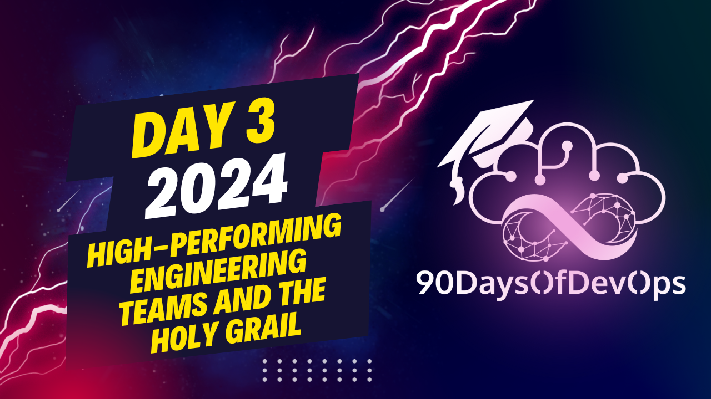

# Day 3 - High-performing engineering teams and the Holy Grail

The speaker discussed the importance of Throughput in software development, particularly in the context of Continuous Delivery. Throughput is a measurement of the number of changes (commits) developers are making to the codebase within a 24-hour period. It reflects the speed at which work is moving through the CI system and can indicate how frequently updates are being made available to customers.

However, it's crucial to note that high throughput doesn't necessarily mean better quality code. The speaker emphasized the importance of considering other metrics such as success rate (percentage of successful builds) and duration (time taken for a build to complete), to get a holistic understanding of the quality of the work being done.

The ideal throughput target varies depending on factors such as the size of the team, type of project (critical product line vs legacy software or niche internal tooling), and expectations of users. The speaker advised against setting a universally applicable throughput goal, suggesting instead that it should be set according to an organization's internal business requirements.

In the report mentioned, the median workflow ran about 1.5 times per day, with the top 5% running seven times per day or more. The average project had almost 3 pipeline runs, which was a slight increase from 2022. To improve throughput, the speaker suggested addressing factors that affect productivity such as workflow duration, failure rate, and recovery time.

The speaker emphasized the importance of tracking these key metrics to understand performance and continuously optimize them. They recommended checking out other reports like the State of DevOps and State of Continuous Delivery for additional insights. The speaker can be found on LinkedIn, Twitter, and Mastodon, and encourages questions if needed.
**Identity and Purpose**

In this case, the original text discusses various metrics related to software development processes, including success rate, meantime to resolve (MTTR), and throughput.

The text highlights that these metrics are crucial in measuring the stability of application development processes and their impact on customers and developers. The author emphasizes that failed signals aren't necessarily bad; rather, it's essential to understand the team's ability to identify and fix errors effectively.

**Key Takeaways**

1. **Success Rate**: Aim for 90% or higher on default branches, but set a benchmark for non-default branches based on development goals.
2. **Meantime to Resolve (MTTR)**: Focus on quick error detection and resolution rather than just maintaining a high success rate.
3. **Throughput**: Measure the frequency of commits and workflow runs, but prioritize quality over quantity.
4. **Metric Interdependence**: Each metric affects the others; e.g., throughput is influenced by MTTR and success rate.

**Actionable Insights**

1. Set a baseline measurement for your organization's metrics and monitor fluctuations to identify changes in processes or environment.
2. Adjust processes based on observed trends rather than arbitrary goals.
3. Focus on optimizing key metrics (success rate, MTTR, and throughput) to gain a competitive advantage over organizations that don't track these metrics.

**Recommended Resources**

1. State of DevOps reports
2. State of Continuous Delivery reports

**_Jeremy Meiss_**

- [Twitter](https://twitter.com/IAmJerdog)
- [LinkedIn](https://linkedin.com/in/jeremymeiss)
- [Dev.to](https://dev.to/jerdog]

### Overview

“High-performing engineering teams” are the Holy Grail for every CTO. But what are they, are they attainable, and if so, how? In this talk, we’ll look at CI/CD data from over 15mil anonymous workflows and compare it against the last few years on the CircleCI platform, and explore this rare specimen in its native habitat – right there in your organization, and how to activate them using some better DevOps and Continuous Delivery practices.

### Resource

- [2023 State of Software Delivery Report](go.jmeiss.me/SoSDR2023)
- [2023 State of DevOps Report](https://cloud.google.com/devops/state-of-devops)
- [2023 State of Continuous Delivery Report](https://cd.foundation/state-of-cd-2023/)
