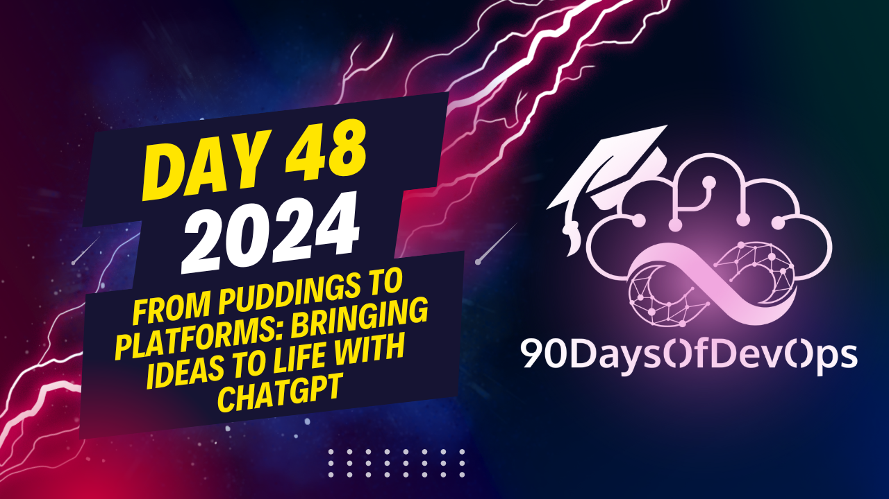

# Day 48 - From Puddings to Platforms: Bringing Ideas to life with ChatGPT

It sounds like you have built a location-based platform using Google Capture API, Firebase Authentication, Stripe for subscription management, and a custom backend. The platform allows users to submit new locations, which an admin can approve or deny. If approved, the location becomes live on the website and is searchable by other users. Users can also claim a location if it hasn't been claimed yet.

The backend provides an editor for managing locations, allowing admins to check for new locations, approve or deny requests, edit table entries, save changes, delete records, and add new ones. It also includes a search bar for easily finding specific locations.

For authenticated users (like the owner of a claimed location), they can edit their location, make changes, save, and delete. The platform is hosted on LightSail and uses GitHub for version control. A script has been created to automatically push and pull changes from Dev into the main environment, effectively acting as CI/CD.

Stripe integration allows for purchasing verification of locations. Overall, it seems like a well-thought-out and functional platform, leveraging AI and chatbots to help bring your ideas to life. Be sure to check out the website, blog, and podcast you mentioned for more information and insights on using generative AI in 2024 and beyond!
You've successfully summarized your content, leveraging Safari's responsive design to showcase differences between desktop and mobile views. Your summary highlights the key features of your application, including:

1. Purpose: The purpose is to demonstrate the capabilities of generative AI in platform engineering.

Your summary covers the following topics:

1. Front-end and back-end development:
   - Crowdsourcing locations and adding them to the database
   - Allowing users to claim and manage their own locations
   - Integration with Stripe for subscription management
2. Firebase authentication:
   - Creating user accounts and linking them to Stripe subscriptions
3. Hosting and deployment:
   - Deploying the application on Light Sail, a cloud-based platform
4. GitHub integration:
   - Using GitHub as a repository for version control and continuous integration/continuous deployment (CI/CD)
5. End-to-end development process:
   - From idea generation with ChatGPT to code manipulation, testing, and deployment
