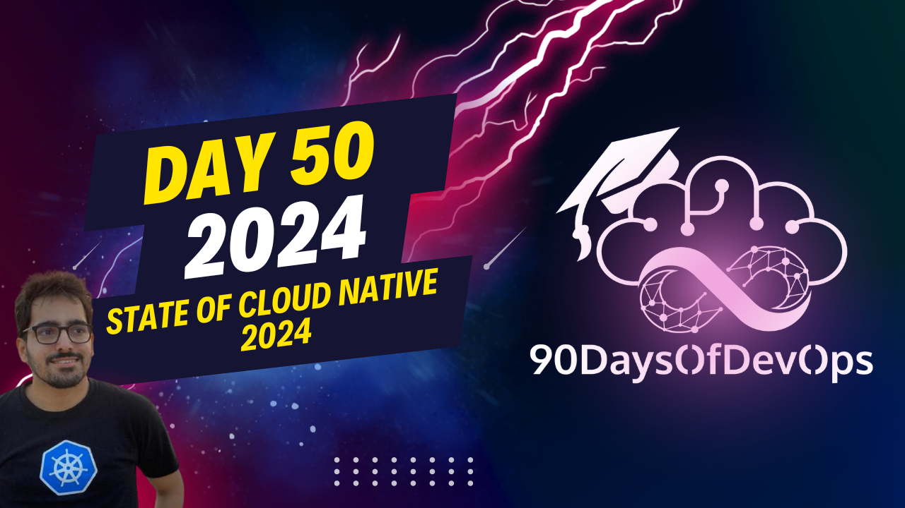

# Day 50 - State of Cloud Native 2024

In summary, the state of cloud native in 2024 will witness significant advancements across several key areas:

1. Platform Engineering: The next iteration of DevOps, platform engineering aims to standardize tooling and reduce complexity by providing self-service APIs and UIs for developers. This approach minimizes duplication of setups, improves cost reduction, finops, and enhances security compliance across projects within an organization.

2. Sustainability: WebAssembly will grow in the cloud native ecosystem, becoming mainstream for server-side web applications and Cloud WebAssembly with Kubernetes runtime as a key enabler. There are ongoing works around extending the WebAssembly ecosystem, making it more versatile and mainstream in 2024.

3. Generative AI: In 2023, generative AI gained significant momentum, with projects like KGPD being accepted into CNCF sandbox. In 2024, we will see more innovations, adoption, and ease of deployment within the AI ecosystem, including end-to-end platforms for developing, training, deploying, and managing machine learning workloads. GPU sharing, smaller providers offering more interesting services in the AI space, and EVF/AI integrations are some trends to watch out for.

4. Observability: There will be a growing trend of observability startups incorporating AI to auto-detect and fix issues related to Kubernetes and cloud native environments. This will help organizations maintain their cloud native infrastructure more efficiently.

It is essential to focus on these areas in 2024 to stay updated, get involved, and capitalize on the opportunities they present. Share your thoughts on which aspects you believe will see the most adoption, innovation, or production use cases in the comments below.

**IDENTITY and PURPOSE**

You discussed how platform engineering can simplify the process of managing multiple projects, teams, and tools within an organization. By having a single platform, developers can request specific resources (e.g., clusters) without needing to understand the underlying infrastructure or Cloud provider. This standardization of tooling across the organization is made possible by the platform engineering team's decision-making based on security best practices, compliance, and tooling maturity.

**PLATFORM ENGINEERING**

You highlighted the importance of platform engineering in 2024, noting that it will lead to:

- Single-platform management for multiple projects
- Standardization of tooling across the organization
- Cost reduction through self-serving APIs and UIs
- FinOps (financial operations) integration

**CLOUD NATIVE and AI**

You emphasized the growing importance of cloud native and AI in 2024, mentioning:

- Generative AI's mainstream adoption in 2023
- Kubernetes' role as a foundation for machine learning workloads
- The increasing number of projects and innovations in the AI space
- End-to-end platforms for developing, training, deploying, and managing machine learning models

**SUSTAINABILITY**

You touched on sustainability, mentioning:

- WebAssembly's growth and adoption in the cloud native ecosystem
- Its potential to become a mainstream technology for server-side development
- The importance of observing startups incorporating AI to auto-detect and auto-fix issues related to Kubernetes

In summary, your key points can be grouped into four main areas: Platform Engineering, Cloud Native, AI, and Sustainability. Each area is expected to see significant growth, innovation, and adoption in 2024.
