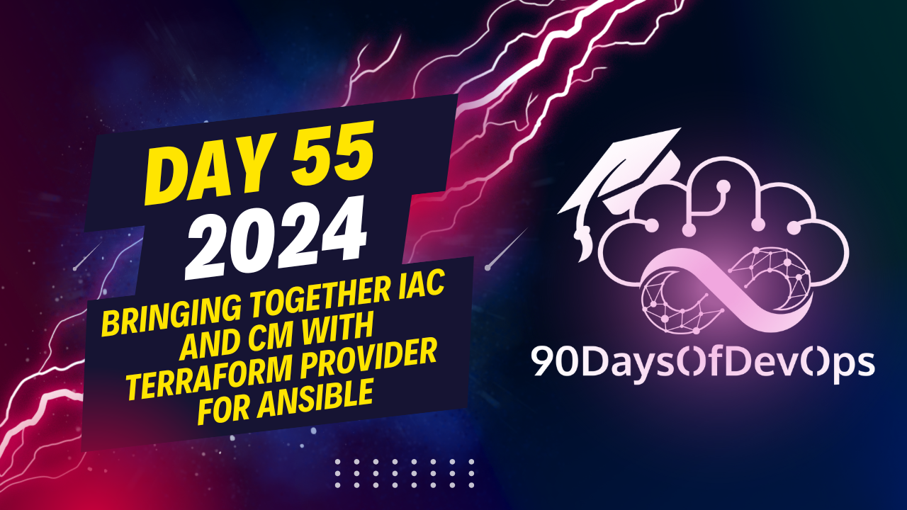

# Day 55 - Bringing Together IaC and CM with Terraform Provider for Ansible

In this explanation, a workflow that uses Terraform and Ansible to dynamically provision infrastructure and configure web servers. Here's a simplified breakdown of the process:

1. Use the external IP address of the newly created web server (web VM) to define dynamically your Ansible inventory file. This is done by mapping the Playbooks against hosts in the 'web' group, which is defined in the inventory metadata. The metadata also includes details about the user for SSH, SSH key, and Python version.

2. Run an Ansible command (`ansible-inventory -g graph`) to visualize the inventory file as a graph. This helps debug information and displays variables like the user being used to connect to the host.

3. Execute the specified Playbook (asle Playbook) using Ansible against the hosts in the 'web' group. The Playbook will install, start, clean up, and deploy an app from GitHub onto the web servers.

4. Validate the Terraform code syntax with `terraplan validate`. Before actually deploying the infrastructure, it's a good idea to check the Terraform State file to make sure there are no existing resources that could interfere with the deployment.

5. Run the `terraform plan` command to let Terraform analyze what needs to be created and deployed without executing anything. If the analysis looks correct, run `terraform apply` to start deploying the infrastructure.

6. The Terraform workflow will create resources like a VPC subnet, firewall rules, a computing instance (web VM), and an Ansible host with its external IP address captured for connectivity. It will also create an URL using the output of Terraform to display the deployed application from GitHub.

7. Finally, check that the application works by accessing it through the generated URL. If everything is working correctly, you should see the application with the title of the session.

8. After the deployment, the Terraform State file will be populated with information about the infrastructure created. Be aware that the Terraform State file contains sensitive information; there are discussions on how to protect it and encrypt it when needed.
   **IDENTITY and PURPOSE**

The speaker is an expert in content summarization, debugging information, and executing Playbooks. They are about to run a Playbook called "ASLE" that will provision infrastructure using Terraform and configure hosts with Ansible.

The speaker starts by mentioning the importance of binding Terraform and Ansible together, which is done through the inventory file. The ASLE Playbook defines which group of hosts (web) to use and what tasks to execute. These tasks include ensuring the existence of a specific package (engine X), starting it, and cleaning up by removing default files.

The speaker then validates the Terraform code using `terraform validate` and ensures that the syntax is correct. They also run `terraform plan` to analyze what resources need to be created, but do not execute anything yet.

After running the plan, the speaker applies the plan using `terraform apply`, which starts deploying the infrastructure. The deployment process creates a VPC subnet, firewall rules, an instance, and other resources.

Once the deployment is complete, the speaker runs the Ansible playbook, which executes the tasks defined in the Playbook. These tasks include installing engine X, starting it, removing default files, downloading a web page from GitHub, and configuring the infrastructure.

The speaker also demonstrates how to use Ansible's `graph` command to present the inventory in a graphical mode. Finally, they run the Ansible playbook again to execute the tasks defined in the Playbook.

Throughout the session, the speaker emphasizes the importance of binding Terraform and Ansible together for dynamic provisioning of infrastructure and configuration management.
