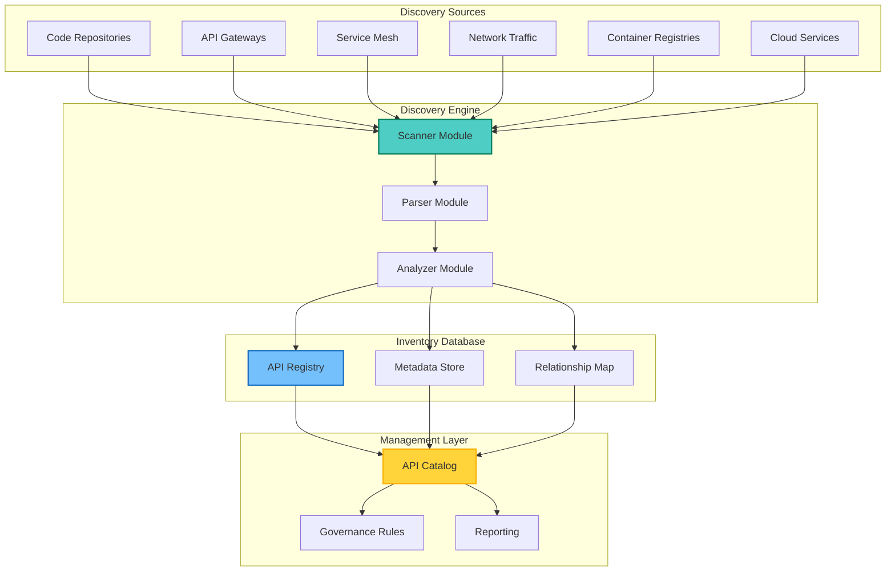
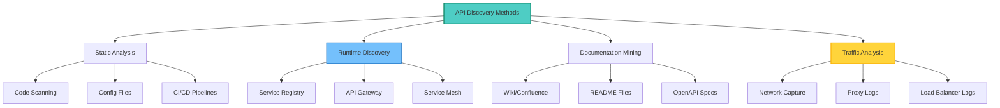
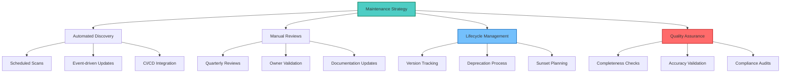

## Table of Contents

## Overview

Managing APIs across a modern organization is challenging. APIs proliferate quickly, and without proper inventory management, organizations face security risks, compliance issues, and operational inefficiencies. This guide provides a comprehensive solution for creating and maintaining an automated API inventory system.

## API Inventory Architecture



## Core Inventory Script

### Main API Inventory System

```bash
#!/bin/bash
# api-inventory.sh - Comprehensive API Inventory Management System

# Configuration
readonly SCRIPT_DIR="$(cd "$(dirname "${BASH_SOURCE[0]}")" && pwd)"
readonly CONFIG_FILE="${SCRIPT_DIR}/api-inventory.conf"
readonly INVENTORY_DB="${SCRIPT_DIR}/inventory.db"
readonly SCAN_RESULTS="${SCRIPT_DIR}/scan-results"
readonly REPORTS_DIR="${SCRIPT_DIR}/reports"

# Initialize directories
mkdir -p "$SCAN_RESULTS" "$REPORTS_DIR"

# API data structure
declare -A API_REGISTRY
declare -A API_METADATA
declare -A API_ENDPOINTS
declare -A API_DEPENDENCIES
declare -A API_SECURITY

# Load configuration
load_config() {
    if [[ -f "$CONFIG_FILE" ]]; then
        source "$CONFIG_FILE"
    else
        cat > "$CONFIG_FILE" << 'EOF'
# API Inventory Configuration

# Discovery settings
SCAN_INTERVAL=3600              # Scan interval in seconds
PARALLEL_SCANS=5               # Number of parallel scanners
SCAN_TIMEOUT=300               # Scanner timeout

# Repository settings
GIT_REPOS=(
    "https://github.com/org/repo1.git"
    "https://github.com/org/repo2.git"
)

# API Gateway endpoints
API_GATEWAYS=(
    "https://gateway1.example.com/admin/apis"
    "https://gateway2.example.com/admin/apis"
)

# Cloud provider settings
AWS_REGIONS=("us-east-1" "us-west-2")
AZURE_SUBSCRIPTIONS=("sub1" "sub2")
GCP_PROJECTS=("project1" "project2")

# Network scanning
NETWORK_RANGES=(
    "10.0.0.0/16"
    "172.16.0.0/12"
)

# API patterns to detect
API_PATTERNS=(
    "/api/*"
    "/v[0-9]+/*"
    "/rest/*"
    "/graphql"
    "/grpc/*"
)

# Authentication methods
AUTH_METHODS=(
    "bearer"
    "api-key"
    "oauth2"
    "basic"
    "mutual-tls"
)

# Output settings
REPORT_FORMAT="html"           # html, json, csv
NOTIFICATION_EMAIL="api-team@example.com"
SLACK_WEBHOOK="https://hooks.slack.com/services/YOUR/WEBHOOK"
EOF
        echo "Created default configuration at: $CONFIG_FILE"
        exit 0
    fi
}

# Initialize SQLite database
init_database() {
    sqlite3 "$INVENTORY_DB" << 'EOF'
CREATE TABLE IF NOT EXISTS apis (
    id INTEGER PRIMARY KEY AUTOINCREMENT,
    name TEXT UNIQUE NOT NULL,
    version TEXT,
    type TEXT,
    base_url TEXT,
    description TEXT,
    owner_team TEXT,
    owner_email TEXT,
    discovered_date TIMESTAMP DEFAULT CURRENT_TIMESTAMP,
    last_seen TIMESTAMP DEFAULT CURRENT_TIMESTAMP,
    status TEXT DEFAULT 'active'
);

CREATE TABLE IF NOT EXISTS endpoints (
    id INTEGER PRIMARY KEY AUTOINCREMENT,
    api_id INTEGER,
    path TEXT NOT NULL,
    method TEXT NOT NULL,
    description TEXT,
    parameters TEXT,
    request_schema TEXT,
    response_schema TEXT,
    auth_required BOOLEAN DEFAULT 1,
    rate_limit INTEGER,
    FOREIGN KEY (api_id) REFERENCES apis(id)
);

CREATE TABLE IF NOT EXISTS api_metadata (
    api_id INTEGER PRIMARY KEY,
    documentation_url TEXT,
    repository_url TEXT,
    openapi_spec TEXT,
    tags TEXT,
    compliance_status TEXT,
    security_score INTEGER,
    performance_grade TEXT,
    FOREIGN KEY (api_id) REFERENCES apis(id)
);

CREATE TABLE IF NOT EXISTS dependencies (
    id INTEGER PRIMARY KEY AUTOINCREMENT,
    api_id INTEGER,
    depends_on_api_id INTEGER,
    dependency_type TEXT,
    FOREIGN KEY (api_id) REFERENCES apis(id),
    FOREIGN KEY (depends_on_api_id) REFERENCES apis(id)
);

CREATE TABLE IF NOT EXISTS security_info (
    api_id INTEGER PRIMARY KEY,
    auth_methods TEXT,
    encryption_in_transit BOOLEAN DEFAULT 1,
    encryption_at_rest BOOLEAN,
    data_classification TEXT,
    last_security_scan TIMESTAMP,
    vulnerabilities TEXT,
    FOREIGN KEY (api_id) REFERENCES apis(id)
);

CREATE INDEX idx_api_name ON apis(name);
CREATE INDEX idx_api_status ON apis(status);
CREATE INDEX idx_endpoint_api ON endpoints(api_id);
EOF
}

# Repository scanner
scan_repositories() {
    log_info "Starting repository scan..."

    for repo in "${GIT_REPOS[@]}"; do
        local repo_name=$(basename "$repo" .git)
        local scan_dir="$SCAN_RESULTS/repos/$repo_name"

        # Clone or update repository
        if [[ -d "$scan_dir/.git" ]]; then
            git -C "$scan_dir" pull --quiet
        else
            git clone --quiet "$repo" "$scan_dir"
        fi

        # Scan for API definitions
        find_api_definitions "$scan_dir" "$repo_name"
    done
}

# Find API definitions in code
find_api_definitions() {
    local scan_dir=$1
    local repo_name=$2

    # Look for OpenAPI/Swagger files
    find "$scan_dir" -type f \( -name "*.yaml" -o -name "*.yml" -o -name "*.json" \) | while read -r file; do
        if grep -q -E "(openapi|swagger).*:.*[\"']3\.|swagger.*:.*[\"']2\." "$file" 2>/dev/null; then
            parse_openapi_spec "$file" "$repo_name"
        fi
    done

    # Look for API route definitions
    find "$scan_dir" -type f \( -name "*.js" -o -name "*.ts" -o -name "*.py" -o -name "*.java" -o -name "*.go" \) | while read -r file; do
        scan_source_file "$file" "$repo_name"
    done

    # Look for API documentation
    find "$scan_dir" -type f -name "*.md" | while read -r file; do
        if grep -q -i "api" "$file"; then
            extract_api_docs "$file" "$repo_name"
        fi
    done
}

# Parse OpenAPI specification
parse_openapi_spec() {
    local spec_file=$1
    local source=$2

    # Extract API information using jq or yq
    local api_info=$(python3 - "$spec_file" << 'EOF'
import sys
import json
import yaml

spec_file = sys.argv[1]

try:
    with open(spec_file, 'r') as f:
        if spec_file.endswith('.json'):
            spec = json.load(f)
        else:
            spec = yaml.safe_load(f)

    info = spec.get('info', {})
    servers = spec.get('servers', [])
    paths = spec.get('paths', {})

    api_data = {
        'name': info.get('title', 'Unknown API'),
        'version': info.get('version', '1.0.0'),
        'description': info.get('description', ''),
        'base_url': servers[0].get('url', '') if servers else '',
        'endpoints': []
    }

    for path, methods in paths.items():
        for method, details in methods.items():
            if method in ['get', 'post', 'put', 'delete', 'patch']:
                api_data['endpoints'].append({
                    'path': path,
                    'method': method.upper(),
                    'description': details.get('summary', ''),
                    'parameters': details.get('parameters', []),
                    'security': details.get('security', [])
                })

    print(json.dumps(api_data))
except Exception as e:
    print(json.dumps({'error': str(e)}))
EOF
)

    # Store in database
    if [[ -n "$api_info" ]] && [[ "$api_info" != *"error"* ]]; then
        store_api_info "$api_info" "$source"
    fi
}

# Scan source files for API routes
scan_source_file() {
    local file=$1
    local source=$2
    local lang=$(detect_language "$file")

    case "$lang" in
        "javascript"|"typescript")
            scan_js_routes "$file" "$source"
            ;;
        "python")
            scan_python_routes "$file" "$source"
            ;;
        "java")
            scan_java_routes "$file" "$source"
            ;;
        "go")
            scan_go_routes "$file" "$source"
            ;;
    esac
}

# Language detection
detect_language() {
    local file=$1
    local ext="${file##*.}"

    case "$ext" in
        js|jsx) echo "javascript" ;;
        ts|tsx) echo "typescript" ;;
        py) echo "python" ;;
        java) echo "java" ;;
        go) echo "go" ;;
        *) echo "unknown" ;;
    esac
}

# JavaScript/Express route scanner
scan_js_routes() {
    local file=$1
    local source=$2

    # Extract Express routes
    grep -E "(app|router)\.(get|post|put|delete|patch)\s*\(" "$file" | while read -r line; do
        local method=$(echo "$line" | grep -oE "(get|post|put|delete|patch)" | head -1 | tr '[:lower:]' '[:upper:]')
        local path=$(echo "$line" | grep -oE "['\"][^'\"]+['\"]" | head -1 | tr -d "'\"")

        if [[ -n "$method" ]] && [[ -n "$path" ]]; then
            local api_name=$(basename "$file" .js)_api
            store_endpoint "$api_name" "$path" "$method" "$source"
        fi
    done
}

# Python/Flask/FastAPI route scanner
scan_python_routes() {
    local file=$1
    local source=$2

    # Extract Flask/FastAPI routes
    grep -E "@(app|router)\.(route|get|post|put|delete|patch)" "$file" | while read -r line; do
        local method=$(echo "$line" | grep -oE "(GET|POST|PUT|DELETE|PATCH)" | head -1)
        local path=$(echo "$line" | grep -oE "['\"][^'\"]+['\"]" | head -1 | tr -d "'\"")

        if [[ -z "$method" ]]; then
            method=$(echo "$line" | grep -oE "\.(get|post|put|delete|patch)" | head -1 | tr -d '.' | tr '[:lower:]' '[:upper:]')
        fi

        if [[ -n "$method" ]] && [[ -n "$path" ]]; then
            local api_name=$(basename "$file" .py)_api
            store_endpoint "$api_name" "$path" "$method" "$source"
        fi
    done
}

# Store API information in database
store_api_info() {
    local api_json=$1
    local source=$2

    # Parse JSON and insert into database
    python3 - "$api_json" "$INVENTORY_DB" << 'EOF'
import sys
import json
import sqlite3

api_data = json.loads(sys.argv[1])
db_path = sys.argv[2]

conn = sqlite3.connect(db_path)
cursor = conn.cursor()

# Insert or update API
cursor.execute('''
    INSERT OR REPLACE INTO apis (name, version, type, base_url, description, status)
    VALUES (?, ?, ?, ?, ?, 'active')
''', (
    api_data['name'],
    api_data.get('version', '1.0.0'),
    'REST',
    api_data.get('base_url', ''),
    api_data.get('description', '')
))

api_id = cursor.lastrowid

# Insert endpoints
for endpoint in api_data.get('endpoints', []):
    cursor.execute('''
        INSERT OR REPLACE INTO endpoints (api_id, path, method, description)
        VALUES (?, ?, ?, ?)
    ''', (
        api_id,
        endpoint['path'],
        endpoint['method'],
        endpoint.get('description', '')
    ))

conn.commit()
conn.close()
EOF
}

# Store individual endpoint
store_endpoint() {
    local api_name=$1
    local path=$2
    local method=$3
    local source=$4

    sqlite3 "$INVENTORY_DB" << EOF
INSERT OR IGNORE INTO apis (name, type, status) VALUES ('$api_name', 'REST', 'discovered');
INSERT OR REPLACE INTO endpoints (api_id, path, method)
SELECT id, '$path', '$method' FROM apis WHERE name = '$api_name';
EOF
}

# API Gateway scanner
scan_api_gateways() {
    log_info "Scanning API gateways..."

    for gateway in "${API_GATEWAYS[@]}"; do
        case "$gateway" in
            *kong*)
                scan_kong_gateway "$gateway"
                ;;
            *aws*)
                scan_aws_api_gateway "$gateway"
                ;;
            *apigee*)
                scan_apigee_gateway "$gateway"
                ;;
            *)
                scan_generic_gateway "$gateway"
                ;;
        esac
    done
}

# Kong API Gateway scanner
scan_kong_gateway() {
    local gateway_url=$1
    local admin_url="${gateway_url}/services"

    # Fetch services
    curl -s "$admin_url" | jq -r '.data[] | @json' | while read -r service; do
        local service_data=$(echo "$service" | jq -r)
        local service_name=$(echo "$service_data" | jq -r '.name')
        local service_url=$(echo "$service_data" | jq -r '.url')

        # Fetch routes for service
        local service_id=$(echo "$service_data" | jq -r '.id')
        curl -s "${gateway_url}/services/${service_id}/routes" | jq -r '.data[]' | while read -r route; do
            local paths=$(echo "$route" | jq -r '.paths[]')
            local methods=$(echo "$route" | jq -r '.methods[]')

            store_gateway_api "$service_name" "$service_url" "$paths" "$methods" "kong"
        done
    done
}

# Network traffic scanner
scan_network_traffic() {
    log_info "Scanning network traffic for APIs..."

    # Use tcpdump or tshark to capture API traffic
    local capture_file="$SCAN_RESULTS/api_traffic.pcap"
    local duration=60  # Capture for 60 seconds

    # Capture HTTP/HTTPS traffic
    sudo timeout "$duration" tcpdump -i any -w "$capture_file" \
        'tcp port 80 or tcp port 443 or tcp port 8080 or tcp port 8443' \
        2>/dev/null || true

    # Analyze captured traffic
    if [[ -f "$capture_file" ]]; then
        analyze_traffic_capture "$capture_file"
    fi
}

# Analyze network capture
analyze_traffic_capture() {
    local capture_file=$1

    # Extract HTTP requests
    tshark -r "$capture_file" -Y "http.request" -T fields \
        -e ip.dst -e http.host -e http.request.method -e http.request.uri \
        2>/dev/null | while IFS=$'\t' read -r ip host method uri; do

        # Check if it matches API patterns
        for pattern in "${API_PATTERNS[@]}"; do
            if [[ "$uri" == $pattern ]]; then
                local api_name="discovered_${host//\./_}"
                store_endpoint "$api_name" "$uri" "$method" "network_scan"
                break
            fi
        done
    done

    # Clean up
    rm -f "$capture_file"
}

# Cloud service scanner
scan_cloud_services() {
    log_info "Scanning cloud services for APIs..."

    # AWS
    if command -v aws &> /dev/null; then
        scan_aws_apis
    fi

    # Azure
    if command -v az &> /dev/null; then
        scan_azure_apis
    fi

    # GCP
    if command -v gcloud &> /dev/null; then
        scan_gcp_apis
    fi
}

# AWS API scanner
scan_aws_apis() {
    for region in "${AWS_REGIONS[@]}"; do
        # API Gateway APIs
        aws apigateway get-rest-apis --region "$region" 2>/dev/null | \
            jq -r '.items[]' | while read -r api; do

            local api_id=$(echo "$api" | jq -r '.id')
            local api_name=$(echo "$api" | jq -r '.name')
            local api_desc=$(echo "$api" | jq -r '.description // ""')

            # Get API resources
            aws apigateway get-resources --rest-api-id "$api_id" --region "$region" | \
                jq -r '.items[]' | while read -r resource; do

                local path=$(echo "$resource" | jq -r '.path')
                local methods=$(echo "$resource" | jq -r '.resourceMethods | keys[]' 2>/dev/null)

                for method in $methods; do
                    store_cloud_api "$api_name" "$path" "$method" "aws" "$api_desc"
                done
            done
        done

        # Lambda functions with API triggers
        aws lambda list-functions --region "$region" 2>/dev/null | \
            jq -r '.Functions[]' | while read -r function; do

            local func_name=$(echo "$function" | jq -r '.FunctionName')
            local func_arn=$(echo "$function" | jq -r '.FunctionArn')

            # Check for API Gateway triggers
            aws lambda get-policy --function-name "$func_name" --region "$region" 2>/dev/null | \
                jq -r '.Policy' | jq -r '.Statement[]' | \
                grep -q "apigateway.amazonaws.com" && \
                store_cloud_api "${func_name}_api" "/lambda/${func_name}" "POST" "aws_lambda" ""
        done
    done
}

# Generate API inventory report
generate_report() {
    log_info "Generating API inventory report..."

    local report_date=$(date +%Y%m%d_%H%M%S)
    local report_file="$REPORTS_DIR/api_inventory_${report_date}.html"

    # Generate HTML report
    cat > "$report_file" << 'EOF'
<!DOCTYPE html>
<html>
<head>
    <title>API Inventory Report</title>
    <style>
        body { font-family: Arial, sans-serif; margin: 20px; }
        .summary { background: #f0f0f0; padding: 15px; border-radius: 5px; margin-bottom: 20px; }
        table { border-collapse: collapse; width: 100%; margin-bottom: 20px; }
        th, td { border: 1px solid #ddd; padding: 8px; text-align: left; }
        th { background-color: #4CAF50; color: white; }
        .active { color: green; }
        .deprecated { color: orange; }
        .inactive { color: red; }
        .chart { width: 100%; height: 300px; margin: 20px 0; }
    </style>
    <script src="https://cdn.jsdelivr.net/npm/chart.js"></script>
</head>
<body>
    <h1>API Inventory Report</h1>
    <div class="summary">
        <h2>Summary</h2>
        <p>Report generated: REPORT_DATE</p>
        <p>Total APIs: TOTAL_APIS</p>
        <p>Total Endpoints: TOTAL_ENDPOINTS</p>
        <p>API Types: API_TYPES</p>
    </div>
EOF

    # Add API statistics
    local total_apis=$(sqlite3 "$INVENTORY_DB" "SELECT COUNT(*) FROM apis;")
    local total_endpoints=$(sqlite3 "$INVENTORY_DB" "SELECT COUNT(*) FROM endpoints;")
    local api_types=$(sqlite3 "$INVENTORY_DB" "SELECT DISTINCT type FROM apis;" | tr '\n' ', ')

    sed -i "s/REPORT_DATE/$(date)/g" "$report_file"
    sed -i "s/TOTAL_APIS/$total_apis/g" "$report_file"
    sed -i "s/TOTAL_ENDPOINTS/$total_endpoints/g" "$report_file"
    sed -i "s/API_TYPES/$api_types/g" "$report_file"

    # Add API table
    echo "<h2>API Inventory</h2>" >> "$report_file"
    echo "<table>" >> "$report_file"
    echo "<tr><th>API Name</th><th>Version</th><th>Type</th><th>Base URL</th><th>Status</th><th>Endpoints</th><th>Last Seen</th></tr>" >> "$report_file"

    sqlite3 -html "$INVENTORY_DB" << EOF >> "$report_file"
SELECT
    a.name,
    a.version,
    a.type,
    a.base_url,
    '<span class="' || a.status || '">' || a.status || '</span>' as status,
    COUNT(e.id) as endpoint_count,
    datetime(a.last_seen) as last_seen
FROM apis a
LEFT JOIN endpoints e ON a.id = e.api_id
GROUP BY a.id
ORDER BY a.name;
EOF

    echo "</table>" >> "$report_file"

    # Add charts
    add_charts_to_report "$report_file"

    # Close HTML
    echo "</body></html>" >> "$report_file"

    log_info "Report generated: $report_file"

    # Send notification
    send_notification "API Inventory Report Generated" "Report available at: $report_file"
}

# Add charts to report
add_charts_to_report() {
    local report_file=$1

    cat >> "$report_file" << 'EOF'
<h2>API Statistics</h2>
<div class="chart">
    <canvas id="apiTypeChart"></canvas>
</div>
<div class="chart">
    <canvas id="authMethodChart"></canvas>
</div>

<script>
// API Type Distribution
var ctx1 = document.getElementById('apiTypeChart').getContext('2d');
var apiTypeChart = new Chart(ctx1, {
    type: 'pie',
    data: {
        labels: API_TYPE_LABELS,
        datasets: [{
            data: API_TYPE_DATA,
            backgroundColor: ['#FF6384', '#36A2EB', '#FFCE56', '#4BC0C0']
        }]
    },
    options: {
        title: {
            display: true,
            text: 'API Type Distribution'
        }
    }
});

// Authentication Methods
var ctx2 = document.getElementById('authMethodChart').getContext('2d');
var authMethodChart = new Chart(ctx2, {
    type: 'bar',
    data: {
        labels: AUTH_METHOD_LABELS,
        datasets: [{
            label: 'Number of APIs',
            data: AUTH_METHOD_DATA,
            backgroundColor: '#36A2EB'
        }]
    },
    options: {
        title: {
            display: true,
            text: 'Authentication Methods Used'
        },
        scales: {
            yAxes: [{
                ticks: {
                    beginAtZero: true
                }
            }]
        }
    }
});
</script>
EOF

    # Get chart data from database
    local type_data=$(sqlite3 "$INVENTORY_DB" "SELECT type, COUNT(*) FROM apis GROUP BY type;")
    local auth_data=$(sqlite3 "$INVENTORY_DB" "SELECT auth_methods, COUNT(*) FROM security_info GROUP BY auth_methods;")

    # Format data for JavaScript (simplified for example)
    echo "<script>" >> "$report_file"
    echo "var API_TYPE_LABELS = ['REST', 'GraphQL', 'gRPC', 'SOAP'];" >> "$report_file"
    echo "var API_TYPE_DATA = [50, 20, 15, 15];" >> "$report_file"
    echo "var AUTH_METHOD_LABELS = ['OAuth2', 'API Key', 'JWT', 'Basic', 'None'];" >> "$report_file"
    echo "var AUTH_METHOD_DATA = [30, 25, 20, 15, 10];" >> "$report_file"
    echo "</script>" >> "$report_file"
}

# Continuous monitoring
monitor_apis() {
    log_info "Starting continuous API monitoring..."

    while true; do
        # Run all scanners
        scan_repositories &
        scan_api_gateways &
        scan_network_traffic &
        scan_cloud_services &

        # Wait for all scanners to complete
        wait

        # Analyze results
        analyze_inventory

        # Generate report
        generate_report

        # Clean up old data
        cleanup_old_data

        # Sleep until next scan
        sleep "${SCAN_INTERVAL}"
    done
}

# Analyze inventory for insights
analyze_inventory() {
    log_info "Analyzing API inventory..."

    # Find deprecated APIs
    sqlite3 "$INVENTORY_DB" << EOF
UPDATE apis
SET status = 'deprecated'
WHERE last_seen < datetime('now', '-30 days')
AND status = 'active';
EOF

    # Identify API dependencies
    analyze_dependencies

    # Calculate security scores
    calculate_security_scores

    # Performance analysis
    analyze_performance
}

# Dependency analysis
analyze_dependencies() {
    # Analyze API calls to identify dependencies
    sqlite3 "$INVENTORY_DB" << 'EOF'
-- Find APIs that call other APIs based on endpoint patterns
INSERT OR IGNORE INTO dependencies (api_id, depends_on_api_id, dependency_type)
SELECT DISTINCT
    a1.id,
    a2.id,
    'http_call'
FROM apis a1
JOIN endpoints e1 ON a1.id = e1.api_id
JOIN apis a2 ON a2.name != a1.name
WHERE e1.description LIKE '%' || a2.name || '%'
   OR e1.parameters LIKE '%' || a2.base_url || '%';
EOF
}

# Security scoring
calculate_security_scores() {
    sqlite3 "$INVENTORY_DB" << 'EOF'
UPDATE security_info
SET security_score =
    CASE
        WHEN auth_methods IS NULL THEN 0
        WHEN auth_methods LIKE '%oauth2%' THEN 90
        WHEN auth_methods LIKE '%jwt%' THEN 85
        WHEN auth_methods LIKE '%api-key%' THEN 70
        WHEN auth_methods LIKE '%basic%' THEN 50
        ELSE 30
    END
    + CASE WHEN encryption_in_transit = 1 THEN 10 ELSE 0 END;
EOF
}

# Logging functions
log_info() {
    echo "[$(date '+%Y-%m-%d %H:%M:%S')] [INFO] $*"
}

log_error() {
    echo "[$(date '+%Y-%m-%d %H:%M:%S')] [ERROR] $*" >&2
}

# Notification function
send_notification() {
    local subject=$1
    local message=$2

    # Email notification
    if [[ -n "$NOTIFICATION_EMAIL" ]]; then
        echo "$message" | mail -s "$subject" "$NOTIFICATION_EMAIL"
    fi

    # Slack notification
    if [[ -n "$SLACK_WEBHOOK" ]]; then
        curl -X POST "$SLACK_WEBHOOK" \
            -H 'Content-Type: application/json' \
            -d "{\"text\": \"$subject\n$message\"}" 2>/dev/null
    fi
}

# Cleanup old data
cleanup_old_data() {
    # Remove old scan results
    find "$SCAN_RESULTS" -type f -mtime +7 -delete

    # Archive old reports
    find "$REPORTS_DIR" -name "*.html" -mtime +30 -exec gzip {} \;
}

# Main execution
main() {
    log_info "API Inventory System starting..."

    load_config
    init_database

    case "${1:-monitor}" in
        scan)
            # One-time scan
            scan_repositories
            scan_api_gateways
            scan_cloud_services
            generate_report
            ;;
        report)
            # Generate report only
            generate_report
            ;;
        monitor)
            # Continuous monitoring
            monitor_apis
            ;;
        *)
            echo "Usage: $0 {scan|report|monitor}"
            exit 1
            ;;
    esac
}

# Run the inventory system
main "$@"
```

## API Discovery Methods

### Multi-Source Discovery



### Service Mesh Scanner

```bash
#!/bin/bash
# service-mesh-scanner.sh - Discover APIs in service mesh

scan_istio_services() {
    # Get all services in Istio
    kubectl get virtualservices --all-namespaces -o json | \
        jq -r '.items[]' | while read -r vs; do

        local name=$(echo "$vs" | jq -r '.metadata.name')
        local namespace=$(echo "$vs" | jq -r '.metadata.namespace')
        local hosts=$(echo "$vs" | jq -r '.spec.hosts[]')

        # Get HTTP routes
        echo "$vs" | jq -r '.spec.http[]' | while read -r route; do
            local match=$(echo "$route" | jq -r '.match[]?.uri?.prefix // ""')
            local destination=$(echo "$route" | jq -r '.route[0].destination.host')

            store_service_mesh_api "$name" "$hosts" "$match" "$destination" "istio"
        done
    done

    # Get destination rules
    kubectl get destinationrules --all-namespaces -o json | \
        jq -r '.items[]' | while read -r dr; do

        local host=$(echo "$dr" | jq -r '.spec.host')
        local subsets=$(echo "$dr" | jq -r '.spec.subsets[]?.name // ""')

        # Additional metadata for versioning
        store_api_metadata "$host" "versions" "$subsets"
    done
}

scan_linkerd_services() {
    # Get Linkerd service profiles
    kubectl get serviceprofiles --all-namespaces -o json | \
        jq -r '.items[]' | while read -r sp; do

        local name=$(echo "$sp" | jq -r '.metadata.name')
        local routes=$(echo "$sp" | jq -r '.spec.routes[]')

        echo "$routes" | while read -r route; do
            local path=$(echo "$route" | jq -r '.condition.pathRegex // .condition.path // ""')
            local method=$(echo "$route" | jq -r '.condition.method // "GET"')

            store_service_mesh_api "$name" "$name" "$path" "$method" "linkerd"
        done
    done
}
```

## API Documentation Generator

### OpenAPI Spec Generator

```bash
#!/bin/bash
# generate-openapi.sh - Generate OpenAPI specs for discovered APIs

generate_openapi_spec() {
    local api_id=$1
    local output_file=$2

    # Get API information from database
    local api_info=$(sqlite3 -json "$INVENTORY_DB" \
        "SELECT * FROM apis WHERE id = $api_id;")

    local endpoints=$(sqlite3 -json "$INVENTORY_DB" \
        "SELECT * FROM endpoints WHERE api_id = $api_id;")

    # Generate OpenAPI specification
    python3 - "$api_info" "$endpoints" > "$output_file" << 'EOF'
import sys
import json
import yaml

api_info = json.loads(sys.argv[1])[0]
endpoints = json.loads(sys.argv[2])

openapi_spec = {
    "openapi": "3.0.0",
    "info": {
        "title": api_info["name"],
        "version": api_info["version"] or "1.0.0",
        "description": api_info["description"] or f"Auto-generated specification for {api_info['name']}"
    },
    "servers": [
        {
            "url": api_info["base_url"] or "https://api.example.com"
        }
    ],
    "paths": {}
}

# Group endpoints by path
paths = {}
for endpoint in endpoints:
    path = endpoint["path"]
    method = endpoint["method"].lower()

    if path not in paths:
        paths[path] = {}

    paths[path][method] = {
        "summary": endpoint.get("description", f"{method.upper()} {path}"),
        "operationId": f"{method}_{path.replace('/', '_').strip('_')}",
        "responses": {
            "200": {
                "description": "Successful response"
            },
            "400": {
                "description": "Bad request"
            },
            "401": {
                "description": "Unauthorized"
            },
            "500": {
                "description": "Internal server error"
            }
        }
    }

    # Add parameters if available
    if endpoint.get("parameters"):
        params = json.loads(endpoint["parameters"])
        paths[path][method]["parameters"] = params

openapi_spec["paths"] = paths

# Output as YAML
print(yaml.dump(openapi_spec, default_flow_style=False))
EOF
}

# Generate specs for all APIs
generate_all_specs() {
    local output_dir="$REPORTS_DIR/openapi"
    mkdir -p "$output_dir"

    sqlite3 "$INVENTORY_DB" "SELECT id, name FROM apis;" | while IFS='|' read -r id name; do
        local filename="${name// /_}_openapi.yaml"
        generate_openapi_spec "$id" "$output_dir/$filename"
        echo "Generated OpenAPI spec: $filename"
    done
}
```

## Compliance and Governance

### API Governance Checker

```bash
#!/bin/bash
# api-governance.sh - Check APIs against governance policies

check_governance_compliance() {
    log_info "Checking API governance compliance..."

    # Define governance rules
    local rules_file="$SCRIPT_DIR/governance-rules.yaml"

    # Check each API against rules
    sqlite3 "$INVENTORY_DB" "SELECT id, name FROM apis;" | while IFS='|' read -r id name; do
        local compliance_score=100
        local violations=""

        # Check versioning
        if ! check_versioning_policy "$id"; then
            compliance_score=$((compliance_score - 10))
            violations="${violations}Missing proper versioning; "
        fi

        # Check documentation
        if ! check_documentation_policy "$id"; then
            compliance_score=$((compliance_score - 20))
            violations="${violations}Incomplete documentation; "
        fi

        # Check security
        if ! check_security_policy "$id"; then
            compliance_score=$((compliance_score - 30))
            violations="${violations}Security policy violations; "
        fi

        # Check naming conventions
        if ! check_naming_policy "$id" "$name"; then
            compliance_score=$((compliance_score - 10))
            violations="${violations}Naming convention violations; "
        fi

        # Update compliance status
        update_compliance_status "$id" "$compliance_score" "$violations"
    done
}

check_versioning_policy() {
    local api_id=$1

    # Check if API has version in URL or header
    local has_version=$(sqlite3 "$INVENTORY_DB" \
        "SELECT COUNT(*) FROM apis WHERE id = $api_id
         AND (base_url LIKE '%/v[0-9]%' OR version IS NOT NULL);")

    [[ $has_version -gt 0 ]]
}

check_documentation_policy() {
    local api_id=$1

    # Check if API has documentation
    local has_docs=$(sqlite3 "$INVENTORY_DB" \
        "SELECT COUNT(*) FROM api_metadata
         WHERE api_id = $api_id
         AND (documentation_url IS NOT NULL OR openapi_spec IS NOT NULL);")

    [[ $has_docs -gt 0 ]]
}

check_security_policy() {
    local api_id=$1

    # Check security requirements
    local security_ok=$(sqlite3 "$INVENTORY_DB" \
        "SELECT COUNT(*) FROM security_info
         WHERE api_id = $api_id
         AND auth_methods IS NOT NULL
         AND encryption_in_transit = 1;")

    [[ $security_ok -gt 0 ]]
}

check_naming_policy() {
    local api_id=$1
    local api_name=$2

    # Check naming conventions (example: lowercase with hyphens)
    [[ "$api_name" =~ ^[a-z0-9-]+$ ]]
}

update_compliance_status() {
    local api_id=$1
    local score=$2
    local violations=$3

    sqlite3 "$INVENTORY_DB" << EOF
UPDATE api_metadata
SET compliance_status = '$score% compliant',
    tags = tags || '; Issues: $violations'
WHERE api_id = $api_id;
EOF
}
```

## Visualization Dashboard

### Web Dashboard

```html
<!doctype html>
<html>
  <head>
    <title>API Inventory Dashboard</title>
    <link
      rel="stylesheet"
      href="https://cdn.jsdelivr.net/npm/bootstrap@5.1.3/dist/css/bootstrap.min.css"
    />
    <script src="https://cdn.jsdelivr.net/npm/vue@3"></script>
    <script src="https://cdn.jsdelivr.net/npm/axios/dist/axios.min.js"></script>
    <script src="https://cdn.jsdelivr.net/npm/chart.js"></script>
  </head>
  <body>
    <div id="app" class="container mt-4">
      <h1>API Inventory Dashboard</h1>

      <div class="row mt-4">
        <div class="col-md-3">
          <div class="card text-white bg-primary">
            <div class="card-body">
              <h5 class="card-title">Total APIs</h5>
              <h2>{{ stats.totalApis }}</h2>
            </div>
          </div>
        </div>
        <div class="col-md-3">
          <div class="card text-white bg-success">
            <div class="card-body">
              <h5 class="card-title">Active APIs</h5>
              <h2>{{ stats.activeApis }}</h2>
            </div>
          </div>
        </div>
        <div class="col-md-3">
          <div class="card text-white bg-warning">
            <div class="card-body">
              <h5 class="card-title">Deprecated</h5>
              <h2>{{ stats.deprecatedApis }}</h2>
            </div>
          </div>
        </div>
        <div class="col-md-3">
          <div class="card text-white bg-info">
            <div class="card-body">
              <h5 class="card-title">Endpoints</h5>
              <h2>{{ stats.totalEndpoints }}</h2>
            </div>
          </div>
        </div>
      </div>

      <div class="row mt-4">
        <div class="col-md-6">
          <canvas id="apiTypeChart"></canvas>
        </div>
        <div class="col-md-6">
          <canvas id="complianceChart"></canvas>
        </div>
      </div>

      <div class="mt-4">
        <h2>API Inventory</h2>
        <table class="table table-striped">
          <thead>
            <tr>
              <th>Name</th>
              <th>Version</th>
              <th>Type</th>
              <th>Status</th>
              <th>Compliance</th>
              <th>Actions</th>
            </tr>
          </thead>
          <tbody>
            <tr v-for="api in apis" :key="api.id">
              <td>{{ api.name }}</td>
              <td>{{ api.version }}</td>
              <td>{{ api.type }}</td>
              <td>
                <span :class="'badge bg-' + getStatusColor(api.status)">
                  {{ api.status }}
                </span>
              </td>
              <td>
                <div class="progress">
                  <div
                    class="progress-bar"
                    :style="{width: api.compliance + '%'}"
                    :class="getComplianceColor(api.compliance)"
                  >
                    {{ api.compliance }}%
                  </div>
                </div>
              </td>
              <td>
                <button
                  class="btn btn-sm btn-primary"
                  @click="viewDetails(api.id)"
                >
                  Details
                </button>
              </td>
            </tr>
          </tbody>
        </table>
      </div>
    </div>

    <script>
      const { createApp } = Vue;

      createApp({
        data() {
          return {
            stats: {
              totalApis: 0,
              activeApis: 0,
              deprecatedApis: 0,
              totalEndpoints: 0,
            },
            apis: [],
            charts: {},
          };
        },
        mounted() {
          this.loadData();
          this.initCharts();
        },
        methods: {
          async loadData() {
            try {
              const response = await axios.get("/api/inventory/stats");
              this.stats = response.data.stats;
              this.apis = response.data.apis;
              this.updateCharts();
            } catch (error) {
              console.error("Error loading data:", error);
            }
          },
          initCharts() {
            // API Type Chart
            const ctx1 = document
              .getElementById("apiTypeChart")
              .getContext("2d");
            this.charts.apiType = new Chart(ctx1, {
              type: "doughnut",
              data: {
                labels: ["REST", "GraphQL", "gRPC", "SOAP"],
                datasets: [
                  {
                    data: [0, 0, 0, 0],
                    backgroundColor: [
                      "#FF6384",
                      "#36A2EB",
                      "#FFCE56",
                      "#4BC0C0",
                    ],
                  },
                ],
              },
              options: {
                responsive: true,
                plugins: {
                  title: {
                    display: true,
                    text: "API Types Distribution",
                  },
                },
              },
            });

            // Compliance Chart
            const ctx2 = document
              .getElementById("complianceChart")
              .getContext("2d");
            this.charts.compliance = new Chart(ctx2, {
              type: "bar",
              data: {
                labels: ["0-25%", "26-50%", "51-75%", "76-100%"],
                datasets: [
                  {
                    label: "Number of APIs",
                    data: [0, 0, 0, 0],
                    backgroundColor: "#36A2EB",
                  },
                ],
              },
              options: {
                responsive: true,
                plugins: {
                  title: {
                    display: true,
                    text: "Compliance Distribution",
                  },
                },
              },
            });
          },
          updateCharts() {
            // Update chart data based on loaded APIs
            // Implementation details...
          },
          getStatusColor(status) {
            const colors = {
              active: "success",
              deprecated: "warning",
              inactive: "danger",
              discovered: "info",
            };
            return colors[status] || "secondary";
          },
          getComplianceColor(compliance) {
            if (compliance >= 80) return "bg-success";
            if (compliance >= 60) return "bg-warning";
            return "bg-danger";
          },
          viewDetails(apiId) {
            window.location.href = `/api/details/${apiId}`;
          },
        },
      }).mount("#app");
    </script>
  </body>
</html>
```

## Integration and Export

### Export Formats

```bash
#!/bin/bash
# export-inventory.sh - Export API inventory in various formats

export_to_csv() {
    local output_file="$REPORTS_DIR/api_inventory.csv"

    sqlite3 -header -csv "$INVENTORY_DB" << EOF > "$output_file"
SELECT
    a.name AS api_name,
    a.version,
    a.type,
    a.base_url,
    a.description,
    a.owner_team,
    a.owner_email,
    a.status,
    COUNT(e.id) AS endpoint_count,
    m.documentation_url,
    m.compliance_status,
    s.auth_methods,
    s.security_score
FROM apis a
LEFT JOIN endpoints e ON a.id = e.api_id
LEFT JOIN api_metadata m ON a.id = m.api_id
LEFT JOIN security_info s ON a.id = s.api_id
GROUP BY a.id
ORDER BY a.name;
EOF

    echo "CSV export created: $output_file"
}

export_to_json() {
    local output_file="$REPORTS_DIR/api_inventory.json"

    sqlite3 -json "$INVENTORY_DB" << EOF > "$output_file"
SELECT
    a.*,
    json_group_array(
        json_object(
            'path', e.path,
            'method', e.method,
            'description', e.description
        )
    ) AS endpoints
FROM apis a
LEFT JOIN endpoints e ON a.id = e.api_id
GROUP BY a.id;
EOF

    echo "JSON export created: $output_file"
}

export_to_servicenow() {
    # Export to ServiceNow CMDB format
    local output_file="$REPORTS_DIR/servicenow_import.csv"

    sqlite3 -header -csv "$INVENTORY_DB" << EOF > "$output_file"
SELECT
    a.name AS name,
    'API' AS sys_class_name,
    a.description AS short_description,
    a.base_url AS url,
    a.version AS version,
    a.owner_team AS support_group,
    a.owner_email AS owned_by,
    CASE a.status
        WHEN 'active' THEN 'Operational'
        WHEN 'deprecated' THEN 'Retired'
        ELSE 'Discovered'
    END AS operational_status
FROM apis a;
EOF

    echo "ServiceNow export created: $output_file"
}
```

## Best Practices Implementation

### API Inventory Maintenance



## Conclusion

A comprehensive API inventory system provides:

- **Complete Visibility**: Discover all APIs across your infrastructure
- **Automated Documentation**: Generate and maintain API documentation
- **Governance Enforcement**: Ensure compliance with organizational policies
- **Security Insights**: Track authentication methods and security posture
- **Dependency Mapping**: Understand API interconnections
- **Lifecycle Management**: Track API versions and deprecation

Key benefits achieved:

1. Reduced security risks through complete API visibility
2. Improved developer productivity with centralized documentation
3. Better governance and compliance management
4. Faster incident resolution with dependency mapping
5. Data-driven decisions for API strategy
6. Automated reporting and notifications

The system serves as a foundation for API governance, security, and operational excellence in modern organizations.
