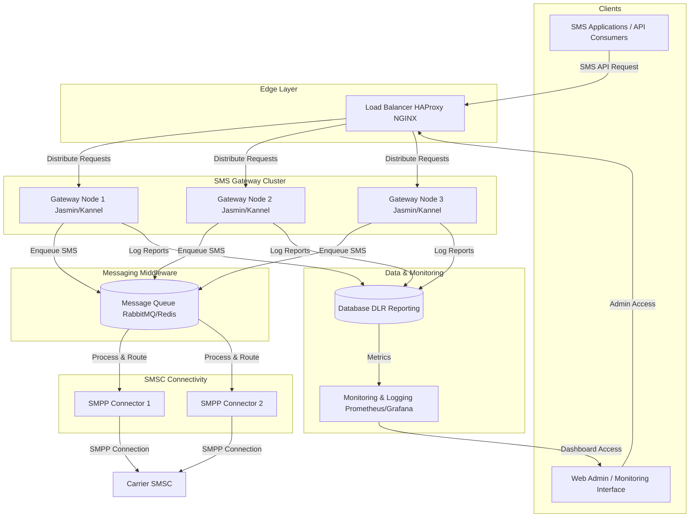

# High-Performance SMS Gateway Architecture (2000 SMS/second)

Below is an example of a production-grade architecture for an open-source SMS gateway (e.g. using Jasmin or Kannel) that is tuned to handle ~2000 SMS/second.

## Explanation

### Clients:
- SMS applications (your API consumers) send SMS requests.
- An admin interface allows operators to monitor the system.

### Edge Layer – Load Balancer:
- A robust load balancer (e.g., HAProxy or NGINX in TCP mode) distributes incoming API requests evenly across multiple gateway nodes.

### SMS Gateway Cluster:
- Multiple instances (nodes) of your SMS gateway software (Jasmin, Kannel, etc.) handle incoming requests and perform local rate-limiting, queuing, and basic message formatting.

### Messaging Middleware (Queue):
- A message queue (RabbitMQ or Redis) buffers and distributes the SMS messages to be processed. This decouples request ingestion from delivery and aids in achieving high throughput.

### SMSC Connectivity:
- Dedicated SMPP connectors on each node (or shared among nodes) establish and maintain connections to the carriers' SMSCs to send out messages using the SMPP protocol.

### Data & Monitoring:
- A centralized database logs delivery reports (DLRs), message statuses, and other metrics.
- Monitoring tools (e.g., Prometheus/Grafana) provide real-time insights and alerting on performance, failures, and throughput.

## Security Considerations

### Security Enhancements:
1. **API Authentication** - Implement strong authentication for all API consumers
2. **Message Encryption** - Encrypt sensitive content in transit and at rest
3. **Network Segmentation** - Implement security zones with proper firewall rules
4. **Input Validation** - Strict validation of all SMS content to prevent injection attacks
5. **Rate Limiting** - Apply per-client rate limits to prevent abuse
6. **Monitoring & Alerting** - Set up security-specific monitoring for suspicious patterns

This architecture is designed for high availability and scalability. It allows you to add or remove gateway nodes as demand increases, while the message queue ensures smooth and reliable processing even under heavy load.

## Implementation Considerations

When implementing this architecture, consider the following:

### Hardware Requirements
- Each gateway node should be provisioned with adequate CPU resources and memory
- Network throughput should be optimized for high traffic volumes
- Consider using specialized hardware for the load balancer in extremely high-volume scenarios

### Message Queue Configuration
- Tune RabbitMQ or Redis for high throughput scenarios
- Implement message persistence to prevent data loss during outages
- Set up appropriate clustering for your message queue to ensure high availability

### SMPP Connection Management
- Implement connection pooling for more efficient use of SMPP binds
- Set up automatic reconnection logic with exponential backoff
- Monitor and manage TPS (Transactions Per Second) limits per SMSC

### Monitoring and Alerting
- Set up comprehensive dashboards to visualize system health
- Implement alerts for critical metrics like queue depth, message processing times, and error rates
- Use distributed tracing to identify bottlenecks in the message flow

## Scaling Strategies

This architecture can be scaled in several ways:

1. **Horizontal Scaling** - Add more gateway nodes as demand increases
2. **Queue Partitioning** - Partition message queues by destination or priority
3. **SMSC Connection Pooling** - Increase the number of connections to SMSCs based on their capacity
4. **Regional Deployment** - Deploy gateway clusters in multiple regions for global coverage

By implementing these strategies, this architecture can be scaled well beyond the 2000 SMS/second baseline to meet growing business needs.

## Conclusion

A high-performance SMS gateway requires careful architecture planning and component selection. The design presented here provides a solid foundation for building a system capable of handling significant SMS traffic while maintaining reliability and security. By following these guidelines and continuously monitoring system performance, organizations can build and maintain a robust messaging infrastructure that can scale with their business needs.
