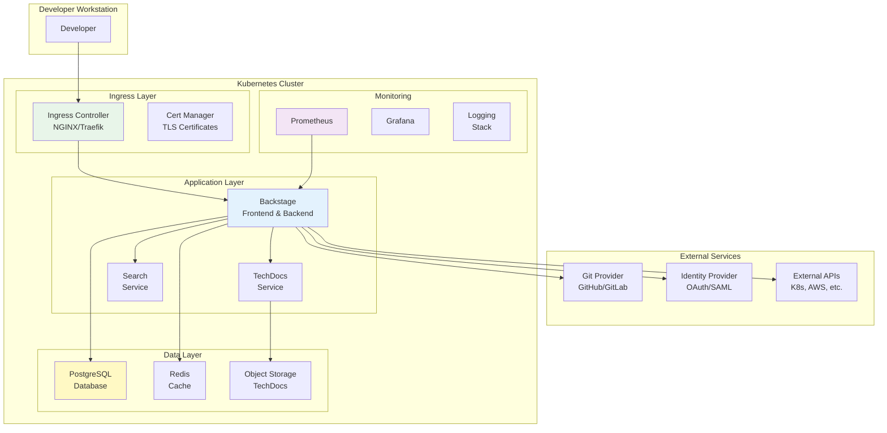
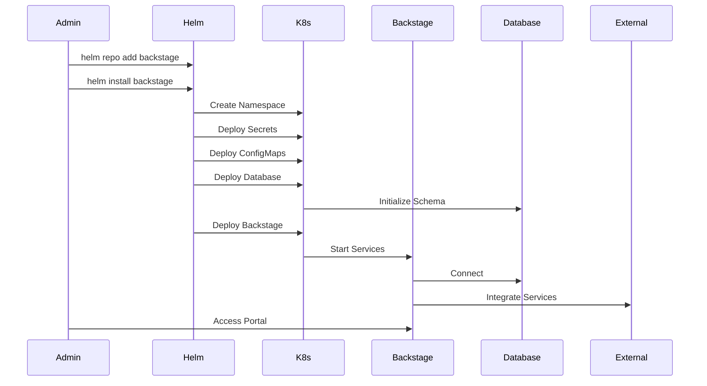
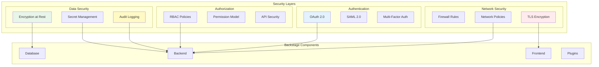
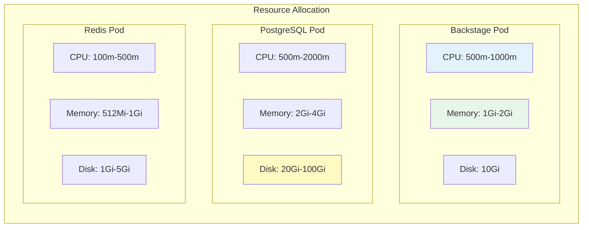

## Table of Contents

## Introduction

Backstage is an open-source developer portal created by Spotify that acts as a centralized hub for infrastructure tooling, documentation, and developer workflows. This guide provides a comprehensive approach to deploying Backstage on Kubernetes using Helm charts, with a focus on production readiness, security, and scalability.

## Architecture Overview

The Backstage deployment architecture consists of multiple components working together to provide a unified developer experience:



## Deployment Workflow

The deployment process follows a structured approach to ensure proper configuration and security:



## Security Architecture

Security is paramount in a Backstage deployment. Here's the security architecture:



## Resource Configuration

Proper resource allocation ensures optimal performance:



## Installation Guide

### Prerequisites

Before beginning the installation, ensure you have:

1. **Kubernetes Cluster**: Version 1.19 or higher
2. **Helm**: Version 3.8 or higher
3. **kubectl**: Configured to access your cluster
4. **Storage**: Persistent storage provisioner
5. **Ingress Controller**: NGINX or similar (optional but recommended)
6. **DNS**: Domain name for accessing Backstage

### Step 1: Add Helm Repository

```bash
# Add the Backstage Helm repository
helm repo add backstage https://backstage.github.io/charts
helm repo update

# Verify the repository was added
helm search repo backstage
```

### Step 2: Create Namespace and Secrets

```bash
# Create a dedicated namespace
kubectl create namespace backstage

# Create secret for PostgreSQL
kubectl create secret generic backstage-postgresql \
  --from-literal=postgres-password=$(openssl rand -base64 32) \
  --namespace backstage

# Create secret for OAuth (if using GitHub)
kubectl create secret generic backstage-oauth \
  --from-literal=AUTH_GITHUB_CLIENT_ID=your-client-id \
  --from-literal=AUTH_GITHUB_CLIENT_SECRET=your-client-secret \
  --namespace backstage
```

### Step 3: Create Production Values File

Create a comprehensive `values-production.yaml` file:

```yaml
# values-production.yaml
global:
  # Set your cluster domain
  clusterDomain: cluster.local

backstage:
  # Number of Backstage replicas for HA
  replicas: 2

  image:
    registry: ghcr.io
    repository: backstage/backstage
    tag: latest
    pullPolicy: IfNotPresent

  # Resource limits and requests
  resources:
    requests:
      memory: "1Gi"
      cpu: "500m"
    limits:
      memory: "2Gi"
      cpu: "1000m"

  # Container configuration
  containerPorts:
    backend: 7007

  # Extra environment variables
  extraEnvVars:
    - name: NODE_ENV
      value: "production"
    - name: LOG_LEVEL
      value: "info"
    - name: APP_CONFIG_backend_baseUrl
      value: "https://backstage.example.com"
    - name: APP_CONFIG_backend_cors_origin
      value: "https://backstage.example.com"

  # Extra environment variables from secrets
  extraEnvVarsSecrets:
    - backstage-oauth

  # App configuration
  appConfig:
    app:
      title: "My Company Backstage"
      baseUrl: https://backstage.example.com

    organization:
      name: "My Company"

    backend:
      baseUrl: https://backstage.example.com
      listen:
        port: 7007
      cors:
        origin: https://backstage.example.com
        methods: [GET, POST, PUT, DELETE]
        credentials: true
      database:
        client: pg
        connection:
          host: ${POSTGRES_HOST}
          port: ${POSTGRES_PORT}
          user: ${POSTGRES_USER}
          password: ${POSTGRES_PASSWORD}
          database: backstage
          ssl:
            require: true
            rejectUnauthorized: false
      cache:
        store: redis
        connection: redis://backstage-redis:6379

    integrations:
      github:
        - host: github.com
          token: ${GITHUB_TOKEN}

    auth:
      environment: production
      providers:
        github:
          production:
            clientId: ${AUTH_GITHUB_CLIENT_ID}
            clientSecret: ${AUTH_GITHUB_CLIENT_SECRET}

    catalog:
      import:
        entityFilename: catalog-info.yaml
        pullRequestBranchName: backstage-integration
      rules:
        - allow: [Component, System, API, Resource, Location]
      locations:
        - type: url
          target: https://github.com/myorg/software-catalog/blob/main/catalog-info.yaml

    techdocs:
      builder: "external"
      generator:
        runIn: "docker"
      publisher:
        type: "awsS3"
        awsS3:
          bucketName: my-techdocs-bucket
          region: us-east-1

    search:
      elasticsearch:
        nodes:
          - http://elasticsearch:9200

  # Service Monitor for Prometheus
  serviceMonitor:
    enabled: true
    path: /metrics
    interval: 30s
    labels:
      prometheus: kube-prometheus

  # Pod Disruption Budget
  podDisruptionBudget:
    enabled: true
    minAvailable: 1

  # Autoscaling configuration
  autoscaling:
    enabled: true
    minReplicas: 2
    maxReplicas: 5
    targetCPU: 70
    targetMemory: 80

# PostgreSQL configuration
postgresql:
  enabled: true

  auth:
    database: backstage
    existingSecret: backstage-postgresql
    secretKeys:
      adminPasswordKey: postgres-password
      userPasswordKey: postgres-password

  primary:
    persistence:
      enabled: true
      size: 20Gi
      storageClass: fast-ssd

    resources:
      requests:
        cpu: 500m
        memory: 2Gi
      limits:
        cpu: 2000m
        memory: 4Gi

    configuration: |
      shared_buffers = 256MB
      max_connections = 200
      effective_cache_size = 1GB

    pgHbaConfiguration: |
      local all all trust
      host all all 0.0.0.0/0 md5
      host all all ::1/128 md5

  metrics:
    enabled: true
    serviceMonitor:
      enabled: true

# Redis configuration
redis:
  enabled: true

  architecture: replication

  auth:
    enabled: true
    existingSecret: backstage-redis
    existingSecretPasswordKey: redis-password

  master:
    persistence:
      enabled: true
      size: 5Gi

    resources:
      requests:
        cpu: 100m
        memory: 512Mi
      limits:
        cpu: 500m
        memory: 1Gi

  replica:
    replicaCount: 2
    persistence:
      enabled: true
      size: 5Gi

  metrics:
    enabled: true
    serviceMonitor:
      enabled: true

# Ingress configuration
ingress:
  enabled: true
  className: nginx

  annotations:
    cert-manager.io/cluster-issuer: letsencrypt-prod
    nginx.ingress.kubernetes.io/backend-protocol: HTTP
    nginx.ingress.kubernetes.io/force-ssl-redirect: "true"
    nginx.ingress.kubernetes.io/proxy-body-size: "10m"
    nginx.ingress.kubernetes.io/proxy-read-timeout: "600"
    nginx.ingress.kubernetes.io/proxy-send-timeout: "600"

  hosts:
    - host: backstage.example.com
      paths:
        - path: /
          pathType: Prefix

  tls:
    - secretName: backstage-tls
      hosts:
        - backstage.example.com

# Network Policy
networkPolicy:
  enabled: true
  ingress:
    - from:
        - namespaceSelector:
            matchLabels:
              name: ingress-nginx
      ports:
        - protocol: TCP
          port: 7007
```

### Step 4: Install Backstage

```bash
# Perform a dry run first
helm upgrade --install backstage backstage/backstage \
  --namespace backstage \
  --values values-production.yaml \
  --dry-run

# Install Backstage
helm upgrade --install backstage backstage/backstage \
  --namespace backstage \
  --values values-production.yaml \
  --wait \
  --timeout 10m

# Verify the installation
kubectl get pods -n backstage
kubectl get svc -n backstage
kubectl get ingress -n backstage
```

### Step 5: Post-Installation Configuration

```bash
# Check Backstage logs
kubectl logs -n backstage -l app.kubernetes.io/name=backstage -f

# Access Backstage locally (for testing)
kubectl port-forward -n backstage svc/backstage 7007:7007

# Get the initial admin password (if configured)
kubectl get secret -n backstage backstage-admin -o jsonpath="{.data.password}" | base64 -d
```

## Security Considerations

### Authentication and Authorization

1. **OAuth/OIDC Integration**:

```yaml
auth:
  providers:
    oidc:
      production:
        metadataUrl: https://your-idp.com/.well-known/openid-configuration
        clientId: ${AUTH_OIDC_CLIENT_ID}
        clientSecret: ${AUTH_OIDC_CLIENT_SECRET}
        scope: "openid profile email groups"
        prompt: auto
```

2. **RBAC Configuration**:

```yaml
permission:
  enabled: true
  rbac:
    policies:
      - effect: allow
        principals:
          - group:platform-team
        permissions:
          - catalog.entity.create
          - catalog.entity.delete
```

3. **API Token Security**:

```bash
# Generate secure API tokens
kubectl create secret generic backstage-api-tokens \
  --from-literal=token1=$(openssl rand -hex 32) \
  --namespace backstage
```

### Network Security

1. **Network Policies**:

```yaml
apiVersion: networking.k8s.io/v1
kind: NetworkPolicy
metadata:
  name: backstage-network-policy
  namespace: backstage
spec:
  podSelector:
    matchLabels:
      app.kubernetes.io/name: backstage
  policyTypes:
    - Ingress
    - Egress
  ingress:
    - from:
        - namespaceSelector:
            matchLabels:
              name: ingress-nginx
      ports:
        - protocol: TCP
          port: 7007
  egress:
    - to:
        - namespaceSelector: {}
      ports:
        - protocol: TCP
          port: 5432 # PostgreSQL
        - protocol: TCP
          port: 6379 # Redis
    - to:
        - namespaceSelector: {}
          podSelector:
            matchLabels:
              k8s-app: kube-dns
      ports:
        - protocol: UDP
          port: 53
    - to: # Allow HTTPS egress
        - ipBlock:
            cidr: 0.0.0.0/0
      ports:
        - protocol: TCP
          port: 443
```

2. **TLS Configuration**:

```yaml
# Configure TLS for all internal communications
backstage:
  appConfig:
    backend:
      https:
        certificate:
          key: /etc/backstage/tls/tls.key
          cert: /etc/backstage/tls/tls.crt
```

### Secrets Management

1. **External Secrets Operator**:

```yaml
apiVersion: external-secrets.io/v1beta1
kind: ExternalSecret
metadata:
  name: backstage-secrets
  namespace: backstage
spec:
  refreshInterval: 1h
  secretStoreRef:
    name: vault-backend
    kind: SecretStore
  target:
    name: backstage-secrets
  data:
    - secretKey: github-token
      remoteRef:
        key: backstage/github
        property: token
    - secretKey: postgres-password
      remoteRef:
        key: backstage/database
        property: password
```

2. **Sealed Secrets**:

```bash
# Install Sealed Secrets controller
kubectl apply -f https://github.com/bitnami-labs/sealed-secrets/releases/download/v0.18.0/controller.yaml

# Create a sealed secret
echo -n "mypassword" | kubectl create secret generic backstage-db \
  --dry-run=client \
  --from-file=password=/dev/stdin \
  -o yaml | kubeseal -o yaml > sealed-secret.yaml
```

### Container Security

1. **Security Context**:

```yaml
backstage:
  podSecurityContext:
    runAsNonRoot: true
    runAsUser: 1000
    fsGroup: 1000
    seccompProfile:
      type: RuntimeDefault

  containerSecurityContext:
    allowPrivilegeEscalation: false
    readOnlyRootFilesystem: true
    runAsNonRoot: true
    runAsUser: 1000
    capabilities:
      drop:
        - ALL
```

2. **Pod Security Standards**:

```yaml
apiVersion: v1
kind: Namespace
metadata:
  name: backstage
  labels:
    pod-security.kubernetes.io/enforce: restricted
    pod-security.kubernetes.io/audit: restricted
    pod-security.kubernetes.io/warn: restricted
```

## Troubleshooting

### Common Issues and Solutions

#### Database Connection Issues

```bash
# Check PostgreSQL pod status
kubectl get pods -n backstage -l app.kubernetes.io/name=postgresql

# Check PostgreSQL logs
kubectl logs -n backstage -l app.kubernetes.io/name=postgresql

# Test database connection
kubectl run -it --rm --restart=Never postgres-client \
  --image=postgres:14 \
  --namespace=backstage \
  -- psql -h backstage-postgresql -U postgres -d backstage

# Check connection from Backstage pod
kubectl exec -it -n backstage deployment/backstage -- \
  nc -zv backstage-postgresql 5432
```

#### Authentication Issues

```bash
# Check OAuth configuration
kubectl get secret -n backstage backstage-oauth -o yaml

# Verify environment variables
kubectl exec -n backstage deployment/backstage -- env | grep AUTH

# Check Backstage auth logs
kubectl logs -n backstage -l app.kubernetes.io/name=backstage | grep -i auth
```

#### Performance Issues

```bash
# Check resource usage
kubectl top pods -n backstage

# Check horizontal pod autoscaler
kubectl get hpa -n backstage

# Analyze slow queries in PostgreSQL
kubectl exec -it -n backstage backstage-postgresql-0 -- \
  psql -U postgres -d backstage -c "SELECT * FROM pg_stat_statements ORDER BY total_time DESC LIMIT 10;"
```

#### Certificate Issues

```bash
# Check certificate status
kubectl get certificate -n backstage

# Describe certificate
kubectl describe certificate backstage-tls -n backstage

# Check cert-manager logs
kubectl logs -n cert-manager deployment/cert-manager
```

## Maintenance and Upgrades

### Regular Maintenance Tasks

1. **Database Maintenance**:

```bash
# Backup database
kubectl exec -n backstage backstage-postgresql-0 -- \
  pg_dump -U postgres backstage > backstage-backup-$(date +%Y%m%d).sql

# Vacuum database
kubectl exec -n backstage backstage-postgresql-0 -- \
  psql -U postgres -d backstage -c "VACUUM ANALYZE;"
```

2. **Log Rotation**:

```yaml
# Configure log rotation in values.yaml
backstage:
  extraEnvVars:
    - name: LOG_FILE_MAX_SIZE
      value: "100MB"
    - name: LOG_FILE_MAX_FILES
      value: "5"
```

3. **Monitoring Setup**:

```yaml
# ServiceMonitor for Prometheus
apiVersion: monitoring.coreos.com/v1
kind: ServiceMonitor
metadata:
  name: backstage
  namespace: backstage
spec:
  selector:
    matchLabels:
      app.kubernetes.io/name: backstage
  endpoints:
    - port: backend
      path: /metrics
      interval: 30s
```

### Upgrade Process

1. **Pre-upgrade Checklist**:

```bash
# Backup current installation
helm get values backstage -n backstage > backstage-values-backup.yaml

# Backup database
kubectl exec -n backstage backstage-postgresql-0 -- \
  pg_dump -U postgres backstage > pre-upgrade-backup.sql

# Check for breaking changes
helm show readme backstage/backstage --version <new-version>
```

2. **Perform Upgrade**:

```bash
# Update Helm repository
helm repo update

# Check changes
helm diff upgrade backstage backstage/backstage \
  --namespace backstage \
  --values values-production.yaml

# Perform upgrade
helm upgrade backstage backstage/backstage \
  --namespace backstage \
  --values values-production.yaml \
  --wait \
  --timeout 10m
```

3. **Post-upgrade Validation**:

```bash
# Check pod status
kubectl get pods -n backstage

# Verify application health
curl -s https://backstage.example.com/api/health | jq .

# Check for errors in logs
kubectl logs -n backstage -l app.kubernetes.io/name=backstage --tail=100
```

## Best Practices

### Development Workflow

1. **GitOps Integration**:

```yaml
# argocd-application.yaml
apiVersion: argoproj.io/v1alpha1
kind: Application
metadata:
  name: backstage
  namespace: argocd
spec:
  project: default
  source:
    repoURL: https://github.com/myorg/backstage-config
    targetRevision: main
    path: overlays/production
  destination:
    server: https://kubernetes.default.svc
    namespace: backstage
  syncPolicy:
    automated:
      prune: true
      selfHeal: true
```

2. **Multi-Environment Setup**:

```bash
# Directory structure
backstage-config/
├── base/
│   ├── kustomization.yaml
│   └── values.yaml
├── overlays/
│   ├── development/
│   │   ├── kustomization.yaml
│   │   └── values.yaml
│   ├── staging/
│   │   ├── kustomization.yaml
│   │   └── values.yaml
│   └── production/
│       ├── kustomization.yaml
│       └── values.yaml
```

### Plugin Management

1. **Custom Plugin Deployment**:

```dockerfile
# Dockerfile for custom Backstage image
FROM node:16-bullseye-slim as build

WORKDIR /app

# Copy and install dependencies
COPY package.json yarn.lock ./
COPY packages ./packages
RUN yarn install --frozen-lockfile

# Build the application
RUN yarn build

# Runtime stage
FROM node:16-bullseye-slim

WORKDIR /app

# Copy built application
COPY --from=build /app/packages/backend/dist ./
COPY --from=build /app/packages/app/dist ./app

# Install production dependencies
COPY package.json yarn.lock ./
RUN yarn install --production --frozen-lockfile

EXPOSE 7007
CMD ["node", "packages/backend"]
```

2. **Plugin Configuration**:

```yaml
# values.yaml plugin configuration
backstage:
  appConfig:
    app:
      plugins:
        - id: "@backstage/plugin-kubernetes"
          config:
            clusters:
              - name: production
                url: https://k8s-prod.example.com
                authProvider: serviceAccount
        - id: "@backstage/plugin-sonarqube"
          config:
            baseUrl: https://sonarqube.example.com
            apiKey: ${SONARQUBE_API_KEY}
```

### Monitoring and Observability

1. **Grafana Dashboard**:

```json
{
  "dashboard": {
    "title": "Backstage Monitoring",
    "panels": [
      {
        "title": "Request Rate",
        "targets": [
          {
            "expr": "rate(http_request_duration_seconds_count{job=\"backstage\"}[5m])"
          }
        ]
      },
      {
        "title": "Error Rate",
        "targets": [
          {
            "expr": "rate(http_request_duration_seconds_count{job=\"backstage\",status=~\"5..\"}[5m])"
          }
        ]
      },
      {
        "title": "Response Time",
        "targets": [
          {
            "expr": "histogram_quantile(0.95, rate(http_request_duration_seconds_bucket{job=\"backstage\"}[5m]))"
          }
        ]
      }
    ]
  }
}
```

2. **Alert Rules**:

```yaml
# prometheus-rules.yaml
apiVersion: monitoring.coreos.com/v1
kind: PrometheusRule
metadata:
  name: backstage-alerts
  namespace: backstage
spec:
  groups:
    - name: backstage
      rules:
        - alert: BackstageDown
          expr: up{job="backstage"} == 0
          for: 5m
          annotations:
            summary: "Backstage is down"
            description: "Backstage has been down for more than 5 minutes"

        - alert: BackstageHighErrorRate
          expr: rate(http_request_duration_seconds_count{job="backstage",status=~"5.."}[5m]) > 0.05
          for: 10m
          annotations:
            summary: "High error rate in Backstage"
            description: "Error rate is above 5% for 10 minutes"

        - alert: BackstageHighMemoryUsage
          expr: container_memory_usage_bytes{pod=~"backstage-.*"} / container_spec_memory_limit_bytes > 0.9
          for: 10m
          annotations:
            summary: "High memory usage in Backstage"
            description: "Memory usage is above 90% for 10 minutes"
```

## References

- [Official Backstage Documentation](https://backstage.io/docs)
- [Backstage Helm Charts Repository](https://github.com/backstage/charts)
- [Kubernetes Best Practices](https://kubernetes.io/docs/concepts/configuration/overview/)
- [Helm Best Practices](https://helm.sh/docs/chart_best_practices/)

## Conclusion

Deploying Backstage on Kubernetes with Helm provides a scalable, secure, and maintainable developer portal solution. By following this guide and implementing the security best practices, you can create a production-ready Backstage deployment that serves as a central hub for your engineering organization.

Remember to:

- Regularly update Backstage and its dependencies
- Monitor performance and security metrics
- Backup your data regularly
- Test disaster recovery procedures
- Keep documentation updated
- Engage with the Backstage community for support and contributions

The flexibility of Backstage, combined with Kubernetes' orchestration capabilities and Helm's package management, creates a powerful platform for improving developer experience and productivity.
