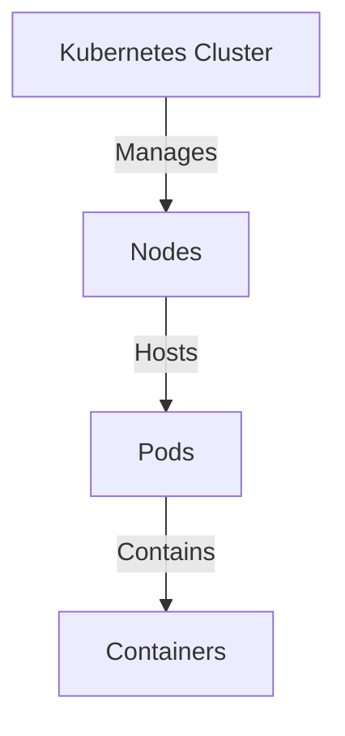
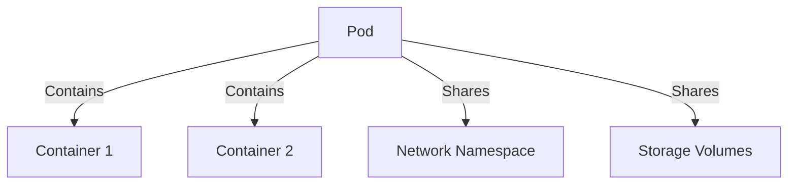
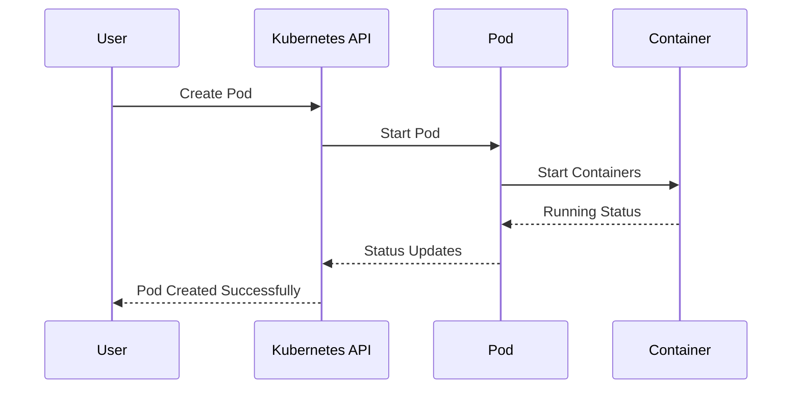
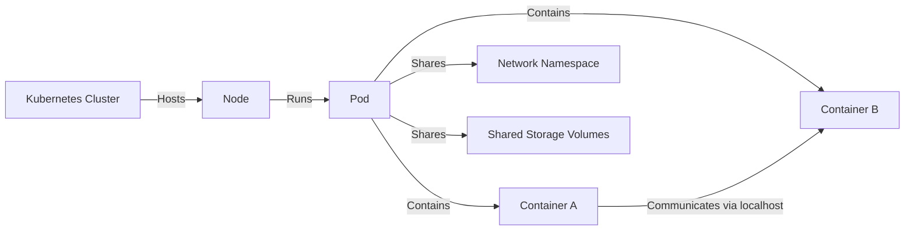
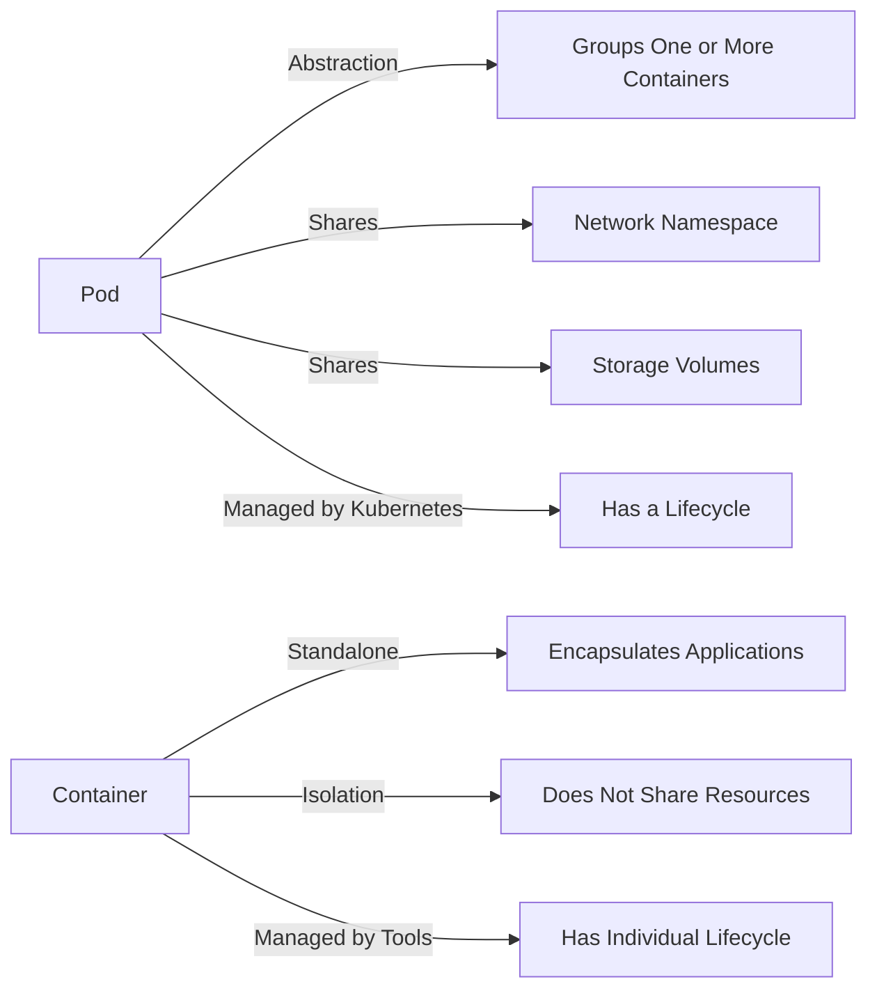

# Kubernetes Pod vs Container: Understanding the Difference

When working with Kubernetes, understanding the distinction between pods and containers is essential for efficient containerized application deployment. This guide breaks down their differences, relationships, and use cases with visual diagrams to help clarify these concepts.

## Overview

- A **Pod** is the smallest deployable unit in Kubernetes.
- A **Container** is a standalone software package that includes all dependencies to run an application.

While containers have been the fundamental building blocks of containerization, pods represent a higher-level abstraction in Kubernetes that simplifies managing related containers.

## Visual Representations

### 1. Kubernetes Architecture

The following diagram illustrates where pods and containers fit within the Kubernetes architecture:



### 2. Pod and Container Relationship

This visualization shows how containers are organized within a pod:



### 3. Pod Lifecycle Management

The following sequence diagram demonstrates how a pod's lifecycle is managed:



### 4. How Pods and Containers Work Together

This diagram shows the interaction between pods and containers on a Kubernetes cluster:



### 5. Difference Between Pod and Container

This comparison highlights the key differences between pods and containers:



## Key Features and Differences

### Kubernetes Pod

- **Resource Grouping**: Pods group one or more containers, making them operate as a single unit.
- **Shared Namespace**: All containers within a pod share the same network namespace, allowing them to communicate via localhost.
- **Shared Storage**: Containers in a pod can access shared volumes, simplifying data exchange.
- **Unified Management**: Starting, stopping, or deleting a pod affects all its containers simultaneously.
- **Atomic Scheduling**: Pods are scheduled as a unit—all containers in a pod run on the same node.
- **IP Assignment**: Each pod receives its own unique IP address within the cluster network.

### Kubernetes Container

- **Isolation**: Each container has its own isolated filesystem and processes.
- **Portability**: Containers can be moved and run independently across different environments.
- **Resource Efficiency**: Containers are lightweight compared to virtual machines, sharing the host's kernel.
- **Individual Lifecycle**: While part of a pod, containers can restart independently of other containers in the pod.
- **Granular Control**: Resource limits, security settings, and environment variables can be configured at the individual container level.

## Common Use Cases

### When to Group Containers in a Pod

1. **Sidecar Pattern**: When you have a main application container with supporting containers (like logging, monitoring, or proxy).
2. **Ambassador Pattern**: When a container acts as a proxy for external services.
3. **Adapter Pattern**: When a container transforms the main container's output.
4. **Init Containers**: When you need containers that run and complete before your app containers start.
5. **Shared Data Processing**: When multiple containers need to process the same data simultaneously.

### When to Use Multiple Pods

1. **Independent Scaling**: When components need to scale independently.
2. **Different Resource Requirements**: When containers have vastly different CPU/memory needs.
3. **Fault Isolation**: To prevent failures in one component from affecting others.
4. **Different Host Requirements**: When containers need to run on different types of nodes.

## Real-World Example

Consider a web application consisting of a frontend service, a backend API, and a Redis cache:

### Single Pod Approach

```yaml
apiVersion: v1
kind: Pod
metadata:
  name: webapp-pod
spec:
  containers:
    - name: frontend
      image: frontend-image:latest
      ports:
        - containerPort: 80
    - name: backend
      image: backend-image:latest
      ports:
        - containerPort: 8000
    - name: cache
      image: redis:latest
      ports:
        - containerPort: 6379
```

With this approach:

- The frontend can connect to the backend via `localhost:8000`
- The backend can connect to Redis via `localhost:6379`
- All components are deployed and scaled together

### Multiple Pods Approach

```yaml
# Frontend Deployment
apiVersion: apps/v1
kind: Deployment
metadata:
  name: frontend
spec:
  replicas: 3
  selector:
    matchLabels:
      app: frontend
  template:
    metadata:
      labels:
        app: frontend
    spec:
      containers:
      - name: frontend
        image: frontend-image:latest

# Backend Deployment
apiVersion: apps/v1
kind: Deployment
metadata:
  name: backend
spec:
  replicas: 2
  selector:
    matchLabels:
      app: backend
  template:
    metadata:
      labels:
        app: backend
    spec:
      containers:
      - name: backend
        image: backend-image:latest

# Cache Deployment
apiVersion: apps/v1
kind: Deployment
metadata:
  name: cache
spec:
  replicas: 1
  selector:
    matchLabels:
      app: cache
  template:
    metadata:
      labels:
        app: cache
    spec:
      containers:
      - name: redis
        image: redis:latest
```

With this approach:

- Each component can scale independently
- Services connect to each other via Kubernetes Services
- Better fault isolation between components

## Conclusion

Pods in Kubernetes provide a higher-level abstraction for deploying and managing closely related containers. They simplify networking and resource sharing between containers while providing a scheduling unit that's more practical than individual containers.

Understanding when to group containers in a pod versus when to separate them into different pods is crucial for designing efficient and scalable applications on Kubernetes. The right approach depends on your specific requirements for scaling, resource utilization, and component interdependencies.

By effectively leveraging pods and containers according to their intended roles and relationships, you can build resilient, maintainable, and scalable applications on Kubernetes.
