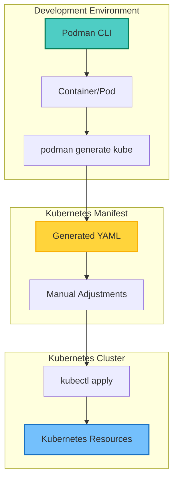
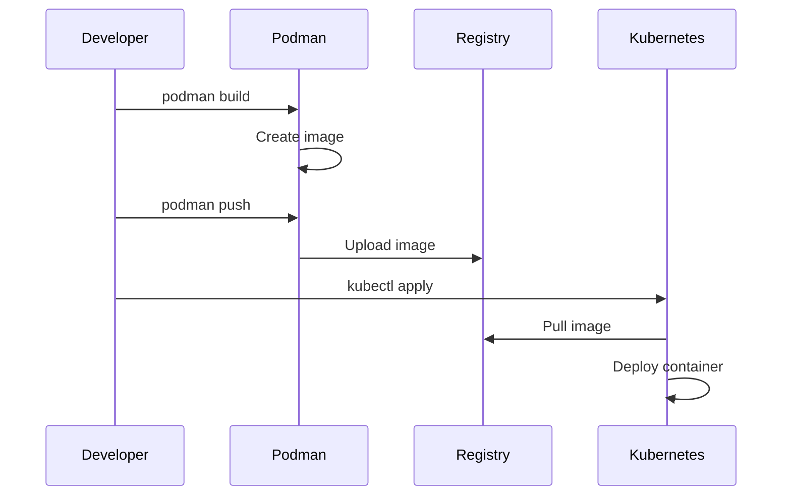
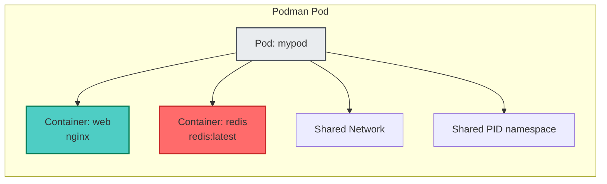
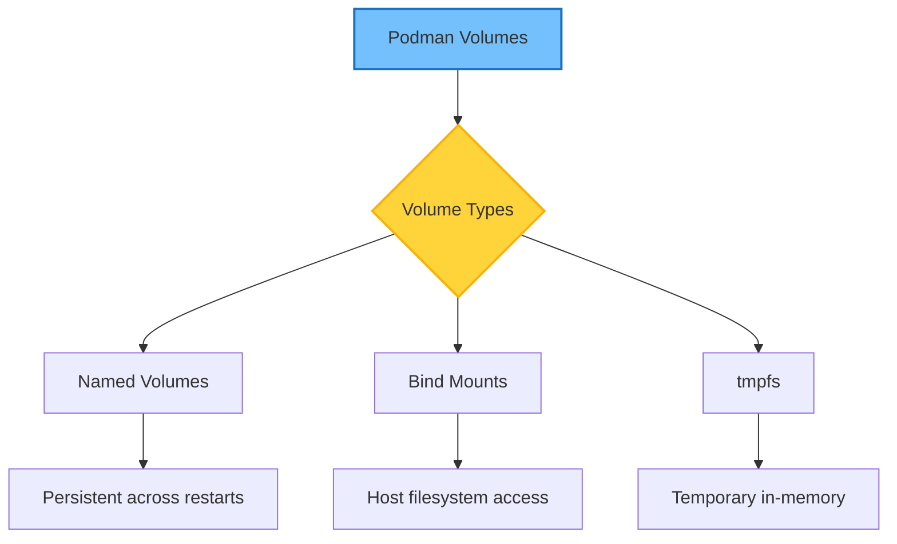
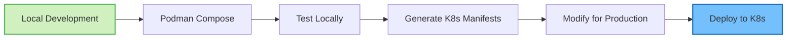
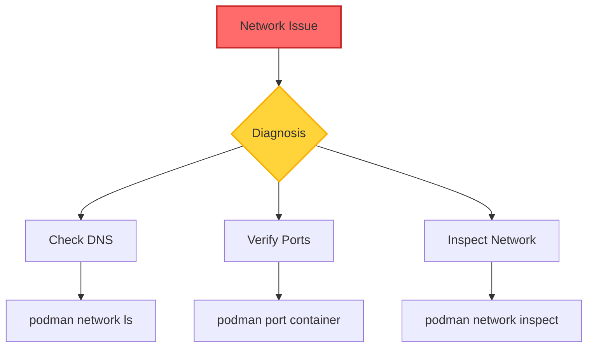
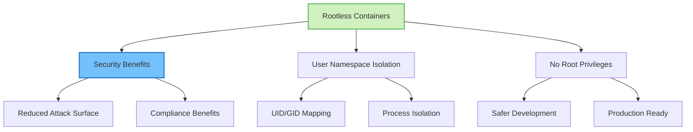
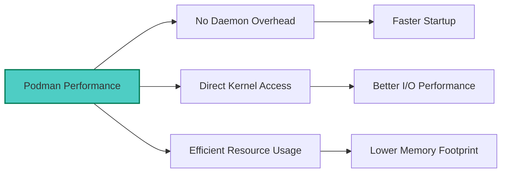

## Table of Contents

## Overview

Podman is a daemonless container engine that provides a Docker-compatible command line experience while offering unique features like rootless containers and native Kubernetes integration. This guide explores how to effectively use Podman with Kubernetes for both development and production workflows.

## Podman to Kubernetes Architecture



## Basic Podman to Kubernetes Workflow

### 1. Generate Kubernetes YAML from Containers

```bash
# Generate Kubernetes YAML from a Podman container
podman generate kube container_name > pod.yaml

# Create Kubernetes resources from Podman-generated YAML
podman play kube pod.yaml

# Generate YAML for multiple containers in a pod
podman generate kube pod_name > multipod.yaml
```

### 2. Simple Container Example

```bash
# Run a container using Podman
podman run -d --name webserver nginx

# Generate Kubernetes manifest
podman generate kube webserver > nginx-pod.yaml
```

The generated YAML structure:

```yaml
apiVersion: v1
kind: Pod
metadata:
  name: webserver
  labels:
    app: webserver
spec:
  containers:
    - name: webserver
      image: docker.io/library/nginx:latest
      ports:
        - containerPort: 80
          protocol: TCP
```

## Common Integration Patterns

### Image Management Workflow



### Building and Pushing Images

```bash
# Build an image
podman build -t myapp:latest .

# Push to a registry
podman push myapp:latest registry.example.com/myapp:latest

# Convert from Docker Compose to Kubernetes
podman-compose -f docker-compose.yml kube > k8s-deployment.yaml
```

## Using Podman with Kind

Kind (Kubernetes in Docker) can work with Podman images:

```bash
# Save Podman image to tar
podman save -o myapp.tar myapp:latest

# Load image into Kind cluster
kind load image-archive myapp.tar
```

## Multi-Container Pod Workflows

### Creating Complex Pods

```bash
# Create pod with multiple containers
podman pod create --name mypod
podman run -dt --pod mypod --name web nginx
podman run -dt --pod mypod --name redis redis

# Generate Kubernetes manifest for the pod
podman generate kube mypod > multipod.yaml
```

### Pod Architecture



## Advanced Features

### 1. Security Context Generation

```bash
# Run rootless containers
podman run --user 1000:1000 nginx

# Generate YAML with security contexts
podman generate kube --security-opt=no-new-privileges container_name
```

### 2. Volume Management



## Development Workflow

### Local Development to Production Pipeline



### Example Development Process

```bash
# 1. Create development environment
podman-compose up -d

# 2. Test and develop locally

# 3. Generate Kubernetes manifests
podman generate kube devenv > k8s-dev.yaml

# 4. Apply to Kubernetes
kubectl apply -f k8s-dev.yaml
```

## Best Practices

### 1. Image Management

- Always tag images properly
- Use multi-stage builds
- Leverage Podman's rootless containers
- Maintain consistency between environments

### 2. Manifest Customization

Generated manifests often need modifications for production:

```yaml
# Add resource limits
resources:
  limits:
    memory: "512Mi"
    cpu: "500m"
  requests:
    memory: "256Mi"
    cpu: "250m"

# Add health checks
livenessProbe:
  httpGet:
    path: /health
    port: 8080
  initialDelaySeconds: 30
  periodSeconds: 10
```

## Troubleshooting Guide

### Common Issues and Solutions

#### 1. Version and Info Check

```bash
# Check Podman version and info
podman version
podman info
```

#### 2. Container Status Verification

```bash
# Verify container status
podman ps -a

# Check container logs
podman logs container_name

# Inspect container details
podman inspect container_name
```

#### 3. Network Troubleshooting



## Kubernetes Manifest Modifications

### Production-Ready Adjustments

When moving from Podman-generated manifests to production, consider:

1. **Resource Management**

   ```yaml
   spec:
     containers:
       - name: app
         resources:
           limits:
             memory: "1Gi"
             cpu: "1000m"
           requests:
             memory: "512Mi"
             cpu: "500m"
   ```

2. **Service Accounts and RBAC**

   ```yaml
   spec:
     serviceAccountName: myapp-sa
   ```

3. **Network Policies**

   ```yaml
   apiVersion: networking.k8s.io/v1
   kind: NetworkPolicy
   metadata:
     name: myapp-netpol
   spec:
     podSelector:
       matchLabels:
         app: myapp
   ```

4. **Persistent Storage**
   ```yaml
   volumes:
     - name: data
       persistentVolumeClaim:
         claimName: myapp-pvc
   ```

## Rootless Container Benefits



## Common Pitfalls to Avoid

1. **Not Setting Proper Image Tags**

   ```bash
   # Bad
   podman build -t myapp .

   # Good
   podman build -t myapp:v1.0.0 .
   ```

2. **Forgetting Registry Access**

   ```bash
   # Ensure Kubernetes can access your registry
   kubectl create secret docker-registry regcred \
     --docker-server=registry.example.com \
     --docker-username=user \
     --docker-password=pass
   ```

3. **Ignoring Security Contexts**
   ```yaml
   securityContext:
     runAsNonRoot: true
     runAsUser: 1000
     fsGroup: 2000
   ```

## Integration with CI/CD

### GitLab CI Example

```yaml
stages:
  - build
  - deploy

build:
  stage: build
  script:
    - podman build -t $CI_REGISTRY_IMAGE:$CI_COMMIT_SHA .
    - podman push $CI_REGISTRY_IMAGE:$CI_COMMIT_SHA

deploy:
  stage: deploy
  script:
    - podman generate kube myapp > k8s-manifest.yaml
    - kubectl apply -f k8s-manifest.yaml
```

## Performance Considerations



## Conclusion

Podman provides a powerful, secure, and Kubernetes-friendly alternative to Docker. Its ability to generate Kubernetes manifests, support for rootless containers, and OCI compliance make it an excellent choice for modern container workflows.

Key takeaways:

- Podman seamlessly integrates with Kubernetes workflows
- `podman generate kube` bridges local development and Kubernetes deployment
- Rootless containers provide enhanced security
- Generated manifests often need production-specific modifications
- Podman can replace Docker in most Kubernetes workflows

Whether you're developing locally or deploying to production, Podman's Kubernetes integration features streamline the container lifecycle while maintaining security and compatibility.
