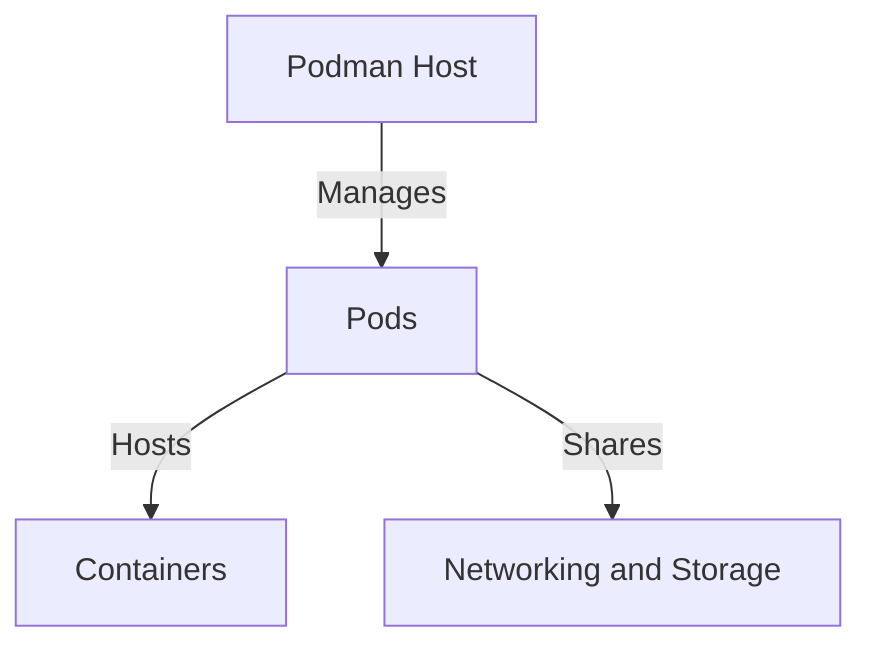
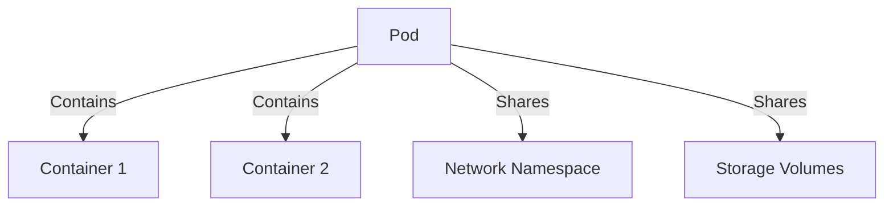
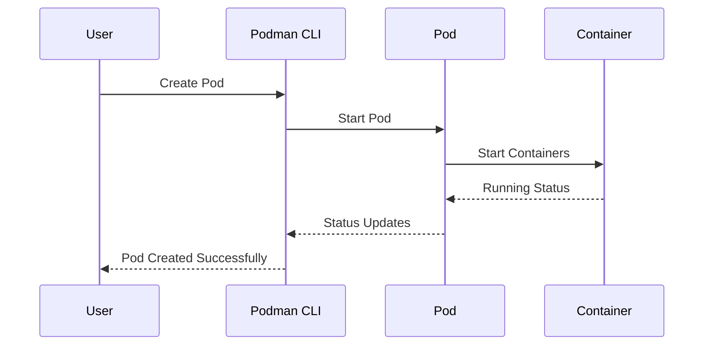
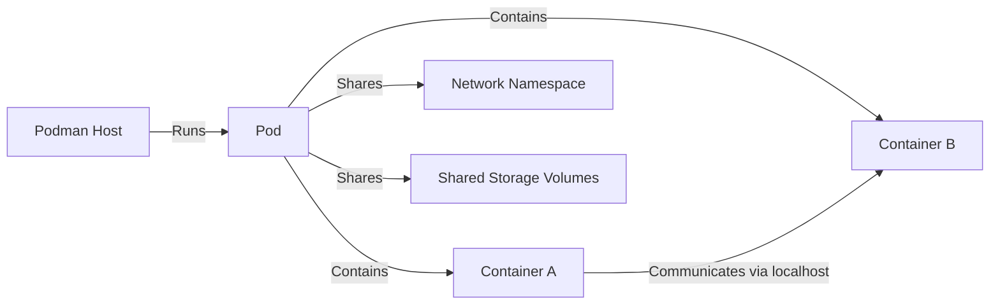
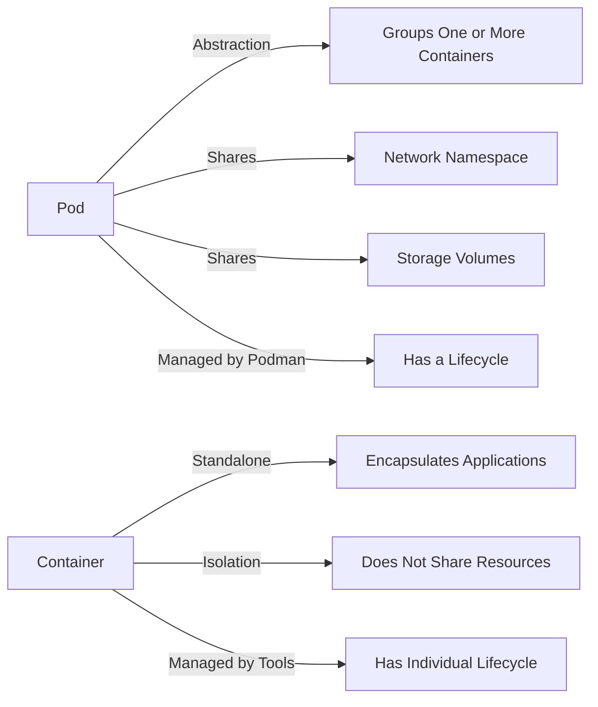

# Podman Pod vs Container: Understanding the Difference

When working with Podman, understanding the distinction between pods and containers is essential for efficient containerized application deployment. This guide breaks down their differences, relationships, and use cases with visual diagrams to help clarify these concepts.

## Overview

- A **Pod** in Podman is a collection of one or more containers that share networking, storage, and other resources.
- A **Container** is a standalone software package that includes all dependencies to run an application.

While containers have been the fundamental building blocks of containerization, pods represent a higher-level abstraction inspired by Kubernetes that simplifies managing related containers.

## Visual Representations

### 1. Podman Architecture

The following diagram illustrates where pods and containers fit within the Podman architecture:



### 2. Pod and Container Relationship in Podman

This visualization shows how containers are organized within a pod:



### 3. Pod Lifecycle Management in Podman

The following sequence diagram demonstrates how a pod's lifecycle is managed:



### 4. How Pods and Containers Work Together in Podman

This diagram shows the interaction between pods and containers on a Podman host:



### 5. Difference Between Pod and Container in Podman

This comparison highlights the key differences between pods and containers:



## Key Features and Differences

### Podman Pod

- **Resource Grouping**: Pods group one or more containers, making them operate as a single unit.
- **Shared Namespace**: All containers within a pod share the same network namespace, allowing them to communicate via localhost.
- **Shared Storage**: Containers in a pod can access shared volumes, simplifying data exchange.
- **Unified Management**: Starting, stopping, or deleting a pod affects all its containers simultaneously.
- **Kubernetes Compatibility**: Pods in Podman mirror Kubernetes pod behavior, making it easier to transition applications between environments.

### Podman Container

- **Isolation**: Each container has its own isolated filesystem and processes.
- **Portability**: Containers can be moved and run independently across different environments.
- **Resource Efficiency**: Containers are lightweight compared to virtual machines, sharing the host's kernel.
- **Individual Lifecycle**: Containers can be started, stopped, and managed independently when not part of a pod.
- **Granular Control**: Resource limits, security settings, and environment variables can be configured at the individual container level.

## Common Use Cases

### When to Use Pods

1. **Sidecar Pattern**: When you have a main application container with supporting containers (like logging, monitoring, or proxy).
2. **Inter-container Communication**: When containers need to communicate over localhost.
3. **Shared Resources**: When multiple containers need access to the same storage or network resources.
4. **Application Bundles**: When deploying tightly coupled applications that function as a unit.
5. **Kubernetes Migration**: When preparing applications for eventual deployment on Kubernetes.

### When to Use Individual Containers

1. **Independent Services**: When deploying standalone microservices.
2. **Resource Isolation**: When services require strict resource separation.
3. **Simple Deployments**: For single-purpose applications without ancillary services.
4. **Different Lifecycle Requirements**: When containers need to be updated or restarted independently.

## Real-World Example

Let's consider a web application that consists of a frontend service, a backend API, and a Redis cache. In this scenario:

### Pod Approach

You could create a pod containing all three components:

```bash
# Create a pod
podman pod create --name webapp-pod -p 8080:80

# Add containers to the pod
podman run --pod webapp-pod -d --name frontend frontend-image
podman run --pod webapp-pod -d --name backend backend-image
podman run --pod webapp-pod -d --name cache redis
```

With this approach:

- The frontend can connect to the backend via `localhost:8000`
- The backend can connect to Redis via `localhost:6379`
- Only port 80 needs to be exposed to the host system

### Individual Container Approach

Alternatively, you could run them as separate containers:

```bash
# Create a network
podman network create webapp-network

# Run containers on the same network
podman run -d --name frontend -p 8080:80 --network webapp-network frontend-image
podman run -d --name backend -p 8000:8000 --network webapp-network backend-image
podman run -d --name cache --network webapp-network redis
```

With this approach:

- Containers connect to each other using container names (e.g., `backend:8000`)
- Each container's ports must be individually managed
- Each container has its own network namespace

## Conclusion

Pods in Podman provide a higher-level abstraction for deploying and managing closely related containers, particularly for applications designed with a microservices architecture. They simplify networking and resource sharing between containers while maintaining the pod abstraction familiar to Kubernetes users.

Containers remain the fundamental units of deployment, providing isolation, portability, and resource efficiency for individual services.

Understanding when to use pods versus individual containers helps you design more efficient, maintainable, and scalable containerized applications with Podman. For complex applications with multiple interconnected components, pods offer significant advantages in simplifying your deployment and management workflows.
