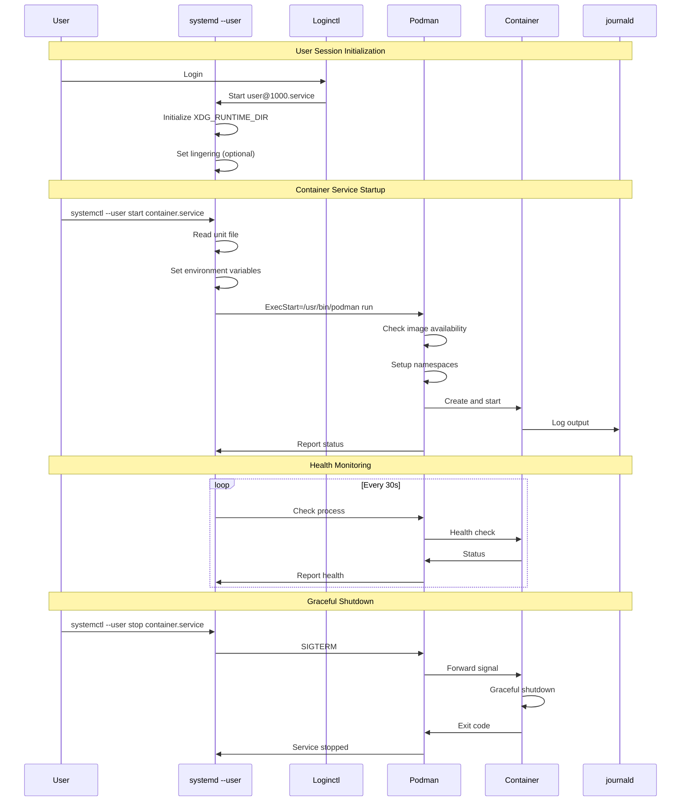
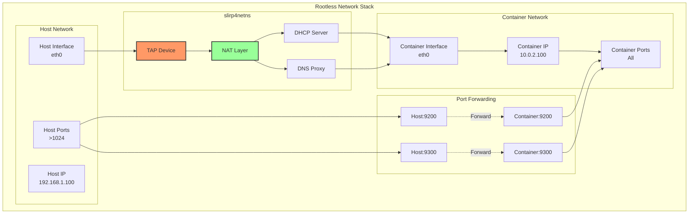
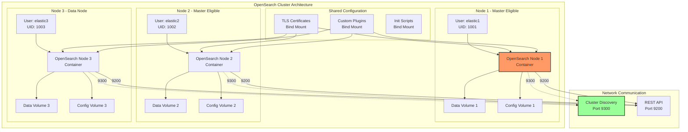
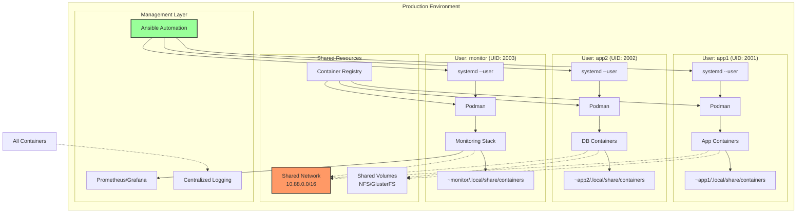
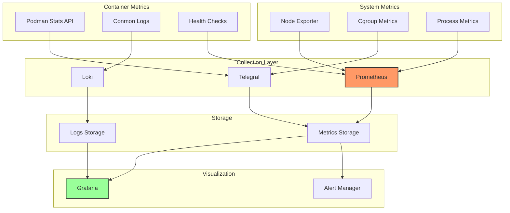
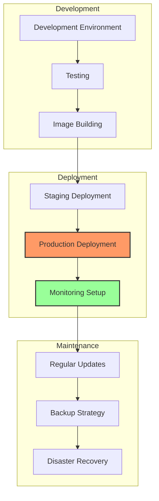

# Podman Rootless Containers - Architecture, Security, and Production Deployment

Podman's rootless container architecture represents a significant advancement in container security, eliminating the need for root privileges while maintaining full container functionality. This comprehensive guide explores the architecture, implementation details, and production deployment strategies for rootless containers.

## Table of Contents

## Container Architecture Overview

Podman's rootless architecture leverages Linux kernel features to provide secure containerization without requiring root privileges. This fundamentally changes how containers interact with the host system.

```mermaid
graph TB
    subgraph "User Space"
        User[Regular User<br/>UID: 1000]
        PodmanCLI[Podman CLI]
        Conmon[Conmon<br/>Container Monitor]

        subgraph "Container Process"
            Init[Container Init<br/>PID 1]
            App[Application<br/>PID 2+]
        end
    end

    subgraph "Kernel Features"
        subgraph "Namespaces"
            UserNS[User Namespace]
            PidNS[PID Namespace]
            NetNS[Network Namespace]
            MountNS[Mount Namespace]
            IPCNS[IPC Namespace]
            UTSNS[UTS Namespace]
            CgroupNS[Cgroup Namespace]
        end

        subgraph "Security"
            Seccomp[Seccomp Filters]
            Capabilities[Capabilities]
            SELinux[SELinux Context]
            AppArmor[AppArmor Profile]
        end

        subgraph "Storage"
            Fuse[FUSE-OverlayFS]
            VFS[VFS Driver]
            SubUID[Sub UID/GID Mapping]
        end
    end

    subgraph "Runtime"
        OCI[OCI Runtime<br/>(crun/runc)]
        CNI[CNI Plugins]
        Slirp4netns[slirp4netns]
    end

    User --> PodmanCLI
    PodmanCLI --> Conmon
    Conmon --> OCI

    OCI --> UserNS
    OCI --> PidNS
    OCI --> NetNS
    OCI --> MountNS
    OCI --> IPCNS
    OCI --> UTSNS
    OCI --> CgroupNS

    UserNS --> SubUID
    NetNS --> Slirp4netns
    MountNS --> Fuse

    OCI --> Init
    Init --> App

    OCI --> Seccomp
    OCI --> Capabilities
    OCI --> SELinux

    style UserNS fill:#f96,stroke:#333,stroke-width:4px
    style Fuse fill:#9f9,stroke:#333,stroke-width:2px
    style PodmanCLI fill:#99f,stroke:#333,stroke-width:2px
```

### Key Architectural Components

1. **User Namespaces**: Maps container UIDs to unprivileged host UIDs
2. **FUSE-OverlayFS**: Provides layered filesystem without root access
3. **slirp4netns**: User-mode networking for rootless containers
4. **Conmon**: Monitors container lifecycle and handles logging
5. **Sub UID/GID**: Extends user's UID/GID range for container isolation

## Rootless vs Root Container Comparison

```mermaid
graph LR
    subgraph "Rootless Containers"
        RL_User[User: 1000]
        RL_Container[Container Root: 0]
        RL_Host[Host Mapping: 100000]
        RL_Storage[User Storage<br/>~/.local/share/containers]
        RL_Network[User Network<br/>slirp4netns]
    end

    subgraph "Root Containers"
        R_User[User: root (0)]
        R_Container[Container Root: 0]
        R_Host[Host Mapping: 0]
        R_Storage[System Storage<br/>/var/lib/containers]
        R_Network[Bridge Network<br/>cni-podman0]
    end

    RL_User -->|maps to| RL_Container
    RL_Container -->|appears as| RL_Host

    R_User -->|direct| R_Container
    R_Container -->|same as| R_Host

    style RL_Container fill:#9f9,stroke:#333,stroke-width:2px
    style R_Container fill:#f99,stroke:#333,stroke-width:2px
```

### Feature Comparison Matrix

| Feature                  | Rootless           | Root            | Notes                          |
| ------------------------ | ------------------ | --------------- | ------------------------------ |
| **Security**             | ✅ High            | ⚠️ Medium       | No root escalation risk        |
| **Port Binding**         | ❌ >1024 only      | ✅ All ports    | Requires root for <1024        |
| **Performance**          | ⚠️ Slight overhead | ✅ Native       | FUSE and slirp4netns overhead  |
| **Storage Drivers**      | 🔶 Limited         | ✅ All          | FUSE-overlayfs, VFS            |
| **Network Modes**        | 🔶 Limited         | ✅ All          | No macvlan, ipvlan             |
| **Systemd Integration**  | ✅ User units      | ✅ System units | Both supported                 |
| **Multi-user Isolation** | ✅ Complete        | ⚠️ Shared       | Each user has separate storage |

## Systemd Integration Architecture

Systemd integration enables automatic container lifecycle management, making rootless containers production-ready.



### Systemd Unit File Example

```ini
# ~/.config/systemd/user/opensearch.service
[Unit]
Description=Rootless OpenSearch Container
Documentation=https://opensearch.org
After=network-online.target
Wants=network-online.target

[Service]
Type=forking
Environment="PODMAN_SYSTEMD_UNIT=%n"
Environment="XDG_RUNTIME_DIR=/run/user/1000"
Restart=always
RestartSec=30s
TimeoutStartSec=300
TimeoutStopSec=70
ExecStartPre=/bin/rm -f %t/%n.ctr-id
ExecStart=/usr/bin/podman run \
    --cidfile=%t/%n.ctr-id \
    --cgroups=no-conmon \
    --sdnotify=conmon \
    --replace \
    --detach \
    --name opensearch \
    --hostname opensearch \
    --network slirp4netns:port_handler=slirp4netns \
    --publish 9200:9200 \
    --publish 9300:9300 \
    --volume opensearch-data:/usr/share/opensearch/data:Z \
    --volume opensearch-config:/usr/share/opensearch/config:Z \
    --env OPENSEARCH_JAVA_OPTS="-Xms2g -Xmx2g" \
    --env discovery.type=single-node \
    --env DISABLE_SECURITY_PLUGIN=true \
    --memory 4g \
    --memory-swap 4g \
    --cpus 2 \
    opensearchproject/opensearch:2.11.0

ExecStop=/usr/bin/podman stop --ignore --cidfile=%t/%n.ctr-id
ExecStopPost=/usr/bin/podman rm -f --ignore --cidfile=%t/%n.ctr-id

# Health check
ExecReload=/usr/bin/podman exec opensearch curl -s http://localhost:9200/_cluster/health

[Install]
WantedBy=default.target
```

## Volume Mount Structure

Volume management in rootless containers requires understanding the permission mapping and storage drivers.

```mermaid
graph TB
    subgraph "Host Filesystem"
        HostUser[User Home<br/>/home/user]
        LocalShare[~/.local/share/containers]

        subgraph "Container Storage"
            Storage[storage]
            Volumes[volumes]
            Images[overlay-images]
            Containers[overlay-containers]
            Cache[cache]
        end

        subgraph "Volume Types"
            Named[Named Volumes]
            Bind[Bind Mounts]
            Tmpfs[Tmpfs Mounts]
            Anonymous[Anonymous Volumes]
        end
    end

    subgraph "Container View"
        ContainerFS[Container Filesystem]
        AppData[/app/data]
        Config[/etc/app]
        Logs[/var/log/app]
        Temp[/tmp]
    end

    subgraph "Permission Mapping"
        UID1000[Host UID: 1000]
        UID100000[Mapped UID: 100000]
        GID1000[Host GID: 1000]
        GID100000[Mapped GID: 100000]
    end

    HostUser --> LocalShare
    LocalShare --> Storage
    Storage --> Volumes
    Storage --> Images
    Storage --> Containers
    Storage --> Cache

    Volumes --> Named
    HostUser --> Bind
    Memory[Memory] --> Tmpfs
    Volumes --> Anonymous

    Named --> AppData
    Bind --> Config
    Anonymous --> Logs
    Tmpfs --> Temp

    UID1000 -.->|maps to| UID100000
    GID1000 -.->|maps to| GID100000

    UID100000 --> ContainerFS
    GID100000 --> ContainerFS

    style LocalShare fill:#f96,stroke:#333,stroke-width:2px
    style Named fill:#9f9,stroke:#333,stroke-width:2px
    style UID100000 fill:#99f,stroke:#333,stroke-width:2px
```

### Volume Permission Management

```bash
#!/bin/bash
# Script to properly set up volumes for rootless containers

# Get subuid/subgid ranges
SUBUID_START=$(grep "^${USER}:" /etc/subuid | cut -d: -f2)
SUBUID_COUNT=$(grep "^${USER}:" /etc/subuid | cut -d: -f3)
SUBGID_START=$(grep "^${USER}:" /etc/subgid | cut -d: -f2)
SUBGID_COUNT=$(grep "^${USER}:" /etc/subgid | cut -d: -f3)

echo "User ${USER} UID mapping: ${SUBUID_START}:${SUBUID_COUNT}"
echo "User ${USER} GID mapping: ${SUBGID_START}:${SUBGID_COUNT}"

# Create volume with proper permissions
create_rootless_volume() {
    local volume_name=$1
    local container_uid=${2:-0}
    local container_gid=${3:-0}

    # Create the volume
    podman volume create ${volume_name}

    # Get volume path
    volume_path=$(podman volume inspect ${volume_name} --format '{{ .Mountpoint }}')

    # Calculate host UID/GID
    host_uid=$((SUBUID_START + container_uid))
    host_gid=$((SUBGID_START + container_gid))

    echo "Setting volume ownership to ${host_uid}:${host_gid}"

    # Set ownership using podman unshare
    podman unshare chown ${container_uid}:${container_gid} "${volume_path}"
}

# Example: Create OpenSearch data volume
create_rootless_volume opensearch-data 1000 1000

# Fix existing volume permissions
fix_volume_permissions() {
    local volume_name=$1
    local container_uid=${2:-0}
    local container_gid=${3:-0}

    volume_path=$(podman volume inspect ${volume_name} --format '{{ .Mountpoint }}')

    # Use podman unshare to enter the user namespace
    podman unshare chown -R ${container_uid}:${container_gid} "${volume_path}"
}
```

## Network Architecture

Rootless containers use different networking approaches compared to root containers, primarily relying on slirp4netns for network isolation.



### Network Performance Optimization

```yaml
# podman-network-config.yaml
# Optimized slirp4netns configuration

slirp4netns_options:
  # Enable IPv6
  enable_ipv6: true

  # Increase MTU for better throughput
  mtu: 65520

  # Port forwarding optimizations
  port_handler: slirp4netns

  # DNS configuration
  enable_dns: true
  dns_forward: 8.8.8.8,8.8.4.4

  # Performance tuning
  disable_host_loopback: false
  enable_sandbox: true
  enable_seccomp: true

  # Socket activation for better startup
  socket_activation: true

  # API socket for runtime configuration
  api_socket: /tmp/slirp4netns.sock
```

## OpenSearch Rootless Deployment

Deploying OpenSearch in rootless containers requires specific considerations for security, performance, and data persistence.



### OpenSearch Podman Compose

```yaml
# opensearch-compose.yml
version: "3.8"

services:
  opensearch-node1:
    image: opensearchproject/opensearch:2.11.0
    container_name: opensearch-node1
    environment:
      - cluster.name=opensearch-cluster
      - node.name=opensearch-node1
      - node.roles=master,data,ingest
      - discovery.seed_hosts=opensearch-node2,opensearch-node3
      - cluster.initial_master_nodes=opensearch-node1,opensearch-node2
      - bootstrap.memory_lock=true
      - OPENSEARCH_JAVA_OPTS=-Xms2g -Xmx2g
      - DISABLE_INSTALL_DEMO_CONFIG=true
      - DISABLE_SECURITY_PLUGIN=false
    ulimits:
      memlock:
        soft: -1
        hard: -1
      nofile:
        soft: 65536
        hard: 65536
    volumes:
      - opensearch-data1:/usr/share/opensearch/data:Z
      - ./config/opensearch.yml:/usr/share/opensearch/config/opensearch.yml:Z,ro
      - ./config/certs:/usr/share/opensearch/config/certs:Z,ro
    ports:
      - "9200:9200"
      - "9300:9300"
    networks:
      - opensearch-net
    restart: unless-stopped

  opensearch-node2:
    image: opensearchproject/opensearch:2.11.0
    container_name: opensearch-node2
    environment:
      - cluster.name=opensearch-cluster
      - node.name=opensearch-node2
      - node.roles=master,data
      - discovery.seed_hosts=opensearch-node1,opensearch-node3
      - cluster.initial_master_nodes=opensearch-node1,opensearch-node2
      - bootstrap.memory_lock=true
      - OPENSEARCH_JAVA_OPTS=-Xms2g -Xmx2g
      - DISABLE_INSTALL_DEMO_CONFIG=true
      - DISABLE_SECURITY_PLUGIN=false
    ulimits:
      memlock:
        soft: -1
        hard: -1
      nofile:
        soft: 65536
        hard: 65536
    volumes:
      - opensearch-data2:/usr/share/opensearch/data:Z
      - ./config/opensearch.yml:/usr/share/opensearch/config/opensearch.yml:Z,ro
      - ./config/certs:/usr/share/opensearch/config/certs:Z,ro
    ports:
      - "9201:9200"
      - "9301:9300"
    networks:
      - opensearch-net
    restart: unless-stopped

  opensearch-dashboards:
    image: opensearchproject/opensearch-dashboards:2.11.0
    container_name: opensearch-dashboards
    environment:
      - OPENSEARCH_HOSTS=["https://opensearch-node1:9200","https://opensearch-node2:9200"]
      - DISABLE_SECURITY_DASHBOARDS_PLUGIN=false
      - SERVER_SSL_ENABLED=true
      - SERVER_SSL_CERTIFICATE=/usr/share/opensearch-dashboards/config/certs/dashboard.pem
      - SERVER_SSL_KEY=/usr/share/opensearch-dashboards/config/certs/dashboard-key.pem
    volumes:
      - ./config/opensearch-dashboards.yml:/usr/share/opensearch-dashboards/config/opensearch_dashboards.yml:Z,ro
      - ./config/certs:/usr/share/opensearch-dashboards/config/certs:Z,ro
    ports:
      - "5601:5601"
    networks:
      - opensearch-net
    depends_on:
      - opensearch-node1
      - opensearch-node2
    restart: unless-stopped

volumes:
  opensearch-data1:
    name: opensearch-data1
  opensearch-data2:
    name: opensearch-data2

networks:
  opensearch-net:
    driver: bridge
```

## Security Considerations

### Security Architecture Layers

```mermaid
graph TB
    subgraph "Security Layers"
        subgraph "Container Isolation"
            UserNS[User Namespaces]
            PidNS[PID Namespaces]
            NetNS[Network Namespaces]
            MountNS[Mount Namespaces]
        end

        subgraph "Access Control"
            SubUIDs[Sub UID/GID Mapping]
            Capabilities[Dropped Capabilities]
            Seccomp[Seccomp Profiles]
            SELinux[SELinux Contexts]
        end

        subgraph "Runtime Security"
            ReadOnly[Read-only Rootfs]
            NoNewPrivs[No New Privileges]
            SecureMounts[Secure Mounts]
            ResourceLimits[Resource Limits]
        end

        subgraph "Network Security"
            PortRestrictions[Port >1024 Only]
            NetworkIsolation[Network Isolation]
            DNSSecurity[DNS Security]
        end
    end

    UserNS --> Isolation[Container Isolation]
    PidNS --> Isolation
    NetNS --> Isolation
    MountNS --> Isolation

    SubUIDs --> Access[Access Control]
    Capabilities --> Access
    Seccomp --> Access
    SELinux --> Access

    ReadOnly --> Runtime[Runtime Protection]
    NoNewPrivs --> Runtime
    SecureMounts --> Runtime
    ResourceLimits --> Runtime

    PortRestrictions --> Network[Network Protection]
    NetworkIsolation --> Network
    DNSSecurity --> Network

    Isolation --> Security[Complete Security]
    Access --> Security
    Runtime --> Security
    Network --> Security

    style UserNS fill:#f96,stroke:#333,stroke-width:2px
    style Security fill:#9f9,stroke:#333,stroke-width:2px
```



### Security Hardening Script

```bash
#!/bin/bash
# Rootless container security hardening

# Function to create secure container
create_secure_container() {
    local name=$1
    local image=$2

    podman run -d \
        --name "${name}" \
        --security-opt no-new-privileges:true \
        --security-opt seccomp=/etc/containers/seccomp.json \
        --security-opt label=type:container_runtime_t \
        --cap-drop ALL \
        --cap-add NET_BIND_SERVICE \
        --read-only \
        --read-only-tmpfs \
        --tmpfs /tmp:noexec,nosuid,nodev,size=100m \
        --tmpfs /run:noexec,nosuid,nodev,size=100m \
        --memory 2g \
        --memory-reservation 1g \
        --memory-swap 2g \
        --cpus 2 \
        --pids-limit 200 \
        --ulimit nofile=1024:2048 \
        --ulimit nproc=50:100 \
        --health-cmd '/bin/sh -c "curl -f http://localhost:9200/_cluster/health || exit 1"' \
        --health-interval 30s \
        --health-retries 3 \
        --health-start-period 60s \
        --health-timeout 10s \
        "${image}"
}

# Seccomp profile generator
generate_seccomp_profile() {
    cat > /etc/containers/seccomp.json << 'EOF'
{
    "defaultAction": "SCMP_ACT_ERRNO",
    "defaultErrnoRet": 1,
    "archMap": [
        {
            "architecture": "SCMP_ARCH_X86_64",
            "subArchitectures": ["SCMP_ARCH_X86", "SCMP_ARCH_X32"]
        }
    ],
    "syscalls": [
        {
            "names": [
                "accept", "accept4", "access", "alarm", "bind", "brk",
                "capget", "capset", "chdir", "chmod", "chown", "chown32",
                "clock_getres", "clock_gettime", "clock_nanosleep", "close",
                "connect", "copy_file_range", "creat", "dup", "dup2", "dup3",
                "epoll_create", "epoll_create1", "epoll_ctl", "epoll_ctl_old",
                "epoll_pwait", "epoll_wait", "epoll_wait_old", "eventfd",
                "eventfd2", "execve", "execveat", "exit", "exit_group",
                "faccessat", "fadvise64", "fadvise64_64", "fallocate",
                "fanotify_mark", "fchdir", "fchmod", "fchmodat", "fchown",
                "fchown32", "fchownat", "fcntl", "fcntl64", "fdatasync",
                "fgetxattr", "flistxattr", "flock", "fork", "fremovexattr",
                "fsetxattr", "fstat", "fstat64", "fstatat64", "fstatfs",
                "fstatfs64", "fsync", "ftruncate", "ftruncate64", "futex",
                "futimesat", "getcpu", "getcwd", "getdents", "getdents64",
                "getegid", "getegid32", "geteuid", "geteuid32", "getgid",
                "getgid32", "getgroups", "getgroups32", "getitimer", "getpeername",
                "getpgid", "getpgrp", "getpid", "getppid", "getpriority",
                "getrandom", "getresgid", "getresgid32", "getresuid", "getresuid32",
                "getrlimit", "get_robust_list", "getrusage", "getsid", "getsockname",
                "getsockopt", "get_thread_area", "gettid", "gettimeofday", "getuid",
                "getuid32", "getxattr", "inotify_add_watch", "inotify_init",
                "inotify_init1", "inotify_rm_watch", "io_cancel", "ioctl",
                "io_destroy", "io_getevents", "ioprio_get", "ioprio_set",
                "io_setup", "io_submit", "kill", "lchown", "lchown32",
                "lgetxattr", "link", "linkat", "listen", "listxattr",
                "llistxattr", "lremovexattr", "lseek", "lsetxattr", "lstat",
                "lstat64", "madvise", "memfd_create", "mincore", "mkdir",
                "mkdirat", "mknod", "mknodat", "mlock", "mlock2", "mlockall",
                "mmap", "mmap2", "mprotect", "mq_getsetattr", "mq_notify",
                "mq_open", "mq_timedreceive", "mq_timedsend", "mq_unlink",
                "mremap", "msgctl", "msgget", "msgrcv", "msgsnd", "msync",
                "munlock", "munlockall", "munmap", "nanosleep", "newfstatat",
                "open", "openat", "pause", "pipe", "pipe2", "poll", "ppoll",
                "prctl", "pread64", "preadv", "preadv2", "prlimit64", "pselect6",
                "pwrite64", "pwritev", "pwritev2", "read", "readahead",
                "readlink", "readlinkat", "readv", "recv", "recvfrom",
                "recvmmsg", "recvmsg", "remap_file_pages", "removexattr",
                "rename", "renameat", "renameat2", "restart_syscall", "rmdir",
                "rt_sigaction", "rt_sigpending", "rt_sigprocmask", "rt_sigqueueinfo",
                "rt_sigreturn", "rt_sigsuspend", "rt_sigtimedwait", "rt_tgsigqueueinfo",
                "sched_getaffinity", "sched_getattr", "sched_getparam",
                "sched_get_priority_max", "sched_get_priority_min", "sched_getscheduler",
                "sched_rr_get_interval", "sched_setaffinity", "sched_setattr",
                "sched_setparam", "sched_setscheduler", "sched_yield", "seccomp",
                "select", "semctl", "semget", "semop", "semtimedop", "send",
                "sendfile", "sendfile64", "sendmmsg", "sendmsg", "sendto",
                "setfsgid", "setfsgid32", "setfsuid", "setfsuid32", "setgid",
                "setgid32", "setgroups", "setgroups32", "setitimer", "setpgid",
                "setpriority", "setregid", "setregid32", "setresgid", "setresgid32",
                "setresuid", "setresuid32", "setreuid", "setreuid32", "setrlimit",
                "set_robust_list", "setsid", "setsockopt", "set_thread_area",
                "set_tid_address", "setuid", "setuid32", "setxattr", "shmat",
                "shmctl", "shmdt", "shmget", "shutdown", "sigaltstack", "signalfd",
                "signalfd4", "sigreturn", "socket", "socketcall", "socketpair",
                "splice", "stat", "stat64", "statfs", "statfs64", "statx",
                "symlink", "symlinkat", "sync", "sync_file_range", "syncfs",
                "sysinfo", "tee", "tgkill", "time", "timer_create", "timer_delete",
                "timerfd_create", "timerfd_gettime", "timerfd_settime",
                "timer_getoverrun", "timer_gettime", "timer_settime", "times",
                "tkill", "truncate", "truncate64", "ugetrlimit", "umask", "uname",
                "unlink", "unlinkat", "utime", "utimensat", "utimes", "vfork",
                "vmsplice", "wait4", "waitid", "waitpid", "write", "writev"
            ],
            "action": "SCMP_ACT_ALLOW"
        }
    ]
}
EOF
}
```

## Production Deployment Patterns

### Multi-User Deployment Architecture



### Ansible Automation Playbook

```yaml
---
# deploy-rootless-containers.yml
- name: Deploy Rootless Container Infrastructure
  hosts: container_hosts
  become: no
  vars:
    container_users:
      - username: app1
        uid: 2001
        containers:
          - name: frontend
            image: registry.local/frontend:latest
            ports: ["8080:8080"]
            volumes: ["frontend-data:/data:Z"]
      - username: app2
        uid: 2002
        containers:
          - name: backend
            image: registry.local/backend:latest
            ports: ["8081:8081"]
            volumes: ["backend-data:/data:Z"]

  tasks:
    - name: Ensure container users exist
      become: yes
      user:
        name: "{{ item.username }}"
        uid: "{{ item.uid }}"
        shell: /bin/bash
        home: "/home/{{ item.username }}"
        create_home: yes
        groups: []
        append: yes
      loop: "{{ container_users }}"

    - name: Configure subuid/subgid mappings
      become: yes
      lineinfile:
        path: "{{ item.0 }}"
        line: "{{ item.1.username }}:{{ 100000 + (item.1.uid * 65536) }}:65536"
        create: yes
      loop:
        - ["/etc/subuid", "{{ container_users }}"]
        - ["/etc/subgid", "{{ container_users }}"]
      loop_control:
        nested: yes

    - name: Enable lingering for container users
      become: yes
      command: loginctl enable-linger {{ item.username }}
      loop: "{{ container_users }}"

    - name: Create systemd user directories
      become: yes
      become_user: "{{ item.username }}"
      file:
        path: "/home/{{ item.username }}/.config/systemd/user"
        state: directory
        mode: "0755"
      loop: "{{ container_users }}"

    - name: Deploy systemd service files
      become: yes
      become_user: "{{ item.0.username }}"
      template:
        src: container.service.j2
        dest: "/home/{{ item.0.username }}/.config/systemd/user/{{ item.1.name }}.service"
        mode: "0644"
      loop: "{{ container_users | subelements('containers') }}"

    - name: Start and enable container services
      become: yes
      become_user: "{{ item.0.username }}"
      systemd:
        name: "{{ item.1.name }}"
        state: started
        enabled: yes
        daemon_reload: yes
        scope: user
      loop: "{{ container_users | subelements('containers') }}"
      environment:
        XDG_RUNTIME_DIR: "/run/user/{{ item.0.uid }}"
```

## Performance Tuning

### Performance Optimization Architecture

```mermaid
graph LR
    subgraph "Performance Bottlenecks"
        FUSE[FUSE Overhead]
        Network[Network Translation]
        UID[UID Mapping]
        Cgroup[Cgroup Limits]
    end

    subgraph "Optimization Strategies"
        Storage[Storage Driver Selection]
        NetOpt[Network Optimization]
        Caching[Volume Caching]
        Resources[Resource Allocation]
    end

    subgraph "Solutions"
        Native[Native Overlayfs<br/>(Kernel 5.11+)]
        Pasta[Pasta Networking]
        DirectVol[Direct Volume Mounts]
        CgroupV2[Cgroup v2 Delegation]
    end

    FUSE --> Storage
    Network --> NetOpt
    UID --> Caching
    Cgroup --> Resources

    Storage --> Native
    NetOpt --> Pasta
    Caching --> DirectVol
    Resources --> CgroupV2

    style FUSE fill:#f99,stroke:#333,stroke-width:2px
    style Native fill:#9f9,stroke:#333,stroke-width:2px
```

### Performance Tuning Script

```bash
#!/bin/bash
# Rootless container performance optimization

# Enable native overlayfs if available (kernel 5.11+)
setup_native_overlay() {
    kernel_version=$(uname -r | cut -d. -f1,2)
    if (( $(echo "$kernel_version >= 5.11" | bc -l) )); then
        echo "Native overlayfs available"
        mkdir -p ~/.config/containers
        cat > ~/.config/containers/storage.conf << EOF
[storage]
driver = "overlay"

[storage.options.overlay]
# Use native overlay instead of fuse-overlayfs
mount_program = ""
# Optimize for performance
skip_mount_home = "true"
mountopt = "noatime,volatile"
EOF
    else
        echo "Kernel too old for native overlayfs, using fuse-overlayfs"
    fi
}

# Configure pasta networking (faster than slirp4netns)
setup_pasta_network() {
    if command -v pasta &> /dev/null; then
        echo "Configuring pasta networking"
        mkdir -p ~/.config/containers
        cat >> ~/.config/containers/containers.conf << EOF
[network]
default_rootless_network_cmd = "pasta"
EOF
    else
        echo "Pasta not available, install it for better network performance"
    fi
}

# Optimize cgroup v2 delegation
setup_cgroup_delegation() {
    if [ -f /sys/fs/cgroup/cgroup.controllers ]; then
        echo "Cgroup v2 detected"
        # Request delegation for current user
        systemctl --user set-property systemd-oomd.service "Delegate=cpu cpuset io memory pids"
    fi
}

# Volume performance optimization
optimize_volumes() {
    # Use tmpfs for temporary data
    podman volume create temp-data --opt type=tmpfs --opt device=tmpfs --opt o=size=1g,noatime

    # Use dedicated disk for persistent data
    podman volume create persistent-data --opt type=none --opt device=/fast-ssd/containers --opt o=bind,noatime
}

# Main execution
setup_native_overlay
setup_pasta_network
setup_cgroup_delegation
optimize_volumes

echo "Performance optimizations applied"
```

## Monitoring and Logging

### Monitoring Architecture



### Monitoring Configuration

```yaml
# prometheus-podman-config.yml
global:
  scrape_interval: 15s
  evaluation_interval: 15s

scrape_configs:
  - job_name: "podman"
    static_configs:
      - targets: ["localhost:9090"]
    metrics_path: /metrics
    scheme: http

  - job_name: "podman-containers"
    static_configs:
      - targets: ["localhost:8080"]
    relabel_configs:
      - source_labels: [__address__]
        target_label: __param_target
      - source_labels: [__param_target]
        target_label: instance
      - target_label: __address__
        replacement: localhost:8080

  - job_name: "node"
    static_configs:
      - targets: ["localhost:9100"]
```

## Troubleshooting Guide

### Common Issues and Solutions

| Issue               | Symptoms                           | Root Cause         | Solution                             |
| ------------------- | ---------------------------------- | ------------------ | ------------------------------------ |
| Permission Denied   | `ERRO[0000] permission denied`     | UID mapping issues | Check /etc/subuid and /etc/subgid    |
| Cannot bind port    | `bind: permission denied`          | Port < 1024        | Use ports > 1024 or configure sysctl |
| Volume mount fails  | `Error: statfs: permission denied` | SELinux context    | Add `:Z` to volume mount             |
| No space left       | `no space left on device`          | Storage quota      | Check `podman system df`, clean up   |
| Network unreachable | `connect: network unreachable`     | slirp4netns issue  | Restart container, check firewall    |

### Debug Commands

```bash
# Check user namespace configuration
podman unshare cat /proc/self/uid_map
podman unshare cat /proc/self/gid_map

# Inspect container namespace
podman inspect <container> | jq '.[0].State.Pid'
nsenter -t $(podman inspect <container> -f '{{.State.Pid}}') -a ps aux

# Debug storage issues
podman system df
podman volume ls
podman volume inspect <volume>

# Network debugging
podman exec <container> ip addr
podman exec <container> ss -tlnp
podman port <container>

# SELinux context
ls -laZ ~/.local/share/containers/
podman exec <container> ls -laZ /

# Systemd service debugging
systemctl --user status container.service
journalctl --user -u container.service -f
```

## Best Practices

### Security Best Practices

1. **Always run rootless** when possible
2. **Use read-only containers** with tmpfs for writable areas
3. **Drop all capabilities** and add only required ones
4. **Enable seccomp filters** with custom profiles
5. **Set resource limits** to prevent DoS
6. **Regular security updates** for base images
7. **Scan images** for vulnerabilities
8. **Use non-root user** inside containers
9. **Enable SELinux/AppArmor** enforcement
10. **Audit container activities** with audit rules

### Operational Best Practices



## Conclusion

Podman's rootless container architecture provides a secure, efficient, and production-ready alternative to traditional container deployments. By leveraging Linux kernel features like user namespaces and modern storage drivers, rootless containers eliminate many security risks while maintaining compatibility with existing container workflows.

Key benefits of rootless containers include:

1. **Enhanced Security**: No root privileges required, reduced attack surface
2. **User Isolation**: Complete separation between users' containers
3. **Systemd Integration**: Native service management and automation
4. **Production Ready**: Suitable for enterprise deployments
5. **Performance**: Minimal overhead with proper optimization
6. **Compatibility**: Works with existing container images and tools

Whether deploying single applications or complex multi-container systems like OpenSearch, rootless containers provide the security and flexibility needed for modern containerized workloads.

## References

- [Podman Documentation](https://docs.podman.io/)
- [Rootless Containers](https://rootlesscontaine.rs/)
- [User Namespaces Documentation](https://man7.org/linux/man-pages/man7/user_namespaces.7.html)
- [OpenSearch Container Guide](https://opensearch.org/docs/latest/opensearch/install/docker/)
- [Systemd User Services](https://www.freedesktop.org/software/systemd/man/systemd.service.html)
- [Container Security Best Practices](https://www.nist.gov/publications/application-container-security-guide)
