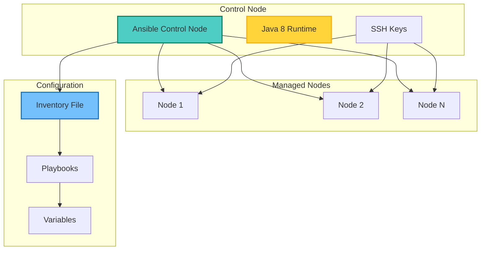
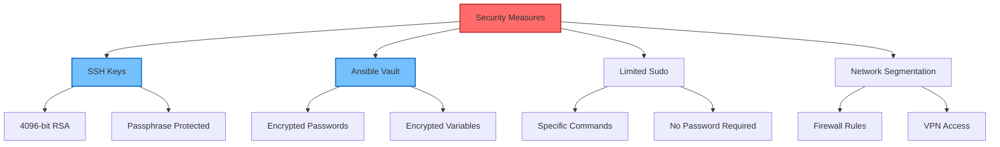

## Table of Contents

## Overview

This guide provides detailed instructions for installing and configuring Ansible and Java 8 on Ubuntu 20.04. Whether you're setting up a development environment or preparing for automation tasks, this guide covers everything from basic installation to advanced configuration.

## System Architecture



## Prerequisites

Before proceeding, ensure you have:

- Ubuntu 20.04 LTS system (physical or virtual)
- Root or sudo access
- Internet connection for package downloads
- At least 2GB RAM and 10GB disk space
- Basic understanding of Linux command line

## Installing Ansible

### Step 1: Update System Packages

```bash
# Update package index
sudo apt update

# Upgrade existing packages
sudo apt upgrade -y

# Install software properties common
sudo apt install -y software-properties-common
```

### Step 2: Add Ansible Repository

```bash
# Add official Ansible PPA
sudo apt-add-repository ppa:ansible/ansible

# Update package index again
sudo apt update
```

### Step 3: Install Ansible

```bash
# Install Ansible
sudo apt install -y ansible

# Verify installation
ansible --version

# Check Python version (Ansible requires Python)
python3 --version
```

### Step 4: Configure Ansible User

```bash
# Create dedicated Ansible user
sudo useradd -m ansible
sudo passwd ansible

# Add to sudo group
sudo usermod -aG sudo ansible

# Configure sudoers for passwordless sudo
echo "ansible ALL=(ALL) NOPASSWD: ALL" | sudo tee /etc/sudoers.d/ansible
```

## Setting Up SSH Keys

### Generate SSH Keys

```bash
# Switch to ansible user
sudo su - ansible

# Generate SSH key pair
ssh-keygen -t rsa -b 4096 -C "ansible@control-node"

# View public key
cat ~/.ssh/id_rsa.pub
```

### Distribute SSH Keys to Managed Nodes

```bash
# Copy SSH key to managed nodes
ssh-copy-id ansible@managed-node-ip

# Test SSH connection
ssh ansible@managed-node-ip

# For multiple nodes, use a loop
for host in node1 node2 node3; do
    ssh-copy-id ansible@$host
done
```

## Configuring Ansible Inventory

### Edit Inventory File

```bash
# Create custom inventory directory
sudo mkdir -p /etc/ansible/inventories/production

# Edit inventory file
sudo nano /etc/ansible/inventories/production/hosts
```

Add the following content:

```ini
[web_servers]
web1 ansible_host=192.168.1.10 ansible_user=ansible
web2 ansible_host=192.168.1.11 ansible_user=ansible

[db_servers]
db1 ansible_host=192.168.1.20 ansible_user=ansible
db2 ansible_host=192.168.1.21 ansible_user=ansible

[all:vars]
ansible_python_interpreter=/usr/bin/python3
ansible_ssh_common_args='-o StrictHostKeyChecking=no'

[web_servers:vars]
http_port=80
max_clients=200

[db_servers:vars]
mysql_port=3306
max_connections=100
```

### Ansible Configuration File

Create or edit `/etc/ansible/ansible.cfg`:

```ini
[defaults]
inventory = /etc/ansible/inventories/production/hosts
remote_user = ansible
host_key_checking = False
retry_files_enabled = False
gathering = smart
fact_caching = jsonfile
fact_caching_connection = /tmp/ansible_facts_cache
fact_caching_timeout = 86400

[privilege_escalation]
become = True
become_method = sudo
become_user = root
become_ask_pass = False

[ssh_connection]
ssh_args = -C -o ControlMaster=auto -o ControlPersist=60s
pipelining = True
```

## Installing Java 8

### Step 1: Install OpenJDK 8

```bash
# Update package index
sudo apt update

# Install OpenJDK 8 JDK (includes JRE)
sudo apt install -y openjdk-8-jdk

# Verify installation
java -version
javac -version
```

### Step 2: Configure Java Environment

```bash
# Set JAVA_HOME environment variable
echo 'export JAVA_HOME=/usr/lib/jvm/java-8-openjdk-amd64' >> ~/.bashrc
echo 'export PATH=$PATH:$JAVA_HOME/bin' >> ~/.bashrc

# Reload bashrc
source ~/.bashrc

# Verify environment variables
echo $JAVA_HOME
```

### Step 3: Manage Multiple Java Versions

```bash
# Check all installed Java versions
sudo update-alternatives --list java

# Configure default Java version
sudo update-alternatives --config java

# Configure default javac version
sudo update-alternatives --config javac
```

## Testing the Installation

### Test Ansible Connection

```bash
# Ping all hosts
ansible all -m ping

# Ping specific group
ansible web_servers -m ping

# Run ad-hoc command
ansible all -a "uname -a"

# Check disk space on all hosts
ansible all -m shell -a "df -h"
```

### Create Test Playbook

Create `test-playbook.yml`:

```yaml
---
- name: Test Playbook
  hosts: all
  gather_facts: yes
  tasks:
    - name: Display system information
      debug:
        msg: "{{ ansible_hostname }} - {{ ansible_distribution }} {{ ansible_distribution_version }}"

    - name: Check Java installation
      command: java -version
      register: java_version
      ignore_errors: yes

    - name: Display Java version
      debug:
        msg: "Java is installed: {{ java_version.stderr }}"
      when: java_version.rc == 0

    - name: Ensure Apache is installed (web servers only)
      apt:
        name: apache2
        state: present
      when: inventory_hostname in groups['web_servers']
```

Run the playbook:

```bash
# Run playbook
ansible-playbook test-playbook.yml

# Run with verbose output
ansible-playbook -vvv test-playbook.yml

# Run with check mode (dry run)
ansible-playbook --check test-playbook.yml
```

### Test Java Installation

Create `HelloWorld.java`:

```java
public class HelloWorld {
    public static void main(String[] args) {
        System.out.println("Hello from Java " + System.getProperty("java.version"));
        System.out.println("Running on " + System.getProperty("os.name"));
    }
}
```

Compile and run:

```bash
# Compile
javac HelloWorld.java

# Run
java HelloWorld
```

## Advanced Configuration

### Ansible Vault for Secrets

```bash
# Create encrypted variables file
ansible-vault create group_vars/all/vault.yml

# Edit encrypted file
ansible-vault edit group_vars/all/vault.yml

# Use in playbook
ansible-playbook playbook.yml --ask-vault-pass
```

### Dynamic Inventory Script

Create `dynamic_inventory.py`:

```python
#!/usr/bin/env python3
import json
import argparse

def get_inventory():
    inventory = {
        'web_servers': {
            'hosts': ['web1', 'web2'],
            'vars': {
                'http_port': 80
            }
        },
        '_meta': {
            'hostvars': {
                'web1': {
                    'ansible_host': '192.168.1.10'
                },
                'web2': {
                    'ansible_host': '192.168.1.11'
                }
            }
        }
    }
    return inventory

if __name__ == '__main__':
    parser = argparse.ArgumentParser()
    parser.add_argument('--list', action='store_true')
    parser.add_argument('--host', action='store')
    args = parser.parse_args()

    if args.list:
        print(json.dumps(get_inventory()))
    elif args.host:
        print(json.dumps({}))
```

Make it executable and test:

```bash
chmod +x dynamic_inventory.py
ansible -i dynamic_inventory.py all -m ping
```

## Security Best Practices

### SSH Security

```bash
# Configure SSH daemon
sudo nano /etc/ssh/sshd_config

# Recommended settings:
PermitRootLogin no
PasswordAuthentication no
PubkeyAuthentication yes
AllowUsers ansible
```

### Ansible Security



## Troubleshooting

### Common Issues and Solutions

1. **SSH Connection Refused**

   ```bash
   # Check SSH service
   sudo systemctl status ssh

   # Check firewall
   sudo ufw status
   ```

2. **Python Interpreter Not Found**

   ```bash
   # Install Python on managed node
   ansible node -m raw -a "apt update && apt install -y python3"
   ```

3. **Java Command Not Found**
   ```bash
   # Update alternatives
   sudo update-alternatives --install /usr/bin/java java /usr/lib/jvm/java-8-openjdk-amd64/bin/java 1
   ```

### Debug Commands

```bash
# Verbose Ansible output
ansible-playbook playbook.yml -vvvv

# Check Ansible configuration
ansible-config dump

# List all facts
ansible hostname -m setup
```

## Performance Optimization

### Ansible Performance Tips

```yaml
# ansible.cfg optimizations
[defaults]
forks = 20
poll_interval = 15
strategy = free
gathering = smart
fact_caching = jsonfile
fact_caching_connection = /tmp
fact_caching_timeout = 86400

[ssh_connection]
pipelining = True
control_path = /tmp/ansible-%%h-%%p-%%r
```

### Java Performance Tuning

```bash
# Set Java heap size
export JAVA_OPTS="-Xms512m -Xmx2048m"

# Enable G1 garbage collector
export JAVA_OPTS="$JAVA_OPTS -XX:+UseG1GC"
```

## Monitoring and Maintenance

### Monitoring Script

```bash
#!/bin/bash
# monitor-ansible.sh

echo "=== Ansible Status ==="
ansible --version

echo -e "\n=== Reachable Hosts ==="
ansible all -m ping --one-line

echo -e "\n=== Java Version on Hosts ==="
ansible all -m shell -a "java -version 2>&1 | head -1" --one-line

echo -e "\n=== System Resources ==="
ansible all -m shell -a "free -h && df -h /" --one-line
```

## Conclusion

You now have a fully configured Ubuntu 20.04 system with Ansible and Java 8 installed. This setup provides:

- **Ansible automation capabilities** for managing multiple nodes
- **Java 8 runtime** for Java-based applications
- **Secure SSH connectivity** between control and managed nodes
- **Optimized configuration** for performance and security

Key takeaways:

- Always use SSH keys for authentication
- Keep your Ansible playbooks in version control
- Use Ansible Vault for sensitive data
- Regularly update both Ansible and Java
- Monitor your managed nodes for consistency

This foundation enables you to automate infrastructure management, deploy applications, and maintain consistent environments across your systems.
