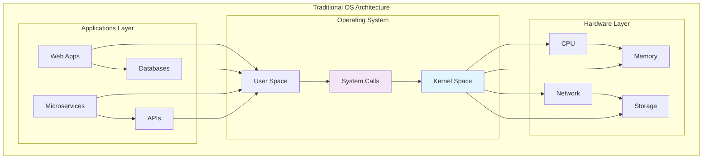
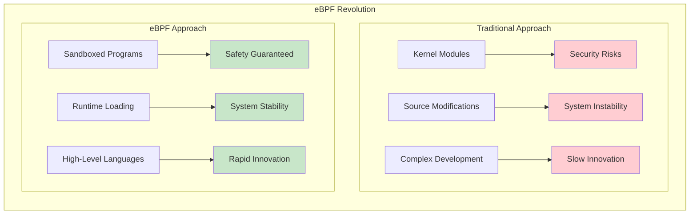
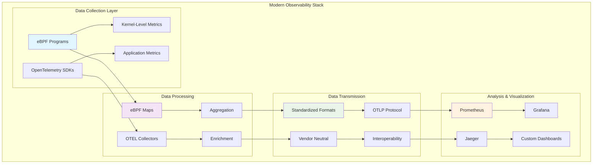
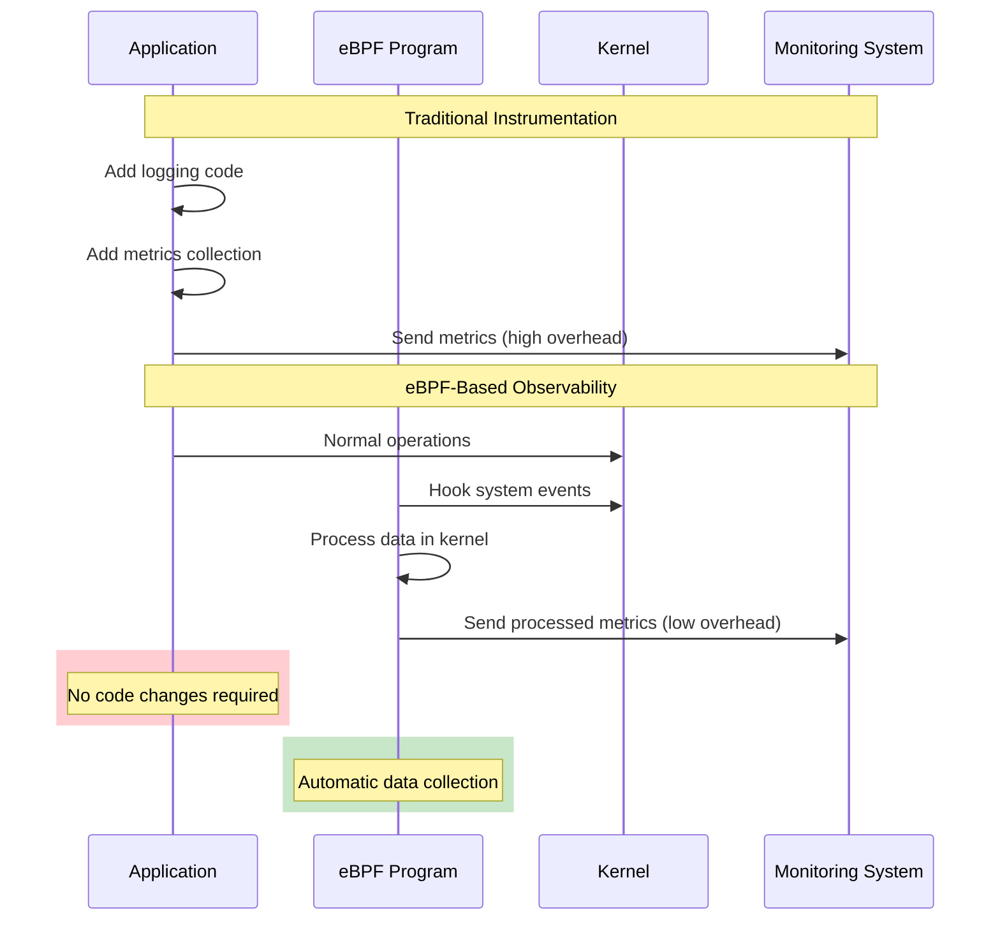
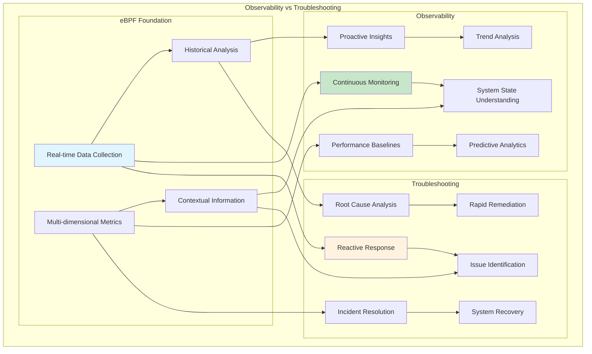
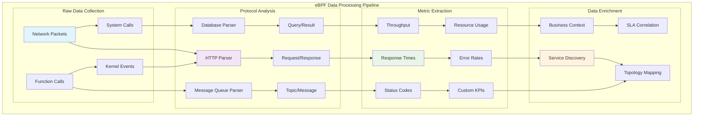

# eBPF: Revolutionizing Observability for DevOps and SRE Teams

Whether you're a system administrator, developer, or any other DevOps or Site Reliability Engineering (SRE) professional, staying ahead in cloud-native computing is crucial. One way to maintain your competitive edge is to embrace the transformative benefits of eBPF (Extended Berkeley Packet Filter).

Beyond advances in security and networking, eBPF-based tools are particularly revolutionizing the observability landscape, providing unprecedented insights into system behavior and application performance with minimal overhead.

## Understanding the Kernel Foundation



### The Critical Role of the Kernel

Traditionally, an operating system is where observability, security, and networking functionalities take place. Every machine—whether it's a computer, cell phone, or virtual computing device—has a single kernel. This kernel is not just significant; it's the **most critical part** of any operating system because without it, no device would be usable.

All containers on any machine share this common kernel, which has made evolving the operating system kernel extremely challenging for several reasons:

- **System Reliability**: Kernel modifications can destabilize the entire system
- **Security Concerns**: Direct kernel access poses significant security risks
- **Compatibility Issues**: Changes must work across diverse hardware and software configurations
- **Development Complexity**: Kernel programming requires specialized expertise

This has resulted in slower innovation compared to service functionalities beyond the OS—until eBPF changed everything.

## Breaking New Ground with eBPF

Rooted in the Linux kernel, eBPF allows running isolated programs within the operating system kernel, extending OS capabilities without loading new modules or modifying its source code.



### Key eBPF Advantages

eBPF allows application developers to add additional capabilities to the operating system by running sandboxed eBPF programs without compromising safety and execution efficiency. This shift has given rise to a revolution of eBPF-based advancements in operating systems, unlocking application innovation in:

- **Full-Stack Observability**: Complete visibility across all system layers
- **Performance Troubleshooting**: Real-time performance analysis and bottleneck identification
- **Application Tracing**: Detailed execution path analysis
- **Advanced Networking**: Programmable network data path processing
- **Preventive Security**: Proactive threat detection and mitigation

The breakthrough lies in accessing the OS kernel via eBPF, which provides incredible insights into every aspect of application code running on the machine—at lightning speed.

## eBPF's Role in Modern Observability

### Integration with OpenTelemetry



As an open-source project for monitoring and collecting performance data in software applications, OpenTelemetry standardizes observability practices across different languages and environments.

Together, eBPF and OpenTelemetry are rewriting the rules, offering more efficient, flexible, and less intrusive ways to gather critical system data:

- **OpenTelemetry** standardizes data transmission and formatting
- **eBPF** revolutionizes data collection at the kernel level

### The eBPF Advantage: A Lightweight Virtual Machine

Imagine a lightweight virtual machine inside your Linux kernel, running programs that enhance and monitor system performance without disrupting normal operations. That's eBPF in a nutshell—designed to be safe, efficient, and incredibly powerful.

Programs built on eBPF effortlessly connect with different system events:

- **Library Function Calls**: Hook into application library functions
- **System Calls**: Monitor kernel-userspace interactions
- **Network Traffic**: Analyze packet flows and protocols
- **Dynamic Tracing**: Conduct user-level tracing without instrumentation

## Exceptional Data Processing Capabilities

### Automatic Instrumentation Without Manual Intervention

One of eBPF's standout features is enabling comprehensive metrics tracking without the need for manual instrumentation:



### Kernel-Level Data Processing Benefits

The ability to process data at the kernel level drastically reduces the overhead of transferring data between kernel and user space:

- **Minimal Context Switching**: Reduced CPU overhead from kernel-userspace transitions
- **Real-Time Processing**: Data filtering and aggregation at the source
- **Memory Efficiency**: Reduced memory footprint for observability data
- **Network Optimization**: Intelligent packet processing before userspace delivery

## Advanced Observability Techniques

### Distinguishing Observability from Troubleshooting

Modern observability platforms make a clear distinction between two related but different practices:



**Observability** is the practice of continuously understanding the state of your landscape, both the application and the underlying platform.

**Troubleshooting** is aimed at remediating an issue as fast as possible.

eBPF-based observability provides strong support for both by retrieving the correct data set through kernel-level instrumentation.

## Network Analysis and Service Interactions

### Comprehensive Network Observability

eBPF excels in network analysis by examining data flow between processes, even across clusters and clouds:

```c
// network_flow_analysis.bpf.c
#include <vmlinux.h>
#include <bpf/bpf_helpers.h>
#include <bpf/bpf_tracing.h>
#include <bpf/bpf_core_read.h>

struct network_flow {
    __u32 src_ip;
    __u32 dst_ip;
    __u16 src_port;
    __u16 dst_port;
    __u8 protocol;
    __u64 bytes_sent;
    __u64 bytes_received;
    __u64 timestamp;
    __u32 latency_us;
    __u16 status_code;
};

struct {
    __uint(type, BPF_MAP_TYPE_HASH);
    __uint(max_entries, 65536);
    __type(key, struct flow_key);
    __type(value, struct network_flow);
} active_flows SEC(".maps");

struct {
    __uint(type, BPF_MAP_TYPE_RINGBUF);
    __uint(max_entries, 1024 * 1024);
} flow_events SEC(".maps");

// Track TCP connections
SEC("tp/sock/inet_sock_set_state")
int trace_tcp_state_change(struct trace_event_raw_inet_sock_set_state *ctx) {
    if (ctx->protocol != IPPROTO_TCP)
        return 0;
    
    struct network_flow *flow;
    flow = bpf_ringbuf_reserve(&flow_events, sizeof(*flow), 0);
    if (!flow)
        return 0;
    
    flow->src_ip = ctx->saddr;
    flow->dst_ip = ctx->daddr;
    flow->src_port = ctx->sport;
    flow->dst_port = ctx->dport;
    flow->protocol = ctx->protocol;
    flow->timestamp = bpf_ktime_get_ns();
    
    bpf_ringbuf_submit(flow, 0);
    return 0;
}

// HTTP traffic analysis
SEC("uprobe/http_request_handler")
int trace_http_request(struct pt_regs *ctx) {
    __u64 pid_tgid = bpf_get_current_pid_tgid();
    
    // Extract HTTP method, path, and headers
    char *method = (char *)PT_REGS_PARM1(ctx);
    char *path = (char *)PT_REGS_PARM2(ctx);
    
    struct network_flow *flow;
    flow = bpf_ringbuf_reserve(&flow_events, sizeof(*flow), 0);
    if (!flow)
        return 0;
    
    // Populate HTTP-specific metrics
    bpf_probe_read_str(&flow->src_ip, 4, method); // Store method in src_ip for demo
    flow->timestamp = bpf_ktime_get_ns();
    
    bpf_ringbuf_submit(flow, 0);
    return 0;
}

// MongoDB operation tracking
SEC("uprobe/mongo_operation_start")
int trace_mongo_operation(struct pt_regs *ctx) {
    __u32 operation_type = (int)PT_REGS_PARM1(ctx);
    char *collection = (char *)PT_REGS_PARM2(ctx);
    
    struct network_flow *flow;
    flow = bpf_ringbuf_reserve(&flow_events, sizeof(*flow), 0);
    if (!flow)
        return 0;
    
    flow->protocol = 27017; // MongoDB default port
    flow->timestamp = bpf_ktime_get_ns();
    
    bpf_ringbuf_submit(flow, 0);
    return 0;
}

char _license[] SEC("license") = "GPL";
```

### Real-Time Protocol Analysis

eBPF provides insights into service interactions with real-time metrics on:

- **Throughput**: Data transfer rates between services
- **Latency**: Request-response timing analysis
- **Error Rates**: Failed requests and connection issues
- **Protocol Support**: HTTP, HTTPS, MongoDB, Kafka, and custom protocols
- **Encrypted Connections**: Analysis even when connections are encrypted

### Multi-Cluster and Multi-Cloud Observability

For complex environments spanning multiple clusters and clouds, advanced techniques maintain observability:

```c
// multi_cluster_tracing.bpf.c
struct trace_context {
    __u64 trace_id;
    __u64 span_id;
    __u64 parent_span_id;
    char cluster_id[32];
    char service_name[64];
    __u64 timestamp;
};

struct {
    __uint(type, BPF_MAP_TYPE_HASH);
    __uint(max_entries, 100000);
    __type(key, __u64);
    __type(value, struct trace_context);
} distributed_traces SEC(".maps");

// Inject trace headers for correlation
SEC("tc")
int inject_trace_headers(struct __sk_buff *skb) {
    // Extract existing trace context
    struct trace_context *ctx;
    __u64 trace_id = extract_trace_id(skb);
    
    ctx = bpf_map_lookup_elem(&distributed_traces, &trace_id);
    if (!ctx) {
        // Create new trace context
        struct trace_context new_ctx = {
            .trace_id = bpf_get_prandom_u32(),
            .span_id = bpf_get_prandom_u32(),
            .timestamp = bpf_ktime_get_ns(),
        };
        
        bpf_probe_read_str(new_ctx.cluster_id, sizeof(new_ctx.cluster_id), "cluster-1");
        bpf_map_update_elem(&distributed_traces, &new_ctx.trace_id, &new_ctx, BPF_ANY);
    }
    
    // Modify packet headers to include trace information
    return TC_ACT_OK;
}

// Cross-cluster correlation
SEC("kprobe/tcp_sendmsg")
int correlate_cross_cluster(struct pt_regs *ctx) {
    struct sock *sk = (struct sock *)PT_REGS_PARM1(ctx);
    
    // Extract destination information
    __u32 dst_ip = BPF_CORE_READ(sk, __sk_common.skc_daddr);
    
    // Check if this is cross-cluster communication
    if (is_cross_cluster_ip(dst_ip)) {
        // Enhance trace context with cluster boundary information
        update_cross_cluster_metrics(sk);
    }
    
    return 0;
}

static int is_cross_cluster_ip(__u32 ip) {
    // Implement cluster IP range detection
    return 1; // Simplified
}

static void update_cross_cluster_metrics(struct sock *sk) {
    // Update metrics for cross-cluster communication
}

char _license[] SEC("license") = "GPL";
```

## Key Metrics Extraction and Analysis

### Actionable Insights from Network Traffic

eBPF-based solutions don't just track network traffic; they decode and distill essential information:



### Comprehensive Metrics Portfolio

Modern eBPF observability platforms extract:

1. **Request Path Analysis**
   - Complete request flow tracking
   - Service dependency mapping
   - Bottleneck identification
   - Performance optimization opportunities

2. **Status Code Distribution**
   - HTTP response code analysis
   - Error pattern identification
   - Success rate monitoring
   - SLA compliance tracking

3. **Topic and Queue Metrics**
   - Message queue throughput
   - Topic-specific performance
   - Producer/consumer analysis
   - Queue depth monitoring

4. **Resource Utilization**
   - CPU usage per service
   - Memory consumption patterns
   - Network bandwidth utilization
   - Storage I/O characteristics

## Implementation Examples

### HTTP Service Monitoring

```c
// http_service_monitor.bpf.c
struct http_metrics {
    char method[8];
    char path[128];
    __u16 status_code;
    __u64 request_time;
    __u64 response_time;
    __u32 request_size;
    __u32 response_size;
    char user_agent[64];
    char client_ip[16];
};

struct {
    __uint(type, BPF_MAP_TYPE_RINGBUF);
    __uint(max_entries, 2 * 1024 * 1024);
} http_events SEC(".maps");

SEC("uprobe/handle_http_request")
int trace_http_request_start(struct pt_regs *ctx) {
    struct http_request *req = (struct http_request *)PT_REGS_PARM1(ctx);
    
    struct http_metrics *metrics;
    metrics = bpf_ringbuf_reserve(&http_events, sizeof(*metrics), 0);
    if (!metrics)
        return 0;
    
    // Extract HTTP request details
    bpf_probe_read_str(metrics->method, sizeof(metrics->method), 
                       BPF_CORE_READ(req, method));
    bpf_probe_read_str(metrics->path, sizeof(metrics->path), 
                       BPF_CORE_READ(req, path));
    bpf_probe_read_str(metrics->user_agent, sizeof(metrics->user_agent), 
                       BPF_CORE_READ(req, user_agent));
    
    metrics->request_time = bpf_ktime_get_ns();
    metrics->request_size = BPF_CORE_READ(req, content_length);
    
    bpf_ringbuf_submit(metrics, 0);
    return 0;
}

SEC("uretprobe/handle_http_request")
int trace_http_request_end(struct pt_regs *ctx) {
    struct http_response *resp = (struct http_response *)PT_REGS_RC(ctx);
    
    struct http_metrics *metrics;
    metrics = bpf_ringbuf_reserve(&http_events, sizeof(*metrics), 0);
    if (!metrics)
        return 0;
    
    metrics->status_code = BPF_CORE_READ(resp, status_code);
    metrics->response_size = BPF_CORE_READ(resp, content_length);
    metrics->response_time = bpf_ktime_get_ns();
    
    bpf_ringbuf_submit(metrics, 0);
    return 0;
}

char _license[] SEC("license") = "GPL";
```

### Database Performance Monitoring

```c
// database_monitor.bpf.c
struct db_operation {
    char operation[16];     // SELECT, INSERT, UPDATE, DELETE
    char table_name[64];    // Target table
    __u64 execution_time;   // Query execution time
    __u32 rows_affected;    // Number of rows processed
    __u32 connection_id;    // Database connection identifier
    __u8 error_code;        // Error status (0 = success)
    char query_hash[32];    // Hash of the query for grouping
};

struct {
    __uint(type, BPF_MAP_TYPE_RINGBUF);
    __uint(max_entries, 1024 * 1024);
} db_events SEC(".maps");

// Track database query execution
SEC("uprobe/mysql_execute_query")
int trace_mysql_query_start(struct pt_regs *ctx) {
    void *connection = (void *)PT_REGS_PARM1(ctx);
    char *query = (char *)PT_REGS_PARM2(ctx);
    
    struct db_operation *op;
    op = bpf_ringbuf_reserve(&db_events, sizeof(*op), 0);
    if (!op)
        return 0;
    
    // Extract query type
    if (bpf_strncmp(query, "SELECT", 6) == 0) {
        bpf_probe_read_str(op->operation, sizeof(op->operation), "SELECT");
    } else if (bpf_strncmp(query, "INSERT", 6) == 0) {
        bpf_probe_read_str(op->operation, sizeof(op->operation), "INSERT");
    } else if (bpf_strncmp(query, "UPDATE", 6) == 0) {
        bpf_probe_read_str(op->operation, sizeof(op->operation), "UPDATE");
    } else if (bpf_strncmp(query, "DELETE", 6) == 0) {
        bpf_probe_read_str(op->operation, sizeof(op->operation), "DELETE");
    }
    
    op->execution_time = bpf_ktime_get_ns();
    op->connection_id = (__u32)(long)connection;
    
    // Generate query hash for grouping similar queries
    op->query_hash[0] = bpf_get_prandom_u32() % 256;
    
    bpf_ringbuf_submit(op, 0);
    return 0;
}

// MongoDB operation tracking
SEC("uprobe/mongodb_collection_operation")
int trace_mongodb_operation(struct pt_regs *ctx) {
    char *collection = (char *)PT_REGS_PARM1(ctx);
    int operation_type = (int)PT_REGS_PARM2(ctx);
    
    struct db_operation *op;
    op = bpf_ringbuf_reserve(&db_events, sizeof(*op), 0);
    if (!op)
        return 0;
    
    bpf_probe_read_str(op->table_name, sizeof(op->table_name), collection);
    
    switch (operation_type) {
        case 1:
            bpf_probe_read_str(op->operation, sizeof(op->operation), "FIND");
            break;
        case 2:
            bpf_probe_read_str(op->operation, sizeof(op->operation), "INSERT");
            break;
        case 3:
            bpf_probe_read_str(op->operation, sizeof(op->operation), "UPDATE");
            break;
        case 4:
            bpf_probe_read_str(op->operation, sizeof(op->operation), "DELETE");
            break;
    }
    
    op->execution_time = bpf_ktime_get_ns();
    
    bpf_ringbuf_submit(op, 0);
    return 0;
}

char _license[] SEC("license") = "GPL";
```

## User-Space Processing and Analytics

### Real-Time Data Processing

```c
// observability_processor.c
#include <stdio.h>
#include <stdlib.h>
#include <string.h>
#include <unistd.h>
#include <time.h>
#include <bpf/libbpf.h>
#include <bpf/bpf.h>

struct service_metrics {
    char service_name[64];
    uint64_t request_count;
    uint64_t error_count;
    uint64_t total_latency;
    uint64_t min_latency;
    uint64_t max_latency;
    time_t last_updated;
};

struct metrics_aggregator {
    struct service_metrics services[1000];
    int service_count;
    time_t collection_start;
};

static struct metrics_aggregator aggregator = {0};

// Process HTTP events from eBPF
static int handle_http_event(void *ctx, void *data, size_t data_sz) {
    struct http_metrics *event = data;
    
    // Find or create service metrics
    struct service_metrics *service = find_or_create_service(event->path);
    if (!service) {
        return 0;
    }
    
    // Update metrics
    service->request_count++;
    
    if (event->status_code >= 400) {
        service->error_count++;
    }
    
    uint64_t latency = event->response_time - event->request_time;
    service->total_latency += latency;
    
    if (latency < service->min_latency || service->min_latency == 0) {
        service->min_latency = latency;
    }
    
    if (latency > service->max_latency) {
        service->max_latency = latency;
    }
    
    service->last_updated = time(NULL);
    
    // Generate real-time insights
    if (should_generate_alert(service, event)) {
        generate_performance_alert(service, event);
    }
    
    return 0;
}

static struct service_metrics *find_or_create_service(const char *path) {
    // Extract service name from path
    char service_name[64];
    extract_service_name(path, service_name, sizeof(service_name));
    
    // Find existing service
    for (int i = 0; i < aggregator.service_count; i++) {
        if (strcmp(aggregator.services[i].service_name, service_name) == 0) {
            return &aggregator.services[i];
        }
    }
    
    // Create new service entry
    if (aggregator.service_count < 1000) {
        struct service_metrics *service = &aggregator.services[aggregator.service_count++];
        strncpy(service->service_name, service_name, sizeof(service->service_name));
        service->last_updated = time(NULL);
        return service;
    }
    
    return NULL;
}

static void extract_service_name(const char *path, char *service_name, size_t size) {
    // Simple service name extraction from API path
    if (strncmp(path, "/api/v1/users", 13) == 0) {
        strncpy(service_name, "user-service", size);
    } else if (strncmp(path, "/api/v1/orders", 14) == 0) {
        strncpy(service_name, "order-service", size);
    } else if (strncmp(path, "/api/v1/payments", 16) == 0) {
        strncpy(service_name, "payment-service", size);
    } else {
        strncpy(service_name, "unknown-service", size);
    }
}

static int should_generate_alert(struct service_metrics *service, struct http_metrics *event) {
    // Error rate threshold
    if (service->request_count > 10) {
        double error_rate = (double)service->error_count / service->request_count;
        if (error_rate > 0.05) { // 5% error rate threshold
            return 1;
        }
    }
    
    // Latency threshold
    uint64_t current_latency = event->response_time - event->request_time;
    if (current_latency > 5000000000ULL) { // 5 seconds
        return 1;
    }
    
    return 0;
}

static void generate_performance_alert(struct service_metrics *service, struct http_metrics *event) {
    time_t now = time(NULL);
    char *timestamp = ctime(&now);
    timestamp[strlen(timestamp) - 1] = '\0'; // Remove newline
    
    double error_rate = service->request_count > 0 ? 
                       (double)service->error_count / service->request_count * 100.0 : 0.0;
    
    double avg_latency = service->request_count > 0 ? 
                        (double)service->total_latency / service->request_count / 1000000.0 : 0.0;
    
    printf("ALERT [%s] Service: %s\n", timestamp, service->service_name);
    printf("  Error Rate: %.2f%% (%lu/%lu requests)\n", 
           error_rate, service->error_count, service->request_count);
    printf("  Average Latency: %.2f ms\n", avg_latency);
    printf("  Min/Max Latency: %.2f/%.2f ms\n", 
           service->min_latency / 1000000.0, service->max_latency / 1000000.0);
    printf("  Recent Request: %s %s -> %d\n", 
           event->method, event->path, event->status_code);
    printf("\n");
}

// Export metrics in Prometheus format
static void export_prometheus_metrics() {
    printf("# HELP http_requests_total Total number of HTTP requests\n");
    printf("# TYPE http_requests_total counter\n");
    
    printf("# HELP http_request_duration_seconds HTTP request latency\n");
    printf("# TYPE http_request_duration_seconds histogram\n");
    
    for (int i = 0; i < aggregator.service_count; i++) {
        struct service_metrics *service = &aggregator.services[i];
        
        printf("http_requests_total{service=\"%s\",status=\"success\"} %lu\n", 
               service->service_name, service->request_count - service->error_count);
        printf("http_requests_total{service=\"%s\",status=\"error\"} %lu\n", 
               service->service_name, service->error_count);
        
        if (service->request_count > 0) {
            double avg_latency = (double)service->total_latency / service->request_count / 1e9;
            printf("http_request_duration_seconds{service=\"%s\",quantile=\"0.5\"} %.6f\n", 
                   service->service_name, avg_latency);
        }
    }
}

int main() {
    struct bpf_object *obj;
    struct ring_buffer *rb;
    int err;
    
    printf("Starting eBPF-based observability processor...\n");
    
    // Load eBPF programs
    obj = bpf_object__open_file("http_service_monitor.bpf.o", NULL);
    if (libbpf_get_error(obj)) {
        fprintf(stderr, "Failed to open eBPF object\n");
        return 1;
    }
    
    err = bpf_object__load(obj);
    if (err) {
        fprintf(stderr, "Failed to load eBPF object\n");
        return 1;
    }
    
    // Attach programs
    struct bpf_link *links[10];
    int link_count = 0;
    
    struct bpf_program *prog;
    bpf_object__for_each_program(prog, obj) {
        links[link_count] = bpf_program__attach(prog);
        if (libbpf_get_error(links[link_count])) {
            printf("Warning: Failed to attach program %s\n", bpf_program__name(prog));
            continue;
        }
        printf("Attached eBPF program: %s\n", bpf_program__name(prog));
        link_count++;
    }
    
    // Set up ring buffer
    int map_fd = bpf_object__find_map_fd_by_name(obj, "http_events");
    if (map_fd < 0) {
        fprintf(stderr, "Failed to find http_events map\n");
        return 1;
    }
    
    rb = ring_buffer__new(map_fd, handle_http_event, NULL, NULL);
    if (!rb) {
        fprintf(stderr, "Failed to create ring buffer\n");
        return 1;
    }
    
    aggregator.collection_start = time(NULL);
    
    printf("eBPF observability system started. Monitoring HTTP traffic...\n");
    printf("Press Ctrl-C to export metrics and exit.\n\n");
    
    // Process events
    while (1) {
        err = ring_buffer__poll(rb, 1000);
        if (err < 0) {
            printf("Error polling ring buffer: %d\n", err);
            break;
        }
        
        // Periodic metrics export
        static time_t last_export = 0;
        time_t now = time(NULL);
        if (now - last_export >= 60) { // Export every minute
            printf("\n=== Metrics Export ===\n");
            export_prometheus_metrics();
            printf("====================\n\n");
            last_export = now;
        }
    }
    
    // Cleanup
    ring_buffer__free(rb);
    for (int i = 0; i < link_count; i++) {
        bpf_link__destroy(links[i]);
    }
    bpf_object__close(obj);
    
    return 0;
}
```

## Future-Proof Observability with eBPF

### Paradigm Shift in System Monitoring

eBPF represents more than just a technology; it's a paradigm shift in observability that provides:

```mermaid
graph TB
    subgraph "eBPF Observability Benefits"
        subgraph "Technical Advantages"
            TA1[Kernel-Level Insights] --> TA2[Real-Time Processing]
            TA3[Zero Instrumentation] --> TA4[Universal Coverage]
            TA5[Minimal Overhead] --> TA6[Production Ready]
        end

        subgraph "Operational Benefits"
            OB1[Comprehensive Visibility] --> OB2[Faster MTTR]
            OB3[Proactive Monitoring] --> OB4[Predictive Analytics]
            OB5[Unified Platform] --> OB6[Reduced Complexity]
        end

        subgraph "Business Impact"
            BI1[Improved Reliability] --> BI2[Better User Experience]
            BI3[Operational Efficiency] --> BI4[Cost Optimization]
            BI5[Risk Mitigation] --> BI6[Competitive Advantage]
        end

        TA2 --> OB1
        TA4 --> OB3
        TA6 --> OB5
        
        OB2 --> BI1
        OB4 --> BI3
        OB6 --> BI5
    </end>

    style TA1 fill:#e1f5fe
    style OB1 fill:#f3e5f5
    style BI1 fill:#e8f5e8
```

### Detailed Real-Time System Views

eBPF provides detailed, real-time views of systems, ensuring operators are always in control:

- **Complete Service Topology**: Automatic discovery of service dependencies
- **Performance Bottleneck Identification**: Real-time identification of performance issues
- **Security Threat Detection**: Continuous monitoring for security anomalies
- **Resource Optimization**: Data-driven insights for resource allocation
- **Capacity Planning**: Predictive analytics for infrastructure scaling

### Strategic Advantages for DevOps and SRE Teams

Understanding and utilizing eBPF provides significant advantages:

1. **Single Cluster Management**: Comprehensive visibility into monolithic or single-cluster environments
2. **Multi-Cloud Environments**: Unified observability across complex, distributed infrastructures
3. **Scalable Architecture**: eBPF programs scale with your infrastructure without proportional overhead
4. **Technology Agnostic**: Works across different programming languages, frameworks, and protocols

## Integration with Modern DevOps Workflows

### CI/CD Pipeline Integration

```yaml
# .github/workflows/ebpf-observability.yml
name: eBPF Observability Deployment
on:
  push:
    branches: [main]
  pull_request:
    branches: [main]

jobs:
  build-ebpf:
    runs-on: ubuntu-latest
    steps:
      - uses: actions/checkout@v3
      
      - name: Install eBPF dependencies
        run: |
          sudo apt-get update
          sudo apt-get install -y clang libbpf-dev bpftool
      
      - name: Compile eBPF programs
        run: |
          make -C src/ebpf all
          
      - name: Test eBPF programs
        run: |
          sudo make -C src/ebpf test
          
      - name: Build user-space components
        run: |
          make -C src/userspace all
          
      - name: Package observability suite
        run: |
          tar -czf ebpf-observability.tar.gz src/ebpf/*.o src/userspace/processor
          
      - name: Upload artifacts
        uses: actions/upload-artifact@v3
        with:
          name: ebpf-observability
          path: ebpf-observability.tar.gz

  deploy-staging:
    needs: build-ebpf
    runs-on: ubuntu-latest
    if: github.ref == 'refs/heads/main'
    steps:
      - name: Deploy to staging
        run: |
          # Deploy eBPF observability to staging environment
          kubectl apply -f k8s/staging/
          
      - name: Run integration tests
        run: |
          # Test observability functionality
          ./tests/integration-tests.sh staging
          
  deploy-production:
    needs: [build-ebpf, deploy-staging]
    runs-on: ubuntu-latest
    if: github.ref == 'refs/heads/main'
    environment: production
    steps:
      - name: Deploy to production
        run: |
          # Deploy eBPF observability to production
          kubectl apply -f k8s/production/
```

### Kubernetes Integration

```yaml
# k8s/ebpf-observability-daemonset.yaml
apiVersion: apps/v1
kind: DaemonSet
metadata:
  name: ebpf-observability
  namespace: monitoring
spec:
  selector:
    matchLabels:
      app: ebpf-observability
  template:
    metadata:
      labels:
        app: ebpf-observability
    spec:
      hostNetwork: true
      hostPID: true
      containers:
      - name: ebpf-agent
        image: ebpf-observability:latest
        securityContext:
          privileged: true
          capabilities:
            add: ["SYS_ADMIN", "NET_ADMIN", "BPF"]
        volumeMounts:
        - name: proc
          mountPath: /host/proc
          readOnly: true
        - name: sys
          mountPath: /host/sys
          readOnly: true
        - name: debugfs
          mountPath: /sys/kernel/debug
        env:
        - name: NODE_NAME
          valueFrom:
            fieldRef:
              fieldPath: spec.nodeName
        - name: CLUSTER_NAME
          value: "production-cluster"
        ports:
        - containerPort: 8080
          name: metrics
        - containerPort: 8081
          name: health
      volumes:
      - name: proc
        hostPath:
          path: /proc
      - name: sys
        hostPath:
          path: /sys
      - name: debugfs
        hostPath:
          path: /sys/kernel/debug
      tolerations:
      - operator: Exists
        effect: NoSchedule
---
apiVersion: v1
kind: Service
metadata:
  name: ebpf-observability-metrics
  namespace: monitoring
spec:
  selector:
    app: ebpf-observability
  ports:
  - name: metrics
    port: 8080
    targetPort: 8080
  - name: health
    port: 8081
    targetPort: 8081
```

## Conclusion

eBPF is revolutionizing observability for DevOps and SRE teams by providing unprecedented insights into system behavior with minimal overhead and zero manual instrumentation. This technology represents a fundamental shift from traditional monitoring approaches to kernel-level, real-time observability.

### Key Benefits Summary

- **Automatic Instrumentation**: No code changes required for comprehensive monitoring
- **Universal Coverage**: Works across all applications, protocols, and languages
- **Real-Time Insights**: Kernel-level processing provides immediate visibility
- **Minimal Overhead**: Efficient data collection without performance impact
- **Scalable Architecture**: Grows with your infrastructure complexity

### Strategic Impact

For organizations managing cloud-native environments, eBPF provides:

1. **Competitive Advantage**: Advanced observability capabilities ahead of traditional monitoring
2. **Operational Excellence**: Faster incident response and proactive issue prevention
3. **Cost Optimization**: Efficient resource utilization through better visibility
4. **Future Readiness**: Technology foundation for next-generation observability needs

### Looking Forward

As cloud-native computing continues to evolve, eBPF-based observability will become increasingly critical for:

- **Microservices Architecture**: Complete service mesh visibility
- **Multi-Cloud Deployments**: Unified observability across cloud providers
- **Edge Computing**: Distributed system monitoring at scale
- **AI/ML Workloads**: Performance optimization for compute-intensive applications

The future of observability is here, and it's powered by eBPF. Organizations that embrace this technology today will be better positioned to handle the complexity and scale of tomorrow's distributed systems.

## Resources and Further Reading

### Official Documentation

- [eBPF Foundation](https://ebpf.io/) - Official eBPF documentation and resources
- [OpenTelemetry](https://opentelemetry.io/) - Open source observability framework
- [eBPF Kernel Documentation](https://www.kernel.org/doc/html/latest/bpf/index.html)

### Learning Resources

- [eBPF: Unlocking the Kernel Documentary](https://www.youtube.com/watch?v=Wb_vD3XZYOA) - 30-minute documentary about eBPF
- [Learning eBPF by Liz Rice](https://www.oreilly.com/library/view/learning-ebpf/9781098135119/)
- [BPF Performance Tools by Brendan Gregg](https://www.brendangregg.com/bpf-performance-tools-book.html)

### Open Source Projects

- [Cilium](https://cilium.io/) - eBPF-powered networking and security
- [Falco](https://falco.org/) - Runtime security monitoring with eBPF
- [Pixie](https://pixielabs.ai/) - Kubernetes observability platform
- [Parca](https://www.parca.dev/) - Continuous profiling with eBPF

### Enterprise Solutions

- [SUSE Observability](https://www.suse.com/products/suse-observability/) - Enterprise observability platform
- [SUSE Rancher Prime](https://www.suse.com/products/suse-rancher/) - Kubernetes management platform

---

_Inspired by the original article by Mark Bakker on [SUSE Blog](https://www.suse.com/c/ebpf-revolutionizing-observability-for-devops-and-sre-teams/)_