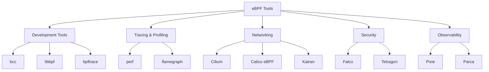
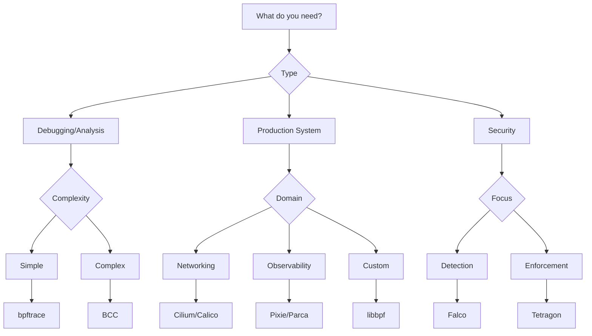

# The eBPF Ecosystem: Tools, Frameworks, and Production Solutions

The eBPF ecosystem has evolved from a kernel feature to a rich collection of tools, frameworks, and production-ready solutions. This guide explores the entire ecosystem, helping you choose the right tools for your use case.

## Tool Categories Overview



## Core Development Tools

### 1. BCC (BPF Compiler Collection)

BCC makes eBPF programming accessible with Python and C++ frontends.

#### Installation

```bash
# Ubuntu/Debian
sudo apt-get install bpfcc-tools linux-headers-$(uname -r)

# Fedora
sudo dnf install bcc bcc-tools kernel-devel

# From source
git clone https://github.com/iovisor/bcc.git
# Follow build instructions
```

#### Example: Process Execution Tracker

```python
#!/usr/bin/python
from bcc import BPF

# BPF program
prog = """
#include <uapi/linux/ptrace.h>
#include <linux/sched.h>

struct data_t {
    u32 pid;
    u32 ppid;
    char comm[TASK_COMM_LEN];
    char filename[256];
};

BPF_PERF_OUTPUT(events);

int trace_exec(struct pt_regs *ctx,
    const char __user *filename,
    const char __user *const __user *__argv,
    const char __user *const __user *__envp) {

    struct data_t data = {};
    struct task_struct *task;

    data.pid = bpf_get_current_pid_tgid() >> 32;

    task = (struct task_struct *)bpf_get_current_task();
    data.ppid = task->real_parent->tgid;

    bpf_get_current_comm(&data.comm, sizeof(data.comm));
    bpf_probe_read_user(&data.filename, sizeof(data.filename), filename);

    events.perf_submit(ctx, &data, sizeof(data));
    return 0;
}
"""

# Initialize BPF
b = BPF(text=prog)
b.attach_kprobe(event="__x64_sys_execve", fn_name="trace_exec")

# Process events
def print_event(cpu, data, size):
    event = b["events"].event(data)
    print(f"PID: {event.pid} PPID: {event.ppid} "
          f"COMM: {event.comm.decode()} "
          f"EXEC: {event.filename.decode()}")

# Loop with callback
b["events"].open_perf_buffer(print_event)
while True:
    b.perf_buffer_poll()
```

#### BCC Tools Collection

```bash
# List available tools
ls /usr/share/bcc/tools/

# Popular tools
sudo biolatency      # Block I/O latency histogram
sudo biosnoop        # Block I/O operations
sudo cachestat       # Page cache hit/miss stats
sudo execsnoop       # Trace process execution
sudo opensnoop       # Trace open() syscalls
sudo tcpconnect      # Trace TCP connections
sudo tcpretrans      # TCP retransmissions
```

### 2. bpftrace - High-Level Tracing Language

bpftrace provides a domain-specific language for eBPF, inspired by DTrace and awk.

#### Installation

```bash
# Ubuntu/Debian
sudo apt-get install bpftrace

# Build from source for latest features
git clone https://github.com/iovisor/bpftrace
cd bpftrace && mkdir build && cd build
cmake -DCMAKE_BUILD_TYPE=Release ..
make -j$(nproc)
sudo make install
```

#### One-Liner Examples

```bash
# Count syscalls by program
sudo bpftrace -e 'tracepoint:raw_syscalls:sys_enter { @[comm] = count(); }'

# Show files opened by process
sudo bpftrace -e 'tracepoint:syscalls:sys_enter_open { printf("%s %s\n", comm, str(args->filename)); }'

# TCP accept() backlog
sudo bpftrace -e 'kretprobe:inet_csk_accept { @[comm] = count(); }'

# Block I/O latency
sudo bpftrace -e 'kprobe:blk_account_io_start { @start[arg0] = nsecs; }
    kprobe:blk_account_io_done /@start[arg0]/ {
        @usecs = hist((nsecs - @start[arg0]) / 1000); delete(@start[arg0]); }'
```

#### Complex Script Example

```bash
#!/usr/bin/env bpftrace

// trace_slowqueries.bt - MySQL slow query tracer

BEGIN {
    printf("Tracing MySQL queries slower than 100ms... Hit Ctrl-C to end.\n");
}

uprobe:/usr/sbin/mysqld:*dispatch_command* {
    @query_start[tid] = nsecs;
    @query[tid] = str(arg2);
}

uretprobe:/usr/sbin/mysqld:*dispatch_command* /@query_start[tid]/ {
    $duration_ms = (nsecs - @query_start[tid]) / 1000000;

    if ($duration_ms > 100) {
        printf("%s: slow query (%d ms): %s\n",
               strftime("%H:%M:%S", nsecs),
               $duration_ms,
               @query[tid]);
    }

    delete(@query_start[tid]);
    delete(@query[tid]);
}

END {
    clear(@query_start);
    clear(@query);
}
```

### 3. libbpf - Modern eBPF Development

libbpf is the official library for eBPF program development with CO-RE support.

#### Project Structure

```bash
my_project/
├── src/
│   ├── my_prog.bpf.c    # eBPF program
│   ├── my_prog.c        # User-space code
│   └── my_prog.h        # Shared headers
├── vmlinux.h            # Generated kernel headers
└── Makefile
```

#### Generating vmlinux.h

```bash
# Generate vmlinux.h for CO-RE
bpftool btf dump file /sys/kernel/btf/vmlinux format c > vmlinux.h
```

#### Modern eBPF Program with CO-RE

```c
// my_prog.bpf.c
#include "vmlinux.h"
#include <bpf/bpf_helpers.h>
#include <bpf/bpf_tracing.h>
#include <bpf/bpf_core_read.h>

char LICENSE[] SEC("license") = "Dual BSD/GPL";

struct {
    __uint(type, BPF_MAP_TYPE_RINGBUF);
    __uint(max_entries, 256 * 1024);
} rb SEC(".maps");

struct event {
    u32 pid;
    u8 comm[16];
    u64 mntns_id;
    u8 filename[256];
};

SEC("tracepoint/syscalls/sys_enter_openat")
int trace_openat_enter(struct trace_event_raw_sys_enter* ctx) {
    struct event *e;
    struct task_struct *task;

    e = bpf_ringbuf_reserve(&rb, sizeof(*e), 0);
    if (!e)
        return 0;

    // Get PID and comm
    e->pid = bpf_get_current_pid_tgid() >> 32;
    bpf_get_current_comm(&e->comm, sizeof(e->comm));

    // Get mount namespace ID using CO-RE
    task = (struct task_struct *)bpf_get_current_task();
    BPF_CORE_READ_INTO(&e->mntns_id, task, nsproxy, mnt_ns, ns.inum);

    // Read filename
    bpf_probe_read_user_str(&e->filename, sizeof(e->filename),
                            (void *)ctx->args[1]);

    bpf_ringbuf_submit(e, 0);
    return 0;
}
```

## Production Networking Solutions

### 1. Cilium - eBPF-based Networking and Security

Cilium provides networking, observability, and security for Kubernetes.

#### Installation

```bash
# Install Cilium CLI
curl -L --remote-name-all https://github.com/cilium/cilium-cli/releases/latest/download/cilium-linux-amd64.tar.gz
sudo tar xzvfC cilium-linux-amd64.tar.gz /usr/local/bin

# Install on Kubernetes
cilium install
cilium status --wait
```

#### Network Policy Example

```yaml
apiVersion: cilium.io/v2
kind: CiliumNetworkPolicy
metadata:
  name: api-protection
spec:
  endpointSelector:
    matchLabels:
      app: api-server
  ingress:
    - fromEndpoints:
        - matchLabels:
            app: frontend
      toPorts:
        - ports:
            - port: "443"
              protocol: TCP
          rules:
            http:
              - method: "GET"
                path: "/api/v1/users"
              - method: "POST"
                path: "/api/v1/users"
                headers:
                  - "Content-Type: application/json"
```

#### Hubble - Cilium's Observability Layer

```bash
# Enable Hubble
cilium hubble enable --ui

# Port forward to access UI
cilium hubble ui

# CLI examples
hubble observe --namespace production
hubble observe --verdict DROPPED
hubble observe --http-status 5xx
```

### 2. Calico eBPF Mode

Calico offers eBPF dataplane for high-performance networking.

```bash
# Enable eBPF mode
kubectl patch felixconfiguration default --type='merge' \
  -p '{"spec":{"bpfEnabled":true}}'

# Verify eBPF mode
kubectl get nodes -o yaml | grep 'projectcalico.org/bpfMode'
```

### 3. Katran - Facebook's L4 Load Balancer

High-performance L4 load balancer using XDP.

```c
// Simplified Katran logic
SEC("xdp")
int katran_lb(struct xdp_md *ctx) {
    void *data_end = (void *)(long)ctx->data_end;
    void *data = (void *)(long)ctx->data;

    // Parse headers
    struct parsing_context pctx = {};
    if (parse_packet(data, data_end, &pctx) < 0)
        return XDP_PASS;

    // Lookup VIP
    struct vip_key vkey = {
        .address = pctx.dst,
        .port = pctx.port,
        .proto = pctx.proto
    };

    struct vip_meta *vmeta = bpf_map_lookup_elem(&vip_map, &vkey);
    if (!vmeta)
        return XDP_PASS;

    // Select real server
    __u32 hash = get_packet_hash(&pctx);
    __u32 real_idx = hash % vmeta->num_reals;

    // Encapsulate and forward
    return encap_and_forward(ctx, real_idx);
}
```

## Security Tools

### 1. Falco - Runtime Security

Falco uses eBPF to detect anomalous behavior in applications.

#### Installation and Usage

```bash
# Install Falco
curl -s https://falco.org/repo/falcosecurity-3672BA8F.asc | apt-key add -
echo "deb https://download.falco.org/packages/deb stable main" | \
  tee -a /etc/apt/sources.list.d/falcosecurity.list
apt-get update -y
apt-get install -y falco

# Custom rules
cat > /etc/falco/rules.d/custom.yaml <<EOF
- rule: Unauthorized Process in Container
  desc: Detect unauthorized process execution in containers
  condition: >
    container and proc.name != "<authorized_processes>"
    and not proc.name in (known_system_procs)
  output: >
    Unauthorized process in container
    (user=%user.name command=%proc.cmdline container=%container.name)
  priority: WARNING
EOF

# Run Falco with eBPF
falco --modern-bpf
```

### 2. Tetragon - Runtime Security Enforcement

Tetragon provides eBPF-based security observability and enforcement.

```yaml
# TracingPolicy example
apiVersion: cilium.io/v1alpha1
kind: TracingPolicy
metadata:
  name: file-monitoring
spec:
  kprobes:
    - call: "security_file_open"
      syscall: false
      args:
        - index: 0
          type: "file"
      selectors:
        - matchArgs:
            - index: 0
              operator: "Equal"
              values:
                - "/etc/passwd"
                - "/etc/shadow"
          matchActions:
            - action: Sigkill
```

## Observability Platforms

### 1. Pixie - Instant Kubernetes Observability

```bash
# Install Pixie
px deploy

# Use Pixie CLI
px run px/cluster      # Cluster overview
px run px/http_data    # HTTP traffic analysis
px run px/pod          # Pod resource usage
```

### 2. Parca - Continuous Profiling

```bash
# Deploy Parca
kubectl apply -f https://github.com/parca-dev/parca/releases/latest/download/kubernetes-manifest.yaml

# Configure profiling
apiVersion: parca.dev/v1alpha1
kind: ParcaConfig
metadata:
  name: parca-config
spec:
  mode: "pull"
  interval: "10s"
  profiles:
  - name: "cpu"
    path: "/debug/pprof/profile"
```

## Specialized Tools

### 1. pwru - Packet Where Are You

Trace packet journey through the kernel:

```bash
# Install pwru
go install github.com/cilium/pwru@latest

# Trace packets
sudo pwru --filter-dst-ip 10.0.0.1 --filter-dst-port 80
```

### 2. ecapture - SSL/TLS Text Capture

Capture SSL/TLS text without certificates:

```bash
# Capture OpenSSL
sudo ecapture tls -i eth0 -w captured.pcap

# Capture specific process
sudo ecapture tls -p 1234
```

### 3. kubectl-trace - eBPF Tracing for Kubernetes

```bash
# Install
kubectl krew install trace

# Run bpftrace in pod
kubectl trace run pod/nginx -n default \
  -e 'kprobe:do_sys_open { printf("%s opened %s\n", comm, str(arg1)); }'
```

## Language Bindings and Frameworks

### 1. Go - ebpf-go

```go
//go:generate go run github.com/cilium/ebpf/cmd/bpf2go counter counter.c

package main

import (
    "log"
    "github.com/cilium/ebpf/link"
    "github.com/cilium/ebpf/rlimit"
)

func main() {
    // Remove memory limit
    if err := rlimit.RemoveMemlock(); err != nil {
        log.Fatal(err)
    }

    // Load pre-compiled programs
    spec, err := loadCounter()
    if err != nil {
        log.Fatal(err)
    }

    coll, err := ebpf.NewCollection(spec)
    if err != nil {
        log.Fatal(err)
    }
    defer coll.Close()

    // Attach to tracepoint
    tp, err := link.Tracepoint("syscalls", "sys_enter_open",
                                coll.Programs["count_open"])
    if err != nil {
        log.Fatal(err)
    }
    defer tp.Close()
}
```

### 2. Rust - aya

```rust
#![no_std]
#![no_main]

use aya_bpf::{
    macros::{kprobe, map},
    maps::HashMap,
    programs::ProbeContext,
};

#[map]
static mut COUNTS: HashMap<u32, u64> = HashMap::with_max_entries(1024, 0);

#[kprobe(name="count_opens")]
pub fn count_opens(ctx: ProbeContext) -> u32 {
    match try_count_opens(ctx) {
        Ok(ret) => ret,
        Err(ret) => ret,
    }
}

fn try_count_opens(ctx: ProbeContext) -> Result<u32, u32> {
    let pid = ctx.pid();

    unsafe {
        let count = COUNTS.get(&pid).unwrap_or(&0);
        COUNTS.insert(&pid, &(count + 1), 0)?;
    }

    Ok(0)
}
```

## Tool Selection Guide

### When to Use What?

| Use Case              | Tool           | Why                         |
| --------------------- | -------------- | --------------------------- |
| Quick debugging       | bpftrace       | One-liners, rapid iteration |
| Custom tools          | BCC            | Python convenience          |
| Production programs   | libbpf         | Performance, CO-RE          |
| Kubernetes networking | Cilium         | Complete solution           |
| Security monitoring   | Falco/Tetragon | Purpose-built               |
| Continuous profiling  | Parca          | Low-overhead profiling      |
| Load balancing        | Katran/XDP     | Line-rate performance       |

### Decision Tree



## Best Practices

### 1. Development Workflow

```bash
# 1. Prototype with bpftrace
sudo bpftrace -e 'kprobe:vfs_read { @[comm] = count(); }'

# 2. Develop with BCC
python bcc_prototype.py

# 3. Production with libbpf
make production_ebpf
```

### 2. Testing Strategy

- Unit test eBPF programs with mock data
- Integration test with different kernel versions
- Load test for performance validation
- Security audit for privilege escalation

### 3. Monitoring eBPF Programs

```bash
# Monitor loaded programs
sudo bpftool prog list

# Check program stats
sudo bpftool prog profile id <id> duration 10

# Monitor map usage
watch -n 1 'sudo bpftool map dump id <id> | wc -l'
```

## Future of eBPF Tools

### Emerging Trends

1. **eBPF for Windows**: Microsoft's eBPF implementation
2. **Hardware Offload**: SmartNIC eBPF support
3. **WASM Integration**: Portable eBPF programs
4. **AI-Assisted Development**: LLM-generated eBPF code

### Upcoming Tools

- **bpftime**: User-space eBPF runtime
- **eunomia-bpf**: Simplified eBPF development
- **Inspektor Gadget**: Container-aware eBPF tools

## Conclusion

The eBPF ecosystem offers tools for every use case, from quick debugging to production-grade infrastructure. Start with high-level tools like bpftrace, gradually move to frameworks like libbpf, and leverage production solutions like Cilium for specific domains.

The key is choosing the right tool for your needs and understanding the trade-offs between ease of use, performance, and flexibility.

---

## Getting Started Resources

- [Awesome eBPF](https://github.com/zoidbergwill/awesome-ebpf) - Curated list of eBPF resources
- [eBPF.io](https://ebpf.io/) - Official eBPF portal
- [BCC Tutorial](https://github.com/iovisor/bcc/blob/master/docs/tutorial.md) - BCC programming guide
- [bpftrace Reference](https://github.com/iovisor/bpftrace/blob/master/docs/reference_guide.md) - Complete bpftrace guide

---

_This completes our eBPF series! Start experimenting with these tools and join the growing eBPF community._
