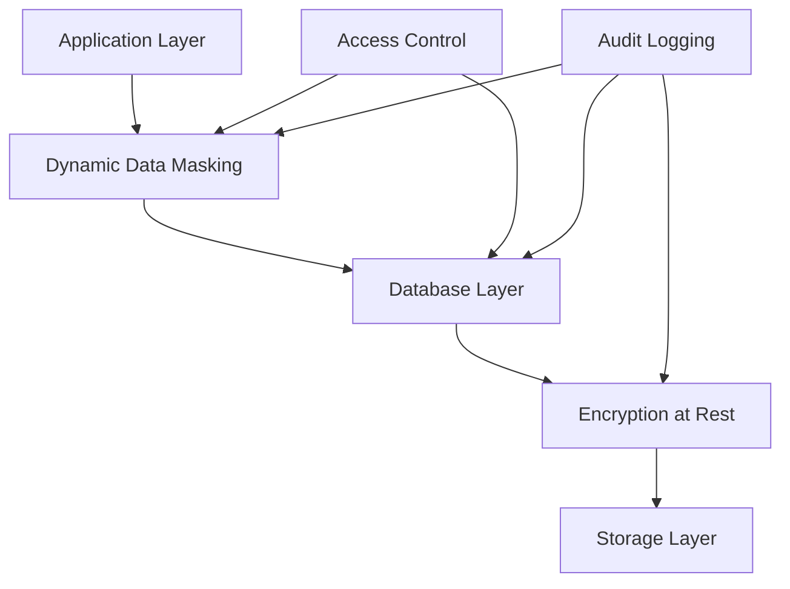

## Table of Contents

## Introduction

Enterprise data protection requires not only encryption of sensitive data but also techniques such as data masking and data subsetting to enable safe provisioning of data for development, testing, and partner environments. This comprehensive guide explores native features provided by leading enterprise databases and highlights third-party tools that support these capabilities.

## Native Database Solutions

### Oracle

**Oracle Data Masking and Subsetting**

Oracle offers a dedicated tool for data masking and subsetting to help organizations securely provision production data in non-production environments. This solution can:

- **Mask sensitive information** by replacing real data with realistic, fictitious values
- **Subset data** to reduce storage requirements while preserving data relationships and integrity
- **Work in conjunction with Transparent Data Encryption (TDE)** to secure data at rest

Key Features:

- Format-preserving masking
- Conditional masking based on data relationships
- Application-aware subsetting
- Integration with Oracle Enterprise Manager

Official Resources:

- [Oracle Data Masking and Subsetting](https://www.oracle.com/security/database-security/data-masking-subsetting/)
- [Oracle Transparent Data Encryption (TDE)](https://docs.oracle.com/en/database/oracle/oracle-database/19/asoag/introduction-to-transparent-data-encryption.html)

### Microsoft SQL Server

**Dynamic Data Masking & Encryption**

SQL Server provides built-in capabilities that help protect sensitive data without altering the underlying database schema:

- **Dynamic Data Masking (DDM)**: Masks sensitive data in query results for unauthorized users
- **Always Encrypted**: Protects sensitive data both at rest and during query execution by keeping encryption keys separate from the database
- **Transparent Data Encryption (TDE)**: Encrypts the entire database at rest

Example of Dynamic Data Masking:

```sql
-- Create a table with masked columns
CREATE TABLE Customers (
    CustomerID int PRIMARY KEY,
    FirstName varchar(100) MASKED WITH (FUNCTION = 'partial(1,"XXXXXXX",0)') NULL,
    Email varchar(100) MASKED WITH (FUNCTION = 'email()') NULL,
    CreditCard varchar(20) MASKED WITH (FUNCTION = 'default()') NULL
);
```

Official Resources:

- [Dynamic Data Masking (SQL Server)](https://docs.microsoft.com/en-us/sql/relational-databases/security/dynamic-data-masking)
- [Always Encrypted Overview](https://docs.microsoft.com/en-us/sql/relational-databases/security/encryption/always-encrypted-database-engine)
- [SQL Server Transparent Data Encryption (TDE)](https://docs.microsoft.com/en-us/sql/relational-databases/security/encryption/transparent-data-encryption)

### IBM Db2

**Data Redaction & Native Encryption**

IBM Db2 includes features to protect sensitive data at query time and at rest:

- **Data Redaction**: Dynamically masks sensitive data during query execution based on user privileges
- **Native Encryption**: Encrypts databases using a two-tier key architecture (data encryption key protected by a master key)

Key Features:

- Column-level masking policies
- Role-based data access
- Hardware-accelerated encryption
- Integrated key management

Official Resources:

- [IBM Db2 Data Redaction](https://www.ibm.com/docs/en/db2/11.5?topic=management-data-redaction)
- [IBM Db2 Native Encryption](https://www.ibm.com/docs/en/db2/11.5?topic=encryption-native-encryption)

### MySQL Enterprise Edition

**Data Masking, De-Identification, and Encryption**

MySQL Enterprise Edition provides tools to safeguard sensitive information:

- **Data Masking and De-Identification**: Allows dynamic masking of sensitive fields for non-production use
- **Transparent Data Encryption (TDE)**: Encrypts data at rest using a two-tier key architecture via a keyring plugin

Example of Data Masking in MySQL:

```sql
-- Using MySQL Enterprise Data Masking functions
SELECT
    mask_inner(email, 2, 2) AS masked_email,
    mask_ssn(ssn) AS masked_ssn,
    mask_pan(credit_card) AS masked_cc
FROM customers;
```

Official Resources:

- [MySQL Enterprise Data Masking and De-Identification](https://www.mysql.com/products/enterprise/masking.html)
- [MySQL Enterprise Encryption](https://dev.mysql.com/doc/refman/8.0/en/innodb-data-encryption.html)

### PostgreSQL

**Community and Third-Party Extensions**

PostgreSQL does not include built-in data masking or subsetting features similar to commercial databases. However, you can achieve similar functionality via:

- **pgcrypto**: An official extension that provides cryptographic functions for encryption or obfuscation
- **pg_tde**: Community-driven transparent data encryption extension
- **Third-Party Tools**: Commercial products offer masking and subsetting services

Example using pgcrypto:

```sql
-- Install pgcrypto extension
CREATE EXTENSION pgcrypto;

-- Encrypt sensitive data
UPDATE customers
SET credit_card = pgp_sym_encrypt(credit_card, 'encryption_key');

-- Decrypt when needed
SELECT pgp_sym_decrypt(credit_card::bytea, 'encryption_key') AS credit_card
FROM customers;
```

Official Resources:

- [pgcrypto – PostgreSQL Documentation](https://www.postgresql.org/docs/current/pgcrypto.html)

### MongoDB

**Encryption and Custom Masking Options**

MongoDB Enterprise provides robust security features:

- **Encryption at Rest**: Ensures data files are encrypted using a master key mechanism
- **Client-Side Field Level Encryption**: Encrypts specific fields before data leaves the client application
- **Custom Masking**: Use aggregation pipeline or views to obscure data

Example of field-level masking in MongoDB:

```javascript
// Using aggregation pipeline for data masking
db.customers.aggregate([
  {
    $project: {
      name: 1,
      email: {
        $concat: [
          { $substr: ["$email", 0, 3] },
          "****",
          { $substr: ["$email", { $indexOfCP: ["$email", "@"] }, -1] },
        ],
      },
      phone: {
        $concat: ["XXX-XXX-", { $substr: ["$phone", -4, 4] }],
      },
    },
  },
]);
```

Official Resources:

- [MongoDB Encryption at Rest](https://www.mongodb.com/docs/manual/core/security-encryption-at-rest/)
- [Client-Side Field Level Encryption](https://www.mongodb.com/docs/manual/core/security-client-side-encryption/)

## Additional Enterprise Solutions

### SAP HANA

**Data Security in SAP HANA**

SAP HANA includes strong encryption capabilities and data anonymization features:

- Full-database and column-level encryption
- Data anonymization techniques for masking
- Integration with SAP Data Privacy features
- Dynamic data masking capabilities

### Teradata

**Teradata Data Masking and Privacy**

Teradata provides enterprise-grade security solutions including:

- Data Masking/Redaction for dynamic query-time masking
- Data Encryption for securing large-scale data warehouses
- Row-level security policies
- Temporal data management for compliance

## Third-Party Solutions

### Delphix Data Platform

Provides comprehensive data virtualization, masking, and subsetting across multiple database platforms:

- Automated sensitive data discovery
- Format-preserving masking
- Referential integrity maintenance
- API-driven automation

[Delphix Data Masking](https://www.delphix.com/solutions/data-compliance/data-masking)

### Informatica Data Masking

Offers enterprise-scale data privacy and security solutions:

- Persistent and dynamic data masking
- Test data management
- Sensitive data discovery
- Multi-platform support

[Informatica Data Masking](https://www.informatica.com/products/data-security/data-masking.html)

### IBM InfoSphere Optim

Provides data lifecycle management with masking and subsetting:

- Context-aware data masking
- Realistic test data generation
- Data archiving and subsetting
- Compliance reporting

[IBM InfoSphere Optim](https://www.ibm.com/products/infosphere-optim)

## Implementation Best Practices

### 1. Data Discovery and Classification

Before implementing masking or encryption:

```sql
-- Example: Identify sensitive columns in SQL Server
SELECT
    SCHEMA_NAME(t.schema_id) AS schema_name,
    t.name AS table_name,
    c.name AS column_name,
    ty.name AS data_type
FROM sys.tables t
INNER JOIN sys.columns c ON t.object_id = c.object_id
INNER JOIN sys.types ty ON c.user_type_id = ty.user_type_id
WHERE c.name LIKE '%ssn%'
   OR c.name LIKE '%credit%'
   OR c.name LIKE '%password%'
   OR c.name LIKE '%email%'
ORDER BY schema_name, table_name, column_name;
```

### 2. Choosing the Right Masking Technique

Different data types require different masking approaches:

- **Format-preserving**: Maintains data format (e.g., credit card numbers)
- **Randomization**: Replaces with random values
- **Shuffling**: Reorders existing values within a column
- **Nulling**: Replaces with NULL values
- **Character masking**: Replaces characters with 'X' or '\*'

### 3. Maintaining Referential Integrity

When masking related data across tables:

```sql
-- Example: Consistent masking across related tables
WITH MaskMapping AS (
    SELECT
        customer_id,
        ROW_NUMBER() OVER (ORDER BY NEWID()) AS masked_id
    FROM customers
)
UPDATE o
SET o.customer_id = m.masked_id
FROM orders o
INNER JOIN MaskMapping m ON o.customer_id = m.customer_id;
```

### 4. Performance Considerations

- Use indexed columns for masking operations
- Batch large masking operations
- Consider parallel processing for large datasets
- Monitor resource usage during masking

## Security Architecture

### Layered Security Approach



### Key Management Best Practices

1. **Separate key storage from data**
2. **Implement key rotation policies**
3. **Use Hardware Security Modules (HSMs) for production**
4. **Maintain key backup and recovery procedures**

## Comparison Matrix

| Feature                 | Oracle        | SQL Server           | PostgreSQL  | MySQL Enterprise | MongoDB         |
| ----------------------- | ------------- | -------------------- | ----------- | ---------------- | --------------- |
| Dynamic Data Masking    | ✓ (Redaction) | ✓                    | Via Views   | ✓                | Via Aggregation |
| Static Data Masking     | ✓             | ✓                    | Third-party | ✓                | Third-party     |
| TDE                     | ✓             | ✓                    | pg_tde      | ✓                | ✓               |
| Column Encryption       | ✓             | ✓ (Always Encrypted) | pgcrypto    | ✓                | ✓ (Field-level) |
| Subsetting              | ✓             | Third-party          | Third-party | Third-party      | Via Export      |
| Built-in Key Management | ✓             | ✓                    | ✗           | ✓                | ✓               |

## Implementation Checklist

- [ ] Identify and classify sensitive data
- [ ] Define masking rules and policies
- [ ] Choose appropriate masking techniques
- [ ] Test masking in non-production environment
- [ ] Validate referential integrity
- [ ] Implement encryption for data at rest
- [ ] Set up key management procedures
- [ ] Configure access controls
- [ ] Enable audit logging
- [ ] Document masking procedures
- [ ] Train team on security practices
- [ ] Schedule regular security audits

## Conclusion

Data masking, subsetting, and encryption are critical components of a comprehensive data security strategy. While enterprise databases offer varying levels of native support, the combination of built-in features and third-party tools can provide robust protection for sensitive data across all environments.

Key takeaways:

- **Oracle** and **SQL Server** offer the most comprehensive built-in solutions
- **PostgreSQL** users often need third-party tools or custom solutions
- **MongoDB** provides strong encryption but limited native masking
- Third-party tools can provide consistent capabilities across heterogeneous environments
- Always consider performance, compliance, and operational requirements when implementing these solutions

Remember to regularly review and update your data protection strategies as both threats and regulatory requirements continue to evolve.
