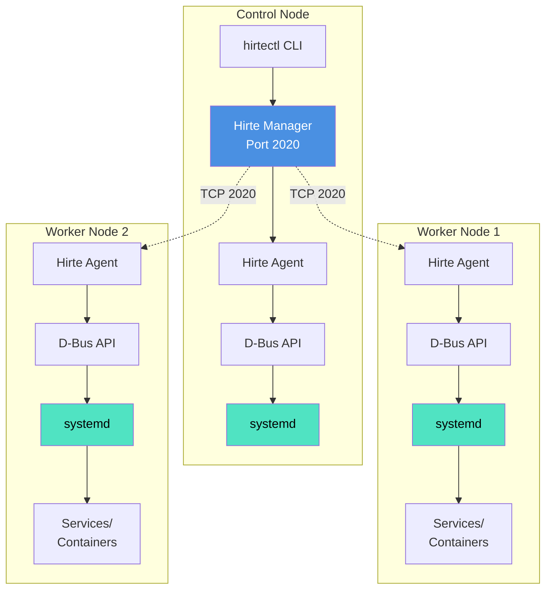
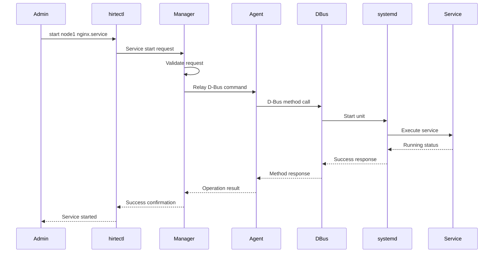
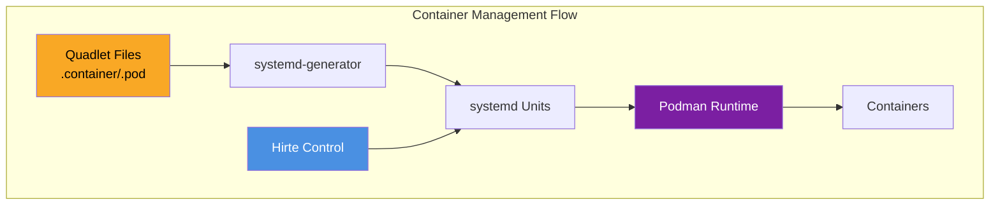
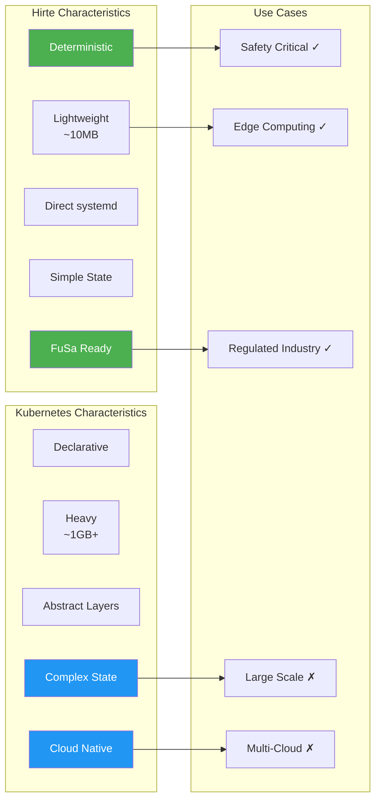

## Table of Contents

## Introduction

Hirte is a deterministic multi-node service controller designed specifically for highly-regulated industries with functional safety requirements. Unlike traditional orchestrators like Kubernetes, Hirte provides predictable behavior critical for safety systems while maintaining a lightweight footprint. It manages service states across multiple nodes by integrating with systemd via its D-Bus API and relaying D-Bus messages over TCP for multi-node support.

This guide provides a comprehensive overview of Hirte's architecture, implementation, and practical deployment on Rocky Linux 9.

## What is Hirte?

Hirte (German for "shepherd") is a minimalist service orchestrator that prioritizes:

- **Deterministic behavior**: Critical for safety-certified systems
- **Lightweight architecture**: Minimal resource overhead
- **Direct systemd integration**: Leverages existing Linux infrastructure
- **Multi-node coordination**: TCP-based D-Bus message relay
- **Container support**: Native integration with Podman and Quadlet

### Key Features

1. **Predictable State Management**: Every action has a deterministic outcome
2. **Minimal Dependencies**: Built on standard Linux components
3. **Safety-First Design**: Suitable for FuSa (Functional Safety) environments
4. **Simple API**: Easy integration with existing tools
5. **Container-Native**: First-class support for containerized workloads

## Architecture Overview

Hirte's architecture is elegantly simple yet powerful:



## Implementation Workflow

The implementation process follows a structured approach:



## Container Integration with Podman

Hirte seamlessly integrates with Podman through Quadlet:



## Hirte vs Kubernetes Comparison

Understanding when to use Hirte versus Kubernetes:



## Setup Instructions

### Prerequisites

For this implementation, you'll need:

- Two Rocky Linux 9 servers (one primary, one agent node)
- Network connectivity between nodes
- Root or sudo access
- Basic understanding of systemd

### Step 1: Install Hirte

Since Hirte isn't in default repositories, we'll use the COPR repository.

**On the primary node:**

```bash
# Enable COPR repository
sudo dnf install -y dnf-plugins-core
sudo dnf copr enable mperina/hirte-snapshot el9

# Install Hirte components
sudo dnf install -y hirte hirte-agent hirtectl

# Verify installation
hirtectl --version
```

**On the agent node:**

```bash
# Enable COPR repository
sudo dnf install -y dnf-plugins-core
sudo dnf copr enable mperina/hirte-snapshot el9

# Install only the agent
sudo dnf install -y hirte-agent
```

### Step 2: Configure Hirte

**On the primary node** (replace 192.168.1.10 with your primary node's IP):

```bash
# Create Hirte manager configuration
sudo tee /etc/hirte/hirte.conf << EOF
[hirte]
ManagerPort=2020
AllowedNodeNames=primary,agent
LogLevel=info
LogTarget=journald
EOF

# Create agent configuration for local agent
sudo tee /etc/hirte/agent.conf << EOF
[hirte-agent]
NodeName=primary
ManagerHost=127.0.0.1
ManagerPort=2020
LogLevel=info
LogTarget=journald
HeartbeatInterval=5
EOF
```

**On the agent node** (replace 192.168.1.10 with your primary node's IP):

```bash
# Create agent configuration
sudo tee /etc/hirte/agent.conf << EOF
[hirte-agent]
NodeName=agent
ManagerHost=192.168.1.10
ManagerPort=2020
LogLevel=info
LogTarget=journald
HeartbeatInterval=5
ReconnectInterval=10
EOF
```

### Step 3: Configure Firewall

**On the primary node:**

```bash
# Open Hirte manager port
sudo firewall-cmd --permanent --add-port=2020/tcp
sudo firewall-cmd --reload

# Verify firewall rules
sudo firewall-cmd --list-ports
```

### Step 4: Start Services

**On the primary node:**

```bash
# Start and enable services
sudo systemctl start hirte hirte-agent
sudo systemctl enable hirte hirte-agent

# Verify services are running
sudo systemctl status hirte hirte-agent
```

**On the agent node:**

```bash
# Start and enable agent
sudo systemctl start hirte-agent
sudo systemctl enable hirte-agent

# Verify agent is running
sudo systemctl status hirte-agent
```

### Step 5: Verify Connectivity

**On the primary node:**

```bash
# Check logs for agent connection
sudo journalctl -lfu hirte

# Expected output should show:
# "Agent 'agent' connected from 192.168.1.20"

# List connected nodes
sudo hirtectl list-nodes

# Expected output:
# NODE      STATE     LAST SEEN
# primary   online    now
# agent     online    2s ago
```

## Testing Functionality

### Basic Service Control

Let's test controlling services across nodes:

```bash
# List all units on all nodes
sudo hirtectl list-units

# List units on specific node
sudo hirtectl list-units agent

# Install a test service on agent node
ssh agent-node "sudo dnf install -y httpd"

# Control the service from primary node
sudo hirtectl start agent httpd.service
sudo hirtectl status agent httpd.service
sudo hirtectl stop agent httpd.service
sudo hirtectl restart agent httpd.service

# Enable service at boot
sudo hirtectl enable agent httpd.service
```

### Container Management with Podman

First, install Podman on the agent node:

```bash
# On agent node
sudo dnf install -y podman

# Create a Quadlet container file
sudo mkdir -p /etc/containers/systemd
sudo tee /etc/containers/systemd/webserver.container << EOF
[Unit]
Description=Nginx Web Server
After=network-online.target

[Container]
Image=docker.io/nginx:latest
PublishPort=8080:80
Volume=/var/www:/usr/share/nginx/html:ro
Environment=NGINX_HOST=example.com

[Service]
Restart=always
TimeoutStartSec=900

[Install]
WantedBy=default.target
EOF

# Reload systemd to generate service
sudo systemctl daemon-reload
```

Now control the container from the primary node:

```bash
# Start container
sudo hirtectl start agent webserver.service

# Check container status
sudo hirtectl status agent webserver.service

# View container logs
ssh agent-node "sudo journalctl -u webserver.service"

# Stop container
sudo hirtectl stop agent webserver.service
```

### Multi-Container Pod Example

Create a pod with multiple containers:

```bash
# On agent node - Create pod file
sudo tee /etc/containers/systemd/webapp.pod << EOF
[Unit]
Description=Web Application Pod

[Pod]
PodName=webapp
Network=bridge
PublishPort=8080:80
PublishPort=9090:9090
EOF

# Create application container
sudo tee /etc/containers/systemd/webapp-app.container << EOF
[Unit]
Description=Web Application
After=webapp.pod

[Container]
Image=docker.io/myapp:latest
Pod=webapp
Environment=DB_HOST=localhost
Environment=DB_PORT=5432

[Service]
Restart=always

[Install]
WantedBy=default.target
EOF

# Create database container
sudo tee /etc/containers/systemd/webapp-db.container << EOF
[Unit]
Description=PostgreSQL Database
After=webapp.pod

[Container]
Image=docker.io/postgres:14
Pod=webapp
Environment=POSTGRES_PASSWORD=secret
Environment=POSTGRES_DB=webapp
Volume=webapp-db-data:/var/lib/postgresql/data

[Service]
Restart=always

[Install]
WantedBy=default.target
EOF

# Reload systemd
sudo systemctl daemon-reload
```

Control the pod from primary node:

```bash
# Start the entire pod
sudo hirtectl start agent webapp.service
sudo hirtectl start agent webapp-app.service
sudo hirtectl start agent webapp-db.service

# Check pod status
sudo hirtectl list-units agent | grep webapp
```

## Advanced Features

### Service Dependencies

Leverage systemd's dependency model:

```bash
# Create dependent services on agent node
sudo tee /etc/systemd/system/app-backend.service << EOF
[Unit]
Description=Application Backend
After=network.target postgresql.service
Requires=postgresql.service

[Service]
Type=simple
ExecStart=/usr/bin/app-backend
Restart=on-failure
User=appuser
Group=appgroup

[Install]
WantedBy=multi-user.target
EOF

sudo tee /etc/systemd/system/app-frontend.service << EOF
[Unit]
Description=Application Frontend
After=app-backend.service
Requires=app-backend.service

[Service]
Type=simple
ExecStart=/usr/bin/app-frontend
Restart=on-failure

[Install]
WantedBy=multi-user.target
EOF

# Reload systemd
sudo systemctl daemon-reload

# Start frontend (will automatically start backend)
sudo hirtectl start agent app-frontend.service
```

### Monitoring Integration

Create a monitoring setup:

```bash
# Create monitoring script
sudo tee /usr/local/bin/hirte-monitor.sh << 'EOF'
#!/bin/bash

# Monitor all nodes
for node in $(hirtectl list-nodes | tail -n +2 | awk '{print $1}'); do
    echo "=== Node: $node ==="

    # Get failed units
    failed=$(hirtectl list-units $node | grep -c failed) || failed=0
    if [ $failed -gt 0 ]; then
        echo "WARNING: $failed failed units on $node"
        hirtectl list-units $node | grep failed
    fi

    # Check node connectivity
    last_seen=$(hirtectl list-nodes | grep $node | awk '{print $3, $4}')
    echo "Last seen: $last_seen"

    echo ""
done
EOF

sudo chmod +x /usr/local/bin/hirte-monitor.sh

# Create systemd timer for monitoring
sudo tee /etc/systemd/system/hirte-monitor.service << EOF
[Unit]
Description=Hirte Monitoring

[Service]
Type=oneshot
ExecStart=/usr/local/bin/hirte-monitor.sh
StandardOutput=journal
EOF

sudo tee /etc/systemd/system/hirte-monitor.timer << EOF
[Unit]
Description=Run Hirte Monitoring every 5 minutes

[Timer]
OnBootSec=5min
OnUnitActiveSec=5min

[Install]
WantedBy=timers.target
EOF

# Enable monitoring
sudo systemctl daemon-reload
sudo systemctl enable --now hirte-monitor.timer
```

### Multi-Node Orchestration

Create orchestration scripts for complex deployments:

```bash
# Orchestration script
sudo tee /usr/local/bin/deploy-stack.sh << 'EOF'
#!/bin/bash
set -e

echo "Deploying application stack..."

# Start database on primary node
echo "Starting database..."
hirtectl start primary postgresql.service
sleep 5

# Wait for database to be ready
until hirtectl exec primary "pg_isready -U postgres"; do
    echo "Waiting for database..."
    sleep 2
done

# Start backend services on agent nodes
echo "Starting backend services..."
hirtectl start agent app-backend.service
hirtectl start agent cache.service

# Wait for backends
sleep 10

# Start frontend services
echo "Starting frontend services..."
hirtectl start agent nginx.service
hirtectl start agent app-frontend.service

echo "Stack deployment complete!"

# Show status
hirtectl list-units primary | grep -E "postgresql|running"
hirtectl list-units agent | grep -E "app-|nginx|cache|running"
EOF

sudo chmod +x /usr/local/bin/deploy-stack.sh
```

## Security Considerations

### TLS Encryption

While Hirte doesn't natively support TLS, you can add it using stunnel:

```bash
# Install stunnel
sudo dnf install -y stunnel

# On primary node - Create stunnel server config
sudo tee /etc/stunnel/hirte-server.conf << EOF
[hirte-manager]
accept = 0.0.0.0:2021
connect = 127.0.0.1:2020
cert = /etc/stunnel/hirte.pem
EOF

# On agent node - Create stunnel client config
sudo tee /etc/stunnel/hirte-client.conf << EOF
client = yes

[hirte-agent]
accept = 127.0.0.1:2020
connect = 192.168.1.10:2021
EOF

# Generate certificate (on primary)
sudo openssl req -new -x509 -days 365 -nodes \
    -out /etc/stunnel/hirte.pem \
    -keyout /etc/stunnel/hirte.pem \
    -subj "/C=US/ST=State/L=City/O=Organization/CN=hirte.local"

# Start stunnel services
sudo systemctl enable --now stunnel@hirte-server
sudo systemctl enable --now stunnel@hirte-client

# Update agent config to use local stunnel
sudo sed -i 's/ManagerHost=.*/ManagerHost=127.0.0.1/' /etc/hirte/agent.conf
sudo systemctl restart hirte-agent
```

### Access Control

Implement basic access control:

```bash
# Create hirte group
sudo groupadd hirte-operators

# Add users to group
sudo usermod -a -G hirte-operators operator1

# Restrict hirtectl access
sudo chown root:hirte-operators /usr/bin/hirtectl
sudo chmod 750 /usr/bin/hirtectl

# Create sudo rules for specific operations
sudo tee /etc/sudoers.d/hirte << EOF
# Allow hirte-operators to use hirtectl
%hirte-operators ALL=(root) NOPASSWD: /usr/bin/hirtectl list-units *
%hirte-operators ALL=(root) NOPASSWD: /usr/bin/hirtectl status * *
%hirte-operators ALL=(root) NOPASSWD: /usr/bin/hirtectl start * *.service
%hirte-operators ALL=(root) NOPASSWD: /usr/bin/hirtectl stop * *.service
%hirte-operators ALL=(root) NOPASSWD: /usr/bin/hirtectl restart * *.service
EOF
```

### Audit Logging

Enable comprehensive audit logging:

```bash
# Configure auditd rules
sudo tee -a /etc/audit/rules.d/hirte.rules << EOF
# Audit Hirte operations
-w /usr/bin/hirtectl -p x -k hirte_commands
-w /etc/hirte/ -p wa -k hirte_config
-w /var/log/hirte/ -p wa -k hirte_logs

# Audit systemd operations via Hirte
-a always,exit -F arch=b64 -S execve -F path=/usr/bin/systemctl -k systemd_hirte
EOF

# Reload audit rules
sudo augenrules --load
sudo systemctl restart auditd

# Create log aggregation
sudo tee /usr/local/bin/hirte-audit-report.sh << 'EOF'
#!/bin/bash
echo "Hirte Audit Report - $(date)"
echo "=========================="
echo ""
echo "Recent Hirte Commands:"
ausearch -k hirte_commands -ts recent | aureport -x
echo ""
echo "Configuration Changes:"
ausearch -k hirte_config -ts recent | aureport -f
echo ""
echo "Service Operations:"
journalctl -u hirte -u hirte-agent --since "1 hour ago" | grep -E "start|stop|restart"
EOF

sudo chmod +x /usr/local/bin/hirte-audit-report.sh
```

## Troubleshooting

### Common Issues and Solutions

#### Connection Failures

```bash
# Check if manager is listening
sudo ss -tlnp | grep 2020

# Test connectivity from agent
telnet 192.168.1.10 2020

# Check firewall on both nodes
sudo firewall-cmd --list-all

# Verify DNS resolution
ping -c 1 primary-node

# Check agent logs
sudo journalctl -u hirte-agent -f
```

#### Service Control Issues

```bash
# Verify local systemd control works
sudo systemctl status httpd

# Check D-Bus connectivity
sudo busctl status

# Test D-Bus method calls
sudo busctl call org.freedesktop.systemd1 \
    /org/freedesktop/systemd1 \
    org.freedesktop.systemd1.Manager \
    GetUnit s "httpd.service"

# Check Hirte agent D-Bus permissions
sudo -u hirte-agent busctl status
```

#### Performance Issues

```bash
# Monitor Hirte resource usage
sudo systemctl status hirte hirte-agent

# Check message queue
sudo ss -tnp | grep 2020

# Monitor D-Bus traffic
sudo busctl monitor org.freedesktop.systemd1

# Check system load
top -b -n 1 | head -20
```

### Debug Mode

Enable verbose logging for troubleshooting:

```bash
# Enable debug logging
sudo sed -i 's/LogLevel=.*/LogLevel=debug/' /etc/hirte/hirte.conf
sudo sed -i 's/LogLevel=.*/LogLevel=debug/' /etc/hirte/agent.conf

# Restart services
sudo systemctl restart hirte hirte-agent

# Watch debug logs
sudo journalctl -f -u hirte -u hirte-agent

# Disable debug when done
sudo sed -i 's/LogLevel=.*/LogLevel=info/' /etc/hirte/hirte.conf
sudo sed -i 's/LogLevel=.*/LogLevel=info/' /etc/hirte/agent.conf
sudo systemctl restart hirte hirte-agent
```

## Best Practices

### 1. Service Organization

```bash
# Use consistent naming conventions
webapp-frontend.service
webapp-backend.service
webapp-database.service

# Group related services
infrastructure-*.service  # Infrastructure services
app-*.service           # Application services
monitor-*.service       # Monitoring services
```

### 2. Health Checks

```bash
# Create health check script
sudo tee /usr/local/bin/check-hirte-health.sh << 'EOF'
#!/bin/bash

ERRORS=0

# Check Hirte services
for service in hirte hirte-agent; do
    if ! systemctl is-active --quiet $service; then
        echo "ERROR: $service is not running"
        ((ERRORS++))
    fi
done

# Check node connectivity
NODES=$(hirtectl list-nodes | tail -n +2 | wc -l)
if [ $NODES -lt 2 ]; then
    echo "ERROR: Expected at least 2 nodes, found $NODES"
    ((ERRORS++))
fi

# Check for failed units
FAILED=$(hirtectl list-units | grep -c failed || true)
if [ $FAILED -gt 0 ]; then
    echo "ERROR: $FAILED failed units detected"
    ((ERRORS++))
fi

exit $ERRORS
EOF

sudo chmod +x /usr/local/bin/check-hirte-health.sh

# Add to monitoring
echo "*/5 * * * * root /usr/local/bin/check-hirte-health.sh || logger -t hirte-health 'Health check failed'" | sudo tee -a /etc/crontab
```

### 3. Backup and Recovery

```bash
# Backup Hirte configuration
sudo tee /usr/local/bin/backup-hirte.sh << 'EOF'
#!/bin/bash

BACKUP_DIR="/var/backups/hirte"
TIMESTAMP=$(date +%Y%m%d_%H%M%S)

mkdir -p $BACKUP_DIR

# Backup configurations
tar -czf $BACKUP_DIR/hirte-config-$TIMESTAMP.tar.gz \
    /etc/hirte/ \
    /etc/systemd/system/*.service \
    /etc/containers/systemd/

# Backup node state
hirtectl list-nodes > $BACKUP_DIR/nodes-$TIMESTAMP.txt
hirtectl list-units > $BACKUP_DIR/units-$TIMESTAMP.txt

# Keep only last 7 days
find $BACKUP_DIR -name "*.tar.gz" -mtime +7 -delete
find $BACKUP_DIR -name "*.txt" -mtime +7 -delete

echo "Backup completed: $BACKUP_DIR/*-$TIMESTAMP.*"
EOF

sudo chmod +x /usr/local/bin/backup-hirte.sh

# Schedule daily backups
echo "0 2 * * * root /usr/local/bin/backup-hirte.sh" | sudo tee -a /etc/crontab
```

## Production Deployment

### High Availability Setup

For production environments, implement HA for the Hirte manager:

```bash
# Install keepalived on both manager nodes
sudo dnf install -y keepalived

# On primary manager
sudo tee /etc/keepalived/keepalived.conf << EOF
vrrp_instance HIRTE_VIP {
    state MASTER
    interface eth0
    virtual_router_id 51
    priority 100
    advert_int 1
    authentication {
        auth_type PASS
        auth_pass secret123
    }
    virtual_ipaddress {
        192.168.1.100/24
    }
    notify_master "/usr/local/bin/hirte-failover.sh master"
    notify_backup "/usr/local/bin/hirte-failover.sh backup"
}
EOF

# On backup manager
sudo tee /etc/keepalived/keepalived.conf << EOF
vrrp_instance HIRTE_VIP {
    state BACKUP
    interface eth0
    virtual_router_id 51
    priority 90
    advert_int 1
    authentication {
        auth_type PASS
        auth_pass secret123
    }
    virtual_ipaddress {
        192.168.1.100/24
    }
    notify_master "/usr/local/bin/hirte-failover.sh master"
    notify_backup "/usr/local/bin/hirte-failover.sh backup"
}
EOF

# Create failover script
sudo tee /usr/local/bin/hirte-failover.sh << 'EOF'
#!/bin/bash

STATE=$1

case $STATE in
    master)
        systemctl start hirte
        logger -t hirte-ha "Became master, starting Hirte manager"
        ;;
    backup)
        systemctl stop hirte
        logger -t hirte-ha "Became backup, stopping Hirte manager"
        ;;
esac
EOF

sudo chmod +x /usr/local/bin/hirte-failover.sh

# Start keepalived
sudo systemctl enable --now keepalived

# Configure agents to use VIP
sudo sed -i 's/ManagerHost=.*/ManagerHost=192.168.1.100/' /etc/hirte/agent.conf
sudo systemctl restart hirte-agent
```

### Monitoring Dashboard

Create a simple monitoring dashboard:

```bash
# Install dependencies
sudo dnf install -y python3 python3-flask python3-requests

# Create dashboard application
sudo tee /opt/hirte-dashboard.py << 'EOF'
#!/usr/bin/env python3

from flask import Flask, render_template_string
import subprocess
import json

app = Flask(__name__)

DASHBOARD_TEMPLATE = '''
<!DOCTYPE html>
<html>
<head>
    <title>Hirte Dashboard</title>
    <meta http-equiv="refresh" content="30">
    <style>
        body { font-family: Arial, sans-serif; margin: 20px; }
        table { border-collapse: collapse; width: 100%; margin: 20px 0; }
        th, td { border: 1px solid #ddd; padding: 8px; text-align: left; }
        th { background-color: #4CAF50; color: white; }
        .online { color: green; }
        .offline { color: red; }
        .running { background-color: #e8f5e9; }
        .failed { background-color: #ffebee; }
    </style>
</head>
<body>
    <h1>Hirte Service Controller Dashboard</h1>

    <h2>Nodes</h2>
    <table>
        <tr><th>Node</th><th>State</th><th>Last Seen</th></tr>
        
        <tr>
            <td>{{ node.name }}</td>
            <td class="{{ node.state }}">{{ node.state }}</td>
            <td>{{ node.last_seen }}</td>
        </tr>
        
    </table>

    <h2>Services</h2>
    <table>
        <tr><th>Node</th><th>Service</th><th>State</th><th>Description</th></tr>
        
        <tr class="{{ service.state }}">
            <td>{{ service.node }}</td>
            <td>{{ service.name }}</td>
            <td>{{ service.state }}</td>
            <td>{{ service.description }}</td>
        </tr>
        
    </table>

    <p>Last updated: {{ timestamp }}</p>
</body>
</html>
'''

@app.route('/')
def dashboard():
    from datetime import datetime

    # Get nodes
    nodes = []
    result = subprocess.run(['sudo', 'hirtectl', 'list-nodes'],
                          capture_output=True, text=True)
    if result.returncode == 0:
        lines = result.stdout.strip().split('\n')[1:]  # Skip header
        for line in lines:
            parts = line.split()
            if len(parts) >= 3:
                nodes.append({
                    'name': parts[0],
                    'state': parts[1],
                    'last_seen': ' '.join(parts[2:])
                })

    # Get services
    services = []
    for node in nodes:
        result = subprocess.run(['sudo', 'hirtectl', 'list-units', node['name']],
                              capture_output=True, text=True)
        if result.returncode == 0:
            lines = result.stdout.strip().split('\n')[1:]  # Skip header
            for line in lines:
                parts = line.split(None, 3)
                if len(parts) >= 3:
                    services.append({
                        'node': node['name'],
                        'name': parts[0],
                        'state': parts[1],
                        'description': parts[3] if len(parts) > 3 else ''
                    })

    return render_template_string(DASHBOARD_TEMPLATE,
                                nodes=nodes,
                                services=services,
                                timestamp=datetime.now().strftime('%Y-%m-%d %H:%M:%S'))

if __name__ == '__main__':
    app.run(host='0.0.0.0', port=8080)
EOF

sudo chmod +x /opt/hirte-dashboard.py

# Create systemd service
sudo tee /etc/systemd/system/hirte-dashboard.service << EOF
[Unit]
Description=Hirte Dashboard
After=network.target hirte.service

[Service]
Type=simple
ExecStart=/opt/hirte-dashboard.py
Restart=always
User=nobody
Group=nobody

[Install]
WantedBy=multi-user.target
EOF

# Add sudo permissions for dashboard
echo "nobody ALL=(root) NOPASSWD: /usr/bin/hirtectl list-nodes, /usr/bin/hirtectl list-units *" | sudo tee -a /etc/sudoers.d/hirte-dashboard

# Start dashboard
sudo systemctl daemon-reload
sudo systemctl enable --now hirte-dashboard

# Open firewall port
sudo firewall-cmd --permanent --add-port=8080/tcp
sudo firewall-cmd --reload
```

## Conclusion

Hirte provides a unique solution for deterministic service orchestration across multiple nodes, making it ideal for:

- **Safety-critical systems** requiring predictable behavior
- **Regulated environments** where Kubernetes complexity is prohibitive
- **Edge computing** scenarios with resource constraints
- **Legacy system integration** leveraging existing systemd infrastructure
- **Container orchestration** without the overhead of k8s

### Key Advantages

1. **Deterministic Behavior**: Every operation has predictable outcomes
2. **Minimal Footprint**: ~10MB memory usage vs gigabytes for k8s
3. **Native Integration**: Direct systemd control without abstraction layers
4. **Simple Architecture**: Easy to understand, audit, and validate
5. **Container Support**: First-class Podman/Quadlet integration

### When to Use Hirte

Choose Hirte when you need:

- Functional safety compliance (ISO 26262, IEC 61508)
- Predictable real-time behavior
- Minimal resource overhead
- Simple multi-node coordination
- Direct systemd integration

### When NOT to Use Hirte

Consider alternatives when you need:

- Large-scale deployments (1000+ nodes)
- Complex scheduling algorithms
- Multi-cloud portability
- Extensive ecosystem of operators
- Dynamic auto-scaling

Hirte fills a critical gap in the orchestration landscape, providing a safety-focused alternative to cloud-native solutions while maintaining the simplicity and reliability that regulated industries require.
