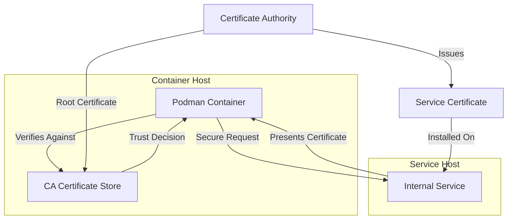
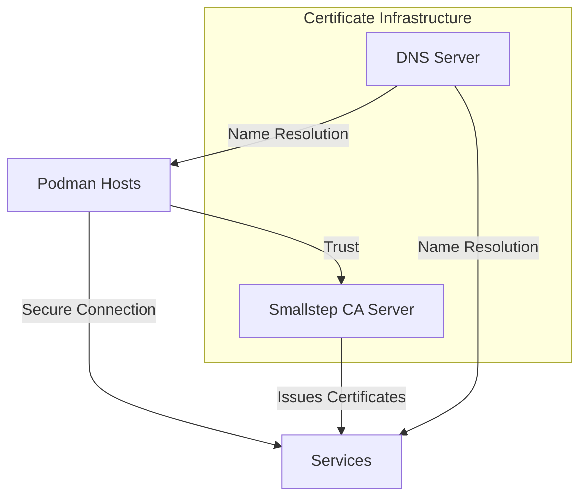

# Adding Custom CA Certificates to Podman - A Complete Guide

Secure communications are essential in modern infrastructure, especially in containerized environments. When working with Podman in enterprise or development settings, you'll often need to connect to services that use certificates signed by private or internal Certificate Authorities (CAs). This guide provides comprehensive instructions for adding custom CA certificates to Podman, enabling secure connections to internal services, private registries, and other certificate-secured resources.

## Understanding CA Certificates and Podman

Before diving into implementation details, it's important to understand why and how CA certificates work with Podman:



Podman relies on the host's certificate store to validate TLS certificates presented by remote services. When connecting to services using certificates signed by custom CAs (like internal company CAs), Podman needs access to those CA certificates to establish trust.

## Two Approaches to Adding CA Certificates

There are two primary methods for adding CA certificates to Podman:

1. **Direct Certificate Installation**: Adding individual CA certificates to the host's trust store
2. **Integrated CA Infrastructure**: Setting up a complete certificate authority infrastructure with tools like Smallstep CA

Let's explore both approaches in detail.

## Method 1: Direct Certificate Installation

This straightforward approach involves adding CA certificates directly to the host system's certificate store.

### For Locally Running Podman (Linux)

```bash
# Copy your CA certificate to the appropriate directory
sudo cp your-ca.crt /etc/pki/ca-trust/source/anchors/

# Update the system's trust store
sudo update-ca-trust
```

### For Podman Machine (macOS/Windows)

If you're using Podman Machine on macOS or Windows, you'll need to add the certificate to the virtual machine:

```bash
# SSH into Podman Machine
podman machine ssh

# Switch to root (if needed)
sudo su -

# Navigate to certificate directory
cd /etc/pki/ca-trust/source/anchors/

# Create certificate file
vi custom-ca.pem
# Paste your certificate content here
# Save and exit (ESC, then :wq)

# Update the trust store
update-ca-trust

# Exit from root and the machine
exit
exit
```

### Downloading Certificates from a Server

If your CA certificate is available for download:

```bash
# SSH into Podman Machine
podman machine ssh

# Switch to root (if needed)
sudo su -

# Navigate to certificate directory
cd /etc/pki/ca-trust/source/anchors/

# Download certificate
curl -k -o custom-ca.pem https://your-ca-server/ca.crt

# Update the trust store
update-ca-trust

# Exit from root and the machine
exit
exit
```

## Method 2: Integrated CA Infrastructure with Smallstep CA

For more advanced use cases, setting up a complete CA infrastructure provides better certificate lifecycle management, automation, and security. This approach is especially valuable for larger environments or when multiple services need certificates.

### Components of an Integrated CA Solution



### Setting Up Smallstep CA Server

These steps outline how to set up a Smallstep CA server on a dedicated machine:

```bash
# Install Smallstep CA and CLI
wget https://github.com/smallstep/cli/releases/download/v0.24.0/step-cli_0.24.0_amd64.rpm
wget https://github.com/smallstep/certificates/releases/download/v0.24.0/step-ca_0.24.0_amd64.rpm

# Install the packages
rpm -ivh step-cli_0.24.0_amd64.rpm
rpm -ivh step-ca_0.24.0_amd64.rpm

# Initialize the CA (save password and fingerprint!)
step ca init --name "Enterprise CA" \
  --dns ca.example.com \
  --address :443 \
  --provisioner admin

# Create password file (for automated startup)
echo "your_secure_password_here" > /etc/step-ca.env
chmod 600 /etc/step-ca.env

# Create systemd service
cat << EOF > /etc/systemd/system/step-ca.service
[Unit]
Description=Smallstep Certificates CA
Documentation=https://smallstep.com/docs/step-ca
After=network.target

[Service]
Type=simple
User=root
EnvironmentFile=/etc/step-ca.env
ExecStart=/bin/bash -c 'echo "$STEPCA_PASSWORD" | step-ca /root/.step/config/ca.json --password-file /dev/stdin'
Restart=on-failure

[Install]
WantedBy=multi-user.target
EOF

# Start and enable service
systemctl daemon-reload
systemctl start step-ca
systemctl enable step-ca
```

### Setting Up CoreDNS (Optional but Recommended)

A DNS server makes certificate management easier by providing consistent naming:

```bash
# Create Corefile configuration
cat << EOF > /etc/coredns/Corefile
.:53 {
    forward . 8.8.8.8
    log
    errors
}

example.com:53 {
    file /etc/coredns/example.com.db
    log
    errors
}
EOF

# Create zone file
cat << EOF > /etc/coredns/example.com.db
\$ORIGIN example.com.
@       3600 IN SOA  ca.example.com. admin.example.com. (
        2024061501 ; serial
        7200       ; refresh
        3600       ; retry
        1209600    ; expire
        3600       ; minimum
)

@       3600 IN NS  ca.example.com.

ca        IN A     192.168.1.10
registry  IN A     192.168.1.20
EOF

# Create CoreDNS service
cat << EOF > /etc/systemd/system/coredns.service
[Unit]
Description=CoreDNS DNS server
Documentation=https://coredns.io
After=network.target

[Service]
ExecStart=/path/to/coredns -conf /etc/coredns/Corefile
Restart=on-failure

[Install]
WantedBy=multi-user.target
EOF

# Start and enable CoreDNS
systemctl daemon-reload
systemctl start coredns
systemctl enable coredns
```

### Adding CA Certificates to Podman

Once your CA infrastructure is set up, add the root certificate to your Podman hosts:

```bash
# SSH into Podman Machine
podman machine ssh

# Switch to root (if needed)
sudo su -

# Navigate to certificate directory
cd /etc/pki/ca-trust/source/anchors/

# Download certificate from CA server
curl -k -o enterprise-ca.pem https://ca.example.com/root_ca.crt

# Update the trust store
update-ca-trust

# Exit
exit
exit
```

## Configuring Podman to Use Your CA Infrastructure

After adding certificates, you may want to configure Podman to work seamlessly with your internal services:

```bash
# SSH into Podman Machine
podman machine ssh

# Configure registries
sudo vi /etc/containers/registries.conf

# Add your internal registry to the search list
[registries.search]
registries = ['docker.io', 'registry.example.com']

# Exit and reload
exit
```

## Testing Your Certificate Configuration

To verify your certificates are properly installed and trusted:

```bash
# Test pulling from a private registry
podman pull registry.example.com/myapp:latest

# Test with curl to verify TLS works
podman run --rm registry.example.com/myapp curl https://secure-service.example.com
```

## Comparing the Two Approaches

| Feature                    | Direct Installation | Integrated CA Infrastructure    |
| -------------------------- | ------------------- | ------------------------------- |
| **Complexity**             | Low                 | Moderate to High                |
| **Scalability**            | Limited             | High                            |
| **Certificate Management** | Manual              | Automated                       |
| **Certificate Rotation**   | Manual process      | Automated renewal               |
| **Security Controls**      | Basic               | Advanced (revocation, policies) |
| **Audit Capability**       | Limited             | Comprehensive                   |
| **Best For**               | Small environments  | Enterprise/production           |

### Advantages of Smallstep CA Over Manual Certificate Management

1. **Centralized certificate management**
2. **Automated certificate lifecycle (issuance, renewal, revocation)**
3. **Built-in PKI best practices**
4. **API-driven workflow**
5. **Easy certificate rotation**
6. **Better audit trails and logging**
7. **Integration capabilities with other services**

## Advanced Integration Examples

### Automating Certificate Distribution

Create an automated script to distribute CA certificates to all Podman hosts:

```bash
#!/bin/bash
# save as distribute-certs.sh

# Variables
CA_SERVER="ca.example.com"
CA_FINGERPRINT="your-fingerprint-here"
HOSTS=("podman1.example.com" "podman2.example.com" "podman3.example.com")

# Get the CA certificate
curl -k -o root_ca.crt https://$CA_SERVER/root_ca.crt

# Distribute to all hosts
for host in "${HOSTS[@]}"; do
  echo "Distributing to $host..."
  scp root_ca.crt root@$host:/tmp/
  ssh root@$host "cp /tmp/root_ca.crt /etc/pki/ca-trust/source/anchors/ && update-ca-trust"
done

echo "Distribution complete!"
```

### Setting Up Automatic Certificate Renewal

For services that need certificates:

```bash
# Request initial certificate
step ca certificate service.example.com service.crt service.key

# Create renewal script
cat << EOF > /usr/local/bin/renew-cert.sh
#!/bin/bash
step ca renew --force service.crt service.key
systemctl reload nginx  # Restart service to use new cert
EOF
chmod +x /usr/local/bin/renew-cert.sh

# Add to crontab for automatic renewal
(crontab -l 2>/dev/null; echo "0 0 1 * * /usr/local/bin/renew-cert.sh") | crontab -
```

## Troubleshooting Certificate Issues

### Certificate Not Trusted

If Podman doesn't trust your certificates:

```bash
# Check if certificate is properly installed
ls -l /etc/pki/ca-trust/source/anchors/your-ca.pem

# Verify certificate format
openssl x509 -in /etc/pki/ca-trust/source/anchors/your-ca.pem -text -noout

# Check if trust update worked
podman run --rm alpine cat /etc/ssl/certs/ca-certificates.crt | grep "Your CA Name"
```

### Connection Issues

For troubleshooting connection problems:

```bash
# Test DNS resolution
podman run --rm alpine nslookup registry.example.com

# Test TLS connection with verbose output
podman run --rm alpine sh -c "apk add --no-cache curl && curl -v https://registry.example.com"
```

### Registry Authentication Problems

If you're having issues with registry authentication:

```bash
# Test registry authentication
podman login registry.example.com

# Check registry configuration
cat /etc/containers/registries.conf
```

## Security Best Practices

1. **Protect CA private keys**: Never share or expose private keys
2. **Rotate certificates regularly**: Implement automated certificate rotation
3. **Implement certificate revocation**: Set up CRLs or OCSP for certificate revocation
4. **Audit certificate issuance**: Regularly review which certificates have been issued
5. **Backup CA data**: Maintain secure backups of CA configuration and keys
6. **Document procedures**: Create detailed documentation for certificate operations
7. **Monitor expiration dates**: Set up alerts for expiring certificates

## Conclusion

Adding custom CA certificates to Podman enables secure connections to internal services and private registries, which is essential in enterprise environments. Depending on your needs, you can choose between direct certificate installation for simpler use cases or setting up a complete certificate authority infrastructure with Smallstep CA for more comprehensive certificate management.

For most production environments, the integrated CA approach offers significant advantages in terms of security, automation, and management capabilities. However, for simpler development environments, direct certificate installation may be sufficient.

By following the steps outlined in this guide, you can establish a robust certificate infrastructure that seamlessly integrates with your Podman environment, ensuring secure communications between containers and services across your infrastructure.

## Resources

- [Podman Documentation](https://docs.podman.io/)
- [Smallstep CA Documentation](https://smallstep.com/docs/step-ca)
- [CoreDNS Documentation](https://coredns.io/manual/toc/)
- [OpenSSL Documentation](https://www.openssl.org/docs/)
- [NIST SP 800-57: Recommendation for Key Management](https://nvlpubs.nist.gov/nistpubs/SpecialPublications/NIST.SP.800-57pt1r4.pdf)
- [RHEL System Administrator's Guide - Managing Certificates](https://access.redhat.com/documentation/en-us/red_hat_enterprise_linux/8/html/security_hardening/using-shared-system-certificates_security-hardening)
