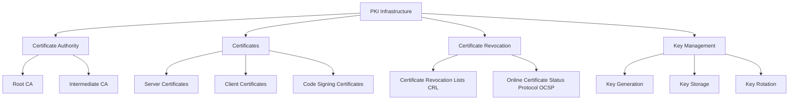

# Building a Complete PKI Infrastructure - Creating Your Own Certificate Authority

Public Key Infrastructure (PKI) forms the foundation of secure digital communications in modern enterprises. While commercial Certificate Authorities (CAs) like DigiCert or Let's Encrypt are common choices for public-facing services, maintaining an internal CA offers significant advantages for organization-wide security, particularly for internal services, development environments, and zero-trust architectures. This comprehensive guide walks through the process of building a complete PKI infrastructure with a hierarchical certificate authority system.

## Understanding PKI and Certificate Hierarchies

Before diving into implementation, it's crucial to understand the key components and concepts in a PKI infrastructure:



### The Three-Tier CA Hierarchy

A robust PKI implementation typically employs a three-tier hierarchy:

1. **Root CA**: The ultimate trust anchor, kept offline and highly secured
2. **Intermediate CA**: Issues end-entity certificates, online but protected
3. **End-entity certificates**: Server, client, or code signing certificates used by actual services

This hierarchical approach provides several security benefits:

- Compromise of an intermediate CA doesn't affect the root CA
- Root CA private keys can be kept in cold storage
- Certificate policies can be enforced at different levels
- Different intermediate CAs can serve different organizational needs

## Implementing a Complete PKI Infrastructure

The following script automates the creation of a three-tier PKI infrastructure. Let's examine its components and functionality before implementation.

### Directory Structure and Security

Our PKI implementation uses the following directory structure:

```
ca/
├── root-ca/         # Root CA certificates
├── intermediate-ca/ # Intermediate CA certificates
├── certs/           # Server certificates
├── private/         # Private keys (restricted access)
├── crl/             # Certificate revocation lists
└── csr/             # Certificate signing requests
```

The `private` directory is particularly critical as it contains sensitive key material and requires strict access controls.

### Certificate Configuration Templates

The script creates three configuration templates:

1. **Root CA Configuration**: Defines parameters for the self-signed root certificate
2. **Intermediate CA Configuration**: Defines parameters for the intermediate certificate
3. **Server Certificate Configuration**: Template for generating server certificates

These templates use OpenSSL configuration syntax and define certificate properties, extensions, and cryptographic parameters.

### The Certificate Authority Script

Here's our comprehensive CA creation script:

```bash
#!/bin/bash
# Certificate Authority Creation Script - A comprehensive tool for building enterprise PKI

# Create directory structure
mkdir -p ca/{root-ca,intermediate-ca,certs,private,crl,csr}
chmod 700 ca/private

# Create root CA configuration file
cat > ca/root-ca.conf << EOL
[ req ]
default_bits = 4096
default_md = sha256
prompt = no
encrypt_key = yes
distinguished_name = req_distinguished_name
x509_extensions = v3_ca
[ req_distinguished_name ]
countryName = US
stateOrProvinceName = YourState
localityName = YourCity
organizationName = YourOrganization
organizationalUnitName = YourUnit
commonName = YourCompany Root CA
emailAddress = admin@yourcompany.com
[ v3_ca ]
subjectKeyIdentifier = hash
authorityKeyIdentifier = keyid:always,issuer:always
basicConstraints = critical, CA:true
keyUsage = critical, digitalSignature, cRLSign, keyCertSign
EOL

# Create intermediate CA configuration
cat > ca/intermediate-ca.conf << EOL
[ req ]
default_bits = 4096
default_md = sha256
prompt = no
encrypt_key = yes
distinguished_name = req_distinguished_name
x509_extensions = v3_intermediate_ca
[ req_distinguished_name ]
countryName = US
stateOrProvinceName = YourState
localityName = YourCity
organizationName = YourOrganization
organizationalUnitName = YourUnit
commonName = YourCompany Intermediate CA
emailAddress = admin@yourcompany.com
[ v3_intermediate_ca ]
subjectKeyIdentifier = hash
authorityKeyIdentifier = keyid:always,issuer:always
basicConstraints = critical, CA:true, pathlen:0
keyUsage = critical, digitalSignature, cRLSign, keyCertSign
EOL

# Create server certificate configuration
cat > ca/server-cert.conf << EOL
[ req ]
default_bits = 2048
default_md = sha256
prompt = no
encrypt_key = no
distinguished_name = req_distinguished_name
req_extensions = v3_req
[ req_distinguished_name ]
countryName = US
stateOrProvinceName = YourState
localityName = YourCity
organizationName = YourOrganization
organizationalUnitName = YourUnit
commonName = your-domain.com
emailAddress = admin@yourcompany.com
[ v3_req ]
basicConstraints = CA:FALSE
keyUsage = critical, digitalSignature, keyEncipherment
extendedKeyUsage = serverAuth, clientAuth
subjectAltName = @alt_names
[ alt_names ]
DNS.1 = your-domain.com
DNS.2 = *.your-domain.com
DNS.3 = localhost
IP.1 = 127.0.0.1
EOL

# Function to generate Root CA
generate_root_ca() {
    echo "Generating Root CA..."

    # Generate Root CA private key
    openssl genrsa -aes256 -out ca/private/root-ca.key 4096
    chmod 400 ca/private/root-ca.key

    # Generate Root CA certificate
    openssl req -config ca/root-ca.conf \
        -key ca/private/root-ca.key \
        -new -x509 -days 7300 \
        -sha256 -extensions v3_ca \
        -out ca/root-ca/root-ca.crt
}

# Function to generate Intermediate CA
generate_intermediate_ca() {
    echo "Generating Intermediate CA..."

    # Generate Intermediate CA private key
    openssl genrsa -aes256 -out ca/private/intermediate-ca.key 4096
    chmod 400 ca/private/intermediate-ca.key

    # Generate Intermediate CA CSR
    openssl req -config ca/intermediate-ca.conf \
        -new -sha256 \
        -key ca/private/intermediate-ca.key \
        -out ca/csr/intermediate-ca.csr

    # Sign Intermediate CA certificate with Root CA
    openssl x509 -req \
        -in ca/csr/intermediate-ca.csr \
        -CA ca/root-ca/root-ca.crt \
        -CAkey ca/private/root-ca.key \
        -CAcreateserial \
        -out ca/intermediate-ca/intermediate-ca.crt \
        -days 3650 \
        -sha256 \
        -extfile ca/intermediate-ca.conf \
        -extensions v3_intermediate_ca
}

# Function to generate server certificate
generate_server_cert() {
    local domain=$1
    echo "Generating server certificate for $domain..."

    # Replace domain in config
    sed -i "s/your-domain.com/$domain/g" ca/server-cert.conf

    # Generate server private key
    openssl genrsa -out ca/private/$domain.key 2048
    chmod 400 ca/private/$domain.key

    # Generate server CSR
    openssl req -config ca/server-cert.conf \
        -key ca/private/$domain.key \
        -new -sha256 -out ca/csr/$domain.csr

    # Sign server certificate with Intermediate CA
    openssl x509 -req \
        -in ca/csr/$domain.csr \
        -CA ca/intermediate-ca/intermediate-ca.crt \
        -CAkey ca/private/intermediate-ca.key \
        -CAcreateserial \
        -out ca/certs/$domain.crt \
        -days 365 \
        -sha256 \
        -extfile ca/server-cert.conf \
        -extensions v3_req

    # Create certificate chain file
    cat ca/certs/$domain.crt \
        ca/intermediate-ca/intermediate-ca.crt \
        ca/root-ca/root-ca.crt > ca/certs/$domain.chain.crt
}

# Main execution
echo "Starting CA setup..."
generate_root_ca
generate_intermediate_ca

# Example usage for generating server certificate
# Uncomment and modify domain as needed
# generate_server_cert "example.com"

echo "CA setup complete!"
echo "Root CA certificate: ca/root-ca/root-ca.crt"
echo "Intermediate CA certificate: ca/intermediate-ca/intermediate-ca.crt"
echo "Generated certificates will be in ca/certs/"
```

## Understanding Each Component of the PKI Implementation

Let's break down each part of this implementation:

### Root CA Generation

```bash
generate_root_ca() {
    echo "Generating Root CA..."

    # Generate Root CA private key
    openssl genrsa -aes256 -out ca/private/root-ca.key 4096
    chmod 400 ca/private/root-ca.key

    # Generate Root CA certificate
    openssl req -config ca/root-ca.conf \
        -key ca/private/root-ca.key \
        -new -x509 -days 7300 \
        -sha256 -extensions v3_ca \
        -out ca/root-ca/root-ca.crt
}
```

This function:

1. Creates a 4096-bit RSA key with AES-256 encryption (password-protected)
2. Sets secure permissions on the private key (read-only for owner)
3. Generates a self-signed certificate valid for 20 years (7300 days)
4. Applies the v3_ca extensions as defined in the configuration file

The extensions are critical for defining this as a CA certificate:

- `basicConstraints = critical, CA:true` identifies this as a CA certificate
- `keyUsage = critical, digitalSignature, cRLSign, keyCertSign` restricts the key's use to signing certificates and CRLs

### Intermediate CA Generation

The intermediate CA generation is a two-step process:

1. Generate a key and Certificate Signing Request (CSR)
2. Sign the CSR with the Root CA to create the intermediate certificate

```bash
generate_intermediate_ca() {
    # Generate Intermediate CA private key
    openssl genrsa -aes256 -out ca/private/intermediate-ca.key 4096
    chmod 400 ca/private/intermediate-ca.key

    # Generate Intermediate CA CSR
    openssl req -config ca/intermediate-ca.conf \
        -new -sha256 \
        -key ca/private/intermediate-ca.key \
        -out ca/csr/intermediate-ca.csr

    # Sign Intermediate CA certificate with Root CA
    openssl x509 -req \
        -in ca/csr/intermediate-ca.csr \
        -CA ca/root-ca/root-ca.crt \
        -CAkey ca/private/root-ca.key \
        -CAcreateserial \
        -out ca/intermediate-ca/intermediate-ca.crt \
        -days 3650 \
        -sha256 \
        -extfile ca/intermediate-ca.conf \
        -extensions v3_intermediate_ca
}
```

Note the `pathlen:0` parameter in the intermediate CA configuration, which prevents this CA from creating additional intermediate CAs, limiting the depth of the certificate chain.

### Server Certificate Generation

The server certificate function creates end-entity certificates for servers:

```bash
generate_server_cert() {
    local domain=$1

    # Replace domain in config
    sed -i "s/your-domain.com/$domain/g" ca/server-cert.conf

    # Generate server private key
    openssl genrsa -out ca/private/$domain.key 2048

    # Generate server CSR
    openssl req -config ca/server-cert.conf \
        -key ca/private/$domain.key \
        -new -sha256 -out ca/csr/$domain.csr

    # Sign server certificate with Intermediate CA
    openssl x509 -req \
        -in ca/csr/$domain.csr \
        -CA ca/intermediate-ca/intermediate-ca.crt \
        -CAkey ca/private/intermediate-ca.key \
        -CAcreateserial \
        -out ca/certs/$domain.crt \
        -days 365 \
        -sha256 \
        -extfile ca/server-cert.conf \
        -extensions v3_req

    # Create certificate chain file
    cat ca/certs/$domain.crt \
        ca/intermediate-ca/intermediate-ca.crt \
        ca/root-ca/root-ca.crt > ca/certs/$domain.chain.crt
}
```

Key points in this function:

1. It customizes the configuration for the specific domain
2. Server keys are 2048-bit (sufficient for end-entity certificates)
3. Server certificates are valid for 365 days (annual rotation)
4. The function creates a full certificate chain file including:
   - The server certificate
   - The intermediate CA certificate
   - The root CA certificate

## Certificate Extensions and Their Importance

The configuration files define critical certificate extensions that dictate how certificates can be used:

### For CA Certificates

- `basicConstraints = critical, CA:true`: Marks the certificate as a CA certificate
- `keyUsage = critical, digitalSignature, cRLSign, keyCertSign`: Restricts key usage to signing certificates and CRLs

### For Server Certificates

- `basicConstraints = CA:FALSE`: Explicitly prevents the certificate from signing other certificates
- `keyUsage = critical, digitalSignature, keyEncipherment`: Restricts key usage to digital signatures and key encipherment
- `extendedKeyUsage = serverAuth, clientAuth`: Allows the certificate to be used for server and client authentication
- `subjectAltName`: Lists domains and IPs for which the certificate is valid

The "critical" flag on extensions means that any software processing the certificate must understand and respect that extension, or else reject the certificate.

## Implementing the PKI Infrastructure in Production

When implementing this PKI infrastructure in a production environment, follow these steps:

### Step 1: Security Preparation

1. **Air-gapped setup for Root CA**: Use an offline computer for Root CA operations
2. **Hardware Security Modules (HSMs)**: Consider using HSMs for key storage in high-security environments
3. **Secure physical storage**: Store Root CA keys on encrypted media in secure physical storage

### Step 2: Initial Setup

1. Execute the script on the designated CA management system:

```bash
chmod +x create-ca.sh
./create-ca.sh
```

2. When prompted, provide strong passwords for the CA private keys

### Step 3: Certificate Distribution

1. Install the Root CA certificate in the trust stores of all systems in your organization:

**For Debian/Ubuntu Systems:**

```bash
sudo cp ca/root-ca/root-ca.crt /usr/local/share/ca-certificates/
sudo update-ca-certificates
```

**For RHEL/CentOS Systems:**

```bash
sudo cp ca/root-ca/root-ca.crt /etc/pki/ca-trust/source/anchors/
sudo update-ca-trust
```

**For Windows Systems:**

```powershell
Import-Certificate -FilePath root-ca.crt -CertStoreLocation Cert:\LocalMachine\Root
```

### Step 4: Server Certificate Issuance

For each server requiring a certificate:

```bash
./create-ca.sh  # If not already run
# Then add the following line at the end of the script or run manually:
generate_server_cert "your-server-domain.com"
```

Install the server certificate and private key on your server according to the server software's requirements.

## Advanced PKI Management Techniques

### Certificate Revocation

Implement certificate revocation mechanisms to invalidate compromised certificates:

```bash
# Create a Certificate Revocation List (CRL)
openssl ca -config ca/intermediate-ca.conf \
    -gencrl -out ca/crl/intermediate-ca.crl

# Revoke a certificate
openssl ca -config ca/intermediate-ca.conf \
    -revoke ca/certs/compromised-cert.crt \
    -crl_reason keyCompromise
```

### Certificate Renewal Process

Establish a process for certificate renewal before expiration:

```bash
# Generate a new CSR using the existing private key
openssl req -new -key ca/private/existing-domain.key \
    -out ca/csr/renewal-domain.csr \
    -config ca/server-cert.conf

# Sign the renewal CSR
openssl x509 -req \
    -in ca/csr/renewal-domain.csr \
    -CA ca/intermediate-ca/intermediate-ca.crt \
    -CAkey ca/private/intermediate-ca.key \
    -CAcreateserial \
    -out ca/certs/renewed-domain.crt \
    -days 365 \
    -sha256 \
    -extfile ca/server-cert.conf \
    -extensions v3_req
```

### Automation and Integration

For larger environments, consider:

1. **Automated certificate management**: Tools like cert-manager, EJBCA, or custom scripts
2. **Certificate inventory management**: Track all issued certificates and expiration dates
3. **Integration with directory services**: LDAP or Active Directory for centralized certificate management

## Security Best Practices for PKI Infrastructure

### Private Key Protection

1. **Encrypt all private keys**: Especially CA keys
2. **Restrict access permissions**: Use filesystem permissions and access controls
3. **Consider key splitting**: Use Shamir's Secret Sharing for high-value keys
4. **Key backup procedures**: Secure, encrypted backups in multiple locations

### Operational Security

1. **Principle of least privilege**: Limit who can issue or manage certificates
2. **Four-eyes principle**: Require multiple administrators for critical operations
3. **Audit logging**: Log all certificate issuance and management activities
4. **Regular security audits**: Periodically review CA operations and security

### Key Ceremony

For enterprise environments, implement a formal key ceremony for Root CA creation:

1. **Documented procedure**: Create detailed documentation for each step
2. **Multiple witnesses**: Include multiple stakeholders as witnesses
3. **Physical security**: Conduct the ceremony in a secure location
4. **Evidence collection**: Record evidence of proper procedure execution

## Common PKI Implementation Challenges and Solutions

### Certificate Trust Issues

**Problem**: Certificates not trusted by applications or systems
**Solution**: Ensure the Root CA certificate is properly installed in all trust stores and check the certificate chain is properly constructed

```bash
# Verify certificate chain
openssl verify -CAfile ca/root-ca/root-ca.crt \
    -untrusted ca/intermediate-ca/intermediate-ca.crt \
    ca/certs/domain.crt
```

### Certificate Chain Problems

**Problem**: Incomplete certificate chains causing validation failures
**Solution**: Properly configure servers to send the full certificate chain excluding the Root CA

```apache
# Apache configuration example
SSLCertificateFile /path/to/domain.crt
SSLCertificateKeyFile /path/to/domain.key
SSLCertificateChainFile /path/to/intermediate-ca.crt
```

### Private Key Security Incidents

**Problem**: Compromised private key
**Solution**: Immediate certificate revocation and reissuance

```bash
# Revoke the compromised certificate
openssl ca -config ca/intermediate-ca.conf \
    -revoke ca/certs/compromised-cert.crt \
    -crl_reason keyCompromise

# Generate new key and certificate
generate_server_cert "compromised-domain.com"

# Update CRL
openssl ca -config ca/intermediate-ca.conf \
    -gencrl -out ca/crl/intermediate-ca.crl
```

## Real-World PKI Use Cases and Adaptations

### Microservice Architecture

For microservice architectures, consider:

- Shorter certificate lifetimes (30-90 days)
- Automated certificate issuance and renewal
- Service mesh integration (e.g., Istio, Linkerd)

```bash
# Generate short-lived certificate
generate_server_cert_with_duration() {
    local domain=$1
    local days=$2
    # Similar to generate_server_cert but with customizable days parameter
    # ...
    openssl x509 -req \
        -in ca/csr/$domain.csr \
        -CA ca/intermediate-ca/intermediate-ca.crt \
        -CAkey ca/private/intermediate-ca.key \
        -CAcreateserial \
        -out ca/certs/$domain.crt \
        -days $days \
        -sha256 \
        -extfile ca/server-cert.conf \
        -extensions v3_req
    # ...
}

# Usage:
generate_server_cert_with_duration "service.internal" 30
```

### Zero-Trust Architecture

For zero-trust implementations:

- Client certificates for mutual TLS (mTLS)
- Identity-based certificate issuance
- Integration with identity providers

```bash
# Create client certificate configuration
cat > ca/client-cert.conf << EOL
[ req ]
default_bits = 2048
default_md = sha256
prompt = no
encrypt_key = yes
distinguished_name = req_distinguished_name
req_extensions = v3_req
[ req_distinguished_name ]
countryName = US
stateOrProvinceName = YourState
organizationName = YourOrganization
commonName = user@example.com
[ v3_req ]
basicConstraints = CA:FALSE
keyUsage = critical, digitalSignature
extendedKeyUsage = clientAuth
EOL

# Function to generate client certificate
generate_client_cert() {
    local username=$1
    echo "Generating client certificate for $username..."

    # Replace username in config
    sed -i "s/user@example.com/$username/g" ca/client-cert.conf

    # Generate client private key (password protected)
    openssl genrsa -aes256 -out ca/private/$username.key 2048
    chmod 400 ca/private/$username.key

    # Generate client CSR
    openssl req -config ca/client-cert.conf \
        -key ca/private/$username.key \
        -new -sha256 -out ca/csr/$username.csr

    # Sign client certificate with Intermediate CA
    openssl x509 -req \
        -in ca/csr/$username.csr \
        -CA ca/intermediate-ca/intermediate-ca.crt \
        -CAkey ca/private/intermediate-ca.key \
        -CAcreateserial \
        -out ca/certs/$username.crt \
        -days 365 \
        -sha256 \
        -extfile ca/client-cert.conf \
        -extensions v3_req

    # Create PKCS#12 file for client import
    openssl pkcs12 -export \
        -out ca/certs/$username.p12 \
        -inkey ca/private/$username.key \
        -in ca/certs/$username.crt \
        -certfile ca/intermediate-ca/intermediate-ca.crt
}
```

### IoT Device Certification

For IoT implementations:

- Batch certificate generation
- Long-lived certificates with revocation mechanisms
- Lightweight certificate formats

```bash
# Batch certificate generation example
batch_generate_certs() {
    local prefix=$1
    local count=$2

    for i in $(seq 1 $count); do
        generate_server_cert "${prefix}-device-${i}.iot.internal"
    done
}

# Usage:
batch_generate_certs "sensor" 100
```

## Conclusion: Building a Sustainable PKI Strategy

Implementing your own PKI infrastructure provides complete control over your certificate ecosystem, enabling stronger security practices, cost savings, and flexibility. The script and guidance provided in this article serve as a foundation for building a robust, scalable certificate management system.

For long-term success:

1. **Documentation**: Maintain comprehensive documentation of your PKI architecture, processes, and procedures
2. **Automation**: Invest in automation for routine certificate operations
3. **Monitoring**: Implement certificate expiration monitoring and alerts
4. **Periodic reviews**: Regularly review and update your PKI implementation as security best practices evolve
5. **Training**: Ensure administrators understand PKI concepts and security implications

By following these guidelines, you can establish a trustworthy PKI infrastructure that supports your organization's security needs today and can evolve to meet future requirements.

## Resources

- [OpenSSL Documentation](https://www.openssl.org/docs/)
- [RFC 5280: X.509 Certificate and CRL Profile](https://tools.ietf.org/html/rfc5280)
- [NIST SP 800-57: Recommendation for Key Management](https://nvlpubs.nist.gov/nistpubs/SpecialPublications/NIST.SP.800-57pt1r4.pdf)
- [Mozilla's CA Certificate Policy](https://www.mozilla.org/en-US/about/governance/policies/security-group/certs/policy/)
- [Let's Encrypt Certification Practice Statement](https://letsencrypt.org/repository/)
- [PKI Book: Understanding PKI](https://www.amazon.com/Understanding-PKI-Concepts-Standards-Deployment/dp/0672323915)
