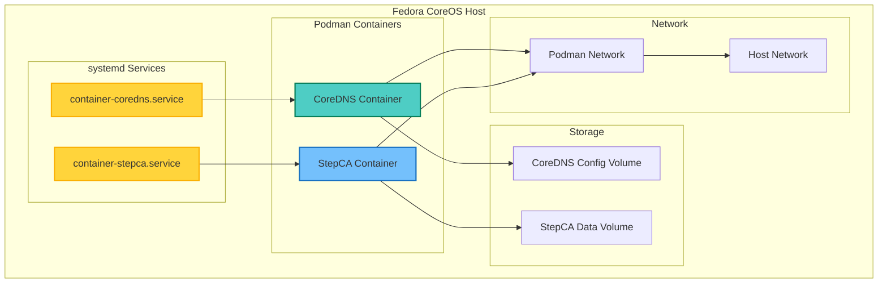
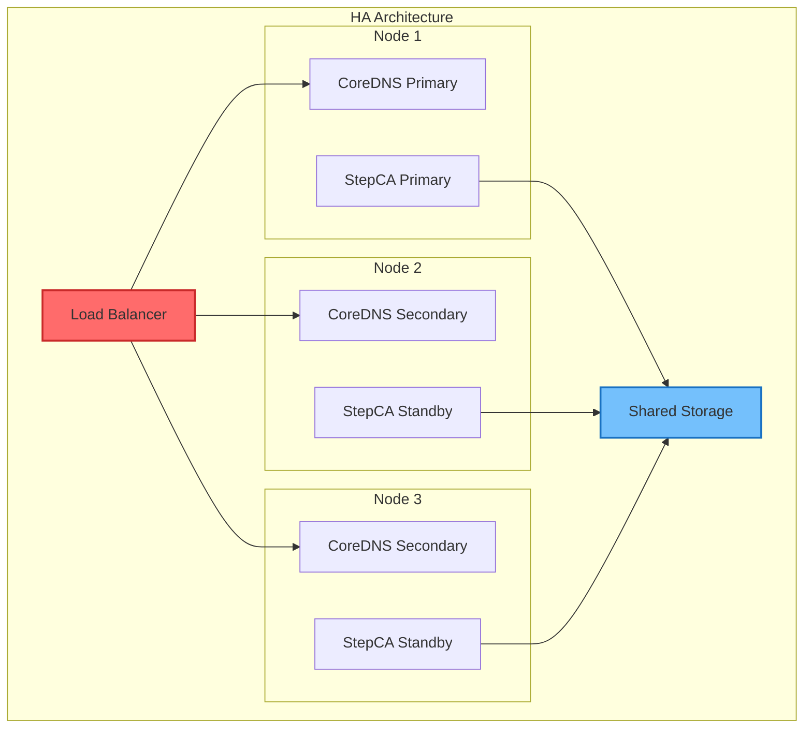
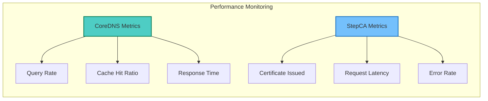

## Table of Contents

## Overview

This guide provides a complete setup for deploying CoreDNS and Smallstep Certificate Authority (StepCA) on Fedora CoreOS using Podman Quadlet. This approach offers a lightweight, systemd-integrated solution for DNS and PKI infrastructure without the complexity of Kubernetes.

## Architecture Overview



## Initial CoreOS Setup

### 1. Verify CoreOS Environment

```bash
# Check CoreOS version
rpm-ostree status

# Verify Podman installation
podman --version

# Check systemd version
systemctl --version
```

### 2. Create Required Directories

```bash
# Create directories for configurations
sudo mkdir -p /etc/containers/systemd
sudo mkdir -p /etc/containers/coredns
sudo mkdir -p /etc/containers/stepca
```

## CoreDNS Configuration Files

### CoreDNS Corefile

Create `/etc/containers/coredns/Corefile`:

```
.:53 {
    hosts {
        192.168.122.16 coredns.invinsense
        192.168.122.76 ca.invinsense
        192.168.122.236 nginx.invinsense
        fallthrough
    }
    forward . 8.8.8.8 9.9.9.9 {
        max_concurrent 1000
    }
    cache 300
    log
    errors
}

invinsense:53 {
    file /etc/coredns/invinsense.db
    log
    errors
}
```

### DNS Zone File

Create `/etc/containers/coredns/invinsense.db`:

```
$ORIGIN invinsense.
@    3600 IN    SOA coredns.invinsense. admin.invinsense. (
                2024010101 ; serial
                7200       ; refresh (2 hours)
                3600       ; retry (1 hour)
                1209600    ; expire (2 weeks)
                3600       ; minimum (1 hour)
                )

    3600 IN NS coredns.invinsense.

coredns    IN A     192.168.122.16
ca         IN A     192.168.122.76
nginx      IN A     192.168.122.236
*.apps     IN A     192.168.122.100
```

## StepCA Configuration

### StepCA Environment File

Create `/etc/containers/stepca.env`:

```bash
STEPCA_PASSWORD=your_secure_password_here
```

Secure the file:

```bash
sudo chmod 600 /etc/containers/stepca.env
sudo chown root:root /etc/containers/stepca.env
```

## Quadlet Configuration Files

### CoreDNS Network Configuration

Create `/etc/containers/systemd/dns-ca.network`:

```ini
[Network]
NetworkName=dns-ca-network
Subnet=10.89.0.0/24
Gateway=10.89.0.1
DNS=10.89.0.10
```

### CoreDNS Volume Configuration

Create `/etc/containers/systemd/coredns-config.volume`:

```ini
[Volume]
VolumeName=coredns-config
CopyFiles=/etc/containers/coredns:/etc/coredns
```

### StepCA Volume Configuration

Create `/etc/containers/systemd/stepca-data.volume`:

```ini
[Volume]
VolumeName=stepca-data
```

### CoreDNS Container Configuration

Create `/etc/containers/systemd/coredns.container`:

```ini
[Unit]
Description=CoreDNS DNS Server
After=network-online.target dns-ca.network.service
Wants=network-online.target dns-ca.network.service

[Container]
Image=docker.io/coredns/coredns:1.11.1
ContainerName=coredns
Network=dns-ca.network
PublishPort=53:53/udp
PublishPort=53:53/tcp
Volume=coredns-config.volume:/etc/coredns:ro,z
Environment=COREDNS_CONFIG=/etc/coredns/Corefile
Exec=-conf /etc/coredns/Corefile

# Security settings
SecurityLabelType=spc_t
ReadOnly=false
NoNewPrivileges=true

# Resource limits
MemoryLimit=512M
CPUQuota=50%

[Service]
Restart=always
RestartSec=30
TimeoutStartSec=900

[Install]
WantedBy=default.target
```

### StepCA Container Configuration

Create `/etc/containers/systemd/stepca.container`:

```ini
[Unit]
Description=Smallstep Certificate Authority
After=network-online.target dns-ca.network.service
Wants=network-online.target dns-ca.network.service

[Container]
Image=docker.io/smallstep/step-ca:0.24.0
ContainerName=stepca
Network=dns-ca.network
PublishPort=443:443
Volume=stepca-data.volume:/home/step:z
EnvironmentFile=/etc/containers/stepca.env
Environment=DOCKER_STEPCA_INIT_NAME=Invinsense CA
Environment=DOCKER_STEPCA_INIT_DNS_NAMES=ca.invinsense,localhost
Environment=DOCKER_STEPCA_INIT_ADDRESS=:443

# Security settings
SecurityLabelType=spc_t
ReadOnly=false
NoNewPrivileges=true

# Resource limits
MemoryLimit=512M
CPUQuota=50%

[Service]
Restart=always
RestartSec=30
TimeoutStartSec=900

[Install]
WantedBy=default.target
```

## Deployment Process

### 1. Deploy the Services

```bash
# Reload systemd to detect new Quadlet files
sudo systemctl daemon-reload

# Start and enable the network
sudo systemctl enable --now dns-ca.network

# Start and enable volumes
sudo systemctl enable --now coredns-config.volume
sudo systemctl enable --now stepca-data.volume

# Start and enable containers
sudo systemctl enable --now coredns.container
sudo systemctl enable --now stepca.container
```

### 2. Verify Services

```bash
# Check service status
sudo systemctl status coredns.container
sudo systemctl status stepca.container

# Check container status
podman ps

# View logs
sudo journalctl -u coredns.container
sudo journalctl -u stepca.container
```

## Post-Deployment Configuration

### Configure System DNS

```bash
# Update system DNS to use CoreDNS
sudo nmcli connection modify "System eth0" ipv4.dns "127.0.0.1"
sudo nmcli connection up "System eth0"

# Verify DNS resolution
dig @localhost ca.invinsense
nslookup nginx.invinsense
```

### Initialize StepCA Client

```bash
# Get CA fingerprint
sudo podman exec stepca step certificate fingerprint /home/step/certs/root_ca.crt

# Bootstrap the client
step ca bootstrap --ca-url https://ca.invinsense --fingerprint <FINGERPRINT>

# Request a test certificate
step ca certificate test.invinsense test.crt test.key
```

## Advanced Configuration

### High Availability Setup



### DNS Performance Tuning

Add to CoreDNS Corefile:

```
.:53 {
    # Performance optimizations
    bufsize 1232
    cache {
        success 9984 300
        denial 9984 5
    }

    # Health checks
    health {
        lameduck 5s
    }
    ready

    # Prometheus metrics
    prometheus :9153
}
```

### Certificate Auto-Renewal Script

Create `/usr/local/bin/cert-renewal.sh`:

```bash
#!/bin/bash
set -euo pipefail

CERT_DIR="/etc/ssl/certs"
KEY_DIR="/etc/ssl/private"
DOMAINS=("nginx.invinsense" "app1.invinsense" "app2.invinsense")

for domain in "${DOMAINS[@]}"; do
    echo "Checking certificate for $domain..."

    if step certificate needs-renewal "$CERT_DIR/$domain.crt"; then
        echo "Renewing certificate for $domain..."
        step ca renew "$CERT_DIR/$domain.crt" "$KEY_DIR/$domain.key" --force

        # Reload services that use this certificate
        systemctl reload nginx || true
    fi
done
```

### Monitoring Configuration

```yaml
# prometheus-config.yaml for monitoring
global:
  scrape_interval: 15s

scrape_configs:
  - job_name: "coredns"
    static_configs:
      - targets: ["localhost:9153"]

  - job_name: "stepca"
    static_configs:
      - targets: ["localhost:9000"]
```

## Security Hardening

### SELinux Configuration

```bash
# Create custom SELinux policy for containers
cat > coredns-stepca.te << 'EOF'
module coredns-stepca 1.0;

require {
    type container_t;
    type dns_port_t;
    type http_port_t;
    class tcp_socket name_bind;
    class udp_socket name_bind;
}

#============= container_t ==============
allow container_t dns_port_t:tcp_socket name_bind;
allow container_t dns_port_t:udp_socket name_bind;
allow container_t http_port_t:tcp_socket name_bind;
EOF

# Compile and install the policy
checkmodule -M -m -o coredns-stepca.mod coredns-stepca.te
semodule_package -o coredns-stepca.pp -m coredns-stepca.mod
sudo semodule -i coredns-stepca.pp
```

### Firewall Rules

```bash
# Configure firewall
sudo firewall-cmd --add-service=dns --permanent
sudo firewall-cmd --add-service=https --permanent
sudo firewall-cmd --reload
```

## Maintenance Operations

### Backup Procedures

```bash
#!/bin/bash
# backup-dns-ca.sh

BACKUP_DIR="/var/backups/dns-ca"
DATE=$(date +%Y%m%d_%H%M%S)

# Create backup directory
mkdir -p "$BACKUP_DIR"

# Backup CoreDNS configuration
podman volume export coredns-config > "$BACKUP_DIR/coredns-config-$DATE.tar"

# Backup StepCA data
podman volume export stepca-data > "$BACKUP_DIR/stepca-data-$DATE.tar"

# Backup Quadlet configurations
tar -czf "$BACKUP_DIR/quadlet-configs-$DATE.tar.gz" /etc/containers/systemd/

# Keep only last 7 days of backups
find "$BACKUP_DIR" -name "*.tar*" -mtime +7 -delete
```

### Update Procedures

```bash
# Update container images
sudo podman pull docker.io/coredns/coredns:latest
sudo podman pull docker.io/smallstep/step-ca:latest

# Update Quadlet files with new image tags
sudo sed -i 's/coredns:1.11.1/coredns:latest/g' /etc/containers/systemd/coredns.container
sudo sed -i 's/step-ca:0.24.0/step-ca:latest/g' /etc/containers/systemd/stepca.container

# Restart services
sudo systemctl restart coredns.container
sudo systemctl restart stepca.container
```

## Troubleshooting Guide

### Common Issues and Solutions

1. **Container Fails to Start**

   ```bash
   # Check for port conflicts
   sudo ss -tlnp | grep -E ':53|:443'

   # Verify SELinux context
   ls -Z /etc/containers/systemd/
   ```

2. **DNS Resolution Failures**

   ```bash
   # Test CoreDNS directly
   dig @localhost invinsense

   # Check CoreDNS logs
   sudo podman logs coredns
   ```

3. **Certificate Issues**

   ```bash
   # Verify StepCA is initialized
   sudo podman exec stepca step ca health

   # Check certificate chain
   openssl s_client -connect ca.invinsense:443 -showcerts
   ```

### Debug Commands

```bash
# Enable debug logging for CoreDNS
sudo podman exec coredns kill -USR1 1

# View detailed container inspect
sudo podman inspect coredns stepca

# Check systemd unit status
systemctl status container-*.service
```

## Performance Metrics



## Conclusion

This comprehensive setup provides a production-ready DNS and PKI infrastructure on Fedora CoreOS using Podman Quadlet. The configuration offers:

- **Seamless Integration**: Native systemd integration through Quadlet
- **High Security**: SELinux policies, firewall rules, and container isolation
- **Easy Maintenance**: Automated updates and backup procedures
- **Scalability**: Ready for high-availability configurations
- **Monitoring**: Built-in metrics and health checks

Key advantages:

- No Kubernetes overhead
- Immutable infrastructure approach
- Declarative configuration
- Automatic service management
- Production-grade reliability

By following this guide, you can deploy a robust DNS and certificate infrastructure that's both secure and maintainable, perfect for internal networks and development environments.
