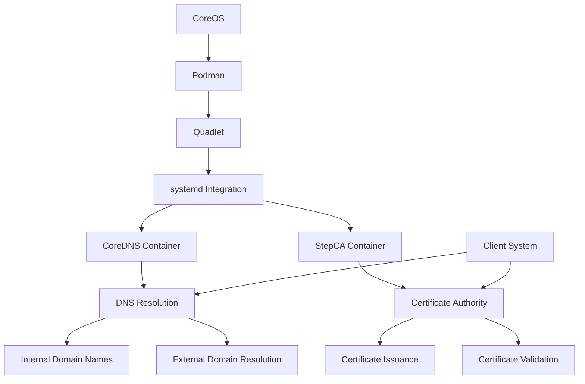

# Deploying CoreDNS and StepCA on CoreOS using Podman Quadlet

Modern infrastructure requires both reliable DNS resolution and secure certificate management. Fedora CoreOS provides an excellent foundation for running containerized infrastructure services with its focus on security, atomic updates, and minimal footprint. This guide demonstrates how to deploy both CoreDNS (for DNS services) and StepCA (for certificate authority services) on CoreOS using Podman Quadlet, which integrates containers directly with systemd.

## Understanding the Components

Before diving into the implementation, let's understand the key components:



- **CoreOS**: A minimal container-focused operating system
- **Podman**: A daemonless container engine
- **Quadlet**: A tool that integrates containers with systemd
- **CoreDNS**: A flexible DNS server written in Go
- **StepCA**: A certificate authority for secure automated certificate management

## Prerequisites

To follow this guide, you need:

- A Fedora CoreOS system (version 38 or newer recommended)
- Administrative access (sudo privileges)
- Basic knowledge of containers, DNS, and PKI concepts

## Implementation Steps

### 1. Verifying the Environment

First, ensure you're running CoreOS with Podman installed:

```bash
# Check CoreOS version
rpm-ostree status

# Verify Podman installation
podman --version
```

Make sure Podman version is 4.0 or higher, which includes Quadlet support.

### 2. Creating Directory Structure

Set up the necessary directories for our configuration files:

```bash
# Create main directories
sudo mkdir -p /etc/containers/systemd
sudo mkdir -p /etc/containers/coredns
sudo mkdir -p /etc/containers/stepca
```

### 3. Creating CoreDNS Configuration Files

Create the configuration files needed for CoreDNS:

```bash
# Create the Corefile for CoreDNS
sudo tee /etc/containers/coredns/Corefile > /dev/null << 'EOF'
.:53 {
    forward . 8.8.8.8
    log
    errors
}

invinsense:53 {
    file /etc/coredns/invinsense.db
    log
    errors
}
EOF

# Create the zone file for your internal domain
sudo tee /etc/containers/coredns/invinsense.db > /dev/null << 'EOF'
$ORIGIN invinsense.
@       3600 IN SOA  coredns.invinsense. admin.invinsense. (
        2024062201 ; serial
        7200       ; refresh
        3600       ; retry
        1209600    ; expire
        3600       ; minimum
)

@       3600 IN NS  coredns.invinsense.

coredns  IN A     127.0.0.1
ca       IN A     127.0.0.1
EOF
```

### 4. Setting Up StepCA Environment

Generate a secure password for StepCA and save it in an environment file:

```bash
# Generate a secure random password
PASSWORD=$(openssl rand -base64 32)

# Create environment file
sudo bash -c "cat > /etc/containers/stepca.env << EOF
STEPCA_PASSWORD=$PASSWORD
EOF"

# Secure the file
sudo chmod 600 /etc/containers/stepca.env

# Save the password somewhere secure for reference
echo "Your StepCA password is: $PASSWORD"
echo "Make sure to save this password in a secure location!"
```

### 5. Creating Quadlet Configuration Files

Now, let's create the Quadlet files that define our containers as systemd services:

```bash
# Create CoreDNS container configuration
sudo tee /etc/containers/systemd/coredns.container > /dev/null << 'EOF'
[Unit]
Description=CoreDNS DNS Server
Documentation=https://coredns.io
After=network-online.target
Wants=network-online.target

[Container]
Image=docker.io/coredns/coredns:1.11.1
Network=host
Volume=/etc/containers/coredns:/etc/coredns:ro,z
UserNS=keep-id

[Service]
Restart=always
TimeoutStartSec=30
TimeoutStopSec=30

[Install]
WantedBy=multi-user.target
EOF

# Create StepCA container configuration
sudo tee /etc/containers/systemd/stepca.container > /dev/null << 'EOF'
[Unit]
Description=StepCA Certificate Authority
Documentation=https://smallstep.com/docs/step-ca
After=network-online.target
Wants=network-online.target

[Container]
Image=docker.io/smallstep/step-ca:0.24.0
Network=host
EnvironmentFile=/etc/containers/stepca.env
Environment=STEPCA_INIT_NAME=Invinsense CA
Environment=STEPCA_INIT_DNS_NAMES=ca.invinsense
Environment=STEPCA_INIT_ADDRESS=:443
Volume=stepca-data:/home/step

[Service]
Restart=always
TimeoutStartSec=60
TimeoutStopSec=30

[Install]
WantedBy=multi-user.target
EOF

# Create volume for StepCA data
sudo tee /etc/containers/systemd/stepca.volume > /dev/null << 'EOF'
[Volume]
Driver=local
Device=tmpfs
Options=type=tmpfs
UID=0
GID=0
EOF
```

### 6. Activating the Services

Now we'll enable and start our services:

```bash
# Reload systemd to detect new quadlet files
sudo systemctl daemon-reload

# Start CoreDNS
sudo systemctl enable --now container-coredns

# Start StepCA
sudo systemctl enable --now container-stepca
```

### 7. Configuring Local DNS Resolution

Configure your system to use your local CoreDNS server for DNS resolution:

```bash
# Create resolved configuration
sudo mkdir -p /etc/systemd/resolved.conf.d/
sudo tee /etc/systemd/resolved.conf.d/dns.conf > /dev/null << 'EOF'
[Resolve]
DNS=127.0.0.1
Domains=~invinsense
EOF

# Restart resolved
sudo systemctl restart systemd-resolved
```

### 8. Verifying Service Operation

Let's verify that both services are running properly:

```bash
# Check CoreDNS service status
sudo systemctl status container-coredns

# Check CoreDNS logs
podman logs coredns

# Check StepCA service status
sudo systemctl status container-stepca

# Check StepCA logs
podman logs stepca
```

### 9. Testing DNS Resolution

Test your CoreDNS configuration by resolving both internal and external domains:

```bash
# Test internal domain resolution
dig @localhost ca.invinsense

# Test external domain resolution
dig @localhost google.com
```

### 10. Setting Up StepCA Client

Install and configure the Step CLI tool to interact with your certificate authority:

```bash
# Install step CLI if not already installed
sudo rpm-ostree install step-cli

# Get CA fingerprint
CA_FINGERPRINT=$(podman exec stepca step certificate fingerprint /home/step/certs/root_ca.crt)

# Bootstrap with CA
step ca bootstrap --ca-url https://ca.invinsense --fingerprint $CA_FINGERPRINT

# Request a test certificate
step ca certificate test.invinsense test.crt test.key
```

## Maintenance and Troubleshooting

### Viewing Service Logs

Monitor your services through systemd's journaling system:

```bash
# View CoreDNS logs
journalctl -u container-coredns -f

# View StepCA logs
journalctl -u container-stepca -f
```

### Restarting Services

If you need to restart the services:

```bash
# Restart CoreDNS
sudo systemctl restart container-coredns

# Restart StepCA
sudo systemctl restart container-stepca
```

### Updating Container Images

Keep your services updated with the latest container images:

```bash
# Pull new CoreDNS image
podman pull docker.io/coredns/coredns:latest

# Pull new StepCA image
podman pull docker.io/smallstep/step-ca:latest

# Restart services to use new images
sudo systemctl restart container-coredns
sudo systemctl restart container-stepca
```

### Backing Up Configuration

Regularly back up your configuration files:

```bash
# Create a comprehensive backup
sudo tar -czf coreos-dns-ca-backup-$(date +%Y%m%d).tar.gz \
    /etc/containers/systemd \
    /etc/containers/coredns \
    /etc/containers/stepca.env

# For a more complete backup that includes certificates
podman exec stepca tar -cf - -C /home/step . | sudo tee stepca-data-backup-$(date +%Y%m%d).tar > /dev/null
```

### Common Issues and Solutions

#### DNS Resolution Not Working

If DNS resolution isn't working:

```bash
# Check if CoreDNS is running
sudo systemctl status container-coredns

# Verify DNS configuration
cat /etc/systemd/resolved.conf.d/dns.conf

# Test direct DNS queries
dig @127.0.0.1 ca.invinsense

# Check CoreDNS logs for errors
journalctl -u container-coredns | grep -i error
```

#### Certificate Issuance Problems

If you're having trouble issuing certificates:

```bash
# Check if StepCA is running
sudo systemctl status container-stepca

# Verify CA connectivity
curl -k https://ca.invinsense/health

# Check StepCA logs for errors
journalctl -u container-stepca | grep -i error

# Re-bootstrap the CA client
step ca bootstrap --ca-url https://ca.invinsense --fingerprint $CA_FINGERPRINT
```

#### Container-Related Issues

For issues with the containers themselves:

```bash
# Check container status
podman ps -a

# Inspect container details
podman inspect coredns
podman inspect stepca

# Check for network conflicts
sudo ss -tulpn | grep '53\|443'
```

## Advanced Configuration

### Persistent Storage for StepCA

The default configuration uses tmpfs for StepCA data, which means certificates are lost on reboot. For a production environment, you'll want persistent storage:

```bash
# Create a persistent directory for StepCA data
sudo mkdir -p /var/lib/stepca
sudo chown 1000:1000 /var/lib/stepca

# Update the StepCA container configuration
sudo tee /etc/containers/systemd/stepca.container > /dev/null << 'EOF'
[Unit]
Description=StepCA Certificate Authority
Documentation=https://smallstep.com/docs/step-ca
After=network-online.target
Wants=network-online.target

[Container]
Image=docker.io/smallstep/step-ca:0.24.0
Network=host
EnvironmentFile=/etc/containers/stepca.env
Environment=STEPCA_INIT_NAME=Invinsense CA
Environment=STEPCA_INIT_DNS_NAMES=ca.invinsense
Environment=STEPCA_INIT_ADDRESS=:443
Volume=/var/lib/stepca:/home/step:z

[Service]
Restart=always
TimeoutStartSec=60
TimeoutStopSec=30

[Install]
WantedBy=multi-user.target
EOF

# Reload systemd and restart StepCA
sudo systemctl daemon-reload
sudo systemctl restart container-stepca
```

### Adding More DNS Zones

You can add more DNS zones to CoreDNS by updating the Corefile and adding zone files:

```bash
# Add a new zone to the Corefile
sudo tee -a /etc/containers/coredns/Corefile > /dev/null << 'EOF'

example.com:53 {
    file /etc/coredns/example.com.db
    log
    errors
}
EOF

# Create the new zone file
sudo tee /etc/containers/coredns/example.com.db > /dev/null << 'EOF'
$ORIGIN example.com.
@       3600 IN SOA  ns1.example.com. admin.example.com. (
        2024062201 ; serial
        7200       ; refresh
        3600       ; retry
        1209600    ; expire
        3600       ; minimum
)

@       3600 IN NS  ns1.example.com.

ns1     IN A     127.0.0.1
www     IN A     192.168.1.100
app     IN A     192.168.1.101
EOF

# Restart CoreDNS to apply changes
sudo systemctl restart container-coredns
```

### Configuring Additional StepCA Provisioners

By default, StepCA creates an admin provisioner for certificate issuance. You can add more provisioners:

```bash
# Add a new ACME provisioner for Let's Encrypt-compatible clients
podman exec -it stepca step ca provisioner add acme --type ACME

# Add a new JWK provisioner for service authentication
podman exec -it stepca step ca provisioner add service --type JWK

# List all provisioners
podman exec -it stepca step ca provisioner list
```

### Setting Up Automatic Certificate Renewal

Configure automatic renewal for certificates:

```bash
# Create a renewal script
cat << 'EOF' > renew-cert.sh
#!/bin/bash
step ca renew --force certificate.crt certificate.key
chmod 600 certificate.key
EOF
chmod +x renew-cert.sh

# Add to user's crontab (runs daily at 2am)
(crontab -l 2>/dev/null; echo "0 2 * * * $PWD/renew-cert.sh") | crontab -
```

## Security Considerations

### Securing DNS Traffic

For production environments, consider securing DNS traffic:

```bash
# Update CoreDNS configuration to enable DNS-over-TLS
sudo tee /etc/containers/coredns/Corefile > /dev/null << 'EOF'
.:53 {
    forward . 8.8.8.8
    log
    errors
}

.:853 {
    tls /etc/coredns/cert.pem /etc/coredns/key.pem
    forward . 8.8.8.8
    log
    errors
}

invinsense:53 {
    file /etc/coredns/invinsense.db
    log
    errors
}

invinsense:853 {
    tls /etc/coredns/cert.pem /etc/coredns/key.pem
    file /etc/coredns/invinsense.db
    log
    errors
}
EOF

# Generate certificates for CoreDNS
step ca certificate coredns.invinsense /etc/containers/coredns/cert.pem /etc/containers/coredns/key.pem
```

### Limiting Access to Services

Restrict access to your DNS and CA services:

```bash
# Configure firewall rules
sudo firewall-cmd --permanent --add-service=dns
sudo firewall-cmd --permanent --add-port=443/tcp
sudo firewall-cmd --permanent --add-port=853/tcp
sudo firewall-cmd --reload
```

### Regular Backup Schedule

Implement a regular backup schedule:

```bash
# Create a backup script
cat << 'EOF' > /usr/local/bin/backup-infra.sh
#!/bin/bash
BACKUP_DIR="/var/backups/infra"
DATE=$(date +%Y%m%d)

# Create backup directory
mkdir -p $BACKUP_DIR

# Backup configurations
tar -czf $BACKUP_DIR/configs-$DATE.tar.gz \
    /etc/containers/systemd \
    /etc/containers/coredns \
    /etc/containers/stepca.env

# Backup StepCA data
podman exec stepca tar -cf - -C /home/step . | \
    tee $BACKUP_DIR/stepca-data-$DATE.tar > /dev/null

# Cleanup old backups (keep last 30 days)
find $BACKUP_DIR -type f -mtime +30 -delete
EOF

# Make executable
chmod +x /usr/local/bin/backup-infra.sh

# Add to crontab (weekly backup on Sunday at 1am)
(sudo crontab -l 2>/dev/null; echo "0 1 * * 0 /usr/local/bin/backup-infra.sh") | sudo crontab -
```

## Conclusion

In this guide, we've successfully deployed CoreDNS and StepCA on Fedora CoreOS using Podman Quadlet for systemd integration. This setup provides a robust foundation for DNS resolution and certificate management in your infrastructure, all while leveraging the benefits of containerization and the security-focused design of CoreOS.

The combination of these technologies offers several advantages:

1. **Security-focused design** with minimal attack surface
2. **Atomic updates** through CoreOS's immutable design
3. **Container isolation** for services
4. **Systemd integration** for reliable service management
5. **Lightweight deployment** compared to full Kubernetes
6. **Self-hosted DNS and PKI** for complete control over infrastructure

By following the maintenance procedures and security considerations outlined in this guide, you can ensure that your DNS and certificate authority services remain reliable, secure, and properly managed over time.

## Resources

- [CoreOS Documentation](https://docs.fedoraproject.org/en-US/fedora-coreos/)
- [Podman Documentation](https://docs.podman.io/)
- [Quadlet Documentation](https://docs.podman.io/en/latest/markdown/podman-systemd.unit.5.html)
- [CoreDNS Documentation](https://coredns.io/manual/toc/)
- [StepCA Documentation](https://smallstep.com/docs/step-ca)
- [systemd Documentation](https://systemd.io/)
- [Step CLI Documentation](https://smallstep.com/docs/step-cli/)
