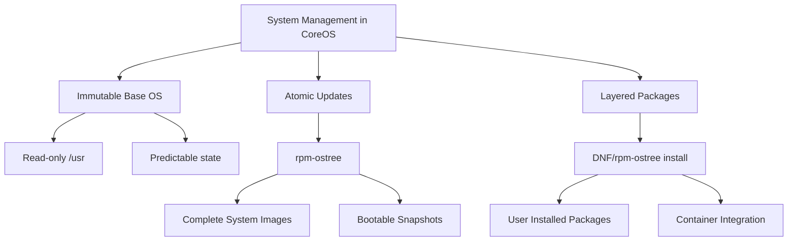

# Managing Packages in Fedora CoreOS - A Comprehensive DNF and rpm-ostree Guide

Fedora CoreOS (FCOS) represents a paradigm shift in operating system design, focusing on minimal, immutable infrastructure optimized for running containerized workloads. Unlike traditional Linux distributions, CoreOS uses a unique approach to package management that combines the atomic updating capabilities of `rpm-ostree` with the familiar `DNF` package manager. This guide explores how to effectively manage packages in this container-focused environment while maintaining the stability and security benefits of an immutable OS design.

## Understanding the CoreOS Package Management Philosophy

CoreOS adopts a fundamentally different approach to system updates and package management:



The key concepts that differentiate CoreOS include:

1. **Immutable Base System**: The core OS is treated as a unit, updated atomically
2. **Image-Based Updates**: System updates are complete filesystem trees, not individual packages
3. **Package Layering**: Additional packages can be "layered" on top of the base image
4. **Container Focus**: Most applications should run as containers, not directly on the host

## Initial CoreOS Setup

Before diving into package management, let's ensure your CoreOS system is properly set up:

### Checking System Status

```bash
# View current deployment status
rpm-ostree status

# Example output:
# State: idle
# AutomaticUpdates: disabled
# Deployments:
# ● fedora:fedora/x86_64/coreos/stable
#                Version: 35.20220116.3.0
#                 Commit: 9f12...
#                OSName: fedora
```

### Enabling Container Tools

CoreOS is designed primarily to run containers. Ensure container tools are enabled:

```bash
# Enable and start Podman
systemctl enable --now podman
```

### Configuring Repository Sources

While CoreOS updates primarily come through `rpm-ostree`, you can configure additional repositories for layered packages:

```bash
# Create a custom repository configuration
sudo mkdir -p /etc/yum.repos.d/
sudo tee /etc/yum.repos.d/custom.repo > /dev/null << EOF
[fedora]
name=Fedora \$releasever - \$basearch
baseurl=https://mirrors.fedoraproject.org/metalink?repo=fedora-\$releasever&arch=\$basearch
enabled=1
gpgcheck=1
gpgkey=file:///etc/pki/rpm-gpg/RPM-GPG-KEY-fedora-\$releasever-\$basearch

[updates]
name=Fedora \$releasever - \$basearch - Updates
baseurl=https://mirrors.fedoraproject.org/metalink?repo=updates-released-f\$releasever&arch=\$basearch
enabled=1
gpgcheck=1
gpgkey=file:///etc/pki/rpm-gpg/RPM-GPG-KEY-fedora-\$releasever-\$basearch
EOF
```

## Basic System Update Operations

### Checking for Updates

```bash
# Check for available updates without applying them
rpm-ostree upgrade --check
```

### Applying System Updates

```bash
# Update the system
rpm-ostree upgrade

# After updating, reboot to apply changes
systemctl reboot
```

### Rebasing to a New Version

When you want to move to a newer CoreOS release:

```bash
# Rebase to a specific Fedora version
rpm-ostree rebase fedora:35

# Or follow a specific stream
rpm-ostree rebase fedora/stable/x86_64/coreos
```

## Managing Layered Packages

While CoreOS discourages extensive host package installation, you can layer packages when needed:

### Installing Packages

```bash
# Install a single package
rpm-ostree install htop

# Install multiple packages
rpm-ostree install vim tmux git

# After installation, reboot to apply changes
systemctl reboot
```

### Removing Packages

```bash
# Remove a layered package
rpm-ostree uninstall htop

# Remove multiple packages
rpm-ostree uninstall vim tmux

# After removal, reboot to apply changes
systemctl reboot
```

### Searching for Packages

```bash
# Search for available packages
rpm-ostree search httpd
```

### Listing Installed Packages

```bash
# List all layered packages
rpm-ostree status --json | jq '.deployments[0].layered_packages'

# List all installed packages (base + layered)
rpm-ostree db list
```

## Advanced Configuration and Maintenance

### DNF Configuration Options

You can customize DNF behavior by creating or modifying `/etc/dnf/dnf.conf`:

```bash
# Create a custom DNF configuration
sudo tee /etc/dnf/dnf.conf > /dev/null << EOF
[main]
gpgcheck=1
installonly_limit=3
clean_requirements_on_remove=true
best=True
skip_if_unavailable=True
fastestmirror=True
max_parallel_downloads=10
deltarpm=True
EOF
```

### Working with Package Groups

CoreOS allows installing predefined groups of packages:

```bash
# List available groups
dnf group list

# Install a package group
rpm-ostree install @"Development Tools"

# After installation, reboot to apply changes
systemctl reboot
```

### System Maintenance Operations

Regular maintenance keeps your system running optimally:

```bash
# Remove old deployments (keeping only the current one)
rpm-ostree cleanup -p

# Remove all but the latest two deployments
rpm-ostree cleanup --rollback=2

# Clean DNF cache
dnf clean all

# Remove unused packages
rpm-ostree cleanup -m
```

### System Rollback

One of the key benefits of CoreOS is easy rollback to previous states:

```bash
# List available deployments
rpm-ostree status

# Rollback to previous deployment
rpm-ostree rollback

# Reboot to apply rollback
systemctl reboot

# Pin current deployment (prevent it from being garbage collected)
rpm-ostree pin
```

## Integrating with Container Workflows

CoreOS is designed primarily as a container host platform:

### Container Base Management

```bash
# Pull container images
podman pull registry.fedoraproject.org/fedora:latest

# Run a container with host integration
podman run -d --name web_server -p 80:80 nginx

# Build custom images
podman build -t custom_app:1.0 .
```

### System Containers

For services that need deeper system integration:

```bash
# Install system container packages
rpm-ostree install podman-compose

# Create a system container definition
mkdir -p ~/.config/containers/systemd/
cat > ~/.config/containers/systemd/web.container << EOF
[Unit]
Description=Web Server Container
After=network-online.target
Wants=network-online.target

[Container]
Image=docker.io/nginx:latest
PublishPort=8080:80
Volume=/var/www/html:/usr/share/nginx/html:Z

[Service]
Restart=always

[Install]
WantedBy=default.target
EOF

# Enable and start the container
systemctl --user daemon-reload
systemctl --user enable --now container-web.service
```

## Troubleshooting Common Issues

### Failed Updates

If updates fail to apply:

```bash
# Check system status
rpm-ostree status

# Clear cached data
rpm-ostree cleanup -b

# Force refresh metadata
rpm-ostree refresh-md -f
```

### Package Conflicts

When facing package installation conflicts:

```bash
# View transaction problems
rpm-ostree ex history

# Reset to last working state
rpm-ostree rollback

# Force package installation (use with caution)
rpm-ostree install --allow-inactive package_name
```

### Logging and Debugging

Viewing logs can help diagnose issues:

```bash
# View system logs
journalctl -u rpm-ostreed

# Enable verbose logging
rpm-ostree --verbose status

# Export transaction history
rpm-ostree ex history > history.txt
```

### System Health Checks

Regular health checks help maintain system integrity:

```bash
# Check system status
rpm-ostree status

# View service status
systemctl status rpm-ostreed

# Monitor system resources
top
```

## Best Practices for CoreOS Package Management

### Performance Optimization

1. **Use delta RPMs**: Enable deltarpm in DNF configuration to reduce download sizes
2. **Configure appropriate mirror servers**: Use geographically close mirrors
3. **Implement caching strategies**: Consider using a local proxy cache for multiple nodes

### Security Considerations

1. **Always verify package signatures**: Never disable gpgcheck
2. **Keep system updated regularly**: Schedule regular maintenance windows
3. **Use trusted repositories only**: Avoid third-party repos when possible

### Maintenance Schedule

1. **Plan regular update windows**: Schedule updates during low-usage periods
2. **Test updates in non-production first**: Validate changes before production deployment
3. **Maintain backup deployments**: Always keep at least one known-good deployment

## Conclusion

Fedora CoreOS provides a robust, secure platform for container workloads by fundamentally rethinking package management. The combination of `rpm-ostree` for atomic system updates and DNF for package layering offers both stability and flexibility. By following the practices outlined in this guide, you can effectively manage your CoreOS systems while maintaining the security and reliability benefits of an immutable infrastructure approach.

Remember that CoreOS is designed with containers in mind—the best practice is to run most applications as containers rather than installing packages directly on the host. This containerized approach enhances security, simplifies updates, and improves resource utilization across your infrastructure.

## Resources

- [Fedora CoreOS Documentation](https://docs.fedoraproject.org/en-US/fedora-coreos/)
- [rpm-ostree Documentation](https://coreos.github.io/rpm-ostree/)
- [DNF Documentation](https://dnf.readthedocs.io/)
- [Podman Documentation](https://podman.io/docs/)
- [Fedora CoreOS Update Streams](https://docs.fedoraproject.org/en-US/fedora-coreos/update-streams/)
