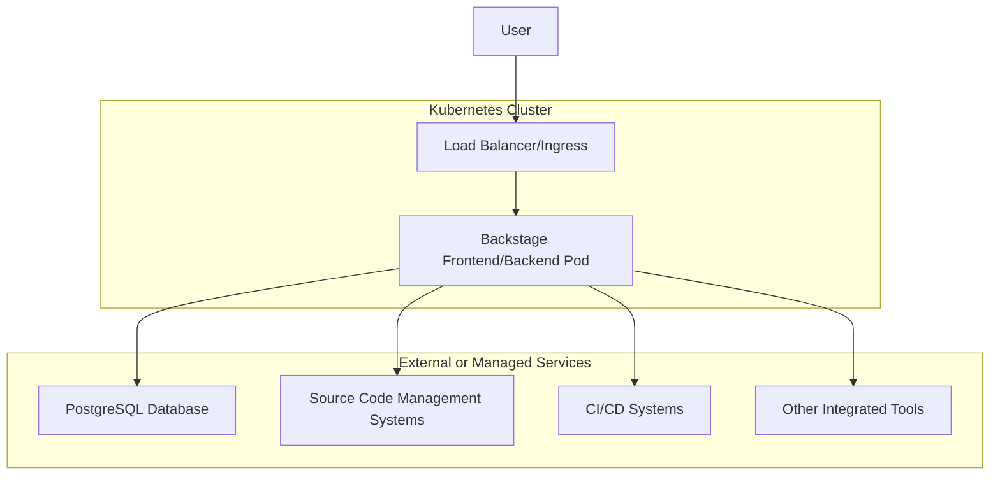

# Deploying Backstage on Kubernetes - A Comprehensive Guide

Backstage, the open-source developer portal platform created by Spotify, has become an essential tool for organizations looking to streamline their developer experience. While getting started with Backstage locally is straightforward, deploying it reliably in a production environment requires careful consideration of infrastructure, scalability, and security concerns. This guide provides a comprehensive approach to deploying Backstage on Kubernetes, complete with infrastructure as code using Terraform.

## Understanding the Backstage Architecture for Kubernetes

Before diving into the deployment process, it's important to understand the components that make up a production Backstage deployment:



A typical Backstage deployment consists of:

1. **Backstage Application**: A Node.js application that includes both frontend and backend components
2. **PostgreSQL Database**: For storing catalog entities, plugin state, and other persistent data
3. **Ingress/Load Balancer**: To route traffic to the Backstage service
4. **Integration Points**: Connections to SCM systems, identity providers, and other tools

## Prerequisites

Before you begin, ensure you have the following:

- Kubernetes cluster (this guide uses examples for AWS EKS, but can be adapted)
- kubectl configured to access your cluster
- Docker for building container images
- Terraform (≥ v1.0.0) for infrastructure provisioning
- PostgreSQL database (or credentials to create one)
- Basic understanding of Kubernetes concepts
- A working Backstage application (configured and tested locally)

## Building a Production-Ready Backstage Docker Image

The first step is creating a Docker image that packages your Backstage application. While Backstage provides a default Dockerfile in the `packages/backend` directory, there are several optimizations to consider for a production environment.

### Enhanced Dockerfile for Production

```dockerfile
# Use Node 18 instead of 16
FROM node:18-bullseye-slim

# Install dependencies including those needed for plugins
RUN --mount=type=cache,target=/var/cache/apt,sharing=locked \
    --mount=type=cache,target=/var/lib/apt,sharing=locked \
    apt-get update && \
    apt-get install -y --no-install-recommends \
    python3 g++ build-essential libsqlite3-dev python3-pip git && \
    yarn config set python /usr/bin/python3

# Install TechDocs dependencies if you're using the TechDocs plugin
RUN pip3 install mkdocs-techdocs-core==1.1.7

# Use non-root user
USER node
WORKDIR /app
ENV NODE_ENV production

# Build arguments needed for configuration
ARG APP_HOST
ARG APP_PORT
ARG POSTGRES_HOST
ARG POSTGRES_PORT
ARG POSTGRES_USER
ARG POSTGRES_PASSWORD
ARG GITHUB_TOKEN

# Set environment variables
ENV APP_HOST=${APP_HOST}
ENV APP_PORT=${APP_PORT}
ENV POSTGRES_HOST=${POSTGRES_HOST}
ENV POSTGRES_PORT=${POSTGRES_PORT}
ENV POSTGRES_USER=${POSTGRES_USER}
ENV POSTGRES_PASSWORD=${POSTGRES_PASSWORD}
ENV GITHUB_TOKEN=${GITHUB_TOKEN}

# Copy package dependencies first for better caching
COPY --chown=node:node yarn.lock package.json packages/backend/dist/skeleton.tar.gz ./
RUN tar xzf skeleton.tar.gz && rm skeleton.tar.gz

# Install production dependencies
RUN --mount=type=cache,target=/home/node/.cache/yarn,sharing=locked,uid=1000,gid=1000 \
    yarn install --frozen-lockfile --production --network-timeout 300000

# Copy app bundle and config
COPY --chown=node:node packages/backend/dist/bundle.tar.gz app-config*.yaml ./
RUN tar xzf bundle.tar.gz && rm bundle.tar.gz

# Set explicit configuration to handle deployment nuances
ENV APP_CONFIG_app_baseUrl "http://${APP_HOST}"
ENV APP_CONFIG_backend_baseUrl "http://${APP_HOST}"
ENV APP_CONFIG_auth_environment "production"

# Increase Node.js memory limit if needed
ENV NODE_OPTIONS "--max-old-space-size=1536"

# Start Backstage with multiple config files
CMD ["node", "packages/backend", "--config", "app-config.yaml", "--config", "app-config.production.yaml"]
```

### Creating an Environment-Specific Configuration

For production environments, create a separate `app-config.production.yaml` file that includes settings specific to your production deployment:

```yaml
app:
  baseUrl: http://${APP_HOST}

backend:
  baseUrl: http://${APP_HOST}
  listen: ":${APP_PORT}"

  database:
    client: pg
    connection:
      host: ${POSTGRES_HOST}
      port: ${POSTGRES_PORT}
      user: ${POSTGRES_USER}
      password: ${POSTGRES_PASSWORD}
      database: backstage
      # SSL configuration if needed
      # ssl:
      #   ca:
      #     $file: /ca/server.crt

auth:
  environment: production
  # Provider configurations go here
```

### Building and Publishing the Docker Image

From your Backstage project root, run these commands to build and push the image:

```bash
# Build the necessary artifacts first
yarn install
yarn tsc
yarn build:backend

# Build the Docker image
docker build . -f packages/backend/Dockerfile \
  --tag backstage:latest \
  --build-arg APP_HOST=backstage.example.com \
  --build-arg APP_PORT=7007

# Push to your registry (example for AWS ECR)
aws ecr get-login-password --region us-east-1 | docker login --username AWS --password-stdin YOUR-AWS-ACCOUNT.dkr.ecr.us-east-1.amazonaws.com
docker tag backstage:latest YOUR-AWS-ACCOUNT.dkr.ecr.us-east-1.amazonaws.com/backstage:latest
docker push YOUR-AWS-ACCOUNT.dkr.ecr.us-east-1.amazonaws.com/backstage:latest
```

## Deploying Backstage with Terraform

Terraform offers a powerful way to provision and manage your Kubernetes resources. The following provides a complete setup for deploying Backstage on Kubernetes with AWS integration.

### Setting Up Provider Configuration

Create a file called `providers.tf`:

```terraform
provider "aws" {
  region = "us-east-1"
}

provider "kubernetes" {
  host                   = var.EKS_ENDPOINT_URL
  cluster_ca_certificate = base64decode(var.AWS_EKS_CA_DATA)
  exec {
    api_version = "client.authentication.k8s.io/v1beta1"
    args        = ["eks", "get-token", "--cluster-name", var.cluster_name]
    command     = "aws"
  }
}

# Create namespace for backstage
resource "kubernetes_namespace" "backstage" {
  metadata {
    name = "backstage"
  }
}
```

### Setting Up Secrets Management

Create a file called `secrets.tf`:

```terraform
# Create Kubernetes secrets for Backstage
resource "kubernetes_secret" "backstage_secrets" {
  metadata {
    name      = "backstage-secrets"
    namespace = "backstage"
  }

  data = {
    POSTGRES_HOST     = aws_rds_cluster.aurora_postgres.endpoint
    POSTGRES_PORT     = aws_rds_cluster.aurora_postgres.port
    POSTGRES_USER     = aws_rds_cluster.aurora_postgres.master_username
    POSTGRES_PASSWORD = aws_rds_cluster.aurora_postgres.master_password
    GITHUB_TOKEN      = var.GITHUB_TOKEN
    # Add other secrets as needed
  }
}
```

### Creating the Database

Create a file called `database.tf`:

```terraform
# Create a subnet group for the Aurora PostgreSQL database
resource "aws_db_subnet_group" "aurora_postgres_subnet_group" {
  name       = "aurora-postgres-subnet-group"
  subnet_ids = var.subnet_ids

  tags = {
    Name = "Aurora PostgreSQL Subnet Group"
  }
}

# Create a security group for database access
resource "aws_security_group" "aurora_postgres_sg" {
  name        = "aurora-postgres-sg"
  description = "Allow inbound traffic from Kubernetes pods to PostgreSQL DB"
  vpc_id      = var.vpc_id

  ingress {
    from_port   = 5432
    to_port     = 5432
    protocol    = "tcp"
    cidr_blocks = ["10.0.0.0/16"] # Update with your cluster's CIDR
  }

  egress {
    from_port   = 0
    to_port     = 0
    protocol    = "-1"
    cidr_blocks = ["0.0.0.0/0"]
  }
}

# Generate a secure password
resource "random_password" "master" {
  length           = 16
  special          = true
  override_special = "_!%^"
}

# Store the password securely in AWS Secrets Manager
resource "aws_secretsmanager_secret" "password" {
  name = "backstage-postgres-password"
}

resource "aws_secretsmanager_secret_version" "password" {
  secret_id     = aws_secretsmanager_secret.password.id
  secret_string = random_password.master.result
}

# Retrieve the password for use in other resources
data "aws_secretsmanager_secret_version" "password" {
  secret_id = aws_secretsmanager_secret.password.id
  depends_on = [
    aws_secretsmanager_secret_version.password
  ]
}

# Create the Aurora PostgreSQL cluster
resource "aws_rds_cluster" "aurora_postgres" {
  cluster_identifier      = "backstage-aurora-postgres"
  engine                  = "aurora-postgresql"
  engine_version          = "13.7"
  db_subnet_group_name    = aws_db_subnet_group.aurora_postgres_subnet_group.name
  vpc_security_group_ids  = [aws_security_group.aurora_postgres_sg.id]
  database_name           = "backstage"
  master_username         = "backstage"
  master_password         = data.aws_secretsmanager_secret_version.password.secret_string
  backup_retention_period = 7
  preferred_backup_window = "07:00-09:00"
  skip_final_snapshot     = true

  tags = {
    Application = "Backstage"
  }
}

# Create a database instance in the cluster
resource "aws_rds_cluster_instance" "aurora_postgres_instance" {
  identifier         = "backstage-aurora-postgres-instance"
  cluster_identifier = aws_rds_cluster.aurora_postgres.id
  engine             = "aurora-postgresql"
  instance_class     = "db.r5.large"
}
```

### Creating the Kubernetes Deployment

Create a file called `kubernetes.tf`:

```terraform
# Create a Kubernetes service for Backstage
resource "kubernetes_service_v1" "backstage" {
  metadata {
    name      = "backstage"
    namespace = "backstage"
    labels = {
      app                       = "backstage"
      "backstage.io/kubernetes-id" = "backstage-app"
    }
  }

  spec {
    selector = {
      app                       = "backstage"
      "backstage.io/kubernetes-id" = "backstage-app"
    }

    port {
      port        = var.APP_PORT
      target_port = var.APP_PORT
    }

    type = "NodePort"
  }
}

# Create a Kubernetes deployment for Backstage
resource "kubernetes_deployment" "backstage" {
  metadata {
    name      = "backstage"
    namespace = "backstage"
    labels = {
      app                       = "backstage"
      "backstage.io/kubernetes-id" = "backstage-app"
    }
  }

  spec {
    replicas = 2

    selector {
      match_labels = {
        app                       = "backstage"
        "backstage.io/kubernetes-id" = "backstage-app"
      }
    }

    template {
      metadata {
        labels = {
          app                       = "backstage"
          "backstage.io/kubernetes-id" = "backstage-app"
        }
      }

      spec {
        container {
          image             = "${var.BACKSTAGE_ECR_REPO}:${var.IMAGE_TAG}"
          image_pull_policy = "Always"
          name              = "backstage"

          port {
            container_port = var.APP_PORT
          }

          # Set secrets as environment variables
          env_from {
            secret_ref {
              name = kubernetes_secret.backstage_secrets.metadata[0].name
            }
          }

          # Set non-sensitive environment variables
          env {
            name  = "APP_HOST"
            value = var.APP_HOST
          }

          env {
            name  = "APP_PORT"
            value = var.APP_PORT
          }

          resources {
            limits = {
              cpu    = "2"
              memory = "4Gi"
            }
            requests = {
              cpu    = "1"
              memory = "2Gi"
            }
          }

          liveness_probe {
            http_get {
              path = "/healthcheck"
              port = var.APP_PORT
            }
            initial_delay_seconds = 60
            timeout_seconds       = 5
            period_seconds        = 10
          }

          readiness_probe {
            http_get {
              path = "/healthcheck"
              port = var.APP_PORT
            }
            initial_delay_seconds = 30
            timeout_seconds       = 5
            period_seconds        = 10
          }
        }
      }
    }
  }
}

# Create an ingress for external access
resource "kubernetes_ingress_v1" "backstage_ingress" {
  metadata {
    name      = "backstage-ingress"
    namespace = "backstage"
    annotations = {
      "kubernetes.io/ingress.class"             = "alb"
      "alb.ingress.kubernetes.io/scheme"        = "internet-facing"
      "alb.ingress.kubernetes.io/target-type"   = "ip"
      "alb.ingress.kubernetes.io/listen-ports"  = "[{\"HTTP\": 80}, {\"HTTPS\": 443}]"
      "alb.ingress.kubernetes.io/ssl-redirect"  = "443"
    }
  }

  spec {
    rule {
      host = var.APP_HOST
      http {
        path {
          path      = "/"
          path_type = "Prefix"
          backend {
            service {
              name = kubernetes_service_v1.backstage.metadata[0].name
              port {
                number = kubernetes_service_v1.backstage.spec[0].port[0].port
              }
            }
          }
        }
      }
    }

    # Add TLS configuration if you have certificates
    # tls {
    #   hosts       = [var.APP_HOST]
    #   secret_name = "backstage-tls-secret"
    # }
  }
}
```

### Setting Up IAM Roles (for AWS)

Create a file called `iam.tf`:

```terraform
# Create IAM role for the AWS Load Balancer Controller
resource "aws_iam_role" "aws_load_balancer_controller" {
  name = "aws-load-balancer-controller"

  assume_role_policy = jsonencode({
    Version = "2012-10-17"
    Statement = [
      {
        Action = "sts:AssumeRole"
        Effect = "Allow"
        Principal = {
          Service = "eks.amazonaws.com"
        }
      }
    ]
  })
}

# Attach required policies to the role
resource "aws_iam_role_policy_attachment" "aws_load_balancer_controller_policy_attachment" {
  policy_arn = "arn:aws:iam::aws:policy/AmazonEKSClusterPolicy"
  role       = aws_iam_role.aws_load_balancer_controller.name
}

resource "aws_iam_role_policy_attachment" "aws_load_balancer_controller_vpc_policy_attachment" {
  policy_arn = "arn:aws:iam::aws:policy/AmazonEKSVPCResourceController"
  role       = aws_iam_role.aws_load_balancer_controller.name
}

# Add the AWS Load Balancer Controller policy
resource "aws_iam_role_policy" "aws_load_balancer_controller_additional_policy" {
  name = "aws-load-balancer-controller-additional"
  role = aws_iam_role.aws_load_balancer_controller.id

  # Load policy from external file
  policy = file("${path.module}/policies/load-balancer-controller-policy.json")
}
```

### Defining Variables

Create a file called `variables.tf`:

```terraform
variable "EKS_ENDPOINT_URL" {
  description = "The endpoint URL of the EKS cluster"
  type        = string
}

variable "AWS_EKS_CA_DATA" {
  description = "The CA certificate data for the EKS cluster"
  type        = string
}

variable "cluster_name" {
  description = "The name of the EKS cluster"
  type        = string
}

variable "APP_HOST" {
  description = "The hostname where Backstage will be available"
  type        = string
  default     = "backstage.example.com"
}

variable "APP_PORT" {
  description = "The port Backstage will listen on"
  type        = string
  default     = "7007"
}

variable "GITHUB_TOKEN" {
  description = "GitHub token for Backstage"
  type        = string
  sensitive   = true
}

variable "BACKSTAGE_ECR_REPO" {
  description = "The ECR repository URL for Backstage"
  type        = string
}

variable "IMAGE_TAG" {
  description = "The tag of the Backstage image to deploy"
  type        = string
  default     = "latest"
}

variable "subnet_ids" {
  description = "List of subnet IDs for the database"
  type        = list(string)
}

variable "vpc_id" {
  description = "The ID of the VPC"
  type        = string
}
```

### Create Outputs

Create a file called `outputs.tf`:

```terraform
output "postgres_endpoint" {
  value       = aws_rds_cluster.aurora_postgres.endpoint
  description = "The endpoint of the PostgreSQL database"
  sensitive   = true
}

output "backstage_service_name" {
  value       = kubernetes_service_v1.backstage.metadata[0].name
  description = "The name of the Backstage Kubernetes service"
}

output "ingress_hostname" {
  value       = var.APP_HOST
  description = "The hostname where Backstage is available"
}
```

## Deploying the Infrastructure

With all the Terraform files in place, you can now deploy your infrastructure:

```bash
# Initialize Terraform
terraform init

# Validate the configuration
terraform validate

# Plan the deployment (with variables)
terraform plan -var-file=production.tfvars

# Apply the deployment
terraform apply -var-file=production.tfvars
```

## Setting Up Continuous Deployment

To keep your Backstage instance up-to-date, consider setting up a CI/CD pipeline. Here's an example GitHub Actions workflow:

```yaml
name: Build and Deploy Backstage

on:
  push:
    branches: [main]
  pull_request:
    branches: [main]

jobs:
  build:
    runs-on: ubuntu-latest

    steps:
      - uses: actions/checkout@v3

      - name: Use Node.js
        uses: actions/setup-node@v3
        with:
          node-version: "18.x"

      - name: Install dependencies
        run: yarn install

      - name: Build TypeScript
        run: yarn tsc

      - name: Build backend
        run: yarn build:backend

      - name: Configure AWS credentials
        uses: aws-actions/configure-aws-credentials@v1
        with:
          aws-access-key-id: ${{ secrets.AWS_ACCESS_KEY_ID }}
          aws-secret-access-key: ${{ secrets.AWS_SECRET_ACCESS_KEY }}
          aws-region: us-east-1

      - name: Login to Amazon ECR
        id: login-ecr
        uses: aws-actions/amazon-ecr-login@v1

      - name: Set commit SHA
        id: vars
        run: echo "sha_short=$(git rev-parse --short HEAD)" >> $GITHUB_OUTPUT

      - name: Build and push Docker image
        uses: docker/build-push-action@v4
        with:
          context: .
          file: ./packages/backend/Dockerfile
          push: true
          tags: ${{ steps.login-ecr.outputs.registry }}/backstage:latest,${{ steps.login-ecr.outputs.registry }}/backstage:${{ steps.vars.outputs.sha_short }}
          build-args: |
            APP_HOST=${{ secrets.APP_HOST }}
            APP_PORT=${{ secrets.APP_PORT }}

      - name: Setup Terraform
        uses: hashicorp/setup-terraform@v2

      - name: Terraform Apply
        working-directory: ./infrastructure
        run: |
          terraform init
          terraform apply -auto-approve \
            -var="IMAGE_TAG=${{ steps.vars.outputs.sha_short }}" \
            -var="GITHUB_TOKEN=${{ secrets.BACKSTAGE_GITHUB_TOKEN }}" \
            -var-file=production.tfvars
```

## Production Best Practices

To ensure your Backstage deployment runs smoothly in production, consider these best practices:

### 1. High Availability Configuration

- Deploy multiple replicas in the Kubernetes deployment
- Use pod disruption budgets to ensure availability during cluster events
- Configure proper resource requests and limits

### 2. Security

- Use network policies to control pod-to-pod communication
- Enable mTLS between services
- Store sensitive data in Kubernetes Secrets or AWS Secrets Manager
- Implement proper RBAC policies

```terraform
resource "kubernetes_network_policy" "backstage_network_policy" {
  metadata {
    name      = "backstage-network-policy"
    namespace = "backstage"
  }

  spec {
    pod_selector {
      match_labels = {
        app = "backstage"
      }
    }

    ingress {
      from {
        namespace_selector {
          match_labels = {
            name = "ingress-nginx"
          }
        }
      }
      ports {
        port     = var.APP_PORT
        protocol = "TCP"
      }
    }

    egress {
      to {
        ip_block {
          cidr = "0.0.0.0/0"
        }
      }
    }

    policy_types = ["Ingress", "Egress"]
  }
}
```

### 3. Monitoring and Logging

- Implement Prometheus metrics collection
- Set up logging with ELK stack or CloudWatch
- Create dashboards for key metrics

### 4. Scaling

- Consider setting up horizontal pod autoscaling
- Implement database connection pooling
- Optimize memory settings for Node.js

```terraform
resource "kubernetes_horizontal_pod_autoscaler" "backstage_hpa" {
  metadata {
    name      = "backstage-hpa"
    namespace = "backstage"
  }

  spec {
    scale_target_ref {
      kind = "Deployment"
      name = kubernetes_deployment.backstage.metadata[0].name
    }
    min_replicas = 2
    max_replicas = 10

    metric {
      type = "Resource"
      resource {
        name = "cpu"
        target {
          type                = "Utilization"
          average_utilization = 70
        }
      }
    }
  }
}
```

### 5. Backup and Disaster Recovery

- Set up regular database backups
- Create a disaster recovery plan
- Test restore procedures

## Troubleshooting Common Issues

### Database Connection Issues

If Backstage fails to connect to the database:

1. Verify that the security group allows traffic from the Kubernetes cluster
2. Check that the database secrets are correctly mounted as environment variables
3. Ensure the database name matches in both the connection string and the actual database

### Image Pull Failures

If pods are failing with `ImagePullBackOff` errors:

1. Check that your ECR repository is accessible from the cluster
2. Verify that the image tag exists in your repository
3. Check for any authentication issues with your container registry

### TLS/SSL Issues

If you're experiencing TLS certificate errors:

1. Ensure your certificates are valid and not expired
2. Check that certificates are correctly mounted in the pod
3. Verify hostname matching in certificate SANs

## Conclusion

Deploying Backstage on Kubernetes provides a scalable, resilient, and maintainable solution for your developer portal needs. By using infrastructure as code with Terraform, you can ensure consistent deployments and easily manage your infrastructure over time.

While this guide focused on AWS EKS, the concepts apply to any Kubernetes environment. As your Backstage instance grows in usage and complexity, you can extend this foundation with additional plugins, integrations, and optimizations to create a comprehensive developer experience platform tailored to your organization's needs.

## Resources

- [Official Backstage Documentation](https://backstage.io/docs)
- [Backstage GitHub Repository](https://github.com/backstage/backstage)
- [Terraform Documentation](https://www.terraform.io/docs)
- [Kubernetes Documentation](https://kubernetes.io/docs/home/)
- [AWS EKS Documentation](https://docs.aws.amazon.com/eks/latest/userguide/getting-started.html)
- [PostgreSQL Documentation](https://www.postgresql.org/docs/)
