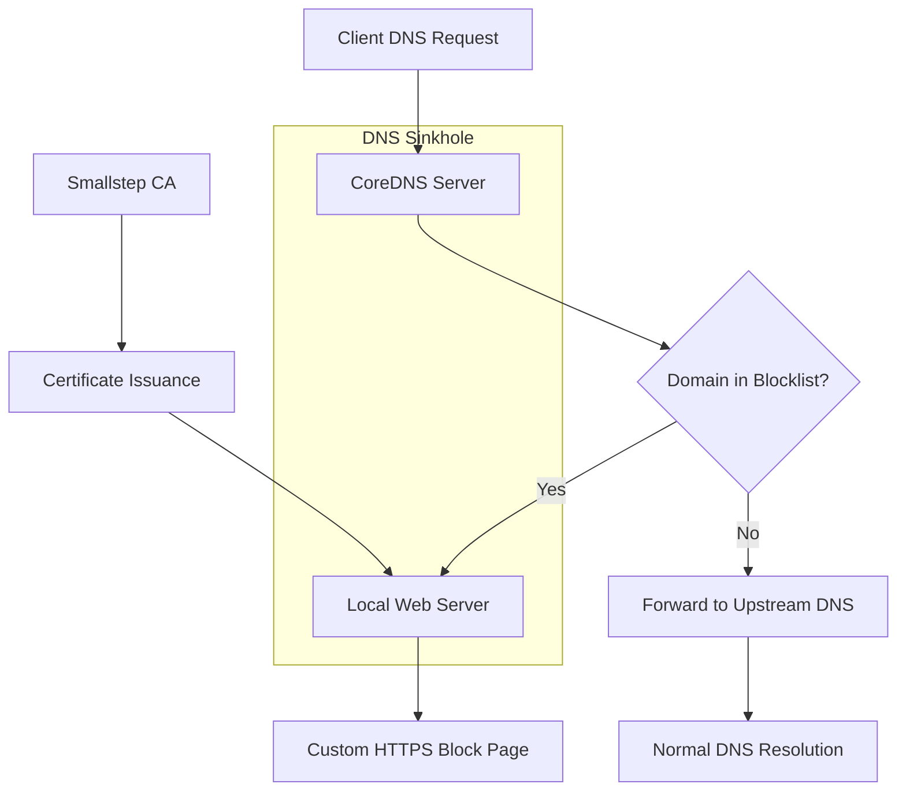

# Building a Secure DNS Sinkhole with CoreDNS and Smallstep Certificates

A DNS sinkhole is a server that redirects requests for specific domain names to a controlled IP address, often used for blocking malicious websites or implementing content filtering. This guide demonstrates how to build a secure DNS sinkhole using CoreDNS, a flexible and extensible DNS server, and Smallstep certificates, enabling HTTPS for your custom block pages.

## Understanding the Architecture



## Implementation Options

There are several approaches to implementing web filtering with custom block pages:

1. **DNS-based filtering** (CoreDNS, Pi-hole)
2. **Proxy-based filtering** (E2Guardian, Squid with SquidGuard)
3. **Gateway-level filtering** (PfSense, OPNsense)
4. **Hybrid solutions** (DNS + Proxy)

This guide focuses primarily on the DNS-based approach using CoreDNS with Smallstep certificates, but we'll also cover alternative approaches.

## Implementation Steps with CoreDNS and Smallstep

### 1. Installing CoreDNS

First, install CoreDNS on your server. The installation process varies depending on your operating system. Here's an example for Debian/Ubuntu:

```bash
sudo apt update
sudo apt install coredns
```

Alternatively, you can download the binary directly:

```bash
wget https://github.com/coredns/coredns/releases/download/v1.10.1/coredns_1.10.1_linux_amd64.tgz
tar -xzf coredns_1.10.1_linux_amd64.tgz
sudo mv coredns /usr/local/bin/
```

### 2. Configuring CoreDNS

Create or modify the CoreDNS configuration file (`/etc/coredns/Corefile`) to block specific domains and serve a custom block page:
