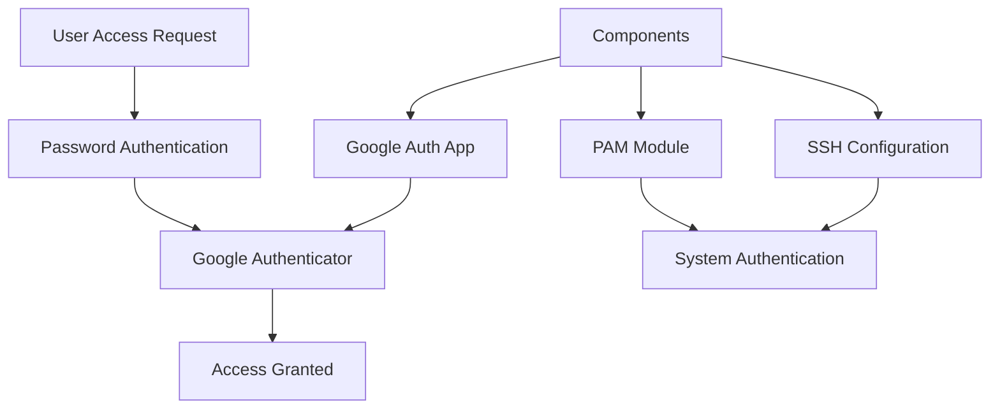

# Setting Up Google Authenticator for SSH and Sudo Access on Linux

Two-factor authentication (2FA) adds an essential layer of security to your system access. This guide demonstrates how to implement Google Authenticator for both SSH and sudo access on Linux systems, providing robust protection against unauthorized access attempts.

## Understanding the Components



## Prerequisites

Before starting the implementation, ensure you have:

1. Root or sudo access to the system
2. Package manager access (dnf, apt, etc.)
3. Google Authenticator app on your mobile device

## Installation Steps

### 1. Installing Required Packages

```bash
# For Rocky Linux/CentOS/RHEL
sudo dnf install google-authenticator qrencode -y

# For Ubuntu/Debian
sudo apt install libpam-google-authenticator qrencode -y
```

### 2. Configuring PAM for SSH

Create a backup of your PAM SSH configuration:

```bash
# Backup original configuration
sudo cp /etc/pam.d/sshd /etc/pam.d/sshd.bak

# Configure PAM for SSH
sudo tee /etc/pam.d/sshd > /dev/null << 'EOF'
#%PAM-1.0
auth required pam_google_authenticator.so nullok
auth include system-auth
account include system-auth
password include system-auth
session include system-auth
EOF
```

### 3. Configuring PAM for Sudo

Create a backup and configure sudo PAM:

```bash
# Backup original configuration
sudo cp /etc/pam.d/sudo /etc/pam.d/sudo.bak

# Configure PAM for sudo
sudo tee /etc/pam.d/sudo > /dev/null << 'EOF'
#%PAM-1.0
auth required pam_google_authenticator.so nullok
auth include system-auth
account include system-auth
password include system-auth
session include system-auth
EOF
```

### 4. Configuring SSH Daemon

Modify the SSH daemon configuration:

```bash
# Backup sshd_config
sudo cp /etc/ssh/sshd_config /etc/ssh/sshd_config.bak

# Update SSH configuration
sudo sed -i 's/^ChallengeResponseAuthentication no/ChallengeResponseAuthentication yes/' /etc/ssh/sshd_config
sudo sed -i 's/^UsePAM no/UsePAM yes/' /etc/ssh/sshd_config

# Restart SSH daemon
sudo systemctl restart sshd
```

### 5. Setting Up Google Authenticator

Run the configuration utility:

```bash
google-authenticator
```

Answer the configuration questions as follows:

```plaintext
Do you want authentication tokens to be time-based? y
Do you want to update your "~/.google_authenticator" file? y
Do you want to disallow multiple uses of the same authentication token? y
By default, a new token is generated every 30 seconds by the mobile app. Do you want to do so? y
Do you want to enable rate-limiting? y
```

## Testing the Configuration

### 1. Testing SSH Access

Open a new terminal and attempt to SSH into your server:

```bash
ssh username@your-server
Password: [Enter your password]
Verification code: [Enter code from Google Authenticator app]
```

### 2. Testing Sudo Access

Try using sudo with your new configuration:

```bash
sudo ls
[sudo] password for username: [Enter your password]
Verification code: [Enter code from Google Authenticator app]
```

## Troubleshooting Common Issues

### Issue 1: Authentication Fails

If authentication fails, check the PAM configuration:

```bash
# Check PAM logs
sudo tail -f /var/log/auth.log

# Verify PAM module is loaded
ldd /usr/lib64/security/pam_google_authenticator.so
```

### Issue 2: SSH Access Issues

If you can't access SSH after configuration:

```bash
# Access server console and check SSH status
sudo systemctl status sshd

# Check SSH configuration
sudo sshd -T | grep -E 'challengeresponseauthentication|usepam'
```

### Issue 3: Unknown Defaults Entry Error

If you see "unknown defaults entry 'auth_type'" error:

```bash
# Edit sudoers file safely
sudo visudo

# Comment out or remove the auth_type line if present
# Defaults    auth_type=auth
```

## Security Best Practices

### 1. Backup Recovery Codes

```bash
# Create a secure location for backup codes
sudo mkdir -p /root/.2fa-backups
sudo cp ~/.google_authenticator /root/.2fa-backups/$(whoami)-google-authenticator
sudo chmod 600 /root/.2fa-backups/$(whoami)-google-authenticator
```

### 2. Rate Limiting Configuration

Add rate limiting to prevent brute force attacks:

```bash
# Edit Google Authenticator configuration
sudo nano ~/.google_authenticator

# Add rate limiting parameters
RATE_LIMIT 3 30
DISALLOW_REUSE
```

### 3. Monitoring and Logging

Set up logging for authentication attempts:

```bash
# Configure rsyslog for authentication logging
sudo tee /etc/rsyslog.d/auth-logging.conf > /dev/null << 'EOF'
auth,authpriv.*                 /var/log/auth.log
EOF

# Restart rsyslog
sudo systemctl restart rsyslog
```

### 4. Session Management

Configure session timeouts:

```bash
# Add to /etc/profile.d/timeout.sh
sudo tee /etc/profile.d/timeout.sh > /dev/null << 'EOF'
TMOUT=900
readonly TMOUT
export TMOUT
EOF

# Make it executable
sudo chmod +x /etc/profile.d/timeout.sh
```

## Recovery Procedures

### 1. Creating Emergency Access

Set up emergency access for administrators:

```bash
# Create backup access configuration
sudo mkdir -p /root/.ssh/emergency
sudo ssh-keygen -t ed25519 -f /root/.ssh/emergency/recovery_key
sudo cat /root/.ssh/emergency/recovery_key.pub >> /root/.ssh/authorized_keys
```

### 2. Recovery Process

If 2FA fails, use recovery codes:

```bash
# View recovery codes
cat ~/.google_authenticator

# Reset Google Authenticator if needed
rm ~/.google_authenticator
google-authenticator
```

## Automation and Deployment

### 1. Automated Setup Script

Create a deployment script:

```bash
#!/bin/bash
# setup-2fa.sh

# Check if running as root
if [ "$EUID" -ne 0 ]; then
  echo "Please run as root"
  exit 1
fi

# Install required packages
dnf install -y google-authenticator qrencode

# Configure PAM
cp /etc/pam.d/sshd /etc/pam.d/sshd.bak
cp /etc/pam.d/sudo /etc/pam.d/sudo.bak

# Configure SSH
cp /etc/ssh/sshd_config /etc/ssh/sshd_config.bak
sed -i 's/^ChallengeResponseAuthentication no/ChallengeResponseAuthentication yes/' /etc/ssh/sshd_config
sed -i 's/^UsePAM no/UsePAM yes/' /etc/ssh/sshd_config

# Update PAM configurations
cat > /etc/pam.d/sshd << 'EOF'
#%PAM-1.0
auth required pam_google_authenticator.so nullok
auth include system-auth
account include system-auth
password include system-auth
session include system-auth
EOF

cat > /etc/pam.d/sudo << 'EOF'
#%PAM-1.0
auth required pam_google_authenticator.so nullok
auth include system-auth
account include system-auth
password include system-auth
session include system-auth
EOF

# Restart services
systemctl restart sshd

echo "2FA configuration complete. Run 'google-authenticator' for each user."
```

### 2. User Setup Script

Create a script for user setup:

```bash
#!/bin/bash
# user-2fa-setup.sh

# Generate Google Authenticator configuration
google-authenticator -t -d -f -r 3 -R 30 -w 3

# Create backup
sudo cp ~/.google_authenticator /root/.2fa-backups/$(whoami)-google-authenticator
sudo chmod 600 /root/.2fa-backups/$(whoami)-google-authenticator

echo "2FA setup complete for user $(whoami)"
```

## Conclusion

Implementing Google Authenticator 2FA provides a robust security layer for both SSH and sudo access. The configuration process requires careful attention to detail, but the enhanced security is worth the effort. Regular testing and maintenance of the 2FA system ensures continued protection of your infrastructure.

Remember to:

1. Keep backup codes in a secure location
2. Regularly update and maintain your 2FA configuration
3. Monitor authentication logs for unusual activity
4. Train users on proper 2FA usage and recovery procedures

## Resources

- [Google Authenticator PAM Module Documentation](https://github.com/google/google-authenticator-libpam)
- [PAM Documentation](http://www.linux-pam.org/Linux-PAM-html/)
- [SSH Security Best Practices](https://www.ssh.com/ssh/security/)
- [Linux PAM System Administrator's Guide](http://www.linux-pam.org/Linux-PAM-html/Linux-PAM_SAG.html)
