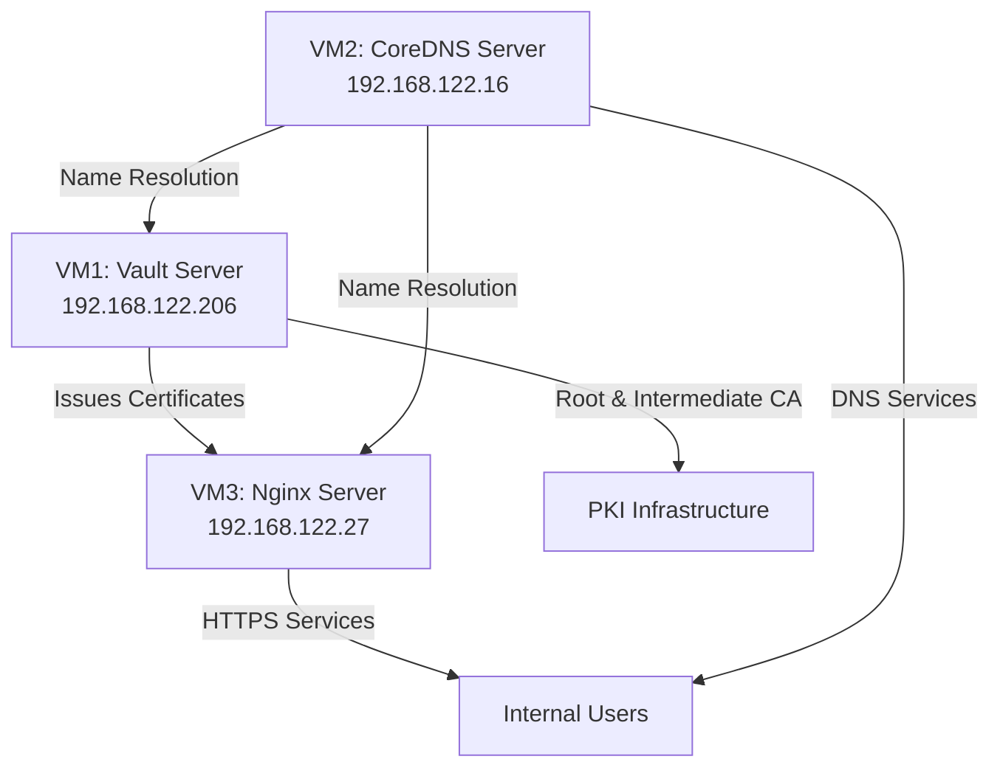

# Enterprise PKI with HashiCorp Vault and CoreDNS - Complete Setup Guide

Building a secure internal network requires proper certificate management and name resolution. HashiCorp Vault provides robust certificate authority capabilities, while CoreDNS offers flexible DNS management. This guide demonstrates how to implement a complete PKI solution across multiple servers, enabling secure internal HTTPS communications with proper certificate validation.

## Architecture Overview

Our setup consists of three virtual machines, each with a specific role:



- **VM1 (192.168.122.206)**: HashiCorp Vault server acting as Certificate Authority
- **VM2 (192.168.122.16)**: CoreDNS server providing internal DNS resolution
- **VM3 (192.168.122.27)**: Nginx web server with TLS/SSL enabled

## Prerequisites

Before beginning, ensure you have:

- Three virtual machines with the IPs listed above
- Basic Linux administration knowledge
- Network connectivity between all three servers
- Root or sudo access on all machines

## Step 1: Initialize and Configure HashiCorp Vault

First, let's install and configure Vault on the dedicated server.

### Installing Vault

```bash
# Download and install Vault
curl -fsSL https://apt.releases.hashicorp.com/gpg | sudo apt-key add -
sudo apt-add-repository "deb [arch=amd64] https://apt.releases.hashicorp.com $(lsb_release -cs) main"
sudo apt-get update && sudo apt-get install vault

# Verify the installation
vault --version
```

### Configure the Vault Server

Create a basic configuration file:

```bash
sudo mkdir /etc/vault
sudo nano /etc/vault/config.hcl
```

Add the following configuration:

```hcl
storage "file" {
  path = "/opt/vault/data"
}

listener "tcp" {
  address     = "0.0.0.0:8200"
  tls_disable = 1  # Enable TLS in production with proper certificates
}

api_addr = "http://192.168.122.206:8200"
cluster_addr = "https://192.168.122.206:8201"
ui = true
```

Prepare the storage directory and start Vault:

```bash
sudo mkdir -p /opt/vault/data
sudo chown -R vault:vault /opt/vault
sudo systemctl enable vault
sudo systemctl start vault
```

### Initialize and Unseal Vault

Initialize the Vault server:

```bash
export VAULT_ADDR='http://192.168.122.206:8200'
vault operator init
```

This will output five unseal keys and a root token. Store these securely as they are critical for accessing your Vault.

Sample output:
