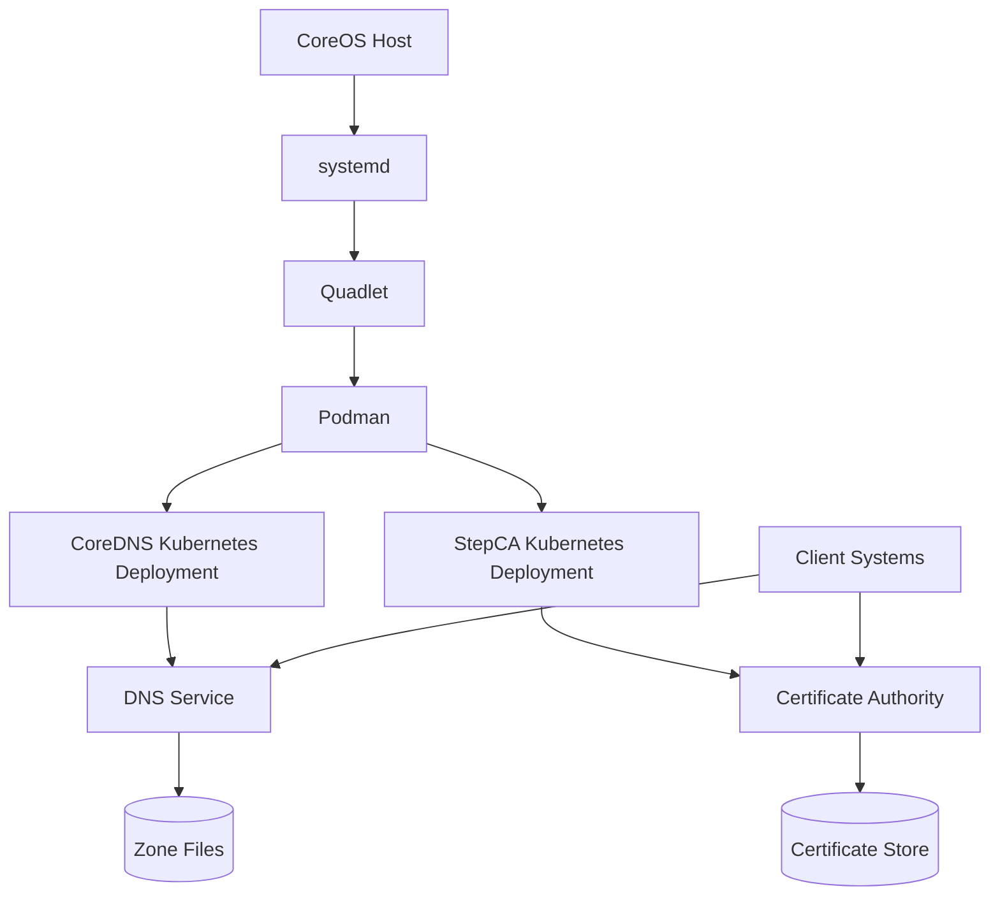

# Deploying CoreDNS and StepCA with Kubernetes Manifests Using Quadlet on CoreOS

Fedora CoreOS provides an excellent foundation for running containerized workloads, especially when combined with Podman and systemd. While Kubernetes is a popular choice for container orchestration, it can be complex to set up and manage. Quadlet offers a compelling alternative by allowing you to deploy Kubernetes-style manifests directly through systemd on CoreOS, combining the declarative power of Kubernetes manifests with the simplicity of systemd service management.

This guide demonstrates how to deploy two critical infrastructure components—CoreDNS for DNS management and StepCA for certificate authority services—using Kubernetes manifests orchestrated through Quadlet on Fedora CoreOS.

## Understanding the Architecture

Before diving into implementation, let's understand the overall architecture:



This architecture enables:

1. **Declarative Configuration**: Using Kubernetes manifests for service definition
2. **SystemD Integration**: Managing container deployments through systemd
3. **No Kubernetes Required**: Running Kubernetes-style resources without a full cluster
4. **Simplified Management**: Standard systemd commands for controlling services
5. **Domain Name Resolution**: Internal DNS with custom zones
6. **Certificate Infrastructure**: Self-hosted PKI for secure communications

## Prerequisites

Before beginning, ensure you have:

- Fedora CoreOS 35 or newer
- Root access to the system
- Basic understanding of systemd, Kubernetes manifests, and Podman
- The `kubectl` command-line tool installed

```bash
# Check CoreOS version
rpm-ostree status

# Verify kubectl availability or install it
which kubectl || rpm-ostree install kubectl

# Check Podman version (should be 4.0+)
podman --version
```

## Implementation Steps

### 1. Creating the Configuration Directory

First, let's create the directory where our Quadlet files will reside:

```bash
# Create the systemd directory for Quadlet files
sudo mkdir -p /etc/containers/systemd
```

### 2. Preparing StepCA Password

For StepCA, we need to generate a secure password and encode it for use in the Kubernetes Secret:

```bash
# Generate a secure random password
STEPCA_PASSWORD=$(openssl rand -base64 32)

# Base64 encode it for use in Kubernetes Secret
STEPCA_PASSWORD_BASE64=$(echo -n "$STEPCA_PASSWORD" | base64)

# Store the plain password securely for reference
echo "$STEPCA_PASSWORD" | sudo tee /etc/containers/stepca.password
sudo chmod 600 /etc/containers/stepca.password

# Output the encoded password for use in our manifest
echo "Encoded password for use in manifest: $STEPCA_PASSWORD_BASE64"
```

### 3. Creating the CoreDNS Deployment Quadlet

Now, let's create the Quadlet file for CoreDNS:

```bash
# Create the CoreDNS Quadlet file
sudo tee /etc/containers/systemd/dns-deployment.kube > /dev/null << 'EOF'
#
# CoreDNS Kubernetes Deployment via Quadlet
#
[Unit]
Description=CoreDNS Kubernetes Deployment
After=network-online.target
Wants=network-online.target

[Kube]
# Namespace for DNS services
Namespace=dns

# The manifest for CoreDNS
Yaml='''
apiVersion: v1
kind: Namespace
metadata:
  name: dns
---
apiVersion: v1
kind: ConfigMap
metadata:
  name: coredns-config
  namespace: dns
data:
  Corefile: |
    .:53 {
        forward . 8.8.8.8
        log
        errors
    }
    invinsense:53 {
        file /etc/coredns/invinsense.db
        log
        errors
    }
  invinsense.db: |
    $ORIGIN invinsense.
    @       3600 IN SOA  coredns.invinsense. admin.invinsense. (
            2023062001 ; serial
            7200       ; refresh
            3600       ; retry
            1209600    ; expire
            3600       ; minimum
    )
    @       3600 IN NS  coredns.invinsense.
    coredns   IN A     192.168.122.16
    ca        IN A     192.168.122.76
---
apiVersion: apps/v1
kind: Deployment
metadata:
  name: coredns
  namespace: dns
spec:
  replicas: 1
  selector:
    matchLabels:
      app: coredns
  template:
    metadata:
      labels:
        app: coredns
    spec:
      containers:
      - name: coredns
        image: docker.io/coredns/coredns:1.11.1
        args: ["-conf", "/etc/coredns/Corefile"]
        ports:
        - containerPort: 53
          name: dns
          protocol: UDP
        - containerPort: 53
          name: dns-tcp
          protocol: TCP
        volumeMounts:
        - name: config-volume
          mountPath: /etc/coredns
      volumes:
      - name: config-volume
        configMap:
          name: coredns-config
---
apiVersion: v1
kind: Service
metadata:
  name: coredns
  namespace: dns
spec:
  selector:
    app: coredns
  ports:
  - name: dns
    port: 53
    protocol: UDP
  - name: dns-tcp
    port: 53
    protocol: TCP
  type: LoadBalancer
'''

[Install]
WantedBy=default.target
EOF
```

### 4. Creating the StepCA Deployment Quadlet

Next, we'll create the Quadlet file for StepCA. Note that we need to substitute the actual base64-encoded password:

```bash
# Create the StepCA Quadlet file with password substitution
sudo tee /etc/containers/systemd/pki-deployment.kube > /dev/null << EOF
#
# StepCA Kubernetes Deployment via Quadlet
#
[Unit]
Description=StepCA Kubernetes Deployment
After=network-online.target
Wants=network-online.target

[Kube]
# Namespace for PKI services
Namespace=pki

# The manifest for StepCA
Yaml='''
apiVersion: v1
kind: Namespace
metadata:
  name: pki
---
apiVersion: v1
kind: Secret
metadata:
  name: stepca-secret
  namespace: pki
type: Opaque
data:
  password: ${STEPCA_PASSWORD_BASE64}
---
apiVersion: v1
kind: PersistentVolumeClaim
metadata:
  name: stepca-data
  namespace: pki
spec:
  accessModes:
    - ReadWriteOnce
  resources:
    requests:
      storage: 1Gi
---
apiVersion: apps/v1
kind: Deployment
metadata:
  name: stepca
  namespace: pki
spec:
  replicas: 1
  selector:
    matchLabels:
      app: stepca
  template:
    metadata:
      labels:
        app: stepca
    spec:
      containers:
      - name: stepca
        image: smallstep/step-ca:0.24.0
        ports:
        - containerPort: 443
        env:
        - name: STEPCA_INIT_NAME
          value: "Invinsense CA"
        - name: STEPCA_INIT_DNS_NAMES
          value: "ca.invinsense"
        - name: STEPCA_INIT_ADDRESS
          value: ":443"
        - name: STEPCA_PASSWORD
          valueFrom:
            secretKeyRef:
              name: stepca-secret
              key: password
        volumeMounts:
        - name: stepca-data
          mountPath: /home/step
      volumes:
      - name: stepca-data
        persistentVolumeClaim:
          claimName: stepca-data
---
apiVersion: v1
kind: Service
metadata:
  name: stepca
  namespace: pki
spec:
  selector:
    app: stepca
  ports:
  - port: 443
    targetPort: 443
  type: LoadBalancer
'''

[Install]
WantedBy=default.target
EOF
```

### 5. Setting Correct Permissions

Ensure the Quadlet files have appropriate permissions:

```bash
# Set correct permissions for Quadlet files
sudo chmod 644 /etc/containers/systemd/*.kube
```

### 6. Enabling and Starting Services

Now, let's enable and start the services through systemd:

```bash
# Reload systemd to detect new Quadlet files
sudo systemctl daemon-reload

# Enable and start CoreDNS
sudo systemctl enable --now kube-dns-deployment

# Enable and start StepCA
sudo systemctl enable --now kube-pki-deployment
```

### 7. Verifying Service Deployment

Let's verify that our services are running correctly:

```bash
# Check systemd services status
sudo systemctl status kube-dns-deployment
sudo systemctl status kube-pki-deployment

# Check Kubernetes resources using kubectl
kubectl get all -n dns
kubectl get all -n pki

# Check the pods
kubectl get pods -n dns
kubectl get pods -n pki
```

### 8. Configuring DNS Resolution

To use our CoreDNS server for name resolution:

```bash
# Get CoreDNS service IP
COREDNS_IP=$(kubectl get svc -n dns coredns -o jsonpath='{.status.loadBalancer.ingress[0].ip}')
echo "CoreDNS service IP: $COREDNS_IP"

# Configure systemd-resolved
sudo mkdir -p /etc/systemd/resolved.conf.d/
sudo tee /etc/systemd/resolved.conf.d/dns.conf > /dev/null << EOF
[Resolve]
DNS=$COREDNS_IP
Domains=~invinsense
EOF

# Restart systemd-resolved
sudo systemctl restart systemd-resolved
```

### 9. Initializing StepCA Client

To use certificates from our StepCA installation:

```bash
# Install step CLI if needed
sudo rpm-ostree install step-cli

# Get StepCA service IP
STEPCA_IP=$(kubectl get svc -n pki stepca -o jsonpath='{.status.loadBalancer.ingress[0].ip}')
echo "StepCA service IP: $STEPCA_IP"

# Get CA fingerprint
CA_POD=$(kubectl get pods -n pki -l app=stepca -o jsonpath='{.items[0].metadata.name}')
CA_FINGERPRINT=$(kubectl exec -n pki $CA_POD -- step certificate fingerprint /home/step/certs/root_ca.crt)
echo "CA Fingerprint: $CA_FINGERPRINT"

# Bootstrap with CA
step ca bootstrap --ca-url https://$STEPCA_IP --fingerprint $CA_FINGERPRINT
```

## Testing the Infrastructure

Now that we have deployed both CoreDNS and StepCA, let's verify they're working properly:

### Testing DNS Resolution

```bash
# Test DNS resolution through CoreDNS
dig @$COREDNS_IP ca.invinsense
dig @$COREDNS_IP coredns.invinsense

# Test external domain resolution
dig @$COREDNS_IP google.com
```

### Testing Certificate Issuance

```bash
# Request a certificate for a test domain
step ca certificate test.invinsense test.crt test.key

# Verify the certificate
step certificate verify test.crt --roots ~/.step/certs/root_ca.crt
```

## Advanced Configuration

### Modifying CoreDNS Zones

To add new DNS records:

1. Edit the Quadlet file:

   ```bash
   sudo vim /etc/containers/systemd/dns-deployment.kube
   ```

2. Add your new entries to the zone file in the ConfigMap:

   ```yaml
   invinsense.db: |
     $ORIGIN invinsense.
     # ...existing entries...
     newservice IN A 192.168.122.100
   ```

3. Apply the changes:
   ```bash
   sudo systemctl daemon-reload
   sudo systemctl restart kube-dns-deployment
   ```

### Adding StepCA Provisioners

To create additional certificate provisioners:

1. Connect to the StepCA pod:

   ```bash
   CA_POD=$(kubectl get pods -n pki -l app=stepca -o jsonpath='{.items[0].metadata.name}')
   kubectl exec -it -n pki $CA_POD -- /bin/sh
   ```

2. Add a new provisioner:

   ```bash
   step ca provisioner add deploy --type JWK
   ```

3. Exit the pod:
   ```bash
   exit
   ```

## Maintenance Procedures

### Viewing Service Logs

```bash
# CoreDNS logs
kubectl logs -n dns -l app=coredns

# StepCA logs
kubectl logs -n pki -l app=stepca
```

### Updating Services

To update the container images:

```bash
# Update CoreDNS
kubectl set image deployment/coredns -n dns coredns=docker.io/coredns/coredns:1.11.2

# Update StepCA
kubectl set image deployment/stepca -n pki stepca=smallstep/step-ca:0.25.0
```

### Backing Up Critical Data

```bash
# Create a backup directory
sudo mkdir -p /var/backups/quadlet

# Backup Kubernetes resources
kubectl get all -n dns -o yaml | sudo tee /var/backups/quadlet/dns-backup.yaml
kubectl get all -n pki -o yaml | sudo tee /var/backups/quadlet/pki-backup.yaml

# Backup StepCA data
CA_POD=$(kubectl get pods -n pki -l app=stepca -o jsonpath='{.items[0].metadata.name}')
kubectl cp -n pki $CA_POD:/home/step /var/backups/quadlet/stepca-data

# Backup configurations
sudo tar -czf /var/backups/quadlet/k8s-quadlet-backup.tar.gz \
    /etc/containers/systemd/*.kube \
    /etc/containers/stepca.password
```

## Troubleshooting Common Issues

### DNS Resolution Issues

If DNS resolution isn't working:

1. **Check if CoreDNS is running**:

   ```bash
   kubectl get pods -n dns
   ```

2. **Verify CoreDNS configuration**:

   ```bash
   kubectl describe configmap -n dns coredns-config
   ```

3. **Check DNS connectivity**:
   ```bash
   podman run --rm alpine nslookup -type=a coredns.invinsense $COREDNS_IP
   ```

### Certificate Issuance Problems

If certificate issuance fails:

1. **Check StepCA pod status**:

   ```bash
   kubectl get pods -n pki
   ```

2. **Examine StepCA logs**:

   ```bash
   kubectl logs -n pki -l app=stepca
   ```

3. **Verify connectivity to StepCA**:
   ```bash
   curl -k https://$STEPCA_IP/health
   ```

### Quadlet Service Failures

If the Quadlet services aren't starting:

1. **Check the systemd service status**:

   ```bash
   sudo systemctl status kube-dns-deployment
   ```

2. **Examine journal logs**:

   ```bash
   sudo journalctl -u kube-dns-deployment
   ```

3. **Validate the Quadlet file syntax**:
   ```bash
   podman kube --dry-run play /etc/containers/systemd/dns-deployment.kube
   ```

## Security Considerations

When implementing this infrastructure, consider the following security aspects:

1. **Restrict DNS Access**: Configure firewall rules to limit DNS access to your network
2. **Secure CA Keys**: StepCA private keys are critical security assets
3. **Regular Backups**: Back up the StepCA data regularly
4. **Certificate Rotation**: Set up automatic certificate rotation
5. **Access Controls**: Implement RBAC for StepCA access
6. **Network Segmentation**: Place your infrastructure on a separate network
7. **TLS for CoreDNS**: Consider enabling DNS over TLS for sensitive queries

## Conclusion

Deploying CoreDNS and StepCA using Kubernetes manifests with Quadlet provides a powerful way to bring Kubernetes-like declarative infrastructure to Fedora CoreOS without the overhead of a full Kubernetes cluster. This approach gives you:

- **Simplified management** through standard systemd commands
- **Declarative configuration** using familiar Kubernetes manifests
- **Infrastructure as code** practices without complex orchestration
- **Critical infrastructure services** for DNS and certificate management
- **Persistent configuration** that survives system reboots

By integrating DNS and certificate management, you create a foundation for secure, service-oriented architecture within your environment. The Quadlet approach elegantly bridges the gap between traditional system administration and modern Kubernetes-based configuration, offering the best of both worlds.

## Resources

- [Quadlet Documentation](https://docs.podman.io/en/latest/markdown/podman-systemd.unit.5.html)
- [CoreDNS Documentation](https://coredns.io/manual/toc/)
- [Smallstep StepCA Documentation](https://smallstep.com/docs/step-ca)
- [Kubernetes Manifest Reference](https://kubernetes.io/docs/reference/kubernetes-api/)
- [Fedora CoreOS Documentation](https://docs.fedoraproject.org/en-US/fedora-coreos/)
- [Podman Kube Reference](https://docs.podman.io/en/latest/markdown/podman-kube.1.html)
