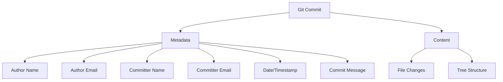

# Managing Git Repository Identity - Safely Rewriting Author History

Git's immutable commit history is one of its greatest strengths, providing an unalterable record of project development. However, there are legitimate scenarios where you might need to update author information across a repository's history, such as transitioning personal projects to organizational ownership, correcting misconfigured Git identity settings, or complying with corporate attribution policies. This guide explores a safe approach to revising repository credentials without compromising the integrity of your codebase.

## Understanding Git Identity and History

Before diving into history rewriting, it's important to understand how Git stores identity information:



Each Git commit contains both your changes and metadata about who made those changes, including:

- **Author**: The person who created the changes
- **Committer**: The person who applied the changes to the repository
- **Timestamps**: When the changes were authored and committed
- **Commit message**: The description of the changes

## Why Rewrite Git History?

There are several legitimate reasons to update commit authorship:

1. **Corporate compliance**: Ensuring all commits use company email addresses
2. **Identity standardization**: Creating consistency across repositories
3. **Privacy concerns**: Removing personal emails from public repositories
4. **Ownership transfer**: When projects move between organizations
5. **Fixing misconfigured identity**: Correcting incorrectly set user details

However, rewriting history should be approached with caution, as it fundamentally alters the commit history that other collaborators may have based their work on.

## Script for Revising Repository Credentials

The following script allows you to safely update Git commit history to use new identity information, while preserving commits that already match your organizational pattern:

```bash
#!/bin/bash

# Script to update Git commit history with new identity
# Ignores commits that already match the -icpl or @example.com pattern

# Check if git repository exists
if ! git rev-parse --is-inside-work-tree >/dev/null 2>&1; then
    echo "Error: Not a git repository"
    exit 1
fi

# New identity credentials
NEW_USERNAME="username"
NEW_EMAIL="email@example.com"

echo "This will update all commit authors to:"
echo "Username: $NEW_USERNAME"
echo "Email: $NEW_EMAIL"
echo
echo "Commits already containing '-icpl' or '@example.com' will be preserved."
echo "Warning: This operation will rewrite git history!"
echo "Make sure you have pushed all your changes and coordinated with your team."
read -p "Do you want to continue? (y/N) " -n 1 -r
echo

if [ ! "$REPLY" = "y" ] && [ ! "$REPLY" = "Y" ]; then
    echo "Operation cancelled"
    exit 1
fi

# Create backup branch
BACKUP_BRANCH="backup_$(date +%Y%m%d_%H%M%S)"
git branch "$BACKUP_BRANCH"
echo "Created backup branch: $BACKUP_BRANCH"

# Update git history
echo "Updating git history..."
git filter-branch --env-filter '
    # Check if current author/committer already matches the pattern
    if ! (echo "$GIT_COMMITTER_NAME" | grep -q "\-icpl$") && ! (echo "$GIT_COMMITTER_EMAIL" | grep -q "@example\.com$"); then
        export GIT_COMMITTER_NAME="username"
        export GIT_COMMITTER_EMAIL="email@example.com"
    fi
    if ! (echo "$GIT_AUTHOR_NAME" | grep -q "\-icpl$") && ! (echo "$GIT_AUTHOR_EMAIL" | grep -q "@example\.com$"); then
        export GIT_AUTHOR_NAME="username"
        export GIT_AUTHOR_EMAIL="email@example.com"
    fi
' --tag-name-filter cat -- --branches --tags

# Set new identity for future commits
git config user.name "$NEW_USERNAME"
git config user.email "$NEW_EMAIL"

echo
echo "Git history has been updated!"
echo "New identity has been set for future commits"
echo
echo "To push changes to remote repository, use:"
echo "git push --force origin main"
echo
echo "To revert changes if needed, use:"
echo "git reset --hard $BACKUP_BRANCH"
```

## How the Script Works

Let's break down the script's key components:

### 1. Repository Validation

```bash
if ! git rev-parse --is-inside-work-tree >/dev/null 2>&1; then
    echo "Error: Not a git repository"
    exit 1
fi
```

The script first checks if it's running within a valid Git repository to prevent accidental execution in non-Git directories.

### 2. User Confirmation

```bash
echo "Warning: This operation will rewrite git history!"
echo "Make sure you have pushed all your changes and coordinated with your team."
read -p "Do you want to continue? (y/N) " -n 1 -r
```

The script provides clear warnings about the operation and requires explicit confirmation from the user before proceeding.

### 3. Creating a Backup

```bash
BACKUP_BRANCH="backup_$(date +%Y%m%d_%H%M%S)"
git branch "$BACKUP_BRANCH"
```

A timestamped backup branch is created, providing a safe rollback point if needed.

### 4. Selective History Rewriting

```bash
git filter-branch --env-filter '
    # Check if current author/committer already matches the pattern
    if ! (echo "$GIT_COMMITTER_NAME" | grep -q "\-icpl$") && ! (echo "$GIT_COMMITTER_EMAIL" | grep -q "@example\.com$"); then
        export GIT_COMMITTER_NAME="username"
        export GIT_COMMITTER_EMAIL="email@example.com"
    fi
    if ! (echo "$GIT_AUTHOR_NAME" | grep -q "\-icpl$") && ! (echo "$GIT_AUTHOR_EMAIL" | grep -q "@example\.com$"); then
        export GIT_AUTHOR_NAME="username"
        export GIT_AUTHOR_EMAIL="email@example.com"
    fi
' --tag-name-filter cat -- --branches --tags
```

The `git filter-branch` command processes every commit in the repository, changing the author and committer information where needed. The script uses pattern matching to preserve commits that already have the correct organizational patterns in the author/committer information.

### 5. Configuring Future Commits

```bash
git config user.name "$NEW_USERNAME"
git config user.email "$NEW_EMAIL"
```

The script updates the local Git configuration to ensure all future commits use the new identity.

## Best Practices for Git Identity Management

When managing Git identity or rewriting history, follow these best practices:

### Planning and Communication

1. **Coordinate with team members**: Ensure everyone is aware of the planned history rewrite
2. **Choose a quiet period**: Perform history rewrites during periods of low development activity
3. **Document the changes**: Keep records of why and when the history was modified

### Technical Safeguards

1. **Always create backups**: Make backup branches before any history rewrite
2. **Test on a clone first**: Verify the script works as expected on a repository clone
3. **Use selective rewrites**: Only modify the specific commits that need changes
4. **Preserve tags and branches**: Ensure all references are properly updated

### After Rewriting History

1. **Force push with caution**: Use `git push --force` carefully, considering the impact on collaborators
2. **Notify team members**: Let others know they need to re-sync their local repositories
3. **Update related systems**: CI/CD pipelines or other systems may need reconfiguration

## Customizing the Script for Your Needs

You may need to adapt the script to your specific requirements:

### Changing Identity Patterns

Modify these lines to match your organization's naming pattern:

```bash
# Check if current author/committer already matches the pattern
if ! (echo "$GIT_COMMITTER_NAME" | grep -q "\-icpl$") && ! (echo "$GIT_COMMITTER_EMAIL" | grep -q "@example\.com$"); then
```

### Targeted Branch Updates

To update only specific branches instead of all branches:

```bash
git filter-branch --env-filter '...' --tag-name-filter cat -- main development
```

### Handling Multiple Authors

For repositories with multiple contributors who need different mappings:

```bash
git filter-branch --env-filter '
    if [ "$GIT_AUTHOR_EMAIL" = "old-email1@example.com" ]; then
        export GIT_AUTHOR_NAME="new-name1"
        export GIT_AUTHOR_EMAIL="new-email1@example.com"
    fi
    if [ "$GIT_AUTHOR_EMAIL" = "old-email2@example.com" ]; then
        export GIT_AUTHOR_NAME="new-name2"
        export GIT_AUTHOR_EMAIL="new-email2@example.com"
    fi
    # Repeat for GIT_COMMITTER_EMAIL if needed
' --tag-name-filter cat -- --branches --tags
```

## Alternatives to History Rewriting

If you're concerned about the implications of rewriting history, consider these alternatives:

### 1. Start Using Correct Identity Moving Forward

Instead of rewriting history, simply configure Git correctly for future commits:

```bash
git config user.name "correct-username"
git config user.email "correct-email@example.com"
```

### 2. Use Git Aliases with Author Information

Create Git aliases that include the `--author` flag:

```bash
git config alias.commit-work 'commit --author="Work Name <work-email@example.com>"'
```

### 3. Use a .mailmap File

Create a `.mailmap` file to display consistent identities without changing the actual commits:

```
# .mailmap file
Correct Name <correct@example.com> <old@example.com>
```

This changes how `git shortlog` and other commands display author information without modifying history.

## Troubleshooting

### Filter-Branch Warnings

If you see warnings about `filter-branch` being dangerous:

```bash
git filter-branch -f --env-filter '...'  # Add -f flag to force
```

### Missing Refs After Rewrite

If some refs are not updated:

```bash
# Rewrite specific refs manually
git update-ref refs/heads/branch-name NEW_SHA OLD_SHA
```

### Cleaning Up After Filter-Branch

To remove temporary files created during the process:

```bash
rm -rf .git/refs/original/ .git/refs/backups/
git reflog expire --expire=now --all
git gc --prune=now
```

## Conclusion

Rewriting Git history to update author information is a powerful operation that should be approached with caution and proper planning. The script provided in this guide offers a safe way to standardize repository identity while preserving commits that already match your organizational pattern. By following the best practices outlined here, you can manage your Git identity changes with minimal disruption to your team's workflow.

Remember that the primary goal is to ensure correct attribution and consistency in your repositories, while maintaining the integrity and traceability of your codebase. When used appropriately, these techniques can help align your Git history with your organizational requirements and identity standards.

## Resources

- [Git Documentation on filter-branch](https://git-scm.com/docs/git-filter-branch)
- [Git SCM Book - Rewriting History](https://git-scm.com/book/en/v2/Git-Tools-Rewriting-History)
- [GitHub Docs on Changing Author Info](https://docs.github.com/en/github/using-git/changing-author-info)
- [Git Documentation on mailmap](https://git-scm.com/docs/gitmailmap)
- [Pro Git Book](https://git-scm.com/book/en/v2)
