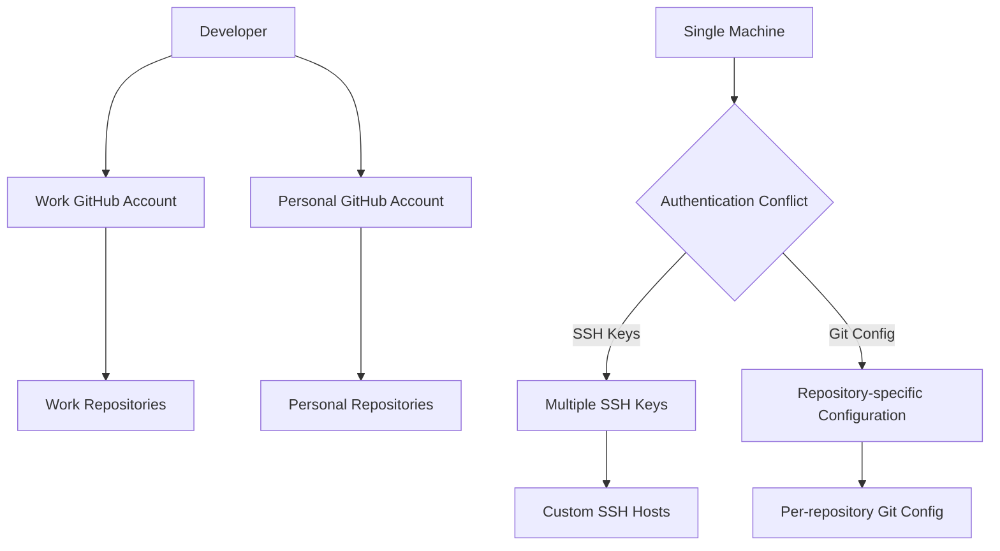

# Managing Multiple GitHub Accounts on a Single Machine

In modern development workflows, it's common to maintain separate GitHub accounts for work and personal projects. However, this presents a challenge: how do you manage multiple accounts from the same machine without constantly switching credentials? This guide provides a comprehensive approach to setting up and managing multiple GitHub accounts on a single computer, ensuring a seamless workflow between different contexts.

## Understanding the Challenge

The core issue stems from GitHub's authentication system, which doesn't directly support using multiple accounts simultaneously. When using HTTPS, GitHub identifies you by your credentials stored in the credential helper. When using SSH, GitHub relies on SSH keys to authenticate you.



## Prerequisites

Before we begin, make sure you have the following:

- Git installed on your machine
- Basic understanding of SSH keys
- Terminal access
- Existing GitHub accounts (work and personal)

## Step-by-Step Setup Guide

### 1. Generate SSH Keys for Each Account

First, create separate SSH keys for each GitHub account:

```bash
# Navigate to SSH directory
cd ~/.ssh

# Generate SSH key for work account
ssh-keygen -t rsa -b 4096 -C "work@email.com" -f "github-work"

# Generate SSH key for personal account
ssh-keygen -t rsa -b 4096 -C "personal@email.com" -f "github-personal"
```

Use strong, unique passphrases for each key for added security.

### 2. Add SSH Keys to the SSH Agent

Add your newly created SSH keys to the SSH agent:

```bash
# Start SSH agent if it's not running
eval "$(ssh-agent -s)"

# Add work SSH key
ssh-add ~/.ssh/github-work

# Add personal SSH key
ssh-add ~/.ssh/github-personal
```

On macOS, you might want to use `ssh-add -K` to store the passphrase in your keychain.

### 3. Add Public Keys to GitHub Accounts

You need to add each public key to its respective GitHub account:

```bash
# Copy the work public key to clipboard (macOS)
pbcopy < ~/.ssh/github-work.pub

# For Linux, you can use:
# cat ~/.ssh/github-work.pub
```

Then:

1. Log in to your work GitHub account
2. Go to Settings → SSH and GPG keys → New SSH key
3. Paste the key content, give it a descriptive title (e.g., "Work Laptop"), and save
4. Repeat the process for your personal account using the `github-personal.pub` key

### 4. Create an SSH Config File

Create or edit the SSH config file to set up custom hosts:

```bash
# Edit SSH config file
nano ~/.ssh/config
```

Add the following configuration:

```
# Work GitHub account
Host github.com-work
    HostName github.com
    User git
    IdentityFile ~/.ssh/github-work
    IdentitiesOnly yes

# Personal GitHub account
Host github.com-personal
    HostName github.com
    User git
    IdentityFile ~/.ssh/github-personal
    IdentitiesOnly yes
```

The `IdentitiesOnly yes` setting is crucial as it forces SSH to use only the specified identity file, preventing key confusion.

### 5. Testing Your Configuration

Verify that both configurations work correctly:

```bash
# Test work configuration
ssh -T git@github.com-work

# Test personal configuration
ssh -T git@github.com-personal
```

You should see a message like: "Hi username! You've successfully authenticated, but GitHub does not provide shell access." for each account, with the respective username.

## Working with Repositories

### Cloning New Repositories

When cloning repositories, use the appropriate custom host:

```bash
# Clone work repository
git clone git@github.com-work:work-organization/repository.git

# Clone personal repository
git clone git@github.com-personal:personal-username/repository.git
```

### Updating Existing Repositories

If you already have repositories cloned, update the remote URL:

```bash
# For work repositories
git remote set-url origin git@github.com-work:work-organization/repository.git

# For personal repositories
git remote set-url origin git@github.com-personal:personal-username/repository.git
```

### Setting User Configuration

Set the correct user configuration for each repository:

```bash
# Navigate to your repository
cd /path/to/repository

# For work repositories
git config user.email "work@email.com"
git config user.name "Your Work Name"

# For personal repositories
git config user.email "personal@email.com"
git config user.name "Your Personal Name"
```

This ensures your commits are properly attributed to the right account.

## Advanced Configuration Techniques

### Directory-Based Configuration

For a more automatic setup, you can use conditional includes in your global `.gitconfig` based on the directory path:

```bash
# Edit global Git config
nano ~/.gitconfig
```

Add the following:

```
[includeIf "gitdir:~/work/"]
    path = ~/.gitconfig-work

[includeIf "gitdir:~/personal/"]
    path = ~/.gitconfig-personal
```

Then create the specific configuration files:

```bash
# Work Git config
nano ~/.gitconfig-work
```

With content:

```
[user]
    email = work@email.com
    name = Your Work Name
[core]
    sshCommand = ssh -i ~/.ssh/github-work -F /dev/null
```

And personal config:

```bash
# Personal Git config
nano ~/.gitconfig-personal
```

With content:

```
[user]
    email = personal@email.com
    name = Your Personal Name
[core]
    sshCommand = ssh -i ~/.ssh/github-personal -F /dev/null
```

With this setup, Git automatically uses the correct identity based on the directory path of your repository.

### Using Multiple Remote URLs

An alternative approach is to use multiple remote URLs for the same repository:

```bash
# Add multiple remotes to a repository
git remote add work git@github.com-work:work-organization/repository.git
git remote add personal git@github.com-personal:personal-username/repository.git

# Push to specific remote
git push work main
git push personal main
```

This method is useful for repositories that you manage under both accounts.

## Troubleshooting Common Issues

### Permission Denied Error

If you get a "Permission denied (publickey)" error:

```bash
# Check if SSH agent has the key
ssh-add -l

# If your key isn't listed, add it
ssh-add ~/.ssh/github-work
```

Also verify that you've added the correct public key to the GitHub account.

### Wrong Account Being Used

If commits are being attributed to the wrong account:

```bash
# Check the repository's Git config
git config --list

# Verify the remote URL
git remote -v
```

Ensure that your repository's configuration and remote URL match the account you want to use.

### SSH Agent Issues

If the SSH agent isn't remembering your keys between sessions:

```bash
# For macOS, add this to your .bash_profile or .zshrc
ssh-add -A

# For other systems, consider using ssh-agent with your desktop environment
# or add this to your .bashrc or .zshrc:
if [ -z "$SSH_AUTH_SOCK" ] ; then
    eval "$(ssh-agent -s)"
    ssh-add ~/.ssh/github-work
    ssh-add ~/.ssh/github-personal
fi
```

### Handling Git Credential Helper

If you're still using HTTPS for some repositories and having credential issues:

```bash
# Clear cached credentials
git credential reject
protocol=https
host=github.com

# Or disable credential helper for a repository
git config --local credential.helper ""
```

## Best Practices for Multiple GitHub Accounts

1. **Organize repositories by account**: Keep work and personal projects in separate directories
2. **Always verify before committing**: Check `git config user.email` before important commits
3. **Use descriptive SSH key names**: Makes identification and troubleshooting easier
4. **Back up your SSH configuration**: Especially when setting up a new machine
5. **Consider using a visual indicator**: Customize your terminal prompt to show which GitHub account is active
6. **Use Git aliases**: Create shortcuts for common commands with the correct configuration

## Creating a Visual Identity Indicator

For bash/zsh users, add this to your shell configuration file to show which GitHub account is active in your prompt:

```bash
# Add to your .bashrc or .zshrc
function parse_git_email() {
    git config user.email 2> /dev/null | awk -F@ '{print $1}'
}

# For bash
PS1='\u@\h \W$(git rev-parse --is-inside-work-tree 2>/dev/null && echo " git:($(parse_git_email))")$ '

# For zsh (add to your theme or prompt setup)
# PROMPT='%n@%m %1~$(git rev-parse --is-inside-work-tree 2>/dev/null && echo " git:($(parse_git_email))")$ '
```

This will display your Git user email's local part in the terminal prompt when you're in a Git repository.

## Conclusion

Managing multiple GitHub accounts on a single machine doesn't have to be complicated. By using SSH keys with custom hosts and account-specific configurations, you can seamlessly switch between accounts without manual credential management. The methods described here allow for a flexible workflow that maintains clear separation between your work and personal projects.

Remember that the most critical aspect is maintaining proper attribution of your work. Always verify that you're using the correct account before pushing sensitive or work-related code.

## Resources

- [GitHub Documentation: Connecting to GitHub with SSH](https://docs.github.com/en/authentication/connecting-to-github-with-ssh)
- [Git Documentation: Git Configuration](https://git-scm.com/docs/git-config)
- [SSH Documentation: SSH Config File](https://man.openbsd.org/ssh_config)
- [GitHub Documentation: Managing Multiple Accounts](https://docs.github.com/en/account-and-profile/setting-up-and-managing-your-personal-account-on-github/managing-your-personal-account)
