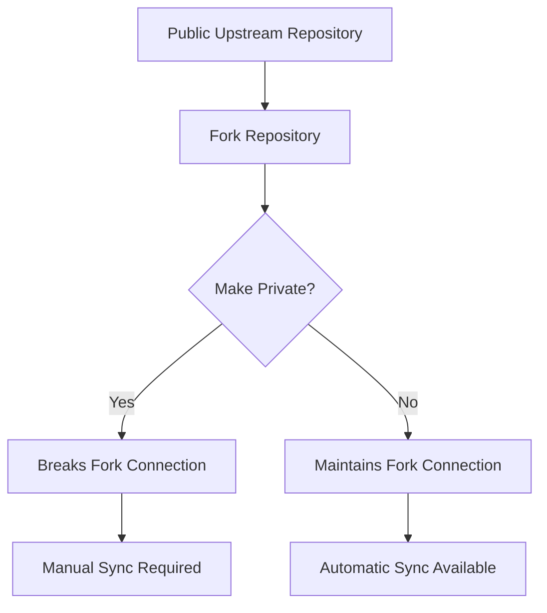

# Managing Private Forks of Public Repositories

When working with open-source projects in an enterprise environment, you often need to maintain private forks of public repositories. This can present challenges with synchronization and visibility management. This guide explores various approaches to effectively manage private forks while maintaining the ability to sync with upstream repositories.

## Understanding Fork Privacy Issues



When you make a forked repository private:

- The fork relationship with the upstream repository is disconnected
- GitHub's fork synchronization features become unavailable
- Manual remote management becomes necessary

## Solution 1: Maintaining Upstream Sync with Private Forks

### Step 1: Add Upstream Remote

```bash
# Add the original repository as a remote
git remote add upstream https://github.com/original-org/original-repo.git

# Verify remotes
git remote -v
```

### Step 2: Configure Regular Syncing

```bash
# Fetch upstream changes
git fetch upstream

# Merge specific branch
git merge upstream/main   # or specific branch like upstream/4.9.2

# Push to your private fork
git push origin main
```

### Step 3: Create an Automated Sync Script

```bash
#!/bin/bash
# sync-upstream.sh

# Configuration
UPSTREAM_BRANCH="4.9.2"
ORIGIN_BRANCH="main"

# Fetch latest from upstream
echo "Fetching from upstream..."
git fetch upstream

# Merge upstream changes
echo "Merging upstream/${UPSTREAM_BRANCH}..."
git checkout ${ORIGIN_BRANCH}
git merge upstream/${UPSTREAM_BRANCH}

# Push to origin
echo "Pushing to origin..."
git push origin ${ORIGIN_BRANCH}
```

## Solution 2: Dual Repository Approach

This approach maintains both public and private repositories.

### Step 1: Set Up Repository Structure

```bash
# Clone the public fork
git clone https://github.com/your-org/public-fork.git
cd public-fork

# Add private repository as remote
git remote add private https://github.com/your-org/private-repo.git
```

### Step 2: Create Branch Management Script

```bash
#!/bin/bash
# manage-repos.sh

# Sync with upstream
git fetch upstream
git merge upstream/main

# Push to public fork
git push origin main

# Push to private repository
git push private main
```

## Solution 3: Using GitHub Actions for Automated Sync

### Step 1: Create GitHub Action Workflow

```yaml
# .github/workflows/sync-upstream.yml
name: Sync Upstream

on:
  schedule:
    - cron: "0 */6 * * *" # Every 6 hours
  workflow_dispatch: # Manual trigger

jobs:
  sync:
    runs-on: ubuntu-latest
    steps:
      - uses: actions/checkout@v3
        with:
          fetch-depth: 0

      - name: Configure Git
        run: |
          git config user.name 'GitHub Action'
          git config user.email 'action@github.com'

      - name: Add Upstream Remote
        run: |
          git remote add upstream https://github.com/original-org/original-repo.git
          git fetch upstream

      - name: Merge Upstream
        run: |
          git merge upstream/4.9.2 --no-edit

      - name: Push Changes
        run: |
          git push origin main
```

## Best Practices for Managing Private Forks

### 1. Regular Synchronization

```bash
# Create a daily cronjob for sync
0 0 * * * /path/to/sync-upstream.sh >> /var/log/sync-upstream.log 2>&1
```

### 2. Change Management

```bash
# Create a branch for local changes
git checkout -b enterprise-customization

# Make your changes
git commit -am "Enterprise customizations"

# Create a rebase script for maintaining changes
cat << 'EOF' > rebase-changes.sh
#!/bin/bash
git checkout enterprise-customization
git rebase upstream/main
git push -f origin enterprise-customization
EOF
chmod +x rebase-changes.sh
```

### 3. Conflict Resolution Strategy

Create a documentation file for managing conflicts:

````markdown
# Conflict Resolution Guide

1. Identify conflict sources:
   ```bash
   git status
   git diff --name-only --diff-filter=U
   ```
````

2. Standard resolution process:

   - Keep upstream changes for core functionality
   - Preserve local modifications for enterprise features
   - Document all conflict resolutions

3. Update customization documentation

````

### 4. Security Considerations

```bash
# Create a script to check for sensitive information
cat << 'EOF' > check-sensitive.sh
#!/bin/bash
git diff upstream/main..HEAD | grep -E 'password|secret|key|token'
EOF
chmod +x check-sensitive.sh
````

## Troubleshooting Common Issues

### 1. Broken Fork Relationship

If the fork relationship breaks after making a repository private:

```bash
# Solution: Manually track upstream
git remote add upstream https://github.com/original-org/original-repo.git
git fetch upstream
git branch --set-upstream-to=upstream/main main
```

### 2. Merge Conflicts

When encountering merge conflicts:

```bash
# Create conflict resolution branch
git checkout -b conflict-resolution

# Get both versions
git checkout --theirs conflicted_file
git checkout --ours conflicted_file

# After resolving
git add conflicted_file
git commit -m "Resolve conflicts with upstream"
```

### 3. Diverged History

If histories have diverged significantly:

```bash
# Create a backup branch
git branch backup-main main

# Reset to upstream
git reset --hard upstream/main

# Cherry-pick essential changes
git cherry-pick backup-main~5..backup-main
```

## Enterprise Workflow Integration

### 1. CI/CD Pipeline Integration

```yaml
# .github/workflows/enterprise-ci.yml
name: Enterprise CI

on:
  push:
    branches: [main, enterprise-*]

jobs:
  validate:
    runs-on: self-hosted
    steps:
      - uses: actions/checkout@v3

      - name: Validate Enterprise Changes
        run: |
          ./check-sensitive.sh
          ./run-enterprise-tests.sh
```

### 2. Code Review Process

Create a pull request template for enterprise changes:

```markdown
## Enterprise Change Request

### Type of Change

- [ ] Upstream Sync
- [ ] Enterprise Feature
- [ ] Security Enhancement
- [ ] Configuration Update

### Upstream Impact Analysis

- [ ] No impact on upstream sync
- [ ] Requires conflict resolution plan
- [ ] Changes to core functionality

### Security Review

- [ ] Sensitive information check complete
- [ ] Enterprise security requirements met
```

### 3. Documentation Maintenance

Create an enterprise documentation structure:

```bash
mkdir -p docs/enterprise
cat << EOF > docs/enterprise/MAINTENANCE.md
# Enterprise Fork Maintenance Guide

## Sync Schedule
- Daily automated sync with upstream at 00:00 UTC
- Manual sync requires approval

## Change Management
1. Create feature branch
2. Implement changes
3. Run validation suite
4. Submit PR with impact analysis

## Emergency Procedures
1. Disable auto-sync
2. Create incident branch
3. Apply hotfix
4. Re-enable sync after validation
EOF
```

## Conclusion

Managing private forks of public repositories requires careful planning and automation. By implementing these strategies and tools, you can maintain a secure, private fork while staying synchronized with upstream changes. Remember to:

1. Regularly sync with upstream
2. Maintain clear documentation
3. Automate repetitive tasks
4. Implement security checks
5. Plan for conflict resolution

## Resources

- [GitHub Documentation on Repository Visibility](https://docs.github.com/en/repositories/managing-your-repositorys-settings-and-features/managing-repository-settings/setting-repository-visibility)
- [Git Documentation on Remotes](https://git-scm.com/book/en/v2/Git-Basics-Working-with-Remotes)
- [GitHub Actions Documentation](https://docs.github.com/en/actions)
- [Git Best Practices](https://git-scm.com/book/en/v2/Git-Tools-Reset-Demystified)
