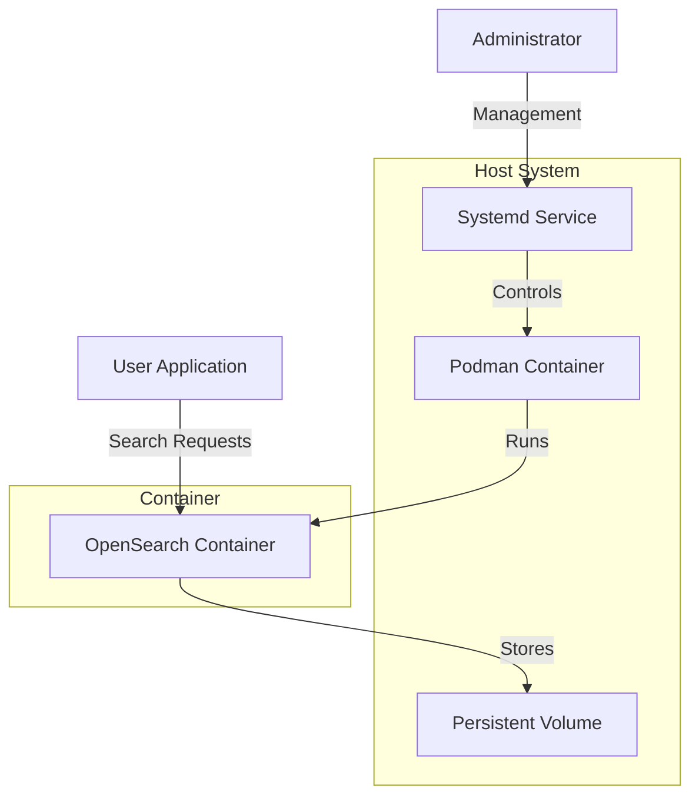

# Deploying OpenSearch with Podman and Quadlet for Containerized Search at Scale

OpenSearch is a powerful open-source search and analytics engine that many organizations use for log analysis, full-text search, and observability. While Kubernetes is commonly used for deploying OpenSearch clusters, there are simpler alternatives for smaller deployments or environments where Kubernetes is not available. This guide demonstrates how to deploy OpenSearch using Podman and Quadlet for a lightweight, secure, and systemd-integrated solution.

## Architecture Overview

This deployment uses a layered architecture that provides stability, security, and integration with the host system:



The architecture consists of:

1. **Podman Container**: Root-less container runtime without daemon
2. **Quadlet**: Configuration standard for systemd container integration
3. **OpenSearch**: Search and analytics engine
4. **Persistent Storage**: Volume mapping for durable data
5. **Systemd Integration**: For service management and automatic restarts

## Prerequisites

Before starting the implementation, ensure you have:

- **Linux Distribution**: Fedora, RHEL, CentOS Stream, or other Linux with Podman 4.0+
- **Hardware Requirements**:
  - Minimum 2 cores and 4GB RAM (8GB+ recommended)
  - 20GB available storage
- **Software**:
  - Podman 4.0 or newer
  - Systemd 248 or newer (for Quadlet support)
  - User with sudo access

## Implementation Steps

Our implementation follows a systematic approach for deploying OpenSearch with Podman and Quadlet.

### 1. Installing and Configuring Podman

First, let's make sure Podman is properly installed and configured:

```bash
# Install Podman if not already installed
sudo dnf install -y podman podman-docker

# Check Podman version (should be 4.0+)
podman --version

# Enable and start the Podman socket
systemctl --user enable --now podman.socket

# Verify socket status
systemctl --user status podman.socket
```

### 2. Creating a Persistent Volume for OpenSearch Data

OpenSearch requires persistent storage to maintain data across container restarts:

```bash
# Create a directory for persistent data
mkdir -p ~/.local/share/opensearch-data

# Set appropriate permissions
chmod 777 ~/.local/share/opensearch-data
```

### 3. Testing OpenSearch with Podman

Before creating the Quadlet file, let's test running OpenSearch with Podman directly:

```bash
# Run OpenSearch as a single-node cluster
podman run -d \
  --name opensearch-node1 \
  -e cluster.name=opensearch-cluster \
  -e node.name=opensearch-node1 \
  -e discovery.type=single-node \
  -e "OPENSEARCH_JAVA_OPTS=-Xms512m -Xmx512m" \
  -e "plugins.security.disabled=true" \
  -e bootstrap.memory_lock=false \
  -e "path.data=/usr/share/opensearch/data" \
  --ulimit nofile=65536:65536 \
  -v ~/.local/share/opensearch-data:/usr/share/opensearch/data:Z,rw \
  -p 19200:9200 \
  -p 19600:9600 \
  --user "$(id -u):$(id -g)" \
  docker.io/opensearchproject/opensearch:latest

# Check if the container is running
podman ps

# View logs to verify startup
podman logs -f opensearch-node1
```

### 4. Creating a Quadlet Configuration for OpenSearch

Now, let's create a Quadlet file to define our OpenSearch container configuration for systemd:

```bash
# Create Quadlet directory if it doesn't exist
mkdir -p ~/.config/containers/systemd

# Create the Quadlet configuration file
cat << EOF > ~/.config/containers/systemd/opensearch.container
[Unit]
Description=OpenSearch Container
After=network-online.target
Wants=network-online.target

[Container]
Image=docker.io/opensearchproject/opensearch:latest
Network=host
PublishPort=19200:9200
PublishPort=19600:9600
Volume=~/.local/share/opensearch-data:/usr/share/opensearch/data:Z
Environment=cluster.name=opensearch-cluster
Environment=node.name=opensearch-node1
Environment=discovery.type=single-node
Environment=OPENSEARCH_JAVA_OPTS=-Xms512m -Xmx512m
Environment=plugins.security.disabled=true
Environment=path.data=/usr/share/opensearch/data
Environment=bootstrap.memory_lock=false
Ulimit=nofile=65536:65536
User=$(id -u):$(id -g)

[Service]
Restart=always
TimeoutStartSec=900
TimeoutStopSec=70

[Install]
WantedBy=default.target
EOF

# Reload systemd to detect the new Quadlet file
systemctl --user daemon-reload
```

### 5. Managing OpenSearch with Systemd

With the Quadlet file in place, you can now manage OpenSearch using systemd:

```bash
# Enable the service to start at login
systemctl --user enable container-opensearch.service

# Enable lingering to ensure services start at boot
loginctl enable-linger $USER

# Start the OpenSearch service
systemctl --user start container-opensearch.service

# Check service status
systemctl --user status container-opensearch.service
```

### 6. Testing OpenSearch Functionality

Once OpenSearch is running, let's verify that it's working properly:

```bash
# Test the OpenSearch REST API
curl -X GET "http://localhost:19200/"

# Create a test index
curl -X PUT "http://localhost:19200/test-index"

# Add a document to the index
curl -X POST "http://localhost:19200/test-index/_doc" \
  -H 'Content-Type: application/json' \
  -d '{"title": "Test Document", "content": "This is a test document for OpenSearch."}'

# Search for documents
curl -X GET "http://localhost:19200/test-index/_search?q=test"
```

### 7. Securing OpenSearch

For production use, you should enable security features in OpenSearch:

```bash
# Stop the existing container
systemctl --user stop container-opensearch.service

# Update Quadlet configuration with security settings
cat << EOF > ~/.config/containers/systemd/opensearch.container
[Unit]
Description=OpenSearch Container
After=network-online.target
Wants=network-online.target

[Container]
Image=docker.io/opensearchproject/opensearch:latest
Network=host
PublishPort=19200:9200
PublishPort=19600:9600
Volume=~/.local/share/opensearch-data:/usr/share/opensearch/data:Z
Environment=cluster.name=opensearch-cluster
Environment=node.name=opensearch-node1
Environment=discovery.type=single-node
Environment=OPENSEARCH_JAVA_OPTS=-Xms512m -Xmx512m
Environment=plugins.security.disabled=false
Environment=OPENSEARCH_INITIAL_ADMIN_PASSWORD=StrongPasswordHere
Environment=path.data=/usr/share/opensearch/data
Environment=bootstrap.memory_lock=false
Ulimit=nofile=65536:65536
User=$(id -u):$(id -g)

[Service]
Restart=always
TimeoutStartSec=900
TimeoutStopSec=70

[Install]
WantedBy=default.target
EOF

# Reload and restart the service
systemctl --user daemon-reload
systemctl --user restart container-opensearch.service

# Test secured API with basic auth
curl -u admin:StrongPasswordHere -X GET "http://localhost:19200/"
```

## Advanced Configuration

### Multi-node Cluster Configuration

For a more robust deployment, you can set up a multi-node cluster:

```bash
# Create Quadlet file for node 1
cat << EOF > ~/.config/containers/systemd/opensearch-1.container
[Unit]
Description=OpenSearch Node 1
After=network-online.target
Wants=network-online.target

[Container]
Image=docker.io/opensearchproject/opensearch:latest
Network=host
PublishPort=19201:9200
PublishPort=19601:9600
Volume=~/.local/share/opensearch-data-1:/usr/share/opensearch/data:Z
Environment=cluster.name=opensearch-cluster
Environment=node.name=opensearch-node1
Environment=discovery.seed_hosts=localhost:19301,localhost:19302
Environment=cluster.initial_master_nodes=opensearch-node1,opensearch-node2
Environment=OPENSEARCH_JAVA_OPTS=-Xms512m -Xmx512m
Environment=path.data=/usr/share/opensearch/data
Environment=network.host=0.0.0.0
Environment=transport.port=19301
Environment=http.port=9200
Ulimit=nofile=65536:65536
User=$(id -u):$(id -g)

[Service]
Restart=always

[Install]
WantedBy=default.target
EOF

# Create Quadlet file for node 2
cat << EOF > ~/.config/containers/systemd/opensearch-2.container
[Unit]
Description=OpenSearch Node 2
After=network-online.target
Wants=network-online.target

[Container]
Image=docker.io/opensearchproject/opensearch:latest
Network=host
PublishPort=19202:9200
PublishPort=19602:9600
Volume=~/.local/share/opensearch-data-2:/usr/share/opensearch/data:Z
Environment=cluster.name=opensearch-cluster
Environment=node.name=opensearch-node2
Environment=discovery.seed_hosts=localhost:19301,localhost:19302
Environment=cluster.initial_master_nodes=opensearch-node1,opensearch-node2
Environment=OPENSEARCH_JAVA_OPTS=-Xms512m -Xmx512m
Environment=path.data=/usr/share/opensearch/data
Environment=network.host=0.0.0.0
Environment=transport.port=19302
Environment=http.port=9200
Ulimit=nofile=65536:65536
User=$(id -u):$(id -g)

[Service]
Restart=always

[Install]
WantedBy=default.target
EOF
```

### Adding OpenSearch Dashboards

To add OpenSearch Dashboards for visualization:

```bash
# Create Quadlet file for OpenSearch Dashboards
cat << EOF > ~/.config/containers/systemd/opensearch-dashboards.container
[Unit]
Description=OpenSearch Dashboards
After=container-opensearch.service
Requires=container-opensearch.service

[Container]
Image=docker.io/opensearchproject/opensearch-dashboards:latest
PublishPort=15601:5601
Environment=OPENSEARCH_HOSTS=["http://localhost:19200"]
Environment=DISABLE_SECURITY_DASHBOARDS_PLUGIN=true

[Service]
Restart=always

[Install]
WantedBy=default.target
EOF
```

## Monitoring and Management

### Checking Container Logs

You can check the logs of your OpenSearch container using:

```bash
# View recent logs
systemctl --user status container-opensearch.service

# Stream logs
journalctl --user -f -u container-opensearch.service

# Or use podman logs
podman logs -f opensearch
```

### Container Resource Management

You can adjust resource limits in your Quadlet file:

```bash
# Update resource limits in ~/.config/containers/systemd/opensearch.container
[Container]
# ...existing configuration...
Environment=OPENSEARCH_JAVA_OPTS=-Xms1g -Xmx1g
CPUQuota=200%
MemoryLimit=2G
```

## Troubleshooting

### Common Issues and Solutions

#### Permission Denied Errors

If you encounter permission issues with the data directory:

```bash
# Fix permissions
chmod 777 ~/.local/share/opensearch-data
# Or use a more secure approach with appropriate ownership
chown -R $(id -u):$(id -g) ~/.local/share/opensearch-data
chmod 700 ~/.local/share/opensearch-data
```

#### OpenSearch Fails to Start

If OpenSearch doesn't start properly:

```bash
# Check for virtual memory limits
cat /proc/sys/vm/max_map_count
# If less than 262144, set it higher:
sudo sysctl -w vm.max_map_count=262144
# Make persistent by adding to /etc/sysctl.conf
echo "vm.max_map_count=262144" | sudo tee -a /etc/sysctl.conf
```

#### Service Does Not Start Automatically

If the service doesn't start at boot:

```bash
# Verify lingering is enabled
loginctl show-user $USER | grep Linger

# Enable if needed
loginctl enable-linger $USER

# Verify systemd service is enabled
systemctl --user is-enabled container-opensearch.service
```

## Security Best Practices

### Network Security

- Use host firewall to restrict access to OpenSearch ports
- Configure TLS for transport and HTTP layers
- Place OpenSearch behind a reverse proxy for additional security

### Authentication and Authorization

- Create custom users with limited permissions
- Use role-based access control
- Regularly rotate admin passwords

### Auditing and Monitoring

- Enable audit logging
- Monitor for unauthorized access attempts
- Set up alerts for security events

## Conclusion

Deploying OpenSearch with Podman and Quadlet provides a lightweight, secure, and systemd-integrated search solution without the complexity of Docker or Kubernetes. This approach offers several advantages:

- **Daemonless Operation**: No background daemon required, reducing resource usage
- **Rootless Security**: Run containers as regular users, enhancing security
- **Systemd Integration**: Native service management with dependencies and logging
- **Portability**: Works across various Linux distributions with minimal dependencies
- **Simplified Management**: Clear configuration files with Quadlet

Whether you're setting up a small development environment or a production system with modest requirements, this deployment method offers a robust solution for running OpenSearch in containers.

## Resources

- [OpenSearch Documentation](https://opensearch.org/docs/)
- [Podman Documentation](https://docs.podman.io/)
- [Quadlet Documentation](https://github.com/containers/quadlet)
- [Systemd Documentation](https://systemd.io/)
- [OpenSearch Security Plugin](https://opensearch.org/docs/latest/security-plugin/)
