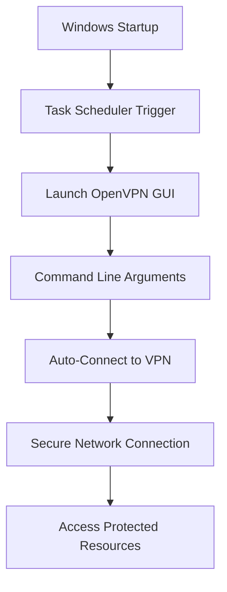

# Automating OpenVPN GUI Connections on Windows Startup

Maintaining a secure connection to your organization's network while working remotely is essential for many professionals. OpenVPN provides robust, secure connectivity, but manually connecting each time you restart your computer can be cumbersome. This guide walks through the process of configuring OpenVPN GUI to automatically establish a connection whenever Windows starts, ensuring you're always securely connected to your network.

## Understanding OpenVPN GUI Auto-Connect

OpenVPN GUI offers built-in functionality for automated connections through command-line parameters. When properly configured with Windows Task Scheduler, you can create a seamless and secure connection experience that requires minimal intervention.



## Prerequisites

Before setting up auto-connect functionality, ensure you have:

- OpenVPN GUI installed on your Windows system
- A working OpenVPN configuration file (.ovpn)
- Administrative privileges on your Windows account
- Successfully tested manual connection at least once

## Step-by-Step Setup Guide

### 1. Initial Configuration

First, make sure OpenVPN GUI is properly installed and configured:

1. **Install OpenVPN GUI**: If not already installed, download and install the latest version from the [official OpenVPN website](https://openvpn.net/community-downloads/)

2. **Configure your VPN profile**: Import your `.ovpn` configuration file into OpenVPN GUI

3. **Test manual connection**: Right-click the OpenVPN GUI icon in the system tray and connect to your VPN to verify everything works correctly

4. **Save credentials**: When prompted for username/password, check "Save password" if your security policies allow it

### 2. Creating a Task Scheduler Configuration

Windows Task Scheduler will launch OpenVPN GUI with the appropriate parameters when you log in:

1. **Open Task Scheduler**:

   - Press `Win + R` to open the Run dialog
   - Type `taskschd.msc` and press Enter

2. **Create a new task**:

   - In the right panel, click "Create Basic Task"
   - Name: `OpenVPN Auto-Connect`
   - Description: `Automatically connects OpenVPN GUI at Windows startup`
   - Click "Next"

3. **Configure the trigger**:

   - Select "When I log on"
   - Click "Next"

4. **Set the action**:

   - Select "Start a program"
   - Click "Next"
   - Program/script: Browse to the OpenVPN GUI executable (typically `C:\Program Files\OpenVPN\bin\openvpn-gui.exe`)
   - Add arguments: `--connect`
   - Start in: Enter the OpenVPN installation directory (e.g., `C:\Program Files\OpenVPN\bin\`)
   - Click "Next"

5. **Review and finish**:
   - Review your settings
   - Check "Open the Properties dialog for this task when I click Finish"
   - Click "Finish"

### 3. Advanced Task Properties Configuration

After completing the basic setup, you'll need to configure additional properties:

1. **General tab**:

   - Check "Run with highest privileges" (required for network configuration)
   - Verify "Configure for:" shows your Windows version

2. **Conditions tab**:

   - Uncheck "Start the task only if the computer is on AC power" (important for laptop users)
   - Optionally check "Wake the computer to run this task" if needed

3. **Settings tab**:

   - Check "Allow task to be run on demand"
   - Check "Run task as soon as possible after a scheduled start is missed"
   - Set "Stop the task if it runs longer than:" to `3 days` or another appropriate duration
   - Check "If the running task does not end when requested, force it to stop"

4. **Click "OK" to save all settings**

### 4. Testing Your Configuration

To ensure everything works as expected:

1. **Disable the task temporarily**:

   - Right-click the task and select "Disable"

2. **Test run**:

   - Right-click the task and select "Run"
   - Verify OpenVPN GUI launches and attempts to connect
   - Check that the VPN connection is established successfully

3. **Enable the task**:

   - Right-click the task and select "Enable"

4. **Restart your computer**:
   - Reboot to verify the task runs automatically at startup
   - Check that the VPN connects without manual intervention

## Advanced Configuration Options

### Using Specific Configuration Files

If you have multiple VPN configurations, you can specify which one to use:

```
--connect=config_file_name.ovpn
```

For example:

```
--connect=work_vpn.ovpn
```

### Starting Minimized

To make the connection process less intrusive:

```
--connect --minimize
```

### Using Full Paths for Configurations Outside Default Directory

For configurations stored in non-standard locations:

```
--config="C:\path\to\your\config.ovpn"
```

### Combining Multiple Parameters

You can combine multiple command-line options:

```
--connect=work_vpn.ovpn --minimize
```

## Troubleshooting Common Issues

### Connection Fails to Establish

If the VPN doesn't connect automatically:

1. **Check Windows Event Viewer**:

   - Open Event Viewer (search for "Event Viewer" in the Start menu)
   - Navigate to Windows Logs > Application
   - Look for errors related to OpenVPN

2. **Verify service status**:

   - Press `Win + R`, type `services.msc` and press Enter
   - Locate "OpenVPNService" and ensure it's running
   - Set startup type to "Automatic" if it isn't already

3. **Check for credential issues**:
   - Open OpenVPN GUI manually
   - Try connecting to confirm your credentials are saved correctly

### Task Scheduler Not Launching OpenVPN

If the scheduler doesn't start OpenVPN:

1. **Check task history**:

   - In Task Scheduler, select your task
   - Go to the History tab to view execution history
   - Look for error codes or messages

2. **Verify executable path**:

   - Confirm the path to `openvpn-gui.exe` is correct
   - Try using the full path in quotes: `"C:\Program Files\OpenVPN\bin\openvpn-gui.exe"`

3. **Run as administrator**:
   - Ensure "Run with highest privileges" is checked in task properties

### Connection Issues After Windows Updates

Windows updates occasionally affect network configurations:

1. **Reinstall TAP adapter**:

   - Open Control Panel > Programs > Programs and Features
   - Find "TAP-Windows" adapter
   - Uninstall and then reinstall via OpenVPN installer

2. **Update OpenVPN**:
   - Download and install the latest version of OpenVPN GUI
   - Reconfigure your auto-connect task

## Security Considerations

### Credential Storage

Automating VPN connections involves security trade-offs:

1. **Password storage**:

   - Saved passwords in OpenVPN are encrypted but not impenetrable
   - Consider using certificate-based authentication instead of passwords
   - Regularly update your VPN credentials

2. **Physical security**:
   - Auto-connecting VPNs on startup means anyone with access to your computer can potentially access your network
   - Always lock your computer when unattended
   - Consider disk encryption with BitLocker

### Alternative Authentication Methods

For enhanced security:

1. **Certificate-based authentication**:

   - Use client certificates instead of passwords
   - Certificates can still be used with auto-connect functionality

2. **Smart card integration**:
   - Configure OpenVPN to use smart cards for authentication
   - Requires physical card presence for connection

## For Enterprise Environments

Organizations managing multiple VPN users should consider:

1. **Group Policy deployment**:

   - Use Group Policy to deploy OpenVPN settings and auto-connect tasks
   - Configure consistent security policies across devices

2. **Centralized management**:

   - Consider an enterprise VPN solution with central management
   - Deploy configuration updates automatically

3. **Compliance monitoring**:
   - Implement logging to track VPN connection status
   - Ensure automatic connections meet security compliance requirements

## Command-Line Reference

OpenVPN GUI supports several command-line parameters for automation:

| Parameter                      | Description                                          |
| ------------------------------ | ---------------------------------------------------- |
| `--connect`                    | Auto-connects using the default or last used profile |
| `--connect=config.ovpn`        | Connects to a specific configuration file            |
| `--config=path\to\config.ovpn` | Specifies a configuration file in a custom location  |
| `--minimize`                   | Starts OpenVPN GUI minimized to the system tray      |
| `--silent_connection=1`        | Suppresses connection dialog boxes                   |
| `--service_only`               | Starts the OpenVPN service without launching GUI     |

## Conclusion

Automating OpenVPN connections at Windows startup provides convenience without sacrificing the security benefits of VPN connectivity. By following this guide, you've configured your system to automatically establish a secure connection whenever you log in, ensuring your network traffic remains protected at all times.

Remember that while automation improves usability, it's important to maintain good security practices, regularly update your VPN configuration, and ensure your authentication methods align with your organization's security requirements.

## Resources

- [OpenVPN Community Resources](https://openvpn.net/community-resources/)
- [OpenVPN GUI Command Line Options](https://openvpn.net/community-resources/reference-manual-for-openvpn-2-4/)
- [Windows Task Scheduler Documentation](https://docs.microsoft.com/en-us/windows/win32/taskschd/task-scheduler-start-page)
- [VPN Security Best Practices](https://www.ncsc.gov.uk/collection/mobile-device-guidance/virtual-private-networks)
