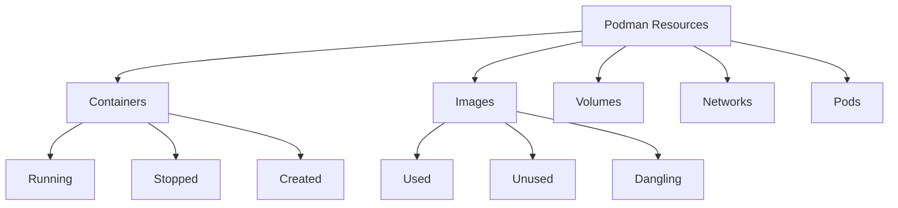

# Effective Podman Resource Management and Cleanup Strategies

Podman is a powerful, daemonless container engine that excels at managing containers without requiring root privileges. However, as with any container platform, regular maintenance is necessary to avoid resource accumulation that can impact system performance and waste disk space. This guide explores effective strategies for cleaning up Podman resources and maintaining a healthy container environment.

## Understanding Podman Resource Types

Before diving into cleanup strategies, it's important to understand the different resource types that Podman manages:



Each resource type requires different cleanup approaches, and understanding their relationships helps determine the appropriate cleanup strategy for your specific situation.

## Basic Cleanup Commands

### Viewing Current Resources

Before performing cleanup operations, it's helpful to assess your current resource usage:

```bash
# List all containers (including stopped ones)
podman ps -a

# List all images
podman images

# List all volumes
podman volume ls

# Check disk usage
podman system df
```

### Stopping Running Containers

The first step in cleanup is to stop any running containers you want to remove:

```bash
# Stop a specific container
podman stop container_name_or_id

# Stop all running containers
podman stop -a
```

### Removing Containers

Once containers are stopped, you can remove them:

```bash
# Remove a specific container
podman rm container_name_or_id

# Remove all stopped containers
podman rm -a

# Force remove all containers (even running ones)
podman rm -af
```

### Cleaning Up Images

Images can consume significant disk space. Here's how to manage them:

```bash
# Remove a specific image
podman rmi image_name_or_id

# Remove all unused images
podman image prune

# Remove all images
podman rmi -a
```

### Managing Volumes

Orphaned volumes can unnecessarily consume disk space:

```bash
# Remove a specific volume
podman volume rm volume_name

# Remove all unused volumes
podman volume prune

# Remove all volumes
podman volume rm $(podman volume ls -q)
```

## Comprehensive System Cleanup

For a complete system reset, Podman provides a convenient command:

```bash
# Reset the entire Podman environment
podman system reset
```

This command removes all containers, images, and volumes at once, requiring confirmation before proceeding. It's essentially equivalent to running:

```bash
podman stop -a
podman rm -a
podman rmi -a
podman volume rm $(podman volume ls -q)
```

## Targeted Cleanup Strategies

### Removing Dangling Resources

Dangling resources are those not associated with any container:

```bash
# Remove dangling images
podman image prune

# Remove unused volumes
podman volume prune

# Remove unused networks
podman network prune
```

### Age-Based Cleanup

You can target resources based on their age:

```bash
# Remove containers created more than 24 hours ago
podman container prune --filter until=24h

# Remove images created more than 48 hours ago
podman image prune --filter until=48h
```

### Label-Based Cleanup

Using labels during container creation enables targeted cleanup:

```bash
# Create a container with a specific label
podman run --label environment=test -d nginx

# Later, remove containers with that label
podman rm $(podman ps -a --filter label=environment=test -q)
```

## Automating Cleanup

### Creating Cleanup Scripts

For regular maintenance, consider creating a cleanup script:

```bash
#!/bin/bash
# podman-cleanup.sh

echo "Stopping all containers..."
podman stop -a

echo "Removing all stopped containers..."
podman rm -a

echo "Removing unused images..."
podman image prune -f

echo "Removing unused volumes..."
podman volume prune -f

echo "Cleanup complete!"
```

Make it executable with `chmod +x podman-cleanup.sh` and run it as needed.

### Scheduling Regular Cleanup

Use systemd timers or cron jobs to schedule regular cleanup:

```bash
# Create a systemd timer file
cat << EOF > ~/.config/systemd/user/podman-cleanup.timer
[Unit]
Description=Weekly Podman cleanup

[Timer]
OnCalendar=weekly
Persistent=true

[Install]
WantedBy=timers.target
EOF

# Create a systemd service file
cat << EOF > ~/.config/systemd/user/podman-cleanup.service
[Unit]
Description=Podman cleanup service

[Service]
ExecStart=/path/to/podman-cleanup.sh
Type=oneshot
EOF

# Enable and start the timer
systemctl --user enable --now podman-cleanup.timer
```

## Best Practices for Podman Resource Management

### Build Efficient Images

Use multi-stage builds and minimal base images to reduce image size:

```dockerfile
# Example multi-stage build
FROM golang:1.17 as builder
WORKDIR /app
COPY . .
RUN go build -o myapp

FROM alpine:3.15
COPY --from=builder /app/myapp /usr/local/bin/
CMD ["/usr/local/bin/myapp"]
```

### Use Named Volumes for Persistence

Named volumes are easier to manage than anonymous volumes:

```bash
# Create a named volume
podman volume create mydata

# Use the named volume with a container
podman run -v mydata:/app/data myapp
```

### Implement Tagging Strategies

Properly tagging images helps with identification and cleanup:

```bash
# Tag with version and environment
podman tag myapp:latest myapp:1.0-dev

# Later, you can remove specific tags
podman rmi myapp:1.0-dev
```

### Monitor Resource Usage

Regularly check resource usage to catch issues early:

```bash
# Detailed system information
podman system df -v

# Information about a specific container
podman stats container_name
```

## Common Scenarios and Solutions

### Post-Development Cleanup

After completing development work:

```bash
# Remove development containers and their volumes
podman rm -v $(podman ps -a --filter label=environment=development -q)

# Remove development images
podman rmi $(podman images --filter label=environment=development -q)
```

### CI/CD Pipeline Cleanup

In CI/CD environments, clean up after each build:

```bash
# Add to your pipeline's cleanup stage
podman stop -a
podman rm -a
podman image prune -f
```

### System Low on Disk Space

When facing disk space issues:

```bash
# Check space usage
podman system df

# Aggressive cleanup of unused resources
podman system prune -a --volumes
```

## Debugging Cleanup Issues

### Locked Resources

Sometimes resources cannot be removed due to locks:

```bash
# For containers that refuse to be removed
podman rm -f container_id

# For images that refuse to be removed
podman rmi -f image_id
```

### Finding Resource Dependencies

Before removing resources, check their dependencies:

```bash
# List containers using an image
podman ps -a --filter ancestor=image_name

# List containers using a volume
podman ps -a --filter volume=volume_name
```

## Conclusion

Effective Podman resource management is essential for maintaining system performance and reclaiming disk space. By implementing regular cleanup strategies and following best practices, you can ensure your container environment remains efficient and manageable. Whether you prefer manual cleanup, automated scripts, or comprehensive system resets, Podman provides the tools needed to keep your container resources under control.

Remember that the most effective cleanup strategy depends on your specific use case. Development environments might benefit from more aggressive cleanup, while production systems may require more careful, targeted approaches. Always verify the resources you're about to remove, especially in critical environments.

## Resources

- [Podman Official Documentation](https://docs.podman.io/)
- [Podman GitHub Repository](https://github.com/containers/podman)
- [Container Best Practices](https://docs.docker.com/develop/develop-images/dockerfile_best-practices/)
- [Linux Container Security](https://www.redhat.com/en/topics/security/container-security)
- [Podman Systemd Integration](https://www.redhat.com/sysadmin/podman-systemd-integration)
