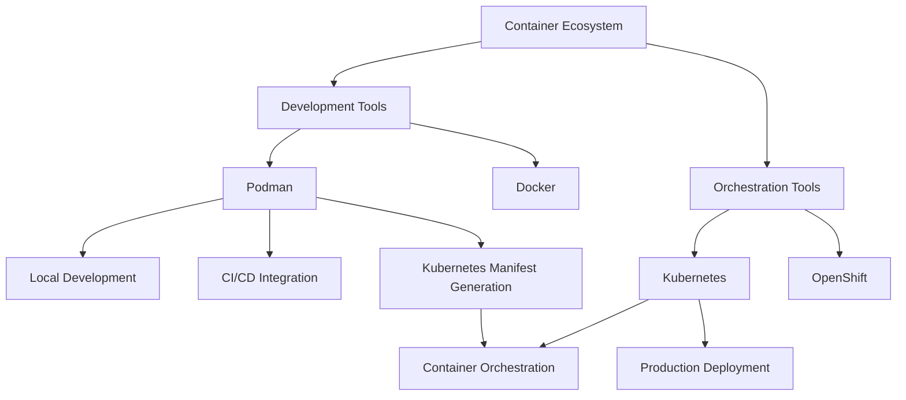

# Integrating Podman with Kubernetes - A Comprehensive Guide

As organizations increasingly adopt container-based infrastructure, the need for flexible and secure container tooling has never been greater. Podman, a daemonless container engine, provides a powerful alternative to Docker with excellent Kubernetes integration capabilities. This guide explores how to effectively use Podman in Kubernetes workflows, bridging the gap between local development and production deployment.

## Understanding Podman and Kubernetes

Podman and Kubernetes serve different but complementary roles in the container ecosystem:



Podman provides several advantages over traditional container engines:

1. **Daemonless Architecture**: No background daemon process required
2. **Rootless Containers**: Enhanced security through non-root container execution
3. **OCI Compliance**: Full compatibility with Open Container Initiative standards
4. **Drop-in Replacement**: Compatible with Docker commands through aliasing
5. **Kubernetes Integration**: Built-in tools for Kubernetes manifest generation

## Podman to Kubernetes Workflow

The core strength of Podman in a Kubernetes environment is its ability to seamlessly translate local containers to Kubernetes resources.

### Basic Translation Workflow

```bash
# Run a container using Podman
podman run -d --name webserver nginx:alpine

# Generate Kubernetes manifest from the running container
podman generate kube webserver > nginx-pod.yaml

# Apply the manifest to a Kubernetes cluster
kubectl apply -f nginx-pod.yaml

# Alternatively, test locally using Podman's "play kube" feature
podman play kube nginx-pod.yaml
```

This workflow allows developers to:

1. Test containers locally with Podman
2. Generate Kubernetes manifests automatically
3. Deploy the same containers to Kubernetes
4. Maintain consistency between development and production

## Working with Pod Configurations

Kubernetes pods often contain multiple containers. Podman supports this concept through its pod management features:

```bash
# Create a pod with multiple containers
podman pod create --name microservice-pod

# Add containers to the pod
podman run -dt --pod microservice-pod --name webapp nginx:alpine
podman run -dt --pod microservice-pod --name api python:3.9-alpine python -m http.server 8000
podman run -dt --pod microservice-pod --name redis redis:alpine

# Generate Kubernetes manifest for the entire pod
podman generate kube microservice-pod > microservice-pod.yaml
```

The generated YAML will include all containers in the pod with their respective configurations:

```yaml
apiVersion: v1
kind: Pod
metadata:
  creationTimestamp: "2023-05-15T10:53:34Z"
  labels:
    app: microservice-pod
  name: microservice-pod
spec:
  containers:
    - image: nginx:alpine
      name: webapp
      ports:
        - containerPort: 80
          hostPort: 80
          protocol: TCP
    - image: python:3.9-alpine
      name: api
      command:
        - python
        - -m
        - http.server
        - "8000"
      ports:
        - containerPort: 8000
          hostPort: 8000
          protocol: TCP
    - image: redis:alpine
      name: redis
      ports:
        - containerPort: 6379
          hostPort: 6379
          protocol: TCP
```

## Development to Production Workflow

A complete workflow for taking an application from development to production with Podman and Kubernetes includes:

### 1. Building Container Images

```bash
# Create a containerized application
mkdir myapp && cd myapp
echo 'console.log("Hello from Podman & Kubernetes!");' > app.js

# Create a Dockerfile
cat > Dockerfile << EOF
FROM node:16-alpine
WORKDIR /app
COPY app.js .
CMD ["node", "app.js"]
EOF

# Build the image
podman build -t myapp:1.0 .

# Test locally
podman run --rm myapp:1.0
```

### 2. Pushing to a Registry

```bash
# Tag for your registry
podman tag myapp:1.0 registry.example.com/myapp:1.0

# Push to registry
podman push registry.example.com/myapp:1.0
```

### 3. Generating Kubernetes Resources

```bash
# Create a deployment container
podman run -d --name myapp-deployment myapp:1.0

# Generate Kubernetes manifest
podman generate kube myapp-deployment > myapp-deployment.yaml

# Modify for production use
# (Add resource limits, replicas, etc.)
```

### 4. Deploying to Kubernetes

```bash
# Deploy to Kubernetes
kubectl apply -f myapp-deployment.yaml

# Verify deployment
kubectl get pods
```

## Integration with Local Kubernetes Development

For local development with Kubernetes clusters, Podman integrates well with tools like Kind (Kubernetes in Docker):

```bash
# Save Podman image to a tarball
podman save -o myapp.tar myapp:1.0

# Load image into Kind cluster
kind load image-archive myapp.tar

# Apply Kubernetes manifest
kubectl apply -f myapp-deployment.yaml
```

## Advanced Podman Kubernetes Features

### Security Context Generation

Podman can generate Kubernetes security contexts from local container configurations:

```bash
# Run a container with security options
podman run --security-opt=no-new-privileges --cap-drop=ALL --cap-add=NET_BIND_SERVICE -d --name secure-nginx nginx

# Generate manifest with security context
podman generate kube secure-nginx > secure-nginx.yaml
```

The resulting YAML will include appropriate security contexts:

```yaml
apiVersion: v1
kind: Pod
metadata:
  name: secure-nginx
spec:
  containers:
    - name: secure-nginx
      image: nginx
      securityContext:
        allowPrivilegeEscalation: false
        capabilities:
          drop:
            - ALL
          add:
            - NET_BIND_SERVICE
```

### Volume and ConfigMap Handling

Podman can translate local volumes to Kubernetes persistent volumes and config maps:

```bash
# Create a config file
echo "server { listen 80; root /usr/share/nginx/html; }" > nginx.conf

# Run with bind mount
podman run -v ./nginx.conf:/etc/nginx/conf.d/default.conf:Z -d --name nginx-config nginx

# Generate Kubernetes manifest
podman generate kube nginx-config > nginx-with-config.yaml
```

The generated manifest will include volume definitions that you can adapt to PersistentVolumes or ConfigMaps.

### Resource Limits and Requests

Setting container resources in Podman translates to Kubernetes resource specifications:

```bash
# Run container with resource limits
podman run --memory=512m --cpus=0.5 -d --name limited-nginx nginx

# Generate manifest with resource specifications
podman generate kube limited-nginx > limited-nginx.yaml
```

## Best Practices

### 1. Maintain Image Consistency

Use the same container images across development and production to avoid "works on my machine" problems:

```bash
# Use specific image tags, not 'latest'
podman run -d --name webapp myapp:1.0.3
```

### 2. Use Multi-Stage Builds

Create smaller, more secure images using multi-stage builds:

```dockerfile
# Build stage
FROM node:16-alpine AS builder
WORKDIR /app
COPY package*.json ./
RUN npm install
COPY . .
RUN npm run build

# Production stage
FROM nginx:alpine
COPY --from=builder /app/build /usr/share/nginx/html
```

### 3. Implement Rootless Containers

Enhance security by running containers without root privileges:

```bash
# Run rootless container
podman run --user 1000:1000 -d --name rootless-nginx nginx
```

### 4. Test Generated Manifests

Always validate generated Kubernetes manifests before applying to production:

```bash
# Validate Kubernetes YAML
kubectl apply --dry-run=client -f nginx-pod.yaml

# Test with Podman first
podman play kube nginx-pod.yaml
```

### 5. Augment Generated Manifests for Production

Add production-specific configurations to generated manifests:

```yaml
# Add production enhancements
apiVersion: v1
kind: Pod
metadata:
  name: nginx
  labels:
    app: nginx
    environment: production
spec:
  replicas: 3 # Add for Deployment
  containers:
    - name: nginx
      image: nginx:1.21-alpine
      resources:
        limits:
          memory: 512Mi
          cpu: 500m
        requests:
          memory: 256Mi
          cpu: 250m
      livenessProbe: # Add health checks
        httpGet:
          path: /
          port: 80
```

## Troubleshooting

### Image Availability Issues

If Kubernetes can't find your images:

```bash
# Verify image exists
podman images | grep myapp

# Check if image is pushed to an accessible registry
podman push registry.example.com/myapp:1.0

# Update image pull policy in Kubernetes manifest
spec:
  containers:
  - name: myapp
    image: registry.example.com/myapp:1.0
    imagePullPolicy: Always
```

### Resource Specification Errors

If pods fail due to resource issues:

```bash
# Check resource usage in Podman
podman stats

# Modify resource specifications
podman generate kube --cpu-limit=500m --memory-limit=512Mi myapp
```

### Security Context Problems

If containers fail due to security issues:

```bash
# Identify capabilities needed
podman inspect --format '{{.EffectiveCapabilities}}' myapp

# Generate Kubernetes manifest with appropriate security context
podman generate kube --security-opt="seccomp=unconfined" myapp
```

## Converting Complex Applications

For more complex applications, consider using Podman Compose to convert Docker Compose files to Kubernetes:

```bash
# Install podman-compose
pip install podman-compose

# Convert docker-compose to Kubernetes
podman-compose -f docker-compose.yml kube > k8s-deployment.yaml
```

## Comparison with Other Approaches

| Feature            | Podman   | Docker + Kompose | kubectl |
| ------------------ | -------- | ---------------- | ------- |
| Daemon Requirement | No       | Yes              | N/A     |
| Root Privileges    | Optional | Required         | N/A     |
| k8s Integration    | Native   | Via Kompose      | Native  |
| Security           | Enhanced | Standard         | N/A     |
| OCI Compliance     | Full     | Full             | N/A     |

## Conclusion

Integrating Podman with Kubernetes provides a seamless path from local development to production deployment. The ability to generate Kubernetes manifests directly from running containers bridges the development-operations gap and helps ensure consistency across environments.

By leveraging Podman's rootless security features, daemonless architecture, and Kubernetes integration capabilities, teams can build more secure, reliable container workflows that work consistently from development laptops to production clusters.

Whether you're managing a small application or a complex microservice architecture, Podman's integration with Kubernetes offers a powerful toolset for modern container workflows.

## Resources

- [Podman Documentation](https://docs.podman.io/)
- [Kubernetes Documentation](https://kubernetes.io/docs/)
- [OCI Container Specification](https://github.com/opencontainers/runtime-spec)
- [Podman-Compose GitHub](https://github.com/containers/podman-compose)
- [Kind Documentation](https://kind.sigs.k8s.io/)
- [Podman Security Guide](https://github.com/containers/podman/blob/main/docs/tutorials/security.md)
