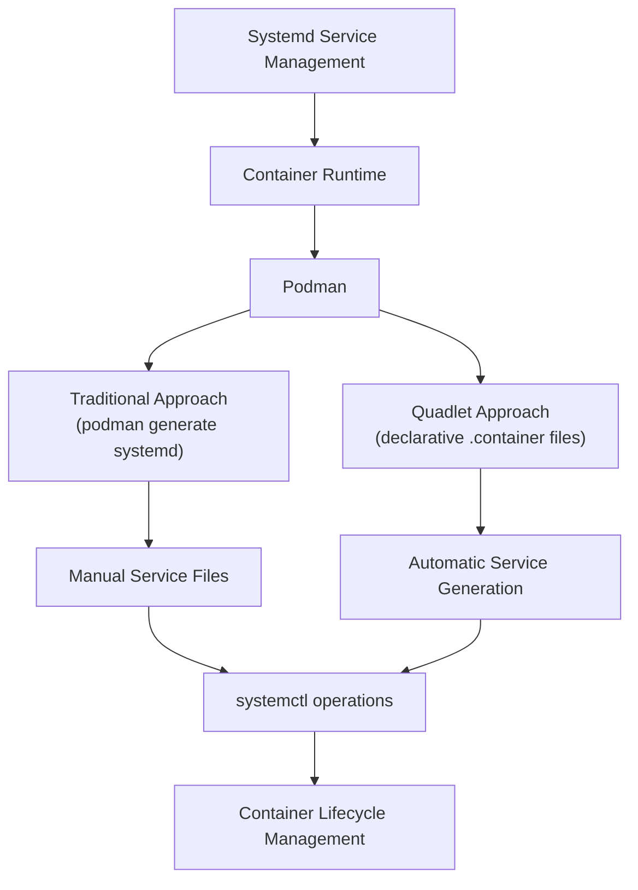

# Managing Podman Containers with Systemd - Traditional Methods vs. Quadlet

Efficiently managing containers in production environments requires reliable automation and integration with the host system's service management. For Linux systems using systemd, there are two primary approaches to running Podman containers as services: the traditional systemd service file approach and the newer, more declarative Quadlet method. This comprehensive guide explores both approaches, helping you choose the right strategy for your container management needs.

## Understanding Container Management with Systemd

Systemd's unit file system provides a powerful framework for service management, offering features like dependency handling, automatic restarts, and parallel execution. When combined with Podman's daemonless container engine, it creates a robust solution for running containers that:

- Start automatically at boot time
- Restart on failure
- Manage dependencies between services
- Provide logging through journald
- Allow for fine-grained resource control
- Support for rootless containers



## Traditional Approach: Podman with Custom Systemd Service Files

The traditional approach involves creating a systemd service file that defines how your container should run. This method gives you direct control over the service configuration.

### Step 1: Creating Your Container

First, define the container you want to run:

```bash
podman run -d \
  --name ubuntu-service \
  --restart=always \
  ubuntu:latest \
  tail -f /dev/null
```

### Step 2: Creating the Systemd Service File

Create a systemd service file in your user's systemd directory for rootless containers:

```bash
mkdir -p ~/.config/systemd/user/
```

Then create a service file with detailed container specifications:

```bash
vi ~/.config/systemd/user/ubuntu-service.service
```

```ini
[Unit]
Description=Ubuntu Service Container
Wants=network-online.target
After=network-online.target
RequiresMountsFor=%t/containers

[Service]
Environment=PODMAN_SYSTEMD_UNIT=%n
Restart=on-failure
TimeoutStopSec=70
ExecStartPre=/bin/rm -f %t/%n.ctr-id
ExecStart=/usr/bin/podman run \
    --cidfile=%t/%n.ctr-id \
    --cgroups=no-conmon \
    --rm \
    --sdnotify=conmon \
    --replace \
    --name ubuntu-service \
    ubuntu:latest \
    tail -f /dev/null
ExecStop=/usr/bin/podman stop --ignore --cidfile=%t/%n.ctr-id
ExecStopPost=/usr/bin/podman rm -f --ignore --cidfile=%t/%n.ctr-id
Type=notify
NotifyAccess=all

[Install]
WantedBy=default.target
```

### Step 3: Enabling and Starting the Service

```bash
# Reload systemd to recognize the new service
systemctl --user daemon-reload

# Enable the service to start on boot
systemctl --user enable ubuntu-service

# Start the service
systemctl --user start ubuntu-service

# Enable lingering for your user (allows services to run without login)
loginctl enable-linger $USER
```

### Step 4: Managing Your Service

```bash
# Check service status
systemctl --user status ubuntu-service

# View logs
journalctl --user -u ubuntu-service

# Stop the service
systemctl --user stop ubuntu-service

# Restart the service
systemctl --user restart ubuntu-service
```

### Generating Service Files Automatically

Podman can generate systemd service files for existing containers:

```bash
# Create a container first
podman run -d --name webapp nginx:latest

# Generate a systemd service file
podman generate systemd --name webapp > webapp.service
```

## Modern Approach: Podman with Quadlet

Quadlet is a newer approach that allows you to define container services declaratively through simple configuration files. It's now built into Podman (since version 4.0) and serves as a more elegant solution for container service management.

### Step 1: Creating the Directory Structure

For user services (rootless):

```bash
mkdir -p ~/.config/containers/systemd/
```

For system services (root):

```bash
sudo mkdir -p /etc/containers/systemd/
```

### Step 2: Creating the Quadlet Container File

Create a file with the `.container` extension:

```bash
vi ~/.config/containers/systemd/ubuntu-service.container
```

```ini
[Unit]
Description=Ubuntu Service Container
After=network-online.target

[Container]
Image=docker.io/library/ubuntu:latest
# Keep container running
Exec=tail -f /dev/null

# Resource limits (optional)
Memory=1G
CPUQuota=100%

# Environment variables (optional)
Environment=MY_VAR=value

# Volume mounts (optional)
Volume=/path/on/host:/path/in/container:Z

[Service]
Restart=always
TimeoutStartSec=900

[Install]
WantedBy=default.target
```

### Step 3: Enabling and Starting the Service

```bash
# Reload systemd to detect the new container configuration
systemctl --user daemon-reload

# Enable and start the service
systemctl --user enable --now container-ubuntu-service
```

### Step 4: Managing Your Service

```bash
# Check service status
systemctl --user status container-ubuntu-service

# View logs
journalctl --user -u container-ubuntu-service

# Restart the service
systemctl --user restart container-ubuntu-service
```

## Comparison: Traditional vs. Quadlet Approach

Let's compare these two approaches across various dimensions:

| Feature                 | Traditional Approach                           | Quadlet Approach                              |
| ----------------------- | ---------------------------------------------- | --------------------------------------------- |
| **Configuration Style** | Imperative (full service file)                 | Declarative (focused on container parameters) |
| **Maintenance**         | Manual updates required when container changes | Automatic service generation                  |
| **Complexity**          | More complex service files                     | Simplified configuration                      |
| **Control**             | Fine-grained control over all aspects          | Container-focused with reasonable defaults    |
| **Integration**         | Manual integration with systemd                | Built-in integration                          |
| **Updates**             | May need regeneration after Podman updates     | Handles Podman updates transparently          |
| **Storage**             | Lives in systemd directories                   | Lives in container configuration directories  |
| **Features**            | All systemd features available                 | Most common container features pre-configured |
| **Learning Curve**      | Steeper (requires systemd knowledge)           | Gentler (focuses on container parameters)     |

## Advanced Quadlet Features

Quadlet supports more than just containers. It has several specialized file types for different container resources:

### Volume Management

Create a persistent named volume with a `.volume` file:

```ini
# ~/.config/containers/systemd/data-volume.volume
[Volume]
Driver=local
Device=tmpfs
UID=1000
GID=1000
```

### Network Configuration

Define a custom network with a `.network` file:

```ini
# ~/.config/containers/systemd/app-network.network
[Network]
Driver=bridge
Subnet=192.168.100.0/24
Gateway=192.168.100.1
IPRange=192.168.100.0/24
```

### Pod Management

Create a pod with multiple containers using a `.pod` file:

```ini
# ~/.config/containers/systemd/web-app.pod
[Pod]
Name=web-app

[Container]
Name=web
Image=nginx:latest
Volume=/var/www/html:/usr/share/nginx/html:ro,Z

[Container]
Name=redis
Image=redis:alpine
```

### Kubernetes-Style Deployments

Deploy applications defined in Kubernetes YAML with a `.kube` file:

```ini
# ~/.config/containers/systemd/kubernetes-app.kube
[Unit]
Description=Kubernetes-style Deployment

[Kube]
Yaml=./deployment.yaml
```

## Practical Examples

### Example 1: Web Server with Persistent Storage

Here's how to create a NGINX web server with persistent storage using Quadlet:

```ini
# ~/.config/containers/systemd/web-server.container
[Unit]
Description=NGINX Web Server
After=network-online.target

[Container]
Image=docker.io/library/nginx:latest
PublishPort=8080:80
Volume=web-data:/usr/share/nginx/html:Z

[Service]
Restart=always

[Install]
WantedBy=default.target
```

```ini
# ~/.config/containers/systemd/web-data.volume
[Volume]
Driver=local
```

### Example 2: Database Server with Resource Limits

```ini
# ~/.config/containers/systemd/postgres-db.container
[Unit]
Description=PostgreSQL Database
After=network-online.target

[Container]
Image=docker.io/library/postgres:14
Environment=POSTGRES_PASSWORD=secret
Environment=POSTGRES_USER=myapp
Environment=POSTGRES_DB=myapp_db
Volume=postgres-data:/var/lib/postgresql/data:Z
PublishPort=5432:5432
Memory=2G
CPUQuota=200%

[Service]
Restart=always
TimeoutStartSec=120

[Install]
WantedBy=default.target
```

```ini
# ~/.config/containers/systemd/postgres-data.volume
[Volume]
Driver=local
```

### Example 3: Multi-Container Application with a Network

```ini
# ~/.config/containers/systemd/app-network.network
[Network]
Driver=bridge
```

```ini
# ~/.config/containers/systemd/web-app.container
[Unit]
Description=Web Application
After=network-online.target
After=container-redis-cache.service
Requires=container-redis-cache.service

[Container]
Image=docker.io/myapp:latest
PublishPort=8080:80
Network=app-network
Environment=REDIS_HOST=redis-cache
Environment=REDIS_PORT=6379

[Service]
Restart=always

[Install]
WantedBy=default.target
```

```ini
# ~/.config/containers/systemd/redis-cache.container
[Unit]
Description=Redis Cache
After=network-online.target

[Container]
Image=docker.io/library/redis:alpine
Network=app-network
AddHost=redis-cache:127.0.0.1

[Service]
Restart=always

[Install]
WantedBy=default.target
```

## Best Practices

### Security Considerations

1. **Use rootless containers when possible**:

   ```ini
   [Container]
   User=1000:1000
   ```

2. **Apply SELinux labels to volumes**:

   ```ini
   [Container]
   Volume=/path/on/host:/path/in/container:Z
   ```

3. **Limit container capabilities**:
   ```ini
   [Container]
   DropCapability=ALL
   AddCapability=NET_BIND_SERVICE
   ```

### Resource Management

1. **Set memory limits to prevent OOM issues**:

   ```ini
   [Container]
   Memory=1G
   MemorySwap=2G
   ```

2. **Configure CPU constraints**:
   ```ini
   [Container]
   CPUShares=1024
   CPUQuota=50%
   ```

### Service Dependencies

1. **Ensure network is available**:

   ```ini
   [Unit]
   After=network-online.target
   Wants=network-online.target
   ```

2. **Create service dependencies**:
   ```ini
   [Unit]
   After=container-database.service
   Requires=container-database.service
   ```

### Observability

1. **Configure healthchecks**:
   ```ini
   [Container]
   HealthCmd=/bin/sh -c "wget -q --spider http://localhost:8080 || exit 1"
   HealthInterval=30s
   HealthTimeout=10s
   HealthStartPeriod=5s
   HealthRetries=3
   ```

## Migrating from Traditional to Quadlet

If you're currently using traditional systemd service files for Podman containers, here's how to migrate to Quadlet:

### Step 1: Identify Current Container Parameters

Extract the container run parameters from your existing service file:

```bash
# From a traditional service file like this:
ExecStart=/usr/bin/podman run \
    --name webapp \
    -v /data:/app/data:Z \
    -p 8080:80 \
    -e DATABASE_URL=postgres://user:pass@db/mydb \
    nginx:latest
```

### Step 2: Create an Equivalent Quadlet File

```ini
# ~/.config/containers/systemd/webapp.container
[Unit]
Description=Web Application

[Container]
Image=nginx:latest
Volume=/data:/app/data:Z
PublishPort=8080:80
Environment=DATABASE_URL=postgres://user:pass@db/mydb

[Service]
Restart=always

[Install]
WantedBy=default.target
```

### Step 3: Test and Switch Over

```bash
# Stop and disable the old service
systemctl --user stop webapp
systemctl --user disable webapp

# Enable and start the new Quadlet-based service
systemctl --user daemon-reload
systemctl --user enable --now container-webapp
```

## Troubleshooting

### Service Won't Start

If your Quadlet-managed container won't start, check these common issues:

1. **Permission problems**:

   ```bash
   # Check journalctl for permission errors
   journalctl --user -u container-webapp -n 50
   ```

2. **Image not found**:

   ```bash
   # Pull the image manually to verify access
   podman pull nginx:latest
   ```

3. **Port conflicts**:
   ```bash
   # Check if ports are already in use
   ss -tulpn | grep 8080
   ```

### Container Crashes

If your container starts but then crashes:

1. **Check container logs**:

   ```bash
   # Look at the container logs directly
   podman logs $(podman ps -a --filter name=webapp --format "{{.ID}}")
   ```

2. **View systemd journal**:

   ```bash
   # Examine journal logs
   journalctl --user -u container-webapp -f
   ```

3. **Increase debug output**:
   ```bash
   # Add debug output to your container file
   [Service]
   Environment=PODMAN_LOG_LEVEL=debug
   ```

### Resource Constraints

If your container is hitting resource limits:

1. **Check container resource usage**:

   ```bash
   podman stats
   ```

2. **Adjust limits in your Quadlet file**:
   ```ini
   [Container]
   Memory=2G  # Increase from previous value
   CPUQuota=200%  # Allow use of 2 full CPUs
   ```

## Conclusion

Both the traditional method and Quadlet approach offer effective ways to integrate Podman containers with systemd, but they serve different needs:

- **Traditional Approach**: Offers maximum flexibility and control but requires more maintenance and deeper systemd knowledge
- **Quadlet Approach**: Provides a simpler, more declarative method that's easier to maintain and more focused on container-specific parameters

For most users, especially those building new container deployments, Quadlet represents the future of Podman-systemd integration with its simplified syntax, automatic service generation, and built-in support for complex container resources like pods and networks. The traditional approach remains valuable for users who need very specific systemd configurations or who are maintaining existing deployments.

Whether you choose the traditional method or Quadlet, integrating your containers with systemd brings considerable benefits in terms of reliability, lifecycle management, and integration with the host system—making your containerized applications easier to manage and more resilient in production environments.

## Resources

- [Podman Documentation](https://docs.podman.io/)
- [Quadlet Documentation](https://docs.podman.io/en/latest/markdown/podman-systemd.unit.5.html)
- [Systemd Documentation](https://www.freedesktop.org/software/systemd/man/systemd.service.html)
- [Podman GitHub Repository](https://github.com/containers/podman)
- [Container Best Practices](https://github.com/containers/common/blob/main/docs/containers.conf.5.md)
