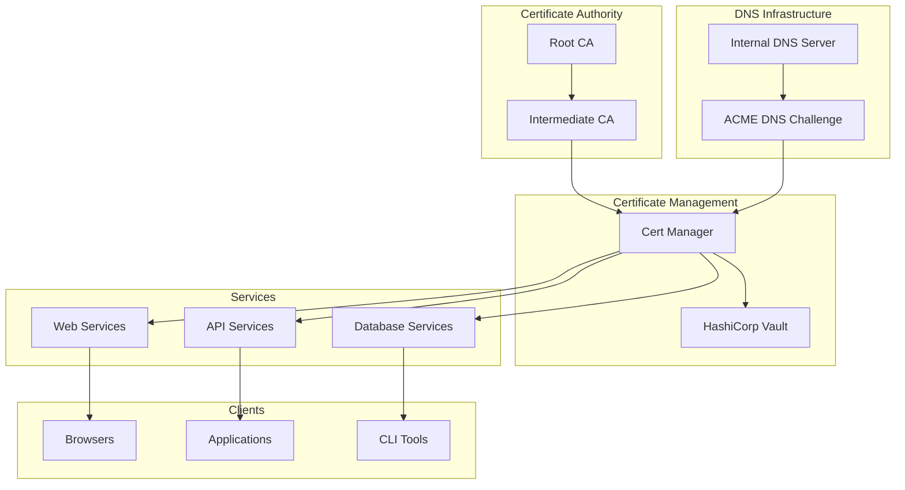
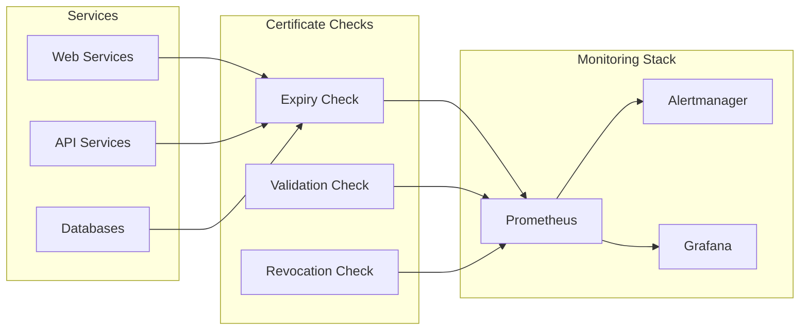

# Building Secure Local SSL Infrastructure with DNS

Creating a secure internal SSL/TLS infrastructure is essential for protecting communication between services in local networks, development environments, and private clouds. This guide provides a complete implementation for building a production-ready local SSL infrastructure integrated with DNS for automatic certificate validation and distribution.

## Architecture Overview

A properly designed local SSL infrastructure consists of several key components working together:



## Setting Up the Certificate Authority

### Step 1: Create Root Certificate Authority

First, establish a secure root CA that will be the trust anchor for your infrastructure:

```bash
#!/bin/bash
# create-root-ca.sh

# Configuration
CA_DIR="/etc/ssl/ca"
ROOT_KEY="$CA_DIR/private/root-ca.key"
ROOT_CERT="$CA_DIR/certs/root-ca.crt"
ROOT_CONFIG="$CA_DIR/root-ca.conf"

# Create directory structure
mkdir -p "$CA_DIR"/{certs,crl,newcerts,private,requests}
chmod 700 "$CA_DIR/private"
touch "$CA_DIR/index.txt"
echo 1000 > "$CA_DIR/serial"

# Create Root CA configuration
cat > "$ROOT_CONFIG" << 'EOF'
[ ca ]
default_ca = CA_default

[ CA_default ]
dir               = /etc/ssl/ca
certs             = $dir/certs
crl_dir           = $dir/crl
new_certs_dir     = $dir/newcerts
database          = $dir/index.txt
serial            = $dir/serial
RANDFILE          = $dir/private/.rand
private_key       = $dir/private/root-ca.key
certificate       = $dir/certs/root-ca.crt
crlnumber         = $dir/crlnumber
crl               = $dir/crl/root-ca.crl
crl_extensions    = crl_ext
default_crl_days  = 30
default_md        = sha256
name_opt          = ca_default
cert_opt          = ca_default
default_days      = 3650
preserve          = no
policy            = policy_loose

[ policy_loose ]
countryName             = optional
stateOrProvinceName     = optional
localityName            = optional
organizationName        = optional
organizationalUnitName  = optional
commonName              = supplied
emailAddress            = optional

[ req ]
default_bits        = 4096
distinguished_name  = req_distinguished_name
string_mask         = utf8only
default_md          = sha256
x509_extensions     = v3_ca

[ req_distinguished_name ]
countryName                     = Country Name (2 letter code)
stateOrProvinceName             = State or Province Name
localityName                    = Locality Name
0.organizationName              = Organization Name
organizationalUnitName          = Organizational Unit Name
commonName                      = Common Name
emailAddress                    = Email Address

[ v3_ca ]
subjectKeyIdentifier = hash
authorityKeyIdentifier = keyid:always,issuer
basicConstraints = critical, CA:true
keyUsage = critical, digitalSignature, cRLSign, keyCertSign

[ v3_intermediate_ca ]
subjectKeyIdentifier = hash
authorityKeyIdentifier = keyid:always,issuer
basicConstraints = critical, CA:true, pathlen:0
keyUsage = critical, digitalSignature, cRLSign, keyCertSign

[ crl_ext ]
authorityKeyIdentifier=keyid:always
EOF

# Generate Root CA private key
openssl genrsa -aes256 -out "$ROOT_KEY" 4096
chmod 400 "$ROOT_KEY"

# Generate Root CA certificate
openssl req -config "$ROOT_CONFIG" \
    -key "$ROOT_KEY" \
    -new -x509 -days 7300 -sha256 -extensions v3_ca \
    -out "$ROOT_CERT" \
    -subj "/C=US/ST=State/L=City/O=Organization/OU=IT/CN=Root CA"

# Verify Root CA certificate
openssl x509 -noout -text -in "$ROOT_CERT"
```

### Step 2: Create Intermediate Certificate Authority

The intermediate CA will issue certificates for services:

```bash
#!/bin/bash
# create-intermediate-ca.sh

# Configuration
CA_DIR="/etc/ssl/ca"
INT_DIR="$CA_DIR/intermediate"
INT_KEY="$INT_DIR/private/intermediate-ca.key"
INT_CSR="$INT_DIR/csr/intermediate-ca.csr"
INT_CERT="$INT_DIR/certs/intermediate-ca.crt"
INT_CONFIG="$INT_DIR/intermediate-ca.conf"

# Create intermediate directory structure
mkdir -p "$INT_DIR"/{certs,crl,csr,newcerts,private}
chmod 700 "$INT_DIR/private"
touch "$INT_DIR/index.txt"
echo 1000 > "$INT_DIR/serial"
echo 1000 > "$INT_DIR/crlnumber"

# Create Intermediate CA configuration
cat > "$INT_CONFIG" << 'EOF'
[ ca ]
default_ca = CA_default

[ CA_default ]
dir               = /etc/ssl/ca/intermediate
certs             = $dir/certs
crl_dir           = $dir/crl
new_certs_dir     = $dir/newcerts
database          = $dir/index.txt
serial            = $dir/serial
RANDFILE          = $dir/private/.rand
private_key       = $dir/private/intermediate-ca.key
certificate       = $dir/certs/intermediate-ca.crt
crlnumber         = $dir/crlnumber
crl               = $dir/crl/intermediate-ca.crl
crl_extensions    = crl_ext
default_crl_days  = 30
default_md        = sha256
name_opt          = ca_default
cert_opt          = ca_default
default_days      = 375
preserve          = no
policy            = policy_loose

[ policy_loose ]
countryName             = optional
stateOrProvinceName     = optional
localityName            = optional
organizationName        = optional
organizationalUnitName  = optional
commonName              = supplied
emailAddress            = optional

[ req ]
default_bits        = 4096
distinguished_name  = req_distinguished_name
string_mask         = utf8only
default_md          = sha256

[ req_distinguished_name ]
countryName                     = Country Name (2 letter code)
stateOrProvinceName             = State or Province Name
localityName                    = Locality Name
0.organizationName              = Organization Name
organizationalUnitName          = Organizational Unit Name
commonName                      = Common Name
emailAddress                    = Email Address

[ v3_intermediate_ca ]
subjectKeyIdentifier = hash
authorityKeyIdentifier = keyid:always,issuer
basicConstraints = critical, CA:true, pathlen:0
keyUsage = critical, digitalSignature, cRLSign, keyCertSign

[ server_cert ]
basicConstraints = CA:FALSE
nsCertType = server
nsComment = "OpenSSL Generated Server Certificate"
subjectKeyIdentifier = hash
authorityKeyIdentifier = keyid,issuer:always
keyUsage = critical, digitalSignature, keyEncipherment
extendedKeyUsage = serverAuth
subjectAltName = @alt_names

[ crl_ext ]
authorityKeyIdentifier=keyid:always

[ ocsp ]
basicConstraints = CA:FALSE
subjectKeyIdentifier = hash
authorityKeyIdentifier = keyid,issuer
keyUsage = critical, digitalSignature
extendedKeyUsage = critical, OCSPSigning
EOF

# Generate Intermediate CA private key
openssl genrsa -aes256 -out "$INT_KEY" 4096
chmod 400 "$INT_KEY"

# Generate Intermediate CA certificate request
openssl req -config "$INT_CONFIG" -new -sha256 \
    -key "$INT_KEY" \
    -out "$INT_CSR" \
    -subj "/C=US/ST=State/L=City/O=Organization/OU=IT/CN=Intermediate CA"

# Sign Intermediate CA certificate with Root CA
openssl ca -config "$CA_DIR/root-ca.conf" \
    -extensions v3_intermediate_ca \
    -days 3650 -notext -md sha256 \
    -in "$INT_CSR" \
    -out "$INT_CERT"

# Create certificate chain
cat "$INT_CERT" "$CA_DIR/certs/root-ca.crt" > "$INT_DIR/certs/ca-chain.crt"

# Verify certificate chain
openssl verify -CAfile "$CA_DIR/certs/root-ca.crt" "$INT_CERT"
```

## DNS Integration for Certificate Validation

### CoreDNS Configuration with ACME Support

Configure CoreDNS to handle DNS challenges for automatic certificate issuance:

```yaml
# coredns-config.yaml
apiVersion: v1
kind: ConfigMap
metadata:
  name: coredns-config
data:
  Corefile: |
    .:53 {
        errors
        health {
            lameduck 5s
        }
        ready
        
        # Internal zone
        file /etc/coredns/zones/internal.zone internal.company.com {
            reload 30s
        }
        
        # ACME DNS challenge support
        file /etc/coredns/zones/acme.zone _acme-challenge.internal.company.com {
            reload 5s
        }
        
        # Forwarding for external domains
        forward . 8.8.8.8 8.8.4.4 {
            max_concurrent 1000
        }
        
        cache 30
        loop
        reload
        loadbalance
        
        # Prometheus metrics
        prometheus :9153
        
        # Logging
        log . {
            class error
        }
    }

  internal.zone: |
    $ORIGIN internal.company.com.
    $TTL 3600
    @   IN  SOA ns1.internal.company.com. admin.internal.company.com. (
            2024010101  ; Serial
            3600        ; Refresh
            1800        ; Retry
            604800      ; Expire
            86400       ; Minimum TTL
    )

    ; Name servers
    @   IN  NS  ns1.internal.company.com.
    @   IN  NS  ns2.internal.company.com.

    ; A records
    ns1     IN  A   10.0.1.10
    ns2     IN  A   10.0.1.11
    ca      IN  A   10.0.1.20
    vault   IN  A   10.0.1.21

    ; Service records
    web     IN  A   10.0.2.10
    api     IN  A   10.0.2.20
    db      IN  A   10.0.2.30

    ; CNAME records
    www     IN  CNAME   web

  acme.zone: |
    $ORIGIN _acme-challenge.internal.company.com.
    $TTL 60
    @   IN  SOA ns1.internal.company.com. admin.internal.company.com. (
            2024010101  ; Serial
            60          ; Refresh
            30          ; Retry
            3600        ; Expire
            60          ; Minimum TTL
    )
```

### DNS-01 Challenge Automation

Implement automated DNS-01 challenge handling:

```python
#!/usr/bin/env python3
# dns_challenge_handler.py

import os
import time
import dns.resolver
import dns.update
import dns.tsigkeyring
import dns.query
from flask import Flask, request, jsonify

app = Flask(__name__)

# Configuration
DNS_SERVER = os.environ.get('DNS_SERVER', '10.0.1.10')
DNS_ZONE = os.environ.get('DNS_ZONE', 'internal.company.com')
TSIG_KEY_NAME = os.environ.get('TSIG_KEY_NAME', 'acme-key')
TSIG_KEY = os.environ.get('TSIG_KEY', 'base64-encoded-key')
TSIG_ALGO = os.environ.get('TSIG_ALGO', 'hmac-sha256')

# Create TSIG keyring
keyring = dns.tsigkeyring.from_text({
    TSIG_KEY_NAME: TSIG_KEY
})

@app.route('/present', methods=['POST'])
def present_challenge():
    """Add DNS TXT record for ACME challenge"""
    data = request.json
    domain = data.get('domain')
    token = data.get('token')

    if not domain or not token:
        return jsonify({'error': 'Missing domain or token'}), 400

    # Create DNS update
    update = dns.update.Update(DNS_ZONE, keyring=keyring, keyalgorithm=TSIG_ALGO)

    # Add TXT record
    txt_name = f'_acme-challenge.{domain}'
    update.add(txt_name, 60, 'TXT', f'"{token}"')

    try:
        response = dns.query.tcp(update, DNS_SERVER)

        # Wait for DNS propagation
        time.sleep(5)

        # Verify record exists
        resolver = dns.resolver.Resolver()
        resolver.nameservers = [DNS_SERVER]
        answers = resolver.resolve(f'{txt_name}.{DNS_ZONE}', 'TXT')

        for rdata in answers:
            if token in str(rdata):
                return jsonify({'status': 'success'}), 200

        return jsonify({'error': 'Record not found after creation'}), 500

    except Exception as e:
        return jsonify({'error': str(e)}), 500

@app.route('/cleanup', methods=['POST'])
def cleanup_challenge():
    """Remove DNS TXT record after challenge completion"""
    data = request.json
    domain = data.get('domain')

    if not domain:
        return jsonify({'error': 'Missing domain'}), 400

    # Create DNS update
    update = dns.update.Update(DNS_ZONE, keyring=keyring, keyalgorithm=TSIG_ALGO)

    # Delete TXT record
    txt_name = f'_acme-challenge.{domain}'
    update.delete(txt_name, 'TXT')

    try:
        response = dns.query.tcp(update, DNS_SERVER)
        return jsonify({'status': 'success'}), 200
    except Exception as e:
        return jsonify({'error': str(e)}), 500

if __name__ == '__main__':
    app.run(host='0.0.0.0', port=8080)
```

## Automated Certificate Management

### Step-CA for ACME Protocol

Deploy Step-CA as an ACME server integrated with your CA:

```yaml
# step-ca-config.yaml
{
  "root": "/etc/step-ca/certs/root-ca.crt",
  "federatedRoots": [],
  "crt": "/etc/step-ca/certs/intermediate-ca.crt",
  "key": "/etc/step-ca/secrets/intermediate-ca.key",
  "address": ":443",
  "insecureAddress": "",
  "dnsNames": ["ca.internal.company.com"],
  "logger": { "format": "json" },
  "db": { "type": "badgerv2", "dataSource": "/etc/step-ca/db" },
  "authority":
    {
      "provisioners":
        [
          {
            "type": "ACME",
            "name": "acme",
            "forceCN": true,
            "claims":
              {
                "maxTLSCertDuration": "720h",
                "defaultTLSCertDuration": "168h",
              },
          },
          {
            "type": "JWK",
            "name": "admin",
            "key":
              {
                "use": "sig",
                "kty": "EC",
                "kid": "admin-key-id",
                "crv": "P-256",
                "alg": "ES256",
                "x": "base64-x-coordinate",
                "y": "base64-y-coordinate",
              },
            "encryptedKey": "encrypted-private-key",
            "claims":
              {
                "maxTLSCertDuration": "8760h",
                "defaultTLSCertDuration": "720h",
                "enableSSHCA": true,
              },
          },
        ],
    },
  "tls":
    {
      "cipherSuites":
        [
          "TLS_ECDHE_ECDSA_WITH_AES_256_GCM_SHA384",
          "TLS_ECDHE_RSA_WITH_AES_256_GCM_SHA384",
          "TLS_ECDHE_ECDSA_WITH_AES_128_GCM_SHA256",
          "TLS_ECDHE_RSA_WITH_AES_128_GCM_SHA256",
        ],
      "minVersion": 1.2,
      "maxVersion": 1.3,
      "renegotiation": false,
    },
}
```

### Cert-Manager Integration

Deploy cert-manager for Kubernetes environments:

```yaml
# cert-manager-issuer.yaml
apiVersion: cert-manager.io/v1
kind: ClusterIssuer
metadata:
  name: internal-ca-issuer
spec:
  acme:
    server: https://ca.internal.company.com/acme/acme/directory
    email: admin@company.com
    privateKeySecretRef:
      name: internal-ca-account-key
    solvers:
      - dns01:
          webhook:
            groupName: acme.company.com
            solverName: internal-dns
            config:
              endpoint: http://dns-challenge-handler:8080
              zone: internal.company.com
---
apiVersion: v1
kind: Secret
metadata:
  name: ca-root-cert
  namespace: cert-manager
type: Opaque
data:
  ca.crt: # base64 encoded root CA certificate
```

### Certificate Lifecycle Automation

```bash
#!/bin/bash
# cert-lifecycle-manager.sh

# Configuration
CERT_DIR="/etc/ssl/services"
CA_URL="https://ca.internal.company.com"
RENEWAL_DAYS=30
LOG_FILE="/var/log/cert-manager.log"

# Logging function
log() {
    echo "[$(date +'%Y-%m-%d %H:%M:%S')] $1" | tee -a "$LOG_FILE"
}

# Check certificate expiration
check_cert_expiry() {
    local cert_file=$1
    local days_until_expiry

    if [[ -f "$cert_file" ]]; then
        days_until_expiry=$(openssl x509 -enddate -noout -in "$cert_file" | \
            cut -d= -f2 | xargs -I {} date -d {} +%s | \
            awk -v now=$(date +%s) '{print int(($1-now)/86400)}')

        echo "$days_until_expiry"
    else
        echo "-1"
    fi
}

# Request new certificate using ACME
request_certificate() {
    local domain=$1
    local cert_path="$CERT_DIR/$domain"

    log "Requesting certificate for $domain"

    # Create certificate directory
    mkdir -p "$cert_path"

    # Request certificate using step CLI
    step ca certificate "$domain" \
        "$cert_path/cert.pem" \
        "$cert_path/key.pem" \
        --ca-url="$CA_URL" \
        --root="/etc/ssl/ca/certs/root-ca.crt" \
        --acme="$CA_URL/acme/acme/directory" \
        --kty=RSA \
        --size=2048

    if [[ $? -eq 0 ]]; then
        log "Certificate successfully obtained for $domain"

        # Set proper permissions
        chmod 644 "$cert_path/cert.pem"
        chmod 600 "$cert_path/key.pem"

        # Create combined certificate chain
        cat "$cert_path/cert.pem" \
            "/etc/ssl/ca/intermediate/certs/intermediate-ca.crt" \
            > "$cert_path/fullchain.pem"

        return 0
    else
        log "ERROR: Failed to obtain certificate for $domain"
        return 1
    fi
}

# Renew certificates
renew_certificates() {
    local services_file="/etc/ssl/services.conf"

    while IFS= read -r line; do
        # Skip comments and empty lines
        [[ "$line" =~ ^#.*$ ]] || [[ -z "$line" ]] && continue

        # Parse service configuration
        domain=$(echo "$line" | cut -d':' -f1)
        service=$(echo "$line" | cut -d':' -f2)
        reload_cmd=$(echo "$line" | cut -d':' -f3)

        cert_file="$CERT_DIR/$domain/cert.pem"
        days_left=$(check_cert_expiry "$cert_file")

        if [[ $days_left -lt $RENEWAL_DAYS ]]; then
            log "Certificate for $domain expires in $days_left days, renewing..."

            if request_certificate "$domain"; then
                # Reload service if specified
                if [[ -n "$reload_cmd" ]]; then
                    log "Reloading service: $service"
                    eval "$reload_cmd"
                fi
            fi
        else
            log "Certificate for $domain is valid for $days_left more days"
        fi

    done < "$services_file"
}

# Main execution
main() {
    log "Starting certificate lifecycle manager"

    # Ensure required directories exist
    mkdir -p "$CERT_DIR"

    # Run certificate renewal check
    renew_certificates

    log "Certificate lifecycle check completed"
}

# Run main function
main
```

## Service Configuration Examples

### Nginx with Auto-Renewed Certificates

```nginx
# /etc/nginx/sites-available/secure-app
server {
    listen 443 ssl http2;
    listen [::]:443 ssl http2;
    server_name app.internal.company.com;

    # Certificate paths
    ssl_certificate /etc/ssl/services/app.internal.company.com/fullchain.pem;
    ssl_certificate_key /etc/ssl/services/app.internal.company.com/key.pem;

    # Modern SSL configuration
    ssl_protocols TLSv1.2 TLSv1.3;
    ssl_ciphers ECDHE-ECDSA-AES256-GCM-SHA384:ECDHE-RSA-AES256-GCM-SHA384:ECDHE-ECDSA-CHACHA20-POLY1305:ECDHE-RSA-CHACHA20-POLY1305:ECDHE-ECDSA-AES128-GCM-SHA256:ECDHE-RSA-AES128-GCM-SHA256;
    ssl_prefer_server_ciphers off;

    # OCSP stapling
    ssl_stapling on;
    ssl_stapling_verify on;
    ssl_trusted_certificate /etc/ssl/services/app.internal.company.com/fullchain.pem;

    # Security headers
    add_header Strict-Transport-Security "max-age=63072000" always;
    add_header X-Frame-Options "SAMEORIGIN" always;
    add_header X-Content-Type-Options "nosniff" always;
    add_header X-XSS-Protection "1; mode=block" always;

    # Application configuration
    location / {
        proxy_pass http://localhost:8080;
        proxy_set_header Host $host;
        proxy_set_header X-Real-IP $remote_addr;
        proxy_set_header X-Forwarded-For $proxy_add_x_forwarded_for;
        proxy_set_header X-Forwarded-Proto $scheme;
    }
}

# Redirect HTTP to HTTPS
server {
    listen 80;
    listen [::]:80;
    server_name app.internal.company.com;
    return 301 https://$server_name$request_uri;
}
```

### PostgreSQL with SSL/TLS

```bash
# postgresql.conf
ssl = on
ssl_cert_file = '/etc/ssl/services/db.internal.company.com/cert.pem'
ssl_key_file = '/etc/ssl/services/db.internal.company.com/key.pem'
ssl_ca_file = '/etc/ssl/ca/certs/ca-chain.crt'
ssl_crl_file = ''
ssl_ciphers = 'HIGH:MEDIUM:+3DES:!aNULL'
ssl_prefer_server_ciphers = on
ssl_ecdh_curve = 'prime256v1'
ssl_min_protocol_version = 'TLSv1.2'
ssl_max_protocol_version = ''

# pg_hba.conf
# TYPE  DATABASE        USER            ADDRESS                 METHOD
hostssl all             all             10.0.0.0/16            cert clientcert=verify-full
hostssl replication     replicator      10.0.0.0/16            cert clientcert=verify-full
```

## Client Certificate Management

### Generating Client Certificates

```bash
#!/bin/bash
# generate-client-cert.sh

CLIENT_NAME="$1"
CLIENT_DIR="/etc/ssl/clients/$CLIENT_NAME"

if [[ -z "$CLIENT_NAME" ]]; then
    echo "Usage: $0 <client-name>"
    exit 1
fi

# Create client directory
mkdir -p "$CLIENT_DIR"

# Generate client private key
openssl genrsa -out "$CLIENT_DIR/client.key" 2048
chmod 600 "$CLIENT_DIR/client.key"

# Create client certificate request
cat > "$CLIENT_DIR/client.conf" << EOF
[req]
distinguished_name = req_distinguished_name
req_extensions = v3_req
prompt = no

[req_distinguished_name]
C = US
ST = State
L = City
O = Organization
OU = IT
CN = $CLIENT_NAME
emailAddress = $CLIENT_NAME@internal.company.com

[v3_req]
keyUsage = critical, digitalSignature, keyEncipherment
extendedKeyUsage = clientAuth
subjectAltName = @alt_names

[alt_names]
email = $CLIENT_NAME@internal.company.com
EOF

# Generate certificate request
openssl req -new -key "$CLIENT_DIR/client.key" \
    -out "$CLIENT_DIR/client.csr" \
    -config "$CLIENT_DIR/client.conf"

# Sign client certificate
openssl ca -config /etc/ssl/ca/intermediate/intermediate-ca.conf \
    -extensions usr_cert -days 365 -notext -md sha256 \
    -in "$CLIENT_DIR/client.csr" \
    -out "$CLIENT_DIR/client.crt"

# Create PKCS12 bundle for easy import
openssl pkcs12 -export \
    -out "$CLIENT_DIR/client.p12" \
    -inkey "$CLIENT_DIR/client.key" \
    -in "$CLIENT_DIR/client.crt" \
    -certfile /etc/ssl/ca/intermediate/certs/ca-chain.crt \
    -passout pass:changeme

echo "Client certificate generated for $CLIENT_NAME"
echo "Certificate: $CLIENT_DIR/client.crt"
echo "Private Key: $CLIENT_DIR/client.key"
echo "PKCS12 Bundle: $CLIENT_DIR/client.p12"
```

## Monitoring and Maintenance

### Certificate Monitoring Dashboard



### Prometheus Certificate Exporter

```python
#!/usr/bin/env python3
# cert_exporter.py

import ssl
import socket
import datetime
import time
from prometheus_client import start_http_server, Gauge

# Metrics
cert_expiry_days = Gauge('cert_expiry_days',
                        'Days until certificate expiry',
                        ['hostname', 'port'])
cert_valid = Gauge('cert_valid',
                  'Certificate validation status',
                  ['hostname', 'port'])

def check_certificate(hostname, port=443):
    """Check SSL certificate for a given host"""
    try:
        # Create SSL context
        context = ssl.create_default_context()

        # Connect and get certificate
        with socket.create_connection((hostname, port), timeout=10) as sock:
            with context.wrap_socket(sock, server_hostname=hostname) as ssock:
                cert = ssock.getpeercert()

                # Parse expiry date
                not_after = datetime.datetime.strptime(
                    cert['notAfter'],
                    '%b %d %H:%M:%S %Y %Z'
                )

                # Calculate days until expiry
                days_left = (not_after - datetime.datetime.utcnow()).days

                # Update metrics
                cert_expiry_days.labels(hostname=hostname, port=port).set(days_left)
                cert_valid.labels(hostname=hostname, port=port).set(1)

                return days_left

    except Exception as e:
        print(f"Error checking {hostname}:{port} - {str(e)}")
        cert_valid.labels(hostname=hostname, port=port).set(0)
        return -1

def main():
    # Start Prometheus metrics server
    start_http_server(9100)

    # Services to monitor
    services = [
        ('web.internal.company.com', 443),
        ('api.internal.company.com', 443),
        ('db.internal.company.com', 5432),
    ]

    while True:
        for hostname, port in services:
            check_certificate(hostname, port)

        # Check every 5 minutes
        time.sleep(300)

if __name__ == '__main__':
    main()
```

## Security Best Practices

### 1. Key Management

```bash
# Secure key storage with proper permissions
chmod 700 /etc/ssl/ca/private
chmod 600 /etc/ssl/ca/private/*.key

# Use hardware security modules (HSM) for production
# Example with SoftHSM
softhsm2-util --init-token --slot 0 --label "CA Keys" \
    --pin 1234 --so-pin 5678

# Store CA key in HSM
pkcs11-tool --module /usr/lib/softhsm/libsofthsm2.so \
    --login --pin 1234 \
    --write-object /etc/ssl/ca/private/root-ca.key \
    --type privkey --id 01 --label "Root CA Key"
```

### 2. Certificate Pinning

```javascript
// Node.js example with certificate pinning
const https = require("https");
const crypto = require("crypto");

const pinnedCerts = ["sha256//BASE64_ENCODED_CERT_FINGERPRINT"];

const options = {
  hostname: "api.internal.company.com",
  port: 443,
  path: "/",
  method: "GET",
  checkServerIdentity: (host, cert) => {
    const fingerprint = crypto
      .createHash("sha256")
      .update(cert.raw)
      .digest("base64");

    if (!pinnedCerts.includes(`sha256//${fingerprint}`)) {
      throw new Error("Certificate pin validation failed");
    }
  },
};

https
  .request(options, res => {
    // Handle response
  })
  .end();
```

### 3. Audit Logging

```bash
#!/bin/bash
# audit-ca-operations.sh

# Enable audit logging for CA operations
cat >> /etc/ssl/ca/intermediate/intermediate-ca.conf << EOF

[ ca ]
# Existing configuration...
audit_log = /var/log/ca-audit.log

EOF

# Log rotation configuration
cat > /etc/logrotate.d/ca-audit << EOF
/var/log/ca-audit.log {
    daily
    rotate 365
    compress
    delaycompress
    missingok
    notifempty
    create 0600 root root
    sharedscripts
    postrotate
        # Signal CA service to reopen logs if needed
        systemctl reload step-ca 2>/dev/null || true
    endscript
}
EOF
```

## Troubleshooting Common Issues

### DNS Resolution Issues

```bash
# Test DNS resolution
dig _acme-challenge.app.internal.company.com TXT @10.0.1.10

# Verify TSIG key
nsupdate -k /etc/bind/acme-key.key <<EOF
server 10.0.1.10
zone internal.company.com
update add test.internal.company.com 60 A 10.0.0.1
send
EOF

# Check DNS logs
journalctl -u coredns -f
```

### Certificate Validation Problems

```bash
# Verify certificate chain
openssl verify -CAfile /etc/ssl/ca/certs/ca-chain.crt \
    /etc/ssl/services/app.internal.company.com/cert.pem

# Check certificate details
openssl x509 -in /etc/ssl/services/app.internal.company.com/cert.pem \
    -noout -text

# Test SSL connection
openssl s_client -connect app.internal.company.com:443 \
    -CAfile /etc/ssl/ca/certs/ca-chain.crt \
    -servername app.internal.company.com
```

## Conclusion

Building a secure local SSL infrastructure with DNS integration provides a robust foundation for internal service communication. By combining a proper PKI hierarchy with automated certificate management and DNS-based validation, organizations can achieve enterprise-grade security for their internal networks while maintaining ease of use and automation capabilities.

The key to success is proper planning, automation of routine tasks, and regular monitoring of certificate health. With the tools and configurations provided in this guide, you can implement a production-ready SSL infrastructure that scales with your organization's needs.

## Resources

- [OpenSSL Documentation](https://www.openssl.org/docs/)
- [Step-CA Documentation](https://smallstep.com/docs/step-ca)
- [ACME Protocol RFC 8555](https://tools.ietf.org/html/rfc8555)
- [DNS-01 Challenge Specification](https://letsencrypt.org/docs/challenge-types/#dns-01-challenge)
- [CoreDNS Documentation](https://coredns.io/manual/toc/)
- [Certificate Transparency](https://certificate.transparency.dev/)
