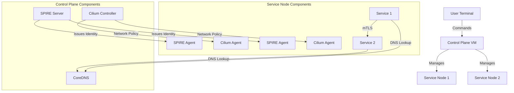

# Building a Secure Service Mesh Without Kubernetes Using SPIFFE, SPIRE, and Cilium

While Kubernetes has become the de facto standard for container orchestration, many organizations still run services on traditional virtual machines or have specific requirements that make Kubernetes adoption challenging. This guide demonstrates how to implement a secure, zero-trust service mesh on Linux VMs without Kubernetes, using industry-standard components like SPIFFE/SPIRE for identity management, Cilium for networking, and private DNS for service discovery.

## Architecture Overview

Our architecture provides a comprehensive security model with defense-in-depth through multiple layers of protection:



This architecture implements:

1. **Identity and Access Management**: SPIFFE/SPIRE for cryptographic service identity
2. **Network Security**: Cilium for policy enforcement and segmentation
3. **Secure Communication**: mTLS for all service interactions
4. **Service Discovery**: Private DNS for internal name resolution

## Prerequisites

Before starting the implementation, ensure you have:

- **Linux VMs**: Ubuntu 20.04+ or similar modern distribution
- **Hardware Requirements**:
  - Minimum 4 cores and 8GB RAM per VM
  - 50GB available storage
  - x86_64 architecture
- **Network Connectivity**: All VMs must be able to communicate with each other
- **Root Access**: Administrative privileges on all VMs

## Implementation Steps

Our implementation follows a modular approach, with each component fulfilling a specific security function within the mesh.

### 1. Setting Up Cilium for Service Mesh

Cilium provides networking, security, and observability capabilities for our service mesh. It will enforce network policies based on SPIFFE identities.

```bash
# Install system dependencies
sudo apt update && sudo apt install -y curl wget tar jq git build-essential \
    pkg-config libssl-dev linux-headers-$(uname -r)

# Install Cilium CLI
export CILIUM_VERSION="1.14.0"
curl -L --remote-name-all https://github.com/cilium/cilium-cli/releases/latest/download/cilium-linux-amd64.tar.gz
sudo tar xzvfC cilium-linux-amd64.tar.gz /usr/local/bin

# Configure Cilium (standalone mode)
sudo mkdir -p /etc/cilium
cat << EOF | sudo tee /etc/cilium/config.yaml
---
cluster-name: standalone
cluster-id: 1
ipam:
  mode: "cluster-pool"
  operator:
    clusterPoolIPv4PodCIDR: "10.0.0.0/16"
tunnel: disabled
enableIPv4Masquerade: true
enableIdentityMark: true
endpointRoutes:
  enabled: true
EOF

# Initialize Cilium
sudo cilium install --config /etc/cilium/config.yaml \
    --version ${CILIUM_VERSION#v} \
    --set enable-l7-proxy=true \
    --set enable-identity=true \
    --set enable-host-reachable-services=true

# Create systemd service
cat << EOF | sudo tee /etc/systemd/system/cilium.service
[Unit]
Description=Cilium Agent
After=network.target

[Service]
Type=simple
ExecStart=/usr/local/bin/cilium-agent --config-dir=/etc/cilium
Restart=always
User=root

[Install]
WantedBy=multi-user.target
EOF

sudo systemctl daemon-reload
sudo systemctl enable cilium
sudo systemctl start cilium
```

### 2. Configuring Private DNS with CoreDNS

A private DNS server is essential for service discovery within our mesh. We'll use CoreDNS for this purpose.

```bash
# Install CoreDNS
export COREDNS_VERSION="1.10.0"
wget https://github.com/coredns/coredns/releases/download/v${COREDNS_VERSION}/coredns_${COREDNS_VERSION}_linux_amd64.tgz
tar xzf coredns_${COREDNS_VERSION}_linux_amd64.tgz
sudo mv coredns /usr/local/bin/

# Create directories
sudo mkdir -p /etc/coredns/zones

# Create CoreDNS configuration
cat << EOF | sudo tee /etc/coredns/Corefile
internal.cluster.local {
    file /etc/coredns/zones/internal.cluster.local
    cache {
        success 3600
        denial 300
    }
    health :8091
    prometheus :9153
    errors
    log {
        class error
    }
    reload 10s
}

. {
    forward . /etc/resolv.conf
    cache 30
    errors
    log
}
EOF

# Create zone file
cat << EOF | sudo tee /etc/coredns/zones/internal.cluster.local
\$ORIGIN internal.cluster.local.
\$TTL 3600
@       IN      SOA     ns.internal.cluster.local. admin.internal.cluster.local. (
                        2023121501 ; serial
                        7200       ; refresh
                        3600       ; retry
                        1209600    ; expire
                        3600       ; minimum
)

@       IN      NS      ns.internal.cluster.local.
ns      IN      A       127.0.0.1

; Add service entries here
service1 IN      A       10.0.1.1
service2 IN      A       10.0.1.2
EOF

# Create systemd service
cat << EOF | sudo tee /etc/systemd/system/coredns.service
[Unit]
Description=CoreDNS DNS server
Documentation=https://coredns.io
After=network.target

[Service]
ExecStart=/usr/local/bin/coredns -conf /etc/coredns/Corefile
Restart=on-failure
User=root
AmbientCapabilities=CAP_NET_BIND_SERVICE
LimitNOFILE=1048576

[Install]
WantedBy=multi-user.target
EOF

sudo systemctl daemon-reload
sudo systemctl enable coredns
sudo systemctl start coredns
```

### 3. Installing SPIRE Server and Agents

SPIFFE/SPIRE provides identity management for our service mesh, enabling zero-trust authentication between services.

```bash
# Download and install SPIRE
export SPIRE_VERSION="1.8.0"
curl -s -N -L https://github.com/spiffe/spire/releases/download/v${SPIRE_VERSION}/spire-${SPIRE_VERSION}-linux-x86_64-glibc.tar.gz | tar xz
cd spire-${SPIRE_VERSION}

# Create directories
sudo mkdir -p /opt/spire/{bin,conf,data}
sudo cp -r bin/* /opt/spire/bin/

# Configure SPIRE Server (on control plane VM)
cat << EOF | sudo tee /opt/spire/conf/server.conf
server {
    bind_address = "0.0.0.0"
    bind_port = "8081"
    trust_domain = "internal.cluster.local"
    data_dir = "/opt/spire/data"
    log_level = "DEBUG"
    ca_ttl = "168h"
    default_svid_ttl = "24h"

    plugins {
        DataStore "sql" {
            plugin_data {
                database_type = "sqlite3"
                connection_string = "/opt/spire/data/datastore.sqlite3"
            }
        }

        KeyManager "disk" {
            plugin_data {
                keys_path = "/opt/spire/data/keys.json"
            }
        }

        NodeAttestor "join_token" {
            plugin_data {}
        }
    }
}
EOF

# Create SPIRE server service
cat << EOF | sudo tee /etc/systemd/system/spire-server.service
[Unit]
Description=SPIRE Server
After=network.target

[Service]
ExecStart=/opt/spire/bin/spire-server run -config /opt/spire/conf/server.conf
Restart=always
User=root
WorkingDirectory=/opt/spire

[Install]
WantedBy=multi-user.target
EOF

# Start SPIRE server
sudo systemctl daemon-reload
sudo systemctl enable spire-server
sudo systemctl start spire-server

# Generate a join token for agents
export SPIRE_JOIN_TOKEN=$(sudo /opt/spire/bin/spire-server token generate -ttl 3600)
echo $SPIRE_JOIN_TOKEN  # Save this for agent setup
```

Next, set up the SPIRE agent on each service VM:

```bash
# Configure SPIRE agent (on service VMs)
cat << EOF | sudo tee /opt/spire/conf/agent.conf
agent {
    data_dir = "/opt/spire/data/agent"
    log_level = "DEBUG"
    server_address = "CONTROL_PLANE_IP"  # Replace with actual IP
    server_port = "8081"
    socket_path = "/tmp/spire-agent/public/api.sock"
    trust_domain = "internal.cluster.local"

    plugins {
        NodeAttestor "join_token" {
            plugin_data {
                join_token = "${SPIRE_JOIN_TOKEN}"
            }
        }

        KeyManager "disk" {
            plugin_data {
                directory = "/opt/spire/data/agent"
            }
        }

        WorkloadAttestor "unix" {
            plugin_data {}
        }
    }
}
EOF

# Create SPIRE agent service
cat << EOF | sudo tee /etc/systemd/system/spire-agent.service
[Unit]
Description=SPIRE Agent
After=network.target

[Service]
ExecStart=/opt/spire/bin/spire-agent run -config /opt/spire/conf/agent.conf
Restart=always
User=root
WorkingDirectory=/opt/spire

[Install]
WantedBy=multi-user.target
EOF

# Start SPIRE agent
sudo systemctl daemon-reload
sudo systemctl enable spire-agent
sudo systemctl start spire-agent
```

### 4. Assigning SPIFFE IDs to Services

Next, we need to define SPIFFE identities for our services:

```bash
# On the control plane VM, create entries for services
sudo /opt/spire/bin/spire-server entry create \
    -spiffeID spiffe://internal.cluster.local/service1 \
    -selector unix:user:service1 \
    -parentID spiffe://internal.cluster.local/host

sudo /opt/spire/bin/spire-server entry create \
    -spiffeID spiffe://internal.cluster.local/service2 \
    -selector unix:user:service2 \
    -parentID spiffe://internal.cluster.local/host

# Create service users on the respective VMs
sudo useradd -r -s /bin/false service1  # On VM running service1
sudo useradd -r -s /bin/false service2  # On VM running service2
```

### 5. Configuring Cilium Network Policies

Now, we'll set up Cilium network policies based on SPIFFE identities:

```bash
# Create policy directory
sudo mkdir -p /etc/cilium/policies

# Create basic network policy
cat << EOF | sudo tee /etc/cilium/policies/basic.yaml
apiVersion: "cilium.io/v2"
kind: CiliumNetworkPolicy
metadata:
  name: "secure-service-policy"
spec:
  endpointSelector:
    matchLabels:
      "spiffe.io/spiffeid": "spiffe://internal.cluster.local/service1"
  ingress:
  - fromEndpoints:
    - matchLabels:
        "spiffe.io/spiffeid": "spiffe://internal.cluster.local/service2"
  egress:
  - toEndpoints:
    - matchLabels:
        "spiffe.io/spiffeid": "spiffe://internal.cluster.local/service2"
EOF

# Apply policy
cilium policy import /etc/cilium/policies/basic.yaml
```

### 6. Configuring Services for mTLS

Finally, we need to configure our services to use mTLS with SPIFFE identities. This example uses the Go programming language:

```go
package main

import (
    "context"
    "fmt"
    "net/http"

    "github.com/spiffe/go-spiffe/v2/spiffeid"
    "github.com/spiffe/go-spiffe/v2/spiffetls/tlsconfig"
    "github.com/spiffe/go-spiffe/v2/workloadapi"
)

func main() {
    ctx, cancel := context.WithCancel(context.Background())
    defer cancel()

    // Create workload API client
    client, err := workloadapi.New(ctx, workloadapi.WithAddr("unix:///tmp/spire-agent/public/api.sock"))
    if err != nil {
        panic(err)
    }
    defer client.Close()

    // Create SPIFFE ID for authorized service
    authorizedID := spiffeid.Must("internal.cluster.local", "service2")

    // Create TLS configuration for server
    serverConfig := tlsconfig.MTLSServerConfig(
        client, client, tlsconfig.AuthorizeID(authorizedID))
    server := &http.Server{
        Addr:      ":8443",
        TLSConfig: serverConfig,
        Handler:   http.HandlerFunc(handler),
    }

    // Start the server
    fmt.Println("Starting secure server on :8443")
    if err := server.ListenAndServeTLS("", ""); err != nil {
        panic(err)
    }
}

func handler(w http.ResponseWriter, r *http.Request) {
    fmt.Fprintf(w, "Hello from secure service\n")
}
```

And for the client:

```go
package main

import (
    "context"
    "fmt"
    "io/ioutil"
    "net/http"

    "github.com/spiffe/go-spiffe/v2/spiffeid"
    "github.com/spiffe/go-spiffe/v2/spiffetls/tlsconfig"
    "github.com/spiffe/go-spiffe/v2/workloadapi"
)

func main() {
    ctx, cancel := context.WithCancel(context.Background())
    defer cancel()

    // Create workload API client
    client, err := workloadapi.New(ctx, workloadapi.WithAddr("unix:///tmp/spire-agent/public/api.sock"))
    if err != nil {
        panic(err)
    }
    defer client.Close()

    // Create SPIFFE ID for server
    serverID := spiffeid.Must("internal.cluster.local", "service1")

    // Create TLS configuration for client
    clientConfig := tlsconfig.MTLSClientConfig(
        client, client, tlsconfig.AuthorizeID(serverID))
    httpClient := &http.Client{
        Transport: &http.Transport{
            TLSClientConfig: clientConfig,
        },
    }

    // Make the request
    resp, err := httpClient.Get("https://service1.internal.cluster.local:8443")
    if err != nil {
        panic(err)
    }
    defer resp.Body.Close()

    // Read and print the response
    body, err := ioutil.ReadAll(resp.Body)
    if err != nil {
        panic(err)
    }
    fmt.Println(string(body))
}
```

## Security Benefits and Considerations

This architecture provides multiple layers of security:

### Identity and Access Management

- Every service gets a cryptographic identity via SPIFFE/SPIRE
- All service-to-service communication is authenticated
- Zero-trust model where identity is the foundation of security

### Network Security

- All traffic between services is encrypted with mTLS
- Network policies are enforced based on identities, not just IPs
- L3/L4/L7 policy enforcement through Cilium
- Network microsegmentation between services

### Service Discovery and DNS Security

- Internal service resolution through private DNS
- Protection against DNS spoofing and man-in-the-middle attacks
- Secure mapping between service names and actual endpoints

## Best Practices

When implementing this architecture in production, follow these best practices:

### Certificate Management

- Rotate SPIFFE certificates regularly (every 24-48 hours)
- Implement proper certificate revocation procedures
- Monitor certificate expirations and renewals

### Network Policies

- Start with default-deny policies and gradually open required paths
- Regularly audit network policies
- Limit egress traffic to only necessary destinations
- Use specific L7 policies where appropriate

### Monitoring and Alerting

- Set up monitoring for all components
- Create alerts for security-relevant events
- Monitor for unauthorized access attempts
- Track certificate renewal failures

### Regular Maintenance

- Keep all components updated with security patches
- Perform regular security audits
- Test recovery procedures
- Document all configurations and procedures

## Troubleshooting

If you encounter issues with your implementation, here are some common troubleshooting steps:

### SPIRE Connectivity Issues

```bash
# Check SPIRE server health
sudo /opt/spire/bin/spire-server healthcheck

# Verify SPIRE agent connection
sudo /opt/spire/bin/spire-agent healthcheck

# Review agent logs
sudo journalctl -u spire-agent -f
```

### DNS Resolution Problems

```bash
# Test DNS resolution
dig @localhost service1.internal.cluster.local

# Check CoreDNS logs
sudo journalctl -u coredns -f
```

### Cilium Policy Enforcement Issues

```bash
# Check Cilium status
cilium status

# View applied policies
cilium policy get

# Monitor dropped packets
cilium monitor --type drop
```

## Conclusion

Building a secure service mesh without Kubernetes is entirely possible with the right components. By combining SPIFFE/SPIRE for identity management, Cilium for networking and security, and CoreDNS for service discovery, you can create a robust, zero-trust architecture that provides many of the security benefits typically associated with service mesh implementations in Kubernetes.

This approach is particularly valuable for organizations with traditional VM-based infrastructure, regulated environments with specific security requirements, or specialized use cases where Kubernetes may not be the optimal solution.

The architecture described here provides a solid foundation that you can adapt and extend to meet your specific needs, ensuring secure communication between services in your environment.

## Resources

- [SPIFFE/SPIRE Documentation](https://spiffe.io/docs/)
- [Cilium Documentation](https://docs.cilium.io/)
- [CoreDNS Documentation](https://coredns.io/manual/toc/)
- [NIST Zero Trust Architecture](https://www.nist.gov/publications/zero-trust-architecture)
