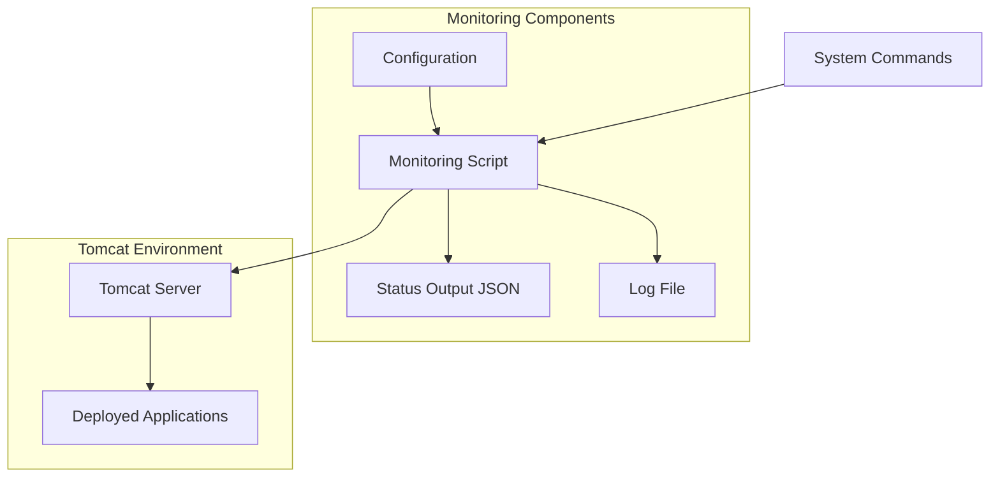

# Implementing Automated API Status Monitoring for Tomcat Applications

Monitoring API health and availability is crucial for maintaining reliable web services. This guide demonstrates how to implement an automated API status monitoring solution for Tomcat applications using Bash scripting, providing real-time visibility into your API endpoints' health.

## Understanding the Architecture

The monitoring system consists of several components working together:



## Implementation

### 1. Basic Script Structure

First, create the main script file `api-status-monitor.sh`:

```bash
#!/usr/bin/env bash
# filepath: /usr/local/bin/api-status-monitor.sh

set -euo pipefail
IFS=$'\n\t'

# Configuration
readonly SCRIPT_NAME=$(basename "$0")
readonly SCRIPT_DIR=$(dirname "$(readlink -f "$0")")
readonly LOG_FILE="${SCRIPT_DIR}/${SCRIPT_NAME%.*}.log"
readonly CONFIG_FILE="${SCRIPT_DIR}/${SCRIPT_NAME%.*}.conf"
readonly DEFAULT_OUTPUT_FILE="/opt/tomcat/api_status.json"
readonly DEFAULT_TOMCAT_PORT=8080
readonly DEFAULT_TOMCAT_HOST="localhost"
readonly DEFAULT_TIMEOUT=5

# Load configuration if exists
[[ -f "$CONFIG_FILE" ]] && source "$CONFIG_FILE"

# Set defaults if not defined
TOMCAT_HOME=${TOMCAT_HOME:-"/opt/tomcat"}
OUTPUT_FILE=${OUTPUT_FILE:-$DEFAULT_OUTPUT_FILE}
TOMCAT_PORT=${TOMCAT_PORT:-$DEFAULT_TOMCAT_PORT}
TOMCAT_HOST=${TOMCAT_HOST:-$DEFAULT_TOMCAT_HOST}
TIMEOUT=${TIMEOUT:-$DEFAULT_TIMEOUT}

# ...existing code...
```

### 2. Logging and Command Validation

Add logging and command validation functions:

```bash
# filepath: /usr/local/bin/api-status-monitor.sh

# ...existing code...

log() {
    local level=$1
    shift
    echo "$(date +'%Y-%m-%d %H:%M:%S') [$level] $*" >> "$LOG_FILE"
    if [[ $level == "ERROR" ]]; then
        echo "ERROR: $*" >&2
    elif [[ $level != "DEBUG" ]]; then
        echo "$*"
    fi
}

check_command() {
    if ! command -v "$1" &> /dev/null; then
        log "ERROR" "$1 is required but not installed. Aborting."
        exit 1
    fi
}

# Validate required commands
for cmd in curl grep find jq timeout; do
    check_command "$cmd"
done

# ...existing code...
```

### 3. Tomcat Status Checking

Add functions to check Tomcat status and deployed applications:

```bash
# filepath: /usr/local/bin/api-status-monitor.sh

# ...existing code...

is_tomcat_running() {
    pgrep -f "org.apache.catalina.startup.Bootstrap" > /dev/null
    return $?
}

get_deployed_apps() {
    find "$TOMCAT_HOME/webapps" -maxdepth 1 \( -type d -o -name "*.war" \) ! -name "webapps" -printf "%f\n"
}

# ...existing code...
```

### 4. API Status Checking Logic

Implement the core API checking functionality:

```bash
# filepath: /usr/local/bin/api-status-monitor.sh

# ...existing code...

check_api_status() {
    local app_name=$1
    local app_results=()
    local endpoints=("/api" "/rest" "/webservices" "/v1" "/api/v1" "")

    for endpoint in "${endpoints[@]}"; do
        local url="http://$TOMCAT_HOST:$TOMCAT_PORT/$app_name$endpoint"
        local curl_output

        if ! curl_output=$(timeout "$TIMEOUT" curl -o /dev/null -s -w "%{http_code}" "$url" 2>&1); then
            log "WARN" "Failed to connect to $url: $curl_output"
            continue
        }

        local http_code=$curl_output
        local status

        case $http_code in
            2[0-9][0-9]|30[0-8])
                status="Working"
                ;;
            401|403)
                status="Protected"
                ;;
            404|405)
                continue
                ;;
            *)
                status="Not working"
                ;;
        esac

        app_results+=("{\"path\":\"/$app_name$endpoint\",\"status\":\"$status\",\"code\":$http_code}")
    done

    if [ ${#app_results[@]} -eq 0 ]; then
        app_results+=("{\"path\":\"/$app_name\",\"status\":\"No working endpoints\",\"code\":null}")
    fi

    local joined_results
    joined_results=$(IFS=,; echo "${app_results[*]}")
    echo "\"$app_name\": [$joined_results]"
}

# ...existing code...
```

### 5. Main Execution Logic

Add the main execution function:

```bash
# filepath: /usr/local/bin/api-status-monitor.sh

# ...existing code...

main() {
    log "INFO" "Starting API status check"

    if ! is_tomcat_running; then
        log "ERROR" "Tomcat is not running. Aborting."
        echo "{\"error\": \"Tomcat is not running\", \"generated_on\": \"$(date -Iseconds)\"}" > "$OUTPUT_FILE"
        exit 1
    }

    local temp_file
    temp_file=$(mktemp)

    echo "{" > "$temp_file"
    echo "  \"generated_on\": \"$(date -Iseconds)\"," >> "$temp_file"
    echo "  \"tomcat_status\": \"running\"," >> "$temp_file"
    echo "  \"apps\": {" >> "$temp_file"

    local apps
    mapfile -t apps < <(get_deployed_apps)
    local last_index=$((${#apps[@]} - 1))

    for i in "${!apps[@]}"; do
        app="${apps[$i]}"
        result=$(check_api_status "$app")
        echo "    $result" >> "$temp_file"
        if [ "$i" -ne "$last_index" ]; then
            echo "," >> "$temp_file"
        fi
    done

    echo "  }" >> "$temp_file"
    echo "}" >> "$temp_file"

    if jq empty "$temp_file" &> /dev/null; then
        mv "$temp_file" "$OUTPUT_FILE"
        log "INFO" "API status results have been saved to $OUTPUT_FILE"
    else
        log "ERROR" "Generated JSON is invalid. Check $temp_file for details."
        exit 1
    }
}

# Run main function
main
exit 0
```

### 6. Configuration File

Create a configuration file `api-status-monitor.conf`:

```bash
# filepath: /usr/local/bin/api-status-monitor.conf

# Tomcat configuration
TOMCAT_HOME="/opt/tomcat"
TOMCAT_PORT=8080
TOMCAT_HOST="localhost"

# Output configuration
OUTPUT_FILE="/opt/tomcat/api_status.json"

# Monitoring configuration
TIMEOUT=5
```

## Setting Up the Monitoring System

### 1. Installation

```bash
# Make script executable
sudo chmod +x /usr/local/bin/api-status-monitor.sh

# Create required directories
sudo mkdir -p /opt/tomcat
sudo chown tomcat:tomcat /opt/tomcat
```

### 2. Cron Job Setup

Create a cron job to run the script periodically:

```bash
# Add to root's crontab
sudo crontab -e

# Add the following line to run every 5 minutes
*/5 * * * * /usr/local/bin/api-status-monitor.sh
```

### 3. Log Rotation

Configure log rotation to manage the log files:

```bash
# Create log rotation configuration
sudo tee /etc/logrotate.d/api-status-monitor << 'EOF'
/usr/local/bin/api-status-monitor.log {
    daily
    rotate 7
    compress
    delaycompress
    missingok
    notifempty
    create 640 root root
}
EOF
```

## Example Output

The script generates a structured JSON output:

```json
{
  "generated_on": "2024-07-20T10:15:30+00:00",
  "tomcat_status": "running",
  "apps": {
    "ROOT": [
      {
        "path": "/ROOT",
        "status": "No working endpoints",
        "code": null
      }
    ],
    "my-api": [
      {
        "path": "/my-api/api",
        "status": "Working",
        "code": 200
      },
      {
        "path": "/my-api/v1",
        "status": "Protected",
        "code": 401
      }
    ]
  }
}
```

## Best Practices and Recommendations

1. **Error Handling**:

   - Use strict mode (`set -euo pipefail`)
   - Implement proper logging
   - Handle edge cases gracefully

2. **Security**:

   - Run with appropriate permissions
   - Protect sensitive information in logs
   - Use secure temporary files

3. **Performance**:

   - Implement appropriate timeouts
   - Use efficient file operations
   - Minimize external command calls

4. **Maintenance**:
   - Keep logs rotated
   - Monitor script execution
   - Update configurations as needed

## Conclusion

This API status monitoring solution provides real-time visibility into the health of your Tomcat applications. By implementing this script and following the provided best practices, you can ensure reliable monitoring of your API endpoints.

## Resources

- [Bash Scripting Guide](https://tldp.org/LDP/abs/html/)
- [Tomcat Documentation](https://tomcat.apache.org/tomcat-9.0-doc/)
- [JQ Manual](https://stedolan.github.io/jq/manual/)
- [Linux System Administration](https://www.linuxfoundation.org/training/linux-system-administration)
