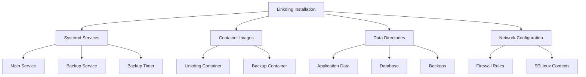

# Complete Guide to Uninstalling Linkding from CoreOS

[Linkding](https://github.com/sissbruecker/linkding) is a popular self-hosted bookmark manager that many users deploy on CoreOS systems. However, there may come a time when you need to remove it from your system. This guide provides detailed instructions for completely uninstalling Linkding from CoreOS, ensuring all components—including services, containers, data, and configuration files—are properly removed.

## Understanding Linkding Components

Before starting the uninstallation process, it's important to understand the various components that make up a typical Linkding installation on CoreOS:



By systematically addressing each component, we can ensure a complete removal of Linkding from your system.

## Pre-uninstallation Backup

Before removing Linkding, you may want to create a final backup of your bookmarks for future use or migration to another system.

```bash
# Create a final backup
sudo systemctl start container-linkding-backup.service

# Verify backup creation
ls -l /var/lib/linkding/backup/

# Copy backups to a safe location before removal
sudo cp -r /var/lib/linkding/backup/ /path/to/safe/location/
```

## Uninstallation Steps

### 1. Stop and Disable Services

First, we need to stop and disable all Linkding-related services to ensure they don't restart automatically:

```bash
# Stop and disable the main Linkding service
sudo systemctl stop container-linkding.service
sudo systemctl disable container-linkding.service

# Stop and disable the backup service and timer
sudo systemctl stop container-linkding-backup.service
sudo systemctl stop container-linkding-backup.timer
sudo systemctl disable container-linkding-backup.service
sudo systemctl disable container-linkding-backup.timer
```

### 2. Remove Service Files

Next, remove the systemd service files that manage Linkding:

```bash
# Remove the service files
sudo rm /etc/systemd/system/container-linkding.service
sudo rm /etc/systemd/system/container-linkding-backup.service
sudo rm /etc/systemd/system/container-linkding-backup.timer

# Reload systemd to recognize the changes
sudo systemctl daemon-reload
```

### 3. Remove Container Images

Remove the Linkding containers and their associated images:

```bash
# Remove the Linkding containers
sudo podman rm -f linkding
sudo podman rm -f linkding-backup

# Remove the Linkding image
sudo podman rmi docker.io/sissbruecker/linkding:latest
```

### 4. Remove Data Directories

Delete all data directories associated with Linkding:

```bash
# Remove the Linkding data directory
sudo rm -rf /var/lib/linkding
```

### 5. Remove Firewall Rules

If you configured firewall rules for Linkding, remove them:

```bash
# Remove the firewall rule for port 9090
sudo firewall-cmd --remove-port=9090/tcp --permanent
sudo firewall-cmd --reload
```

### 6. Remove SELinux Context

If you configured SELinux contexts for Linkding, remove them:

```bash
# Remove SELinux context for Linkding directory
sudo semanage fcontext -d "/var/lib/linkding(/.*)?"
```

## Verification Steps

After completing the uninstallation steps, verify that Linkding has been completely removed:

### Check for Services

Ensure no Linkding-related services remain:

```bash
# Verify services are removed
systemctl list-units --all | grep linkding
```

### Check for Containers

Verify that all Linkding containers have been removed:

```bash
# Verify containers are removed
podman ps -a | grep linkding

# Verify images are removed
podman images | grep linkding
```

### Check for Data Directories

Confirm that the data directories have been deleted:

```bash
# Verify directories are removed
ls -la /var/lib/linkding 2>/dev/null
```

### Check for Network Configuration

Ensure the firewall rule has been removed:

```bash
# Verify firewall rule is removed
sudo firewall-cmd --list-all | grep 9090
```

## Post-uninstallation Cleanup

### Check for Remaining Files

Search for any remaining configuration or data files:

```bash
# Check for any remaining configuration files
sudo find /etc -name "*linkding*"

# Check for any remaining data files
sudo find /var -name "*linkding*"
```

### System Cleanup

Clean up any unused container resources and logs:

```bash
# Clean up any unused container resources
sudo podman system prune -f

# Clean up system journal logs related to Linkding
sudo journalctl --vacuum-time=1d
```

## Advanced Verification

For a more thorough verification, check if port 9090 (the default Linkding port) is still in use:

```bash
# Check if port 9090 is in use
sudo ss -tulpn | grep 9090
```

Also, search for any running processes related to Linkding:

```bash
# Check for any processes related to Linkding
ps aux | grep -i linkding
```

## Common Issues and Troubleshooting

### Service Removal Issues

If you encounter issues when stopping or disabling services:

```bash
# Force kill any related processes
sudo pkill -f linkding

# Check service status for errors
sudo systemctl status container-linkding.service
```

### Container Removal Issues

If containers cannot be removed:

```bash
# Force remove with added options
sudo podman rm -f linkding --force

# Check if the container is truly gone
sudo podman ps -a --format "{{.ID}} {{.Names}}"
```

### Data Directory Removal Issues

If you encounter permission issues when removing data directories:

```bash
# Check directory permissions
ls -la /var/lib/linkding

# Use a more forceful remove command
sudo rm -rf --no-preserve-root /var/lib/linkding
```

### SELinux Issues

If you encounter SELinux-related errors:

```bash
# Check SELinux status
sudo sestatus

# View SELinux audit log
sudo ausearch -m avc -ts recent
```

## Conclusion

Properly uninstalling Linkding from your CoreOS system ensures that no remnants are left behind that could cause conflicts with future installations or waste system resources. By following this comprehensive guide, you've removed all services, containers, files, and configurations related to Linkding.

If you're removing Linkding to install a different bookmark manager, make sure you've properly backed up your data before beginning the uninstallation process. The backup files can often be imported into other bookmark management systems, preserving your carefully curated collection of links.

For users who are removing Linkding temporarily and plan to reinstall it later, the backups created during the pre-uninstallation phase can be restored to pick up where you left off.

## Resources

- [Linkding GitHub Repository](https://github.com/sissbruecker/linkding)
- [Podman Documentation](https://docs.podman.io/)
- [Systemd Documentation](https://systemd.io/)
- [CoreOS Documentation](https://docs.fedoraproject.org/en-US/fedora-coreos/)
- [SELinux User's and Administrator's Guide](https://access.redhat.com/documentation/en-us/red_hat_enterprise_linux/8/html/using_selinux/index)
