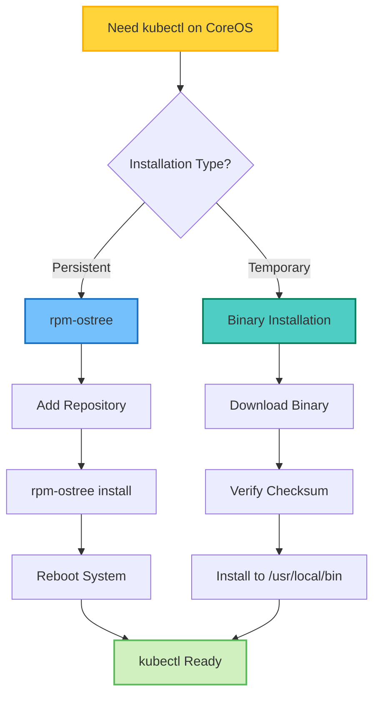
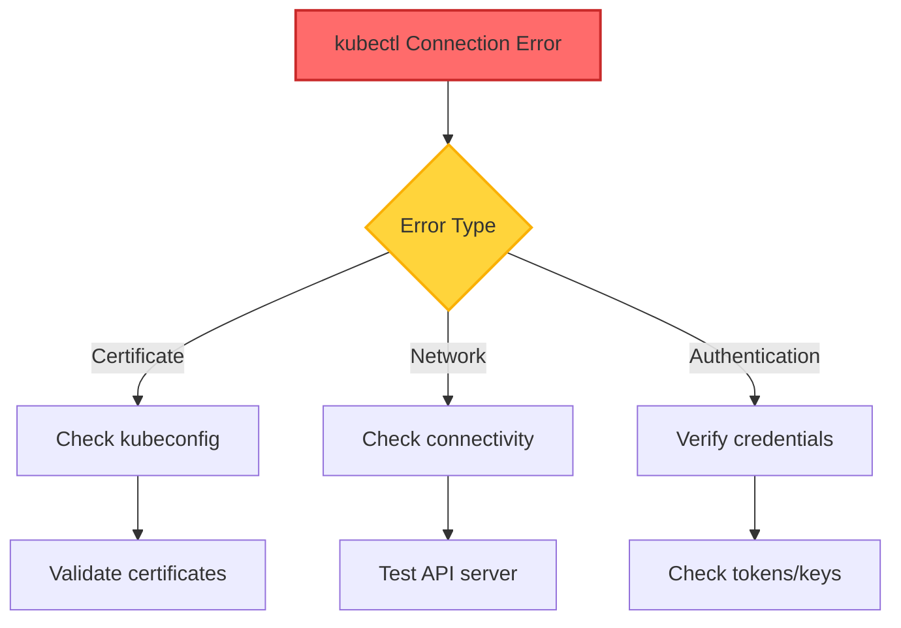
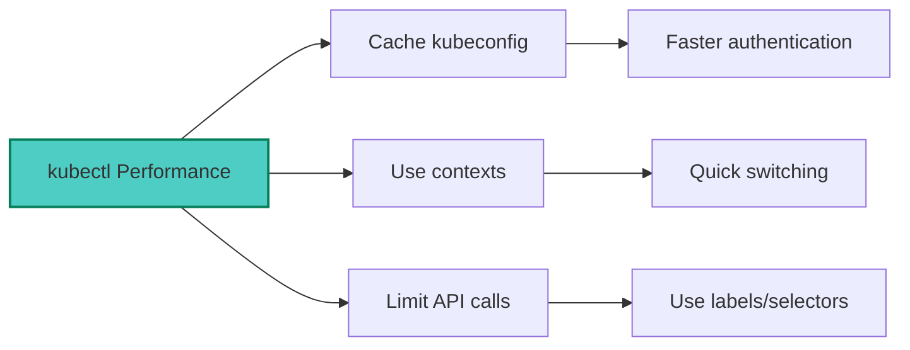

## Table of Contents

## Overview

Fedora CoreOS (FCOS) is an automatically updating, minimal operating system for running containerized workloads. Installing kubectl on CoreOS requires special consideration due to its immutable filesystem design. This guide covers multiple installation methods and best practices.

## Understanding CoreOS Architecture

```mermaid
graph TD
    A[Fedora CoreOS] --> B[Immutable OS Layer]
    A --> C[Layered Packages]
    A --> D[User Space]

    B --> E[Base System]
    B --> F[Read-only /usr]

    C --> G[rpm-ostree]
    C --> H[Layered Extensions]

    D --> I[/usr/local/bin]
    D --> J[User Applications]

    style A fill:#4ecdc4,stroke:#087f5b,stroke-width:2px
    style B fill:#ff6b6b,stroke:#c92a2a,stroke-width:2px
    style G fill:#74c0fc,stroke:#1971c2,stroke-width:2px
```

## Installation Methods

### Method 1: RPM-OSTree Installation (Recommended)

This method integrates kubectl into the CoreOS system layer:

```bash
# Step 1: Add Kubernetes repository
cat <<EOF | sudo tee /etc/yum.repos.d/kubernetes.repo
[kubernetes]
name=Kubernetes
baseurl=https://packages.cloud.google.com/yum/repos/kubernetes-el7-x86_64
enabled=1
gpgcheck=1
repo_gpgcheck=1
gpgkey=https://packages.cloud.google.com/yum/doc/yum-key.gpg https://packages.cloud.google.com/yum/doc/rpm-package-key.gpg
EOF

# Step 2: Install kubectl using rpm-ostree
sudo rpm-ostree install kubectl

# Step 3: Reboot to apply changes (required for rpm-ostree)
sudo systemctl reboot
```

### Method 2: Binary Installation

For immediate use without system modification:

```bash
# Download the latest stable kubectl release
curl -LO "https://dl.k8s.io/release/$(curl -L -s https://dl.k8s.io/release/stable.txt)/bin/linux/amd64/kubectl"

# Verify the binary (optional but recommended)
curl -LO "https://dl.k8s.io/$(curl -L -s https://dl.k8s.io/release/stable.txt)/bin/linux/amd64/kubectl.sha256"
echo "$(cat kubectl.sha256)  kubectl" | sha256sum --check

# Install kubectl
sudo install -o root -g root -m 0755 kubectl /usr/local/bin/kubectl

# Verify installation
kubectl version --client
```

## Installation Decision Flow



## Version Management

### Checking Available Versions

```bash
# List available kubectl versions in repository
sudo dnf list --showduplicates kubectl

# Check current kubectl version
kubectl version --client --short

# Get latest stable version
curl -L -s https://dl.k8s.io/release/stable.txt
```

### Installing Specific Versions

```bash
# Method 1: Using rpm-ostree (specific version)
sudo rpm-ostree install kubectl-1.28.2

# Method 2: Binary installation (specific version)
VERSION="v1.28.2"
curl -LO "https://dl.k8s.io/release/${VERSION}/bin/linux/amd64/kubectl"
sudo install -o root -g root -m 0755 kubectl /usr/local/bin/kubectl
```

## Configuration and Setup

### Basic kubectl Configuration

```bash
# Create kubectl config directory
mkdir -p $HOME/.kube

# Copy cluster configuration (example)
# Replace with your actual cluster config
cat <<EOF > $HOME/.kube/config
apiVersion: v1
kind: Config
clusters:
- cluster:
    server: https://kubernetes.example.com:6443
    certificate-authority-data: <base64-encoded-ca-cert>
  name: my-cluster
contexts:
- context:
    cluster: my-cluster
    user: my-user
  name: my-context
current-context: my-context
users:
- name: my-user
  user:
    client-certificate-data: <base64-encoded-client-cert>
    client-key-data: <base64-encoded-client-key>
EOF

# Set proper permissions
chmod 600 $HOME/.kube/config
```

### Shell Completion

```bash
# Bash completion (add to .bashrc)
source <(kubectl completion bash)
echo 'source <(kubectl completion bash)' >> ~/.bashrc

# Zsh completion (add to .zshrc)
source <(kubectl completion zsh)
echo 'source <(kubectl completion zsh)' >> ~/.zshrc

# Create alias for convenience
echo 'alias k=kubectl' >> ~/.bashrc
echo 'complete -o default -F __start_kubectl k' >> ~/.bashrc
```

## Integration with CoreOS Features

### Using with Ignition


Example Ignition configuration snippet:

```yaml
variant: fcos
version: 1.4.0
storage:
  files:
    - path: /usr/local/bin/kubectl
      mode: 0755
      contents:
        source: https://dl.k8s.io/release/v1.28.2/bin/linux/amd64/kubectl
        verification:
          hash: sha256:your-kubectl-sha256-hash-here
    - path: /home/core/.kube/config
      mode: 0600
      user:
        name: core
      group:
        name: core
      contents:
        inline: |
          apiVersion: v1
          kind: Config
          # Your kubeconfig content here
```

## Troubleshooting

### Common Issues and Solutions

#### 1. rpm-ostree Errors

```bash
# Check rpm-ostree status
rpm-ostree status

# Clean up pending deployments
sudo rpm-ostree cleanup -p

# Force refresh metadata
sudo rpm-ostree refresh-md
```

#### 2. Binary Permission Issues

```bash
# Fix permission problems
sudo chown root:root /usr/local/bin/kubectl
sudo chmod 755 /usr/local/bin/kubectl

# Verify executable
file /usr/local/bin/kubectl
ldd /usr/local/bin/kubectl
```

#### 3. Connection Issues



## Best Practices

### 1. Version Compatibility

Maintain kubectl version within one minor version of your cluster:

```bash
# Check cluster version
kubectl version --short

# Cluster version: v1.28.x
# kubectl should be: v1.27.x, v1.28.x, or v1.29.x
```

### 2. Security Considerations

- Store kubeconfig files securely
- Use proper file permissions (600 for configs)
- Avoid hardcoding credentials
- Use service accounts for automation

### 3. Automated Updates

For rpm-ostree installations:

```bash
# Enable automatic updates
sudo systemctl enable --now rpm-ostreed-automatic.timer

# Configure update policy
sudo vi /etc/rpm-ostreed.conf
```

## Advanced Usage

### Multiple Cluster Management

```bash
# List contexts
kubectl config get-contexts

# Switch context
kubectl config use-context production

# Quick context switching with kubectx
curl -LO https://raw.githubusercontent.com/ahmetb/kubectx/master/kubectx
chmod +x kubectx
sudo mv kubectx /usr/local/bin/
```

### kubectl Plugins

```bash
# Install krew (kubectl plugin manager)
(
  set -x; cd "$(mktemp -d)" &&
  OS="$(uname | tr '[:upper:]' '[:lower:]')" &&
  ARCH="$(uname -m | sed -e 's/x86_64/amd64/' -e 's/\(arm\)\(64\)\?.*/\1\2/' -e 's/aarch64$/arm64/')" &&
  KREW="krew-${OS}_${ARCH}" &&
  curl -fsSLO "https://github.com/kubernetes-sigs/krew/releases/latest/download/${KREW}.tar.gz" &&
  tar zxvf "${KREW}.tar.gz" &&
  ./"${KREW}" install krew
)

# Add to PATH
export PATH="${KREW_ROOT:-$HOME/.krew}/bin:$PATH"

# Install useful plugins
kubectl krew install ctx ns tree
```

## Performance Optimization



### Performance Tips

```bash
# Cache credential helper
kubectl config set-credentials user --exec-command=kubectl-credential-helper

# Use resource caching
export KUBECTL_CACHE_DIR=/tmp/kubectl-cache
mkdir -p $KUBECTL_CACHE_DIR

# Efficient resource queries
kubectl get pods -l app=myapp --field-selector=status.phase=Running
```

## Conclusion

Installing kubectl on Fedora CoreOS requires understanding the immutable nature of the operating system. Whether you choose the persistent rpm-ostree method or the flexible binary installation approach depends on your specific use case:

- **Use rpm-ostree** for production systems where kubectl is a core requirement
- **Use binary installation** for development, testing, or temporary access

Key takeaways:

- CoreOS requires special consideration due to its immutable design
- rpm-ostree provides system-integrated installation
- Binary installation offers immediate availability
- Proper configuration and security practices are essential
- Regular updates maintain compatibility with your cluster

By following this guide, you can successfully deploy and manage kubectl on Fedora CoreOS, enabling effective Kubernetes cluster management from your CoreOS nodes.
