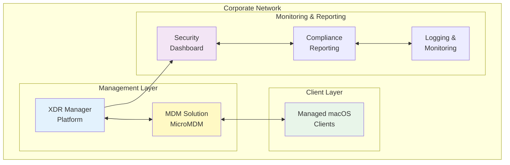
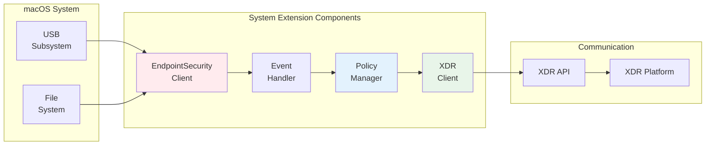
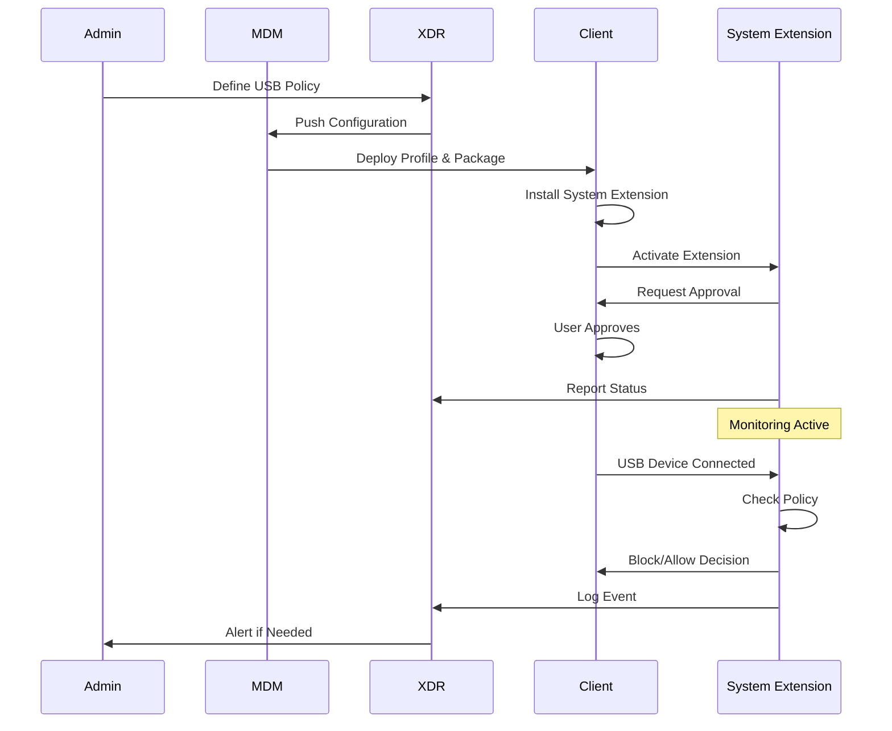

## Table of Contents

## Introduction

This document presents a comprehensive architecture for implementing USB and external storage control on macOS systems using Mobile Device Management (MDM), System Extensions, and Extended Detection and Response (XDR) platform integration. This solution addresses the critical need for controlling data exfiltration risks while maintaining compliance with Apple's security frameworks.

## Architecture Overview

The XDR Platform USB/External Storage Control Architecture consists of integrated components working together to provide comprehensive endpoint security:



## Component Details

### Client-Side Components

#### System Extension

- **Technology**: Built using Apple's EndpointSecurity framework
- **Functions**:
  - Real-time USB and external storage device monitoring
  - Policy-based access control decisions
  - Event logging and reporting
- **Security**: Signed with enterprise developer certificate
- **Deployment**: Distributed via MDM as part of installation package

#### MDM Profile

- **Type**: DiskManagement configuration profile
- **Features**:
  - External storage access restrictions
  - Network volume mounting controls
  - Removable media policies
- **Deployment**: Applied automatically via MDM enrollment

#### XDR Agent

- **Functions**:
  - Monitors system extension health and status
  - Reports security events to central XDR platform
  - Handles local policy enforcement
  - Provides telemetry data
- **Integration**: Communicates with both System Extension and XDR platform

### Server-Side Components

#### MDM Server (MicroMDM)

- **Purpose**: Central management of macOS devices
- **Features**:
  - Device enrollment and authentication
  - Configuration profile deployment
  - Certificate management
  - Command execution
- **Integration**: APIs for XDR platform communication

#### XDR Manager Platform

- **Functions**:
  - Central policy management console
  - Real-time threat detection and response
  - Integration hub for security tools
  - Automated incident response workflows
- **Capabilities**:
  - Policy definition and deployment
  - Alert correlation and analysis
  - Compliance reporting
  - Forensic investigation tools

#### Logging & Monitoring

- **Components**:
  - Event collection infrastructure
  - Log aggregation and storage
  - Real-time alerting system
  - Audit trail maintenance
- **Features**:
  - Centralized log management
  - Search and analysis capabilities
  - Retention policies
  - Compliance audit support

## Implementation Architecture

### System Extension Development



### Code Structure Overview

```swift
// Main EndpointSecurity client implementation
class USBBlockingManager {
    private var esClient: OpaquePointer?
    private let authorizationRights: [String]

    func start() -> Bool {
        // Initialize EndpointSecurity client
        let result = es_new_client(&esClient) { client, event in
            self.handleEvent(event)
        }

        // Subscribe to relevant events
        let events: [es_event_type_t] = [
            ES_EVENT_TYPE_AUTH_MOUNT,
            ES_EVENT_TYPE_AUTH_OPEN,
            ES_EVENT_TYPE_AUTH_CREATE
        ]

        es_subscribe(esClient, events, UInt32(events.count))
        return result == ES_NEW_CLIENT_RESULT_SUCCESS
    }

    func handleEvent(_ event: UnsafePointer<es_event_t>) {
        switch event.pointee.event_type {
        case ES_EVENT_TYPE_AUTH_MOUNT:
            handleMountEvent(event)
        case ES_EVENT_TYPE_AUTH_OPEN:
            handleOpenEvent(event)
        case ES_EVENT_TYPE_AUTH_CREATE:
            handleCreateEvent(event)
        default:
            break
        }
    }

    private func handleMountEvent(_ event: UnsafePointer<es_event_t>) {
        // Check if mount is for external storage
        // Apply policy based on device type
        // Log action and notify XDR agent
    }
}

// XDR agent communication
class XDRAgentClient {
    private let baseURL: URL
    private let session: URLSession

    func reportBlockedDevice(deviceInfo: USBDeviceInfo) {
        // Send blocked device information to XDR platform
        let endpoint = baseURL.appendingPathComponent("device/blocked")
        var request = URLRequest(url: endpoint)
        request.httpMethod = "POST"
        request.httpBody = try? JSONEncoder().encode(deviceInfo)

        session.dataTask(with: request) { data, response, error in
            // Handle response
        }.resume()
    }

    func checkPolicyUpdates() -> USBPolicy? {
        // Fetch latest policy from XDR platform
        // Apply any changes to local configuration
        return nil
    }
}
```

## Implementation Plan

### Phase 1: Infrastructure Setup (Weeks 1-2)

1. **MDM Server Configuration**

   - Install and configure MicroMDM
   - Set up APNS certificates
   - Configure network connectivity
   - Establish authentication mechanisms

2. **XDR Platform Setup**
   - Deploy XDR management platform
   - Configure API endpoints
   - Set up integration points
   - Establish logging infrastructure

### Phase 2: Client Development (Weeks 3-5)

1. **System Extension Development**

   - Implement EndpointSecurity framework integration
   - Develop USB monitoring capabilities
   - Create policy enforcement engine
   - Build event logging system

2. **XDR Agent Development**

   - Create communication protocols
   - Implement health monitoring
   - Build reporting mechanisms
   - Develop update capabilities

3. **Installer Package Creation**
   - Bundle System Extension and XDR Agent
   - Create installation scripts
   - Implement verification checks
   - Sign package for distribution

### Phase 3: Server Development (Weeks 6-8)

1. **Management Console**

   - Develop policy management interface
   - Create device inventory views
   - Build reporting dashboards
   - Implement user management

2. **MDM Profile Templates**

   - Create DiskManagement profiles
   - Develop deployment workflows
   - Build testing procedures
   - Document configuration options

3. **Automated Response Workflows**
   - Design incident response procedures
   - Implement automated actions
   - Create escalation paths
   - Build notification systems

### Phase 4: Testing & Validation (Weeks 9-10)

1. **Functionality Testing**

   - Test on macOS versions (11.x, 12.x, 13.x, 14.x)
   - Validate USB blocking effectiveness
   - Test various storage device types
   - Verify policy enforcement

2. **Performance Testing**

   - Measure system impact
   - Test under load conditions
   - Validate response times
   - Check resource usage

3. **Security Testing**
   - Attempt bypass techniques
   - Test tampering resistance
   - Validate encryption
   - Check authentication

### Phase 5: Deployment (Weeks 11-12)

1. **Pilot Deployment**

   - Select pilot group
   - Deploy to test users
   - Monitor for issues
   - Collect feedback

2. **Production Rollout**
   - Phased deployment approach
   - Monitor deployment progress
   - Address issues as they arise
   - Document lessons learned

## Production Requirements

### Infrastructure Requirements

#### Server Resources

- **MDM Server**:

  - CPU: 4+ cores
  - RAM: 8GB minimum
  - Storage: 100GB+ SSD
  - Network: Gigabit connection

- **XDR Platform**:

  - CPU: 8+ cores (scalable)
  - RAM: 16GB minimum (scalable)
  - Storage: 500GB+ SSD (scalable)
  - Database: High-performance SQL/NoSQL

- **High Availability**:
  - Load balancers for service distribution
  - Redundant database servers
  - Backup infrastructure
  - Disaster recovery plan

#### Network Requirements

- **APNS Connectivity**:

  - Outbound TCP ports: 443, 2195, 2196
  - Stable internet connection
  - Low latency preferred

- **Client-Server Communication**:

  - TLS 1.3 encryption
  - Certificate-based authentication
  - API rate limiting
  - DDoS protection

- **Security Segmentation**:
  - Separate management VLAN
  - Firewall rules
  - IDS/IPS monitoring
  - Network access control

### Security Requirements

#### Encryption

- **Data in Transit**:

  - TLS 1.3 for all communications
  - Certificate pinning for critical connections
  - Perfect forward secrecy
  - Strong cipher suites only

- **Data at Rest**:
  - Encrypted storage for sensitive data
  - Key management system
  - Regular key rotation
  - Secure key storage (HSM)

#### Authentication & Authorization

- **Device Authentication**:

  - Certificate-based enrollment
  - Device identity verification
  - Regular re-authentication
  - Revocation capabilities

- **User Authentication**:
  - Multi-factor authentication
  - Role-based access control
  - Session management
  - Audit logging

#### Compliance Features

- **Logging Requirements**:

  - All USB/storage access attempts
  - Policy changes
  - Administrative actions
  - System events

- **Reporting Capabilities**:

  - Compliance dashboards
  - Audit reports
  - Export functionality
  - Scheduled reports

- **Integration Options**:
  - SIEM system integration
  - Ticketing system APIs
  - Compliance tool exports
  - Custom integrations

## Deployment Workflow



## Maintenance Procedures

### Regular Updates

1. **System Extension Updates**

   - Quarterly security updates
   - Bug fixes as needed
   - Feature enhancements
   - Compatibility updates

2. **Policy Template Updates**

   - Review and update policies
   - Add new device types
   - Adjust restrictions
   - Document changes

3. **MDM Server Patches**
   - Monthly security patches
   - Feature updates
   - Bug fixes
   - Performance improvements

### Monitoring Requirements

1. **Real-time Monitoring**

   - Circumvention attempt alerts
   - System health checks
   - Performance metrics
   - Error tracking

2. **Dashboards**

   - Compliance metrics
   - Device status
   - Policy effectiveness
   - Incident trends

3. **Health Checks**
   - Component availability
   - Response times
   - Resource utilization
   - Error rates

### Backup & Recovery

1. **Backup Strategy**

   - Daily configuration backups
   - Weekly full backups
   - Offsite backup storage
   - Encrypted backups

2. **Recovery Procedures**
   - Documented recovery steps
   - Recovery time objectives
   - Regular recovery testing
   - Rollback procedures

## Security Considerations

### Protection Against Tampering

- **System Extension Protection**:

  - Code signing requirements
  - System Integrity Protection (SIP)
  - Secure boot chain
  - Runtime protections

- **Configuration Security**:
  - Encrypted configuration files
  - Integrity verification
  - Secure update mechanism
  - Tamper detection

### Policy Enforcement

- **Local Bypass Prevention**:

  - Kernel-level enforcement
  - Multiple check points
  - Fail-secure defaults
  - Audit trail

- **Privilege Management**:
  - Least privilege principle
  - Separation of duties
  - Regular permission audits
  - Access reviews

### Monitoring & Detection

- **Bypass Attempt Detection**:

  - Multiple detection methods
  - Behavioral analysis
  - Anomaly detection
  - Real-time alerting

- **Security Assessment**:
  - Regular penetration testing
  - Vulnerability assessments
  - Code reviews
  - Security audits

## Best Practices

### Development

1. Use secure coding practices
2. Implement comprehensive logging
3. Follow Apple's guidelines
4. Regular code reviews

### Deployment

1. Test thoroughly before production
2. Use phased rollout approach
3. Monitor deployment progress
4. Have rollback plan ready

### Operations

1. Regular health monitoring
2. Proactive maintenance
3. Incident response planning
4. Continuous improvement

### Security

1. Regular security assessments
2. Keep all components updated
3. Monitor for new threats
4. Maintain security documentation

## Troubleshooting Guide

### Common Issues

#### System Extension Not Loading

- Check code signing
- Verify MDM approval
- Review system logs
- Check user approval

#### Policy Not Applying

- Verify MDM profile installation
- Check XDR connectivity
- Review policy syntax
- Validate device scope

#### Performance Issues

- Check resource usage
- Review event volume
- Optimize policies
- Consider scaling

### Diagnostic Tools

- Console.app for system logs
- `systemextensionsctl` command
- MDM diagnostic commands
- XDR platform tools

## Conclusion

This architecture provides a comprehensive, enterprise-ready solution for controlling USB and external storage devices on macOS systems. By leveraging proper MDM integration, System Extensions, and XDR platform capabilities, organizations can effectively manage data exfiltration risks while maintaining compliance with Apple's security frameworks.

The solution balances security requirements with user experience, providing granular control over storage devices while maintaining system performance and stability. Regular updates, monitoring, and security assessments ensure the solution remains effective against evolving threats.

For additional implementation details or customization options, consult with your security team and Apple enterprise support resources.
