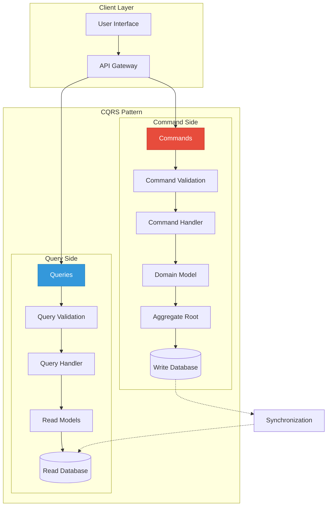
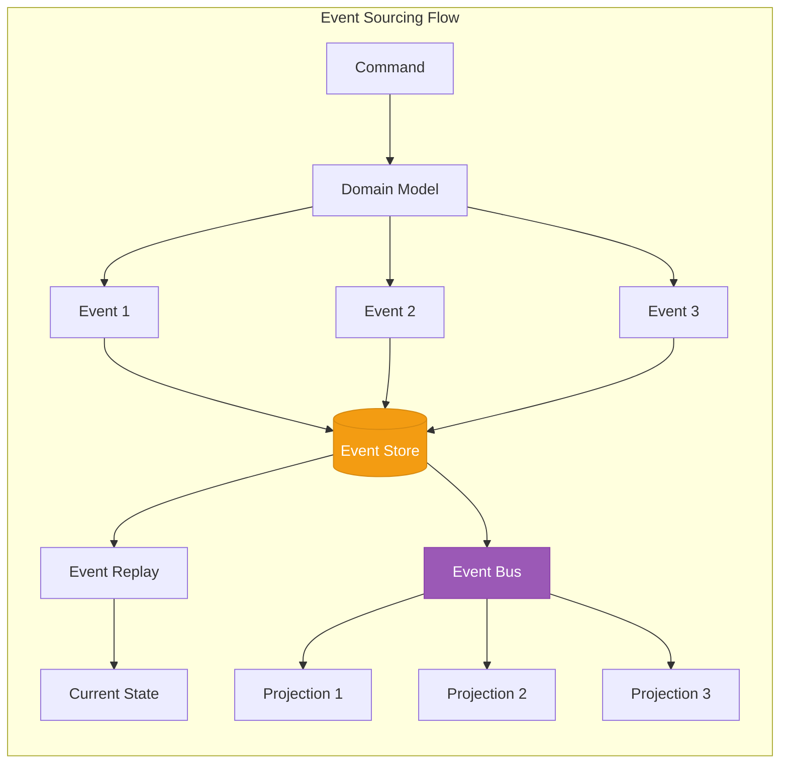
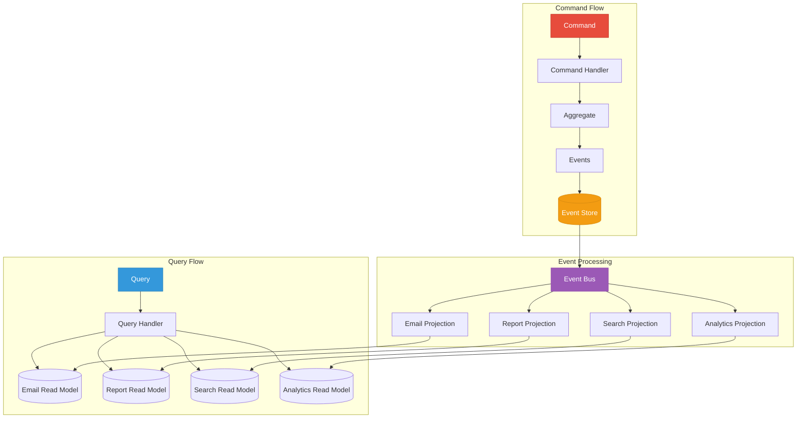
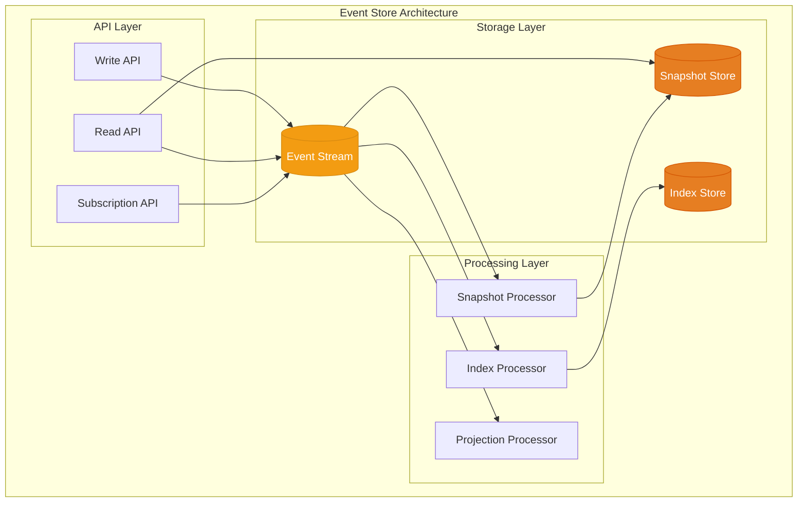
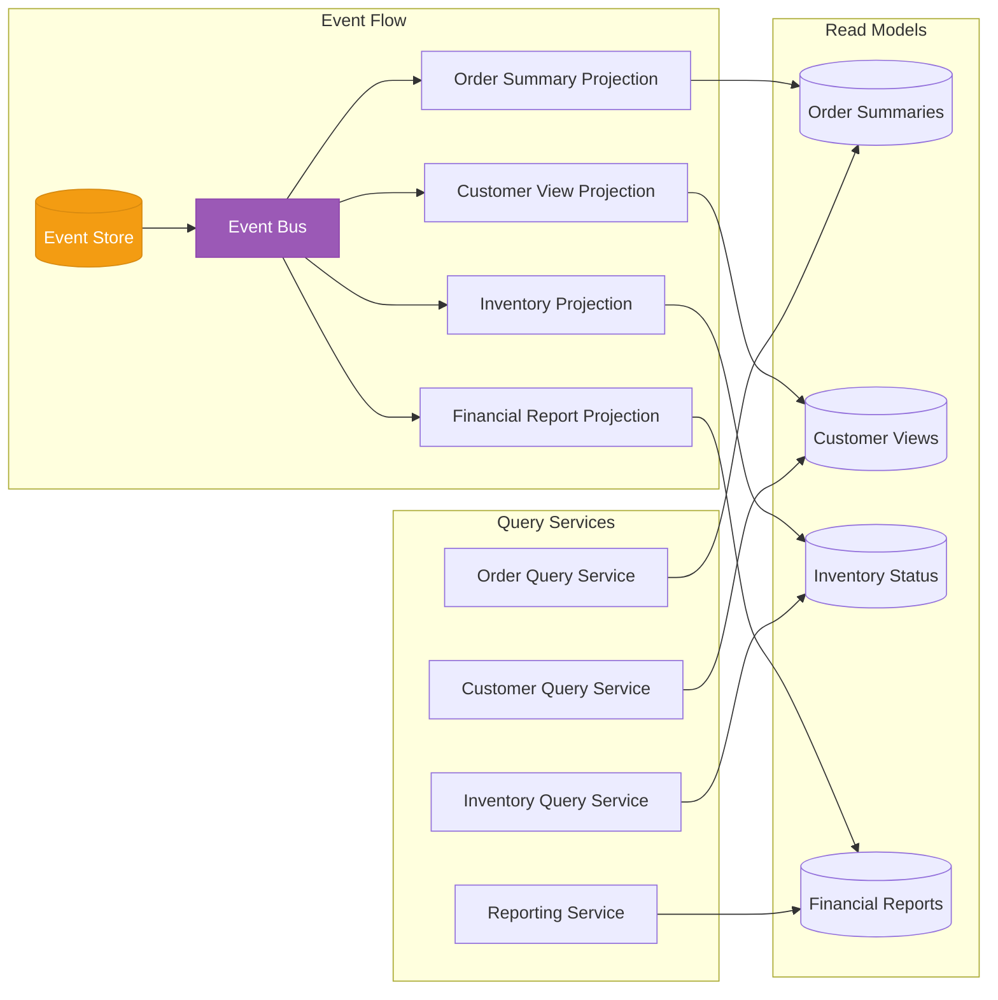
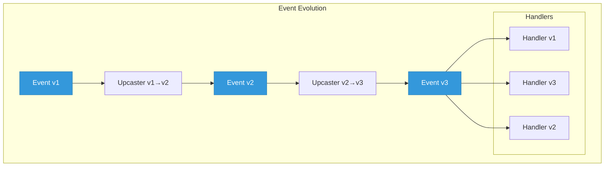
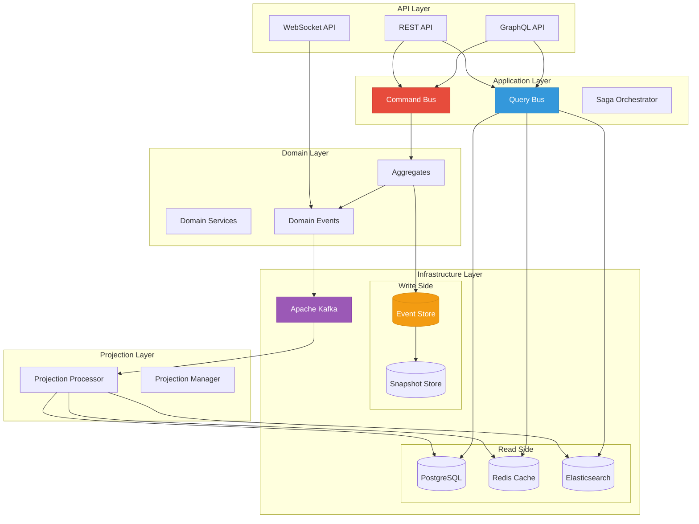

# CQRS and Event Sourcing: Building Scalable Event-Driven Systems

In the world of distributed systems and microservices, two powerful patterns have emerged as game-changers for building scalable, maintainable, and auditable applications: **CQRS (Command Query Responsibility Segregation)** and **Event Sourcing**. While each pattern provides significant benefits independently, their combination creates a robust architecture that addresses many challenges in modern software development.

## Table of Contents

1. [Introduction to CQRS](#introduction-to-cqrs)
2. [Event Sourcing Fundamentals](#event-sourcing-fundamentals)
3. [How CQRS and Event Sourcing Work Together](#how-cqrs-and-event-sourcing-work-together)
4. [Event Store Implementation](#event-store-implementation)
5. [Projection and Read Model Strategies](#projection-and-read-model-strategies)
6. [Event Versioning and Schema Evolution](#event-versioning-and-schema-evolution)
7. [Practical Examples](#practical-examples)
8. [Best Practices and Common Pitfalls](#best-practices-and-common-pitfalls)
9. [Conclusion](#conclusion)

## Introduction to CQRS

Command Query Responsibility Segregation (CQRS) is an architectural pattern that separates read and write operations into different models. This separation allows each model to be optimized for its specific use case, leading to better performance, scalability, and maintainability.

### Core Principles of CQRS

1. **Separation of Concerns**: Commands (writes) and queries (reads) are handled by different models
2. **Optimized Data Models**: Each side can use the most appropriate data structure
3. **Independent Scaling**: Read and write sides can scale independently
4. **Eventual Consistency**: Read models are updated asynchronously from write models

### CQRS Architecture Overview



### Benefits of CQRS

1. **Performance Optimization**: Tailor each model for its specific workload
2. **Scalability**: Scale read and write operations independently
3. **Flexibility**: Use different technologies for different concerns
4. **Security**: Apply different security policies to commands and queries
5. **Simplified Queries**: Denormalized read models make queries simpler and faster

## Event Sourcing Fundamentals

Event Sourcing is a pattern where the state of an application is determined by a sequence of events. Instead of storing just the current state, Event Sourcing stores all changes to the application state as a sequence of immutable events.

### Core Concepts

1. **Events as Source of Truth**: Every state change is captured as an event
2. **Immutability**: Events are never modified or deleted
3. **Event Replay**: Current state can be rebuilt by replaying events
4. **Temporal Queries**: Query the state at any point in time
5. **Audit Trail**: Complete history of all changes

### Event Sourcing Flow



### Event Structure

```typescript
interface DomainEvent {
  aggregateId: string; // The entity this event belongs to
  eventType: string; // Type of the event
  eventVersion: number; // Version for schema evolution
  eventData: object; // The actual event payload
  timestamp: Date; // When the event occurred
  userId?: string; // Who triggered the event
  correlationId?: string; // For tracking across services
  causationId?: string; // What caused this event
}

// Example Events
class OrderCreatedEvent implements DomainEvent {
  aggregateId: string;
  eventType = "OrderCreated";
  eventVersion = 1;
  eventData: {
    orderId: string;
    customerId: string;
    items: Array<{ productId: string; quantity: number; price: number }>;
    totalAmount: number;
  };
  timestamp: Date;
  userId: string;
}

class PaymentProcessedEvent implements DomainEvent {
  aggregateId: string;
  eventType = "PaymentProcessed";
  eventVersion = 1;
  eventData: {
    orderId: string;
    paymentId: string;
    amount: number;
    method: "credit_card" | "paypal" | "bank_transfer";
    transactionId: string;
  };
  timestamp: Date;
  userId: string;
}
```

## How CQRS and Event Sourcing Work Together

The combination of CQRS and Event Sourcing creates a powerful architecture where:

1. **Commands** generate **Events** that are stored in the **Event Store**
2. **Events** are the source of truth for the write model
3. **Projections** consume events to build **Read Models**
4. **Queries** are served from optimized **Read Models**

### Combined Architecture



### Implementation Example

```typescript
// Command Handler with Event Sourcing
class OrderCommandHandler {
  constructor(
    private eventStore: EventStore,
    private eventBus: EventBus
  ) {}

  async handle(command: CreateOrderCommand): Promise<void> {
    // Load aggregate from events
    const events = await this.eventStore.getEvents(command.orderId);
    const order = Order.fromEvents(events);

    // Execute business logic
    order.create(command.customerId, command.items, command.shippingAddress);

    // Get new events
    const newEvents = order.getUncommittedEvents();

    // Save events to event store
    await this.eventStore.saveEvents(command.orderId, newEvents, order.version);

    // Publish events for projections
    await this.eventBus.publishBatch(newEvents);
  }
}

// Projection Handler
class OrderProjectionHandler {
  constructor(private readModelDb: Database) {}

  async handle(event: DomainEvent): Promise<void> {
    switch (event.eventType) {
      case "OrderCreated":
        await this.handleOrderCreated(event);
        break;
      case "OrderShipped":
        await this.handleOrderShipped(event);
        break;
      case "OrderDelivered":
        await this.handleOrderDelivered(event);
        break;
    }
  }

  private async handleOrderCreated(event: OrderCreatedEvent): Promise<void> {
    // Create denormalized read model
    await this.readModelDb.insert("order_summaries", {
      order_id: event.eventData.orderId,
      customer_id: event.eventData.customerId,
      customer_name: await this.getCustomerName(event.eventData.customerId),
      total_amount: event.eventData.totalAmount,
      status: "CREATED",
      created_at: event.timestamp,
      items_count: event.eventData.items.length,
    });
  }
}
```

## Event Store Implementation

The Event Store is the heart of an Event Sourcing system. It must be reliable, performant, and support various querying capabilities.

### Event Store Structure



### EventStore Implementation

```typescript
class EventStore {
  private db: Database;
  private snapshots: SnapshotStore;
  private subscriptions: Map<string, EventHandler[]> = new Map();

  constructor(database: Database, snapshotStore: SnapshotStore) {
    this.db = database;
    this.snapshots = snapshotStore;
  }

  async appendEvents(
    streamId: string,
    events: DomainEvent[],
    expectedVersion: number
  ): Promise<void> {
    await this.db.transaction(async trx => {
      // Check for concurrency conflicts
      const currentVersion = await this.getCurrentVersion(streamId, trx);
      if (currentVersion !== expectedVersion) {
        throw new ConcurrencyError(
          `Expected version ${expectedVersion} but was ${currentVersion}`
        );
      }

      // Prepare events for storage
      const eventRecords = events.map((event, index) => ({
        stream_id: streamId,
        event_id: uuid(),
        event_type: event.eventType,
        event_version: event.eventVersion,
        event_data: JSON.stringify(event.eventData),
        event_metadata: JSON.stringify({
          userId: event.userId,
          correlationId: event.correlationId,
          causationId: event.causationId,
        }),
        stream_version: currentVersion + index + 1,
        created_at: event.timestamp || new Date(),
      }));

      // Insert events
      await trx("events").insert(eventRecords);

      // Update stream metadata
      await trx("streams").upsert({
        stream_id: streamId,
        version: currentVersion + events.length,
        updated_at: new Date(),
      });
    });

    // Publish to subscribers
    await this.publishToSubscribers(streamId, events);

    // Check if snapshot is needed
    await this.checkSnapshot(streamId);
  }

  async getEvents(
    streamId: string,
    fromVersion: number = 0,
    toVersion?: number
  ): Promise<DomainEvent[]> {
    // Try to load from snapshot first
    const snapshot = await this.snapshots.getLatest(streamId);
    const startVersion = snapshot ? snapshot.version + 1 : fromVersion;

    // Load events
    let query = this.db("events")
      .where("stream_id", streamId)
      .where("stream_version", ">=", startVersion)
      .orderBy("stream_version");

    if (toVersion) {
      query = query.where("stream_version", "<=", toVersion);
    }

    const records = await query;

    // Deserialize events
    const events = records.map(record => this.deserializeEvent(record));

    // If we have a snapshot, prepend it to events
    if (snapshot && snapshot.data) {
      events.unshift(snapshot.data);
    }

    return events;
  }

  async createSnapshot(streamId: string): Promise<void> {
    const events = await this.getEvents(streamId);
    const aggregate = await this.rebuildAggregate(streamId, events);

    await this.snapshots.save({
      streamId,
      version: aggregate.version,
      data: aggregate.toSnapshot(),
      createdAt: new Date(),
    });
  }

  subscribe(eventType: string, handler: EventHandler): void {
    if (!this.subscriptions.has(eventType)) {
      this.subscriptions.set(eventType, []);
    }
    this.subscriptions.get(eventType)!.push(handler);
  }

  private async publishToSubscribers(
    streamId: string,
    events: DomainEvent[]
  ): Promise<void> {
    for (const event of events) {
      const handlers = this.subscriptions.get(event.eventType) || [];
      await Promise.all(
        handlers.map(handler => handler(event).catch(console.error))
      );
    }
  }
}
```

### Using Apache Kafka as Event Store

```typescript
class KafkaEventStore implements EventStore {
  private producer: KafkaProducer;
  private admin: KafkaAdmin;
  private consumers: Map<string, KafkaConsumer> = new Map();

  constructor(kafkaConfig: KafkaConfig) {
    this.producer = new KafkaProducer(kafkaConfig);
    this.admin = new KafkaAdmin(kafkaConfig);
  }

  async appendEvents(
    streamId: string,
    events: DomainEvent[],
    expectedVersion: number
  ): Promise<void> {
    // Ensure topic exists
    await this.ensureTopic(streamId);

    // Prepare messages
    const messages = events.map((event, index) => ({
      key: streamId,
      value: JSON.stringify(event),
      headers: {
        "event-type": event.eventType,
        "event-version": event.eventVersion.toString(),
        "stream-version": (expectedVersion + index + 1).toString(),
        timestamp: event.timestamp.toISOString(),
      },
      partition: this.getPartition(streamId),
    }));

    // Send to Kafka
    await this.producer.sendBatch({
      topic: this.getTopicName(streamId),
      messages,
    });
  }

  async subscribeToStream(
    streamId: string,
    handler: EventHandler,
    options: SubscriptionOptions = {}
  ): Promise<void> {
    const consumer = new KafkaConsumer({
      groupId: options.consumerGroup || `${streamId}-consumer`,
      ...this.kafkaConfig,
    });

    await consumer.subscribe({
      topic: this.getTopicName(streamId),
      fromBeginning: options.fromBeginning ?? true,
    });

    await consumer.run({
      eachMessage: async ({ message }) => {
        const event = JSON.parse(message.value.toString());
        await handler(event);
      },
    });

    this.consumers.set(streamId, consumer);
  }

  private getTopicName(streamId: string): string {
    return `events.${streamId}`;
  }

  private getPartition(streamId: string): number {
    // Use consistent hashing to determine partition
    return hashCode(streamId) % this.partitionCount;
  }
}
```

## Projection and Read Model Strategies

Projections are the bridge between the event-sourced write model and the query-optimized read models. They consume events and update read models accordingly.

### Projection Mechanism



### Projection Implementation Strategies

```typescript
// Base Projection Handler
abstract class ProjectionHandler {
  protected readDb: Database;
  protected checkpointStore: CheckpointStore;
  protected projectionName: string;

  constructor(
    readDb: Database,
    checkpointStore: CheckpointStore,
    projectionName: string
  ) {
    this.readDb = readDb;
    this.checkpointStore = checkpointStore;
    this.projectionName = projectionName;
  }

  async handleEvent(event: DomainEvent): Promise<void> {
    try {
      await this.readDb.transaction(async trx => {
        // Process the event
        await this.processEvent(event, trx);

        // Update checkpoint
        await this.checkpointStore.updateCheckpoint(
          this.projectionName,
          event.aggregateId,
          event.eventVersion
        );
      });
    } catch (error) {
      // Handle idempotency - if event already processed, skip
      if (this.isAlreadyProcessed(error)) {
        return;
      }
      throw error;
    }
  }

  abstract processEvent(event: DomainEvent, trx: Transaction): Promise<void>;

  protected isAlreadyProcessed(error: Error): boolean {
    return error.message.includes("duplicate key");
  }
}

// Specialized Projection for Order Summaries
class OrderSummaryProjection extends ProjectionHandler {
  async processEvent(event: DomainEvent, trx: Transaction): Promise<void> {
    switch (event.eventType) {
      case "OrderCreated":
        await this.handleOrderCreated(event as OrderCreatedEvent, trx);
        break;
      case "OrderItemAdded":
        await this.handleOrderItemAdded(event as OrderItemAddedEvent, trx);
        break;
      case "OrderShipped":
        await this.handleOrderShipped(event as OrderShippedEvent, trx);
        break;
      case "OrderDelivered":
        await this.handleOrderDelivered(event as OrderDeliveredEvent, trx);
        break;
      case "OrderCancelled":
        await this.handleOrderCancelled(event as OrderCancelledEvent, trx);
        break;
    }
  }

  private async handleOrderCreated(
    event: OrderCreatedEvent,
    trx: Transaction
  ): Promise<void> {
    const customerInfo = await this.getCustomerInfo(event.eventData.customerId);

    await trx("order_summaries").insert({
      order_id: event.eventData.orderId,
      customer_id: event.eventData.customerId,
      customer_name: customerInfo.name,
      customer_email: customerInfo.email,
      total_amount: event.eventData.totalAmount,
      currency: event.eventData.currency,
      status: "CREATED",
      items_count: event.eventData.items.length,
      created_at: event.timestamp,
      updated_at: event.timestamp,
    });

    // Also update customer statistics
    await trx("customer_statistics")
      .where("customer_id", event.eventData.customerId)
      .increment("total_orders", 1)
      .increment("lifetime_value", event.eventData.totalAmount);
  }
}

// Materialized View Projection
class MaterializedViewProjection extends ProjectionHandler {
  private viewDefinition: ViewDefinition;

  constructor(
    readDb: Database,
    checkpointStore: CheckpointStore,
    viewDefinition: ViewDefinition
  ) {
    super(readDb, checkpointStore, viewDefinition.name);
    this.viewDefinition = viewDefinition;
  }

  async processEvent(event: DomainEvent, trx: Transaction): Promise<void> {
    // Check if this event affects the view
    if (!this.viewDefinition.eventTypes.includes(event.eventType)) {
      return;
    }

    // Execute the view update query
    const updateQuery = this.viewDefinition.generateUpdateQuery(event);
    await trx.raw(updateQuery);

    // Refresh materialized view if needed
    if (this.viewDefinition.refreshStrategy === "immediate") {
      await trx.raw(
        `REFRESH MATERIALIZED VIEW ${this.viewDefinition.viewName}`
      );
    }
  }
}

// Async Projection with Retry Logic
class ResilientProjection extends ProjectionHandler {
  private retryPolicy: RetryPolicy;

  async handleEvent(event: DomainEvent): Promise<void> {
    await this.retryPolicy.execute(async () => {
      await super.handleEvent(event);
    });
  }

  async rebuild(fromEventVersion: number = 0): Promise<void> {
    // Get all events from the event store
    const eventStream = await this.eventStore.streamEvents({
      fromVersion: fromEventVersion,
      batchSize: 1000,
    });

    // Process in batches
    for await (const batch of eventStream) {
      await this.readDb.transaction(async trx => {
        for (const event of batch) {
          await this.processEvent(event, trx);
        }
      });

      // Update checkpoint after each batch
      const lastEvent = batch[batch.length - 1];
      await this.checkpointStore.updateCheckpoint(
        this.projectionName,
        "rebuild",
        lastEvent.eventVersion
      );
    }
  }
}
```

### Read Model Optimization Strategies

```typescript
// Denormalized Read Model
interface OrderSummaryReadModel {
  // Order fields
  orderId: string;
  orderNumber: string;
  orderDate: Date;
  status: OrderStatus;
  totalAmount: number;
  currency: string;

  // Denormalized customer data
  customerId: string;
  customerName: string;
  customerEmail: string;
  customerPhone: string;
  customerTier: "bronze" | "silver" | "gold" | "platinum";

  // Denormalized shipping data
  shippingAddress: Address;
  shippingMethod: string;
  estimatedDelivery: Date;
  trackingNumber?: string;

  // Aggregated data
  itemsCount: number;
  uniqueProductsCount: number;
  totalWeight: number;

  // Computed fields
  isExpressShipping: boolean;
  isPriorityCustomer: boolean;
  requiresSpecialHandling: boolean;
}

// Cached Read Model Service
class CachedReadModelService {
  private cache: RedisCache;
  private db: Database;
  private ttl: number = 300; // 5 minutes

  async getOrderSummary(orderId: string): Promise<OrderSummaryReadModel> {
    // Try cache first
    const cached = await this.cache.get<OrderSummaryReadModel>(
      `order:${orderId}`
    );
    if (cached) return cached;

    // Load from database
    const order = await this.db("order_summaries")
      .where("order_id", orderId)
      .first();

    if (!order) {
      throw new NotFoundError(`Order ${orderId} not found`);
    }

    // Transform to read model
    const readModel = this.mapToReadModel(order);

    // Cache for future requests
    await this.cache.set(`order:${orderId}`, readModel, this.ttl);

    return readModel;
  }

  async searchOrders(
    criteria: SearchCriteria
  ): Promise<OrderSummaryReadModel[]> {
    // Build optimized query using indexes
    let query = this.db("order_summaries");

    if (criteria.customerId) {
      query = query.where("customer_id", criteria.customerId);
    }

    if (criteria.status) {
      query = query.where("status", criteria.status);
    }

    if (criteria.dateFrom) {
      query = query.where("order_date", ">=", criteria.dateFrom);
    }

    if (criteria.dateTo) {
      query = query.where("order_date", "<=", criteria.dateTo);
    }

    // Use covering index for performance
    query = query.select([
      "order_id",
      "order_number",
      "customer_name",
      "total_amount",
      "status",
      "order_date",
    ]);

    const results = await query.limit(criteria.limit || 100);

    return results.map(this.mapToReadModel);
  }
}
```

## Event Versioning and Schema Evolution

As systems evolve, event schemas need to change. Proper versioning strategies ensure backward compatibility and smooth migrations.

### Event Versioning Strategies



### Implementing Event Versioning

```typescript
// Event Version Registry
class EventVersionRegistry {
  private versions: Map<string, EventVersionInfo[]> = new Map();
  private upcasters: Map<string, EventUpcaster[]> = new Map();

  registerEventVersion(
    eventType: string,
    version: number,
    schema: JsonSchema,
    upcaster?: EventUpcaster
  ): void {
    if (!this.versions.has(eventType)) {
      this.versions.set(eventType, []);
      this.upcasters.set(eventType, []);
    }

    this.versions.get(eventType)!.push({
      version,
      schema,
      registeredAt: new Date(),
    });

    if (upcaster) {
      this.upcasters.get(eventType)!.push(upcaster);
    }
  }

  upcastEvent(event: DomainEvent): DomainEvent {
    const upcasters = this.upcasters.get(event.eventType) || [];
    let currentEvent = event;

    // Apply all upcasters in sequence
    for (const upcaster of upcasters) {
      if (upcaster.fromVersion === currentEvent.eventVersion) {
        currentEvent = upcaster.upcast(currentEvent);
      }
    }

    return currentEvent;
  }

  validateEvent(event: DomainEvent): ValidationResult {
    const versions = this.versions.get(event.eventType);
    if (!versions) {
      return { valid: false, error: "Unknown event type" };
    }

    const versionInfo = versions.find(v => v.version === event.eventVersion);
    if (!versionInfo) {
      return { valid: false, error: "Unknown event version" };
    }

    // Validate against JSON schema
    const validator = new JsonSchemaValidator(versionInfo.schema);
    return validator.validate(event.eventData);
  }
}

// Event Upcaster Implementation
interface EventUpcaster {
  fromVersion: number;
  toVersion: number;
  upcast(event: DomainEvent): DomainEvent;
}

class OrderCreatedEventUpcasterV1ToV2 implements EventUpcaster {
  fromVersion = 1;
  toVersion = 2;

  upcast(event: DomainEvent): DomainEvent {
    const v1Data = event.eventData as OrderCreatedEventV1;

    // Transform v1 to v2 format
    const v2Data: OrderCreatedEventV2 = {
      orderId: v1Data.orderId,
      customerId: v1Data.customerId,
      items: v1Data.items.map(item => ({
        ...item,
        // Add new field with default value
        taxRate: 0.0,
        // Calculate new field from existing data
        totalPrice: item.quantity * item.price,
      })),
      // Split address into structured format
      shippingAddress: this.parseAddress(v1Data.shippingAddress),
      totalAmount: v1Data.totalAmount,
      // Add new required field
      currency: "USD",
    };

    return {
      ...event,
      eventVersion: 2,
      eventData: v2Data,
    };
  }

  private parseAddress(addressString: string): Address {
    // Parse string address into structured format
    const parts = addressString.split(", ");
    return {
      street: parts[0] || "",
      city: parts[1] || "",
      state: parts[2] || "",
      zipCode: parts[3] || "",
      country: parts[4] || "USA",
    };
  }
}

// Backward Compatible Event Handler
class BackwardCompatibleEventHandler {
  private registry: EventVersionRegistry;

  async handleEvent(event: DomainEvent): Promise<void> {
    // Upcast to latest version
    const upcastedEvent = this.registry.upcastEvent(event);

    // Validate the event
    const validation = this.registry.validateEvent(upcastedEvent);
    if (!validation.valid) {
      throw new ValidationError(validation.error);
    }

    // Process with version-specific logic
    await this.processEventByVersion(upcastedEvent);
  }

  private async processEventByVersion(event: DomainEvent): Promise<void> {
    // Handle different versions if needed
    switch (event.eventVersion) {
      case 3:
        await this.handleV3Event(event);
        break;
      case 2:
        await this.handleV2Event(event);
        break;
      case 1:
        // Should not reach here after upcasting
        await this.handleV1Event(event);
        break;
      default:
        throw new Error(`Unsupported event version: ${event.eventVersion}`);
    }
  }
}

// Schema Evolution Best Practices
class EventSchemaEvolution {
  // Adding new fields - backward compatible
  static addFieldExample(): void {
    // Old event
    interface ProductAddedV1 {
      productId: string;
      quantity: number;
      price: number;
    }

    // New event with optional field
    interface ProductAddedV2 {
      productId: string;
      quantity: number;
      price: number;
      discount?: number; // Optional for backward compatibility
    }
  }

  // Renaming fields - requires upcaster
  static renameFieldExample(): EventUpcaster {
    return {
      fromVersion: 1,
      toVersion: 2,
      upcast: event => ({
        ...event,
        eventVersion: 2,
        eventData: {
          ...event.eventData,
          customerId: event.eventData.userId, // Rename
          userId: undefined, // Remove old field
        },
      }),
    };
  }

  // Changing field types - requires careful handling
  static changeTypeExample(): EventUpcaster {
    return {
      fromVersion: 1,
      toVersion: 2,
      upcast: event => ({
        ...event,
        eventVersion: 2,
        eventData: {
          ...event.eventData,
          // Convert string to number
          amount: parseFloat(event.eventData.amount),
          // Convert single value to array
          tags: [event.eventData.tag],
        },
      }),
    };
  }
}
```

## Practical Examples

Let's look at complete implementations using different technologies.

### Example 1: E-Commerce Order Management with EventStore

```typescript
// Domain Model
class Order {
  private id: string;
  private version: number = 0;
  private uncommittedEvents: DomainEvent[] = [];
  private status: OrderStatus = "DRAFT";
  private items: OrderItem[] = [];
  private customerId: string;
  private totalAmount: number = 0;

  static fromEvents(events: DomainEvent[]): Order {
    const order = new Order();
    events.forEach(event => order.apply(event, false));
    return order;
  }

  create(customerId: string, items: OrderItem[]): void {
    if (this.status !== "DRAFT") {
      throw new Error("Order already created");
    }

    this.raiseEvent(
      new OrderCreatedEvent({
        orderId: this.id,
        customerId,
        items,
        totalAmount: this.calculateTotal(items),
        createdAt: new Date(),
      })
    );
  }

  ship(trackingNumber: string): void {
    if (this.status !== "PAID") {
      throw new Error("Order must be paid before shipping");
    }

    this.raiseEvent(
      new OrderShippedEvent({
        orderId: this.id,
        trackingNumber,
        shippedAt: new Date(),
      })
    );
  }

  private raiseEvent(event: DomainEvent): void {
    this.uncommittedEvents.push(event);
    this.apply(event, true);
  }

  private apply(event: DomainEvent, isNew: boolean): void {
    switch (event.eventType) {
      case "OrderCreated":
        this.applyOrderCreated(event as OrderCreatedEvent);
        break;
      case "OrderShipped":
        this.applyOrderShipped(event as OrderShippedEvent);
        break;
    }

    if (!isNew) {
      this.version++;
    }
  }

  private applyOrderCreated(event: OrderCreatedEvent): void {
    this.id = event.eventData.orderId;
    this.customerId = event.eventData.customerId;
    this.items = event.eventData.items;
    this.totalAmount = event.eventData.totalAmount;
    this.status = "CREATED";
  }

  private applyOrderShipped(event: OrderShippedEvent): void {
    this.status = "SHIPPED";
  }

  getUncommittedEvents(): DomainEvent[] {
    return this.uncommittedEvents;
  }

  markEventsAsCommitted(): void {
    this.uncommittedEvents = [];
  }
}

// EventStore Integration
class EventStoreOrderRepository {
  private eventStore: EventStore;

  constructor(eventStore: EventStore) {
    this.eventStore = eventStore;
  }

  async save(order: Order): Promise<void> {
    const events = order.getUncommittedEvents();
    if (events.length === 0) return;

    await this.eventStore.appendEvents(order.id, events, order.version);

    order.markEventsAsCommitted();
  }

  async getById(orderId: string): Promise<Order> {
    const events = await this.eventStore.getEvents(orderId);
    if (events.length === 0) {
      throw new NotFoundError(`Order ${orderId} not found`);
    }

    return Order.fromEvents(events);
  }
}

// Query Side Implementation
class OrderQueryService {
  private readDb: Database;

  async getOrderSummary(orderId: string): Promise<OrderSummaryDto> {
    const summary = await this.readDb("order_summaries")
      .where("order_id", orderId)
      .first();

    if (!summary) {
      throw new NotFoundError(`Order ${orderId} not found`);
    }

    return {
      orderId: summary.order_id,
      orderNumber: summary.order_number,
      customerName: summary.customer_name,
      totalAmount: summary.total_amount,
      status: summary.status,
      createdAt: summary.created_at,
      items: await this.getOrderItems(orderId),
    };
  }

  async getCustomerOrders(
    customerId: string,
    options: PaginationOptions
  ): Promise<PagedResult<OrderSummaryDto>> {
    const query = this.readDb("order_summaries")
      .where("customer_id", customerId)
      .orderBy("created_at", "desc")
      .limit(options.pageSize)
      .offset(options.page * options.pageSize);

    const [results, totalCount] = await Promise.all([
      query,
      this.readDb("order_summaries")
        .where("customer_id", customerId)
        .count("* as count")
        .first(),
    ]);

    return {
      items: results.map(this.mapToDto),
      totalCount: totalCount.count,
      page: options.page,
      pageSize: options.pageSize,
    };
  }
}
```

### Example 2: Financial Transaction System with Kafka

```typescript
// Event Definitions
interface TransactionEvent extends DomainEvent {
  accountId: string;
  transactionId: string;
}

class MoneyDepositedEvent implements TransactionEvent {
  eventType = "MoneyDeposited";
  eventVersion = 1;
  accountId: string;
  transactionId: string;
  eventData: {
    amount: number;
    currency: string;
    source: string;
    reference: string;
  };
  timestamp: Date;
}

class MoneyWithdrawnEvent implements TransactionEvent {
  eventType = "MoneyWithdrawn";
  eventVersion = 1;
  accountId: string;
  transactionId: string;
  eventData: {
    amount: number;
    currency: string;
    destination: string;
    reference: string;
  };
  timestamp: Date;
}

// Kafka-based Event Store and Projection
class KafkaFinancialEventProcessor {
  private kafka: Kafka;
  private producer: Producer;
  private consumers: Map<string, Consumer> = new Map();

  constructor(kafkaConfig: KafkaConfig) {
    this.kafka = new Kafka(kafkaConfig);
    this.producer = this.kafka.producer();
  }

  async publishTransactionEvent(event: TransactionEvent): Promise<void> {
    await this.producer.send({
      topic: "financial-transactions",
      messages: [
        {
          key: event.accountId,
          value: JSON.stringify(event),
          headers: {
            "event-type": event.eventType,
            "event-version": event.eventVersion.toString(),
            "correlation-id": event.correlationId || uuid(),
          },
          partition: this.getPartition(event.accountId),
        },
      ],
    });
  }

  async subscribeToProjection(
    projectionName: string,
    handler: ProjectionHandler
  ): Promise<void> {
    const consumer = this.kafka.consumer({
      groupId: `projection-${projectionName}`,
      sessionTimeout: 30000,
      heartbeatInterval: 3000,
    });

    await consumer.connect();
    await consumer.subscribe({
      topic: "financial-transactions",
      fromBeginning: false,
    });

    await consumer.run({
      autoCommit: false,
      eachMessage: async ({ topic, partition, message }) => {
        const event = JSON.parse(message.value.toString());

        try {
          // Process event in projection
          await handler.handleEvent(event);

          // Commit offset only after successful processing
          await consumer.commitOffsets([
            {
              topic,
              partition,
              offset: (parseInt(message.offset) + 1).toString(),
            },
          ]);
        } catch (error) {
          console.error(`Projection error: ${error.message}`);
          // Implement retry logic or dead letter queue
        }
      },
    });

    this.consumers.set(projectionName, consumer);
  }

  private getPartition(accountId: string): number {
    // Consistent hashing for partition assignment
    const hash = crypto.createHash("sha256").update(accountId).digest();
    return hash.readUInt32BE(0) % 10; // Assuming 10 partitions
  }
}

// Account Balance Projection
class AccountBalanceProjection extends ProjectionHandler {
  async processEvent(event: DomainEvent, trx: Transaction): Promise<void> {
    const txEvent = event as TransactionEvent;

    switch (event.eventType) {
      case "MoneyDeposited":
        await this.handleDeposit(txEvent as MoneyDepositedEvent, trx);
        break;
      case "MoneyWithdrawn":
        await this.handleWithdrawal(txEvent as MoneyWithdrawnEvent, trx);
        break;
    }
  }

  private async handleDeposit(
    event: MoneyDepositedEvent,
    trx: Transaction
  ): Promise<void> {
    // Update account balance
    await trx.raw(
      `
            INSERT INTO account_balances (account_id, balance, currency, last_updated)
            VALUES (?, ?, ?, ?)
            ON CONFLICT (account_id) DO UPDATE
            SET balance = account_balances.balance + EXCLUDED.balance,
                last_updated = EXCLUDED.last_updated
        `,
      [
        event.accountId,
        event.eventData.amount,
        event.eventData.currency,
        event.timestamp,
      ]
    );

    // Record transaction
    await trx("transactions").insert({
      transaction_id: event.transactionId,
      account_id: event.accountId,
      type: "DEPOSIT",
      amount: event.eventData.amount,
      currency: event.eventData.currency,
      reference: event.eventData.reference,
      created_at: event.timestamp,
    });
  }
}
```

### Example 3: Complete CQRS + Event Sourcing Architecture



## Best Practices and Common Pitfalls

### Best Practices

1. **Event Design**

   - Make events immutable
   - Include all necessary information
   - Use past tense for event names
   - Version events from the start
   - Keep events small and focused

2. **Projection Design**

   - Make projections idempotent
   - Design for eventual consistency
   - Use appropriate data stores for each projection
   - Monitor projection lag
   - Implement catch-up mechanisms

3. **Performance Optimization**

   - Use snapshots for long event streams
   - Implement proper indexing strategies
   - Cache frequently accessed read models
   - Partition event streams by aggregate
   - Use bulk operations for projections

4. **Error Handling**
   - Implement retry mechanisms
   - Use dead letter queues
   - Log all errors with context
   - Monitor system health
   - Plan for disaster recovery

### Common Pitfalls

1. **Over-Engineering**

   - Not every system needs CQRS + Event Sourcing
   - Start simple and evolve
   - Consider complexity vs benefits

2. **Event Granularity**

   - Too fine-grained events create noise
   - Too coarse-grained events lose information
   - Find the right balance

3. **Projection Complexity**

   - Avoid complex business logic in projections
   - Keep projections simple and focused
   - Don't try to maintain consistency across projections

4. **Storage Costs**

   - Event stores can grow large
   - Plan for data retention policies
   - Consider archiving old events

5. **Debugging Challenges**
   - Distributed systems are hard to debug
   - Implement comprehensive logging
   - Use correlation IDs
   - Build debugging tools

## Conclusion

CQRS and Event Sourcing are powerful patterns that, when combined, provide a robust foundation for building scalable, maintainable, and auditable distributed systems. While they introduce complexity, the benefits often outweigh the costs for systems that require:

- Complete audit trails
- Temporal queries
- High scalability
- Complex business logic
- Multiple read models
- Event-driven integration

The key to success is understanding when and how to apply these patterns, starting simple, and evolving the architecture as requirements grow. With proper implementation, monitoring, and tooling, CQRS and Event Sourcing can transform how we build modern distributed systems.

Remember that these patterns are not silver bullets - they're tools in your architectural toolkit. Use them wisely, and they'll serve you well in building the next generation of scalable, event-driven applications.

---

_This guide covered the fundamentals and advanced concepts of CQRS and Event Sourcing. For hands-on implementation, check out the example repositories and consider starting with a small proof of concept before applying these patterns to production systems._
