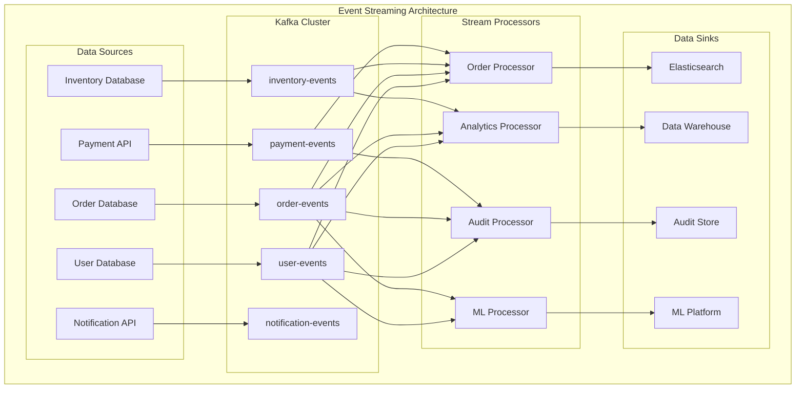
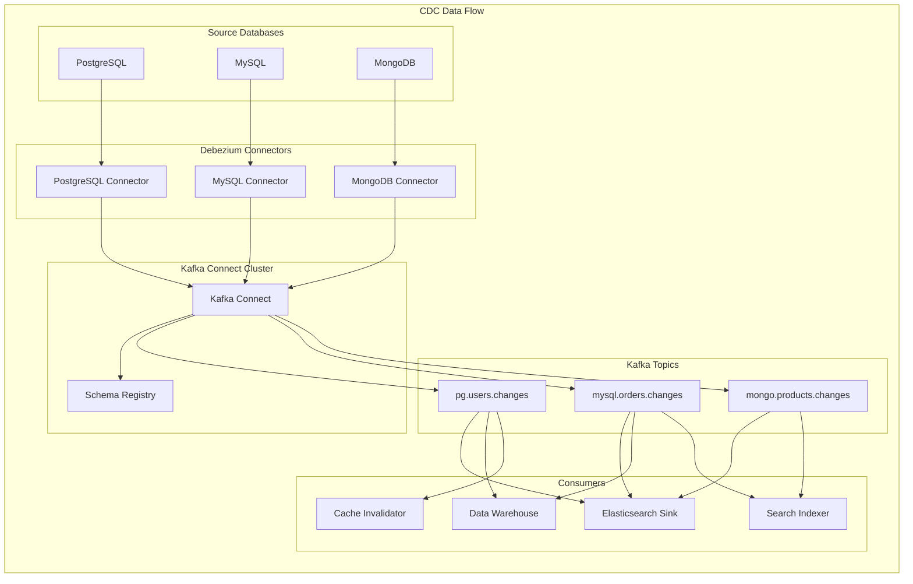
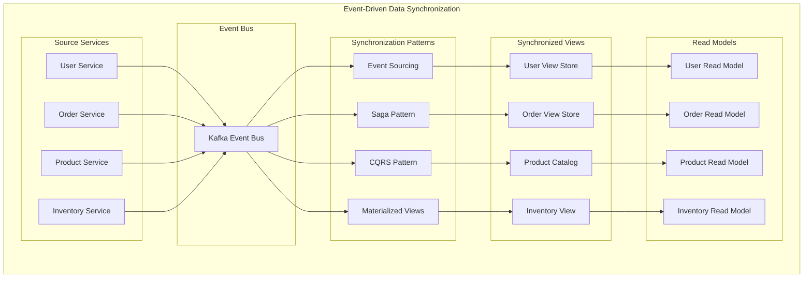
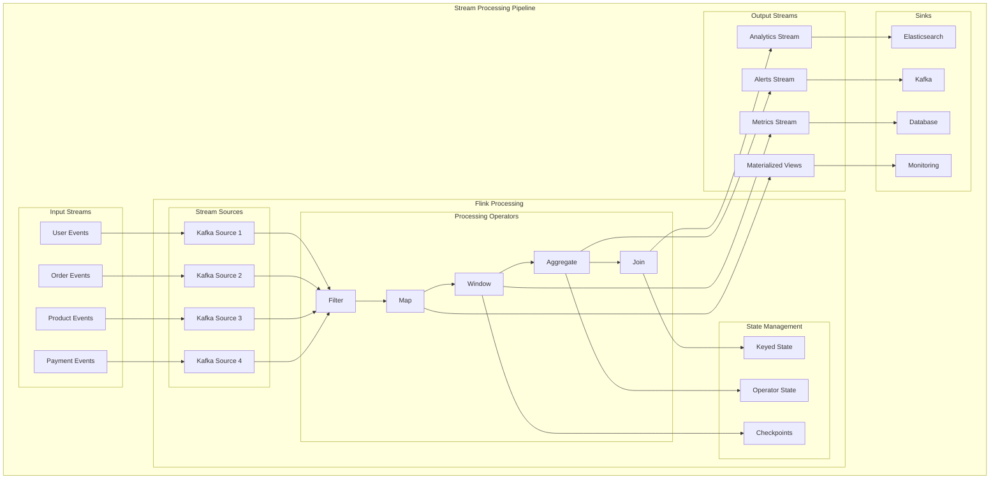
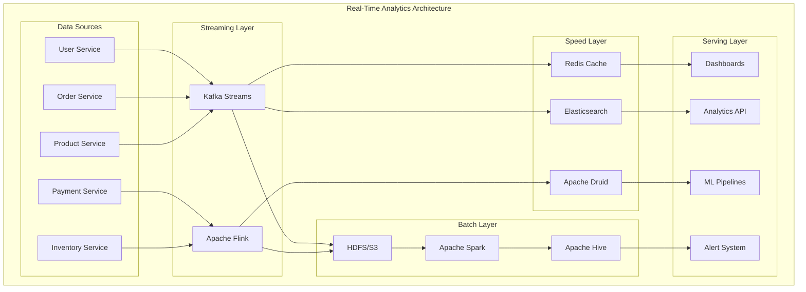
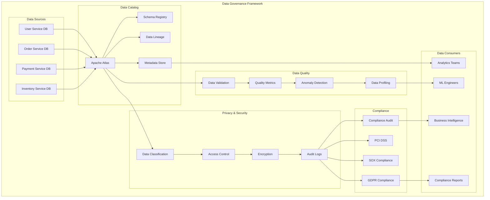

# Data Management and Streaming Patterns in Microservices: A Comprehensive Guide

In the world of microservices, managing data across distributed systems presents unique challenges. This comprehensive guide explores modern data management patterns, event streaming architectures, and real-time processing techniques that enable scalable, resilient, and performant microservices ecosystems.

## Table of Contents

1. [Event Streaming Architecture](#event-streaming-architecture)
2. [Change Data Capture (CDC) Implementation](#change-data-capture-cdc-implementation)
3. [Data Synchronization Strategies](#data-synchronization-strategies)
4. [Event-Driven Architecture Patterns](#event-driven-architecture-patterns)
5. [Stream Processing with Apache Flink](#stream-processing-with-apache-flink)
6. [Data Lake Patterns for Microservices](#data-lake-patterns-for-microservices)
7. [Real-Time Analytics Integration](#real-time-analytics-integration)
8. [Data Governance and Compliance](#data-governance-and-compliance)

## Event Streaming Architecture

Event streaming forms the backbone of modern microservices data management, enabling real-time data flow and decoupled communication between services.



### Kafka Configuration for Microservices

```yaml
# kafka-config.yml
apiVersion: v1
kind: ConfigMap
metadata:
  name: kafka-config
data:
  server.properties: |
    # Basic Kafka Configuration
    broker.id=1
    listeners=PLAINTEXT://:9092
    log.dirs=/var/lib/kafka/logs
    num.network.threads=8
    num.io.threads=16
    socket.send.buffer.bytes=102400
    socket.receive.buffer.bytes=102400
    socket.request.max.bytes=104857600

    # Topic Configuration
    num.partitions=12
    default.replication.factor=3
    min.insync.replicas=2
    unclean.leader.election.enable=false

    # Log Configuration
    log.retention.hours=168
    log.segment.bytes=1073741824
    log.retention.check.interval.ms=300000
    log.cleanup.policy=delete

    # Performance Tuning
    compression.type=snappy
    batch.size=65536
    linger.ms=100
    buffer.memory=134217728

    # High Availability
    replica.fetch.max.bytes=1048576
    fetch.purgatory.purge.interval.requests=1000
```

### Event Schema Management

```json
{
  "type": "record",
  "name": "OrderEvent",
  "namespace": "com.company.orders.events",
  "doc": "Schema for order events in the streaming platform",
  "fields": [
    {
      "name": "eventId",
      "type": "string",
      "doc": "Unique event identifier"
    },
    {
      "name": "eventType",
      "type": {
        "type": "enum",
        "name": "OrderEventType",
        "symbols": ["CREATED", "UPDATED", "CANCELLED", "SHIPPED", "DELIVERED"]
      }
    },
    {
      "name": "orderId",
      "type": "string",
      "doc": "Order identifier"
    },
    {
      "name": "customerId",
      "type": "string",
      "doc": "Customer identifier"
    },
    {
      "name": "orderData",
      "type": {
        "type": "record",
        "name": "OrderData",
        "fields": [
          { "name": "totalAmount", "type": "double" },
          { "name": "currency", "type": "string" },
          { "name": "items", "type": { "type": "array", "items": "string" } },
          { "name": "shippingAddress", "type": "string" }
        ]
      }
    },
    {
      "name": "timestamp",
      "type": "long",
      "logicalType": "timestamp-millis",
      "doc": "Event timestamp in milliseconds"
    },
    {
      "name": "metadata",
      "type": {
        "type": "map",
        "values": "string"
      },
      "default": {}
    }
  ]
}
```

## Change Data Capture (CDC) Implementation

CDC enables real-time data synchronization by capturing and streaming database changes to downstream systems.



### Debezium PostgreSQL Connector Configuration

```json
{
  "name": "user-database-connector",
  "config": {
    "connector.class": "io.debezium.connector.postgresql.PostgresConnector",
    "database.hostname": "postgres-primary",
    "database.port": "5432",
    "database.user": "debezium",
    "database.password": "${file:/opt/kafka/secrets/db-password.txt:password}",
    "database.dbname": "userdb",
    "database.server.name": "user-db",
    "table.include.list": "public.users,public.user_profiles,public.user_preferences",
    "plugin.name": "pgoutput",
    "slot.name": "debezium_user_slot",
    "publication.name": "debezium_publication",
    "transforms": "route,unwrap",
    "transforms.route.type": "org.apache.kafka.connect.transforms.RegexRouter",
    "transforms.route.regex": "([^.]+)\\.([^.]+)\\.([^.]+)",
    "transforms.route.replacement": "$3",
    "transforms.unwrap.type": "io.debezium.transforms.ExtractNewRecordState",
    "transforms.unwrap.drop.tombstones": "false",
    "transforms.unwrap.delete.handling.mode": "rewrite",
    "key.converter": "org.apache.kafka.connect.json.JsonConverter",
    "value.converter": "org.apache.kafka.connect.json.JsonConverter",
    "key.converter.schemas.enable": "false",
    "value.converter.schemas.enable": "false",
    "snapshot.mode": "initial",
    "decimal.handling.mode": "double",
    "include.schema.changes": "true",
    "provide.transaction.metadata": "true",
    "max.batch.size": "2048",
    "max.queue.size": "81920"
  }
}
```

### CDC Event Processing

```java
@Component
@Slf4j
public class UserCDCEventProcessor {

    @KafkaListener(topics = "users", groupId = "user-cdc-processor")
    public void processUserChange(
            @Payload UserChangeEvent event,
            @Header Map<String, Object> headers) {

        log.info("Processing user change event: {}", event.getEventType());

        switch (event.getEventType()) {
            case CREATE:
                handleUserCreation(event);
                break;
            case UPDATE:
                handleUserUpdate(event);
                break;
            case DELETE:
                handleUserDeletion(event);
                break;
        }
    }

    private void handleUserCreation(UserChangeEvent event) {
        // Update search index
        searchService.indexUser(event.getAfter());

        // Invalidate cache
        cacheService.evictUserCache(event.getAfter().getId());

        // Update materialized views
        materializedViewService.updateUserView(event.getAfter());

        // Trigger downstream events
        eventPublisher.publishEvent(new UserCreatedEvent(event.getAfter()));
    }

    private void handleUserUpdate(UserChangeEvent event) {
        UserData before = event.getBefore();
        UserData after = event.getAfter();

        // Compare changes and update accordingly
        if (!before.getEmail().equals(after.getEmail())) {
            emailChangeService.handleEmailChange(before.getId(),
                before.getEmail(), after.getEmail());
        }

        if (!before.getPreferences().equals(after.getPreferences())) {
            recommendationService.updateUserPreferences(after.getId(),
                after.getPreferences());
        }

        // Update search index with changes only
        searchService.updateUser(after, getChangedFields(before, after));
    }

    private void handleUserDeletion(UserChangeEvent event) {
        String userId = event.getBefore().getId();

        // Remove from search index
        searchService.removeUser(userId);

        // Clear all related caches
        cacheService.evictAllUserCaches(userId);

        // Clean up materialized views
        materializedViewService.removeUserData(userId);

        // Publish deletion event
        eventPublisher.publishEvent(new UserDeletedEvent(userId));
    }
}
```

## Data Synchronization Strategies

Effective data synchronization ensures consistency across distributed microservices while maintaining performance and availability.



### Event Sourcing Implementation

```java
@Entity
@Table(name = "event_store")
public class EventStore {
    @Id
    private String eventId;
    private String aggregateId;
    private String eventType;
    private String eventData;
    private Long version;
    private Instant timestamp;
    private String metadata;

    // Getters, setters, constructors
}

@Service
@Transactional
public class EventSourcingService {

    @Autowired
    private EventStoreRepository eventStoreRepository;

    @Autowired
    private KafkaTemplate<String, Object> kafkaTemplate;

    public void saveEvent(DomainEvent event) {
        // Save to event store
        EventStore eventStore = new EventStore();
        eventStore.setEventId(UUID.randomUUID().toString());
        eventStore.setAggregateId(event.getAggregateId());
        eventStore.setEventType(event.getClass().getSimpleName());
        eventStore.setEventData(jsonUtils.toJson(event));
        eventStore.setVersion(getNextVersion(event.getAggregateId()));
        eventStore.setTimestamp(Instant.now());

        eventStoreRepository.save(eventStore);

        // Publish to event stream
        kafkaTemplate.send("domain-events", event.getAggregateId(), event);
    }

    public List<DomainEvent> getEvents(String aggregateId) {
        return eventStoreRepository.findByAggregateIdOrderByVersion(aggregateId)
                .stream()
                .map(this::deserializeEvent)
                .collect(Collectors.toList());
    }

    public <T> T reconstructAggregate(String aggregateId, Class<T> aggregateClass) {
        List<DomainEvent> events = getEvents(aggregateId);
        T aggregate = createEmptyAggregate(aggregateClass);

        events.forEach(event -> applyEvent(aggregate, event));

        return aggregate;
    }
}
```

### SAGA Pattern for Distributed Transactions

```java
@Component
public class OrderProcessingSaga {

    @SagaOrchestrationStart
    @KafkaListener(topics = "order-created")
    public void startOrderProcessing(OrderCreatedEvent event) {
        SagaTransaction saga = SagaTransaction.builder()
                .sagaType("ORDER_PROCESSING")
                .correlationId(event.getOrderId())
                .build();

        // Step 1: Reserve inventory
        sagaManager.executeStep(saga, "RESERVE_INVENTORY",
            new ReserveInventoryCommand(event.getOrderId(), event.getItems()));
    }

    @SagaOrchestrationContinue
    @KafkaListener(topics = "inventory-reserved")
    public void handleInventoryReserved(InventoryReservedEvent event) {
        // Step 2: Process payment
        sagaManager.executeStep(getSaga(event.getOrderId()), "PROCESS_PAYMENT",
            new ProcessPaymentCommand(event.getOrderId(), event.getAmount()));
    }

    @SagaOrchestrationContinue
    @KafkaListener(topics = "payment-processed")
    public void handlePaymentProcessed(PaymentProcessedEvent event) {
        // Step 3: Update order status
        sagaManager.executeStep(getSaga(event.getOrderId()), "CONFIRM_ORDER",
            new ConfirmOrderCommand(event.getOrderId()));
    }

    @SagaOrchestrationContinue
    @KafkaListener(topics = "order-confirmed")
    public void handleOrderConfirmed(OrderConfirmedEvent event) {
        // Saga completed successfully
        sagaManager.completeSaga(getSaga(event.getOrderId()));
    }

    // Compensation handlers
    @SagaOrchestrationCompensate
    @KafkaListener(topics = "payment-failed")
    public void compensateInventoryReservation(PaymentFailedEvent event) {
        sagaManager.compensateStep(getSaga(event.getOrderId()), "RESERVE_INVENTORY",
            new ReleaseInventoryCommand(event.getOrderId()));
    }
}
```

## Event-Driven Architecture Patterns

Event-driven architectures enable loose coupling and scalability in microservices ecosystems.



### Event-Driven Domain Design

```java
public abstract class DomainEvent {
    private final String eventId;
    private final String aggregateId;
    private final Instant occurredOn;
    private final Long version;

    protected DomainEvent(String aggregateId, Long version) {
        this.eventId = UUID.randomUUID().toString();
        this.aggregateId = aggregateId;
        this.occurredOn = Instant.now();
        this.version = version;
    }

    // Getters
    public String getEventId() { return eventId; }
    public String getAggregateId() { return aggregateId; }
    public Instant getOccurredOn() { return occurredOn; }
    public Long getVersion() { return version; }
}

@JsonTypeName("UserRegistered")
public class UserRegisteredEvent extends DomainEvent {
    private final String userId;
    private final String email;
    private final String firstName;
    private final String lastName;
    private final Instant registrationTime;

    public UserRegisteredEvent(String userId, String email,
                              String firstName, String lastName) {
        super(userId, 1L);
        this.userId = userId;
        this.email = email;
        this.firstName = firstName;
        this.lastName = lastName;
        this.registrationTime = Instant.now();
    }

    // Getters
}

@Component
public class EventPublisher {

    @Autowired
    private KafkaTemplate<String, DomainEvent> kafkaTemplate;

    @Autowired
    private EventStoreService eventStoreService;

    @EventListener
    @Async
    public void handleDomainEvent(DomainEvent event) {
        try {
            // Store event
            eventStoreService.saveEvent(event);

            // Publish to stream
            String topicName = getTopicName(event);
            kafkaTemplate.send(topicName, event.getAggregateId(), event)
                    .addCallback(
                            result -> log.info("Event published successfully: {}",
                                event.getEventId()),
                            failure -> log.error("Failed to publish event: {}",
                                event.getEventId(), failure)
                    );
        } catch (Exception e) {
            log.error("Error handling domain event: {}", event.getEventId(), e);
            // Implement retry logic or dead letter queue
        }
    }

    private String getTopicName(DomainEvent event) {
        return event.getClass().getSimpleName()
                .replaceAll("([a-z])([A-Z])", "$1-$2")
                .toLowerCase();
    }
}
```

## Stream Processing with Apache Flink

Apache Flink provides powerful stream processing capabilities for real-time data transformation and analytics.

### Flink Stream Processing Job

```java
@Component
public class OrderAnalyticsJob {

    public void executeJob() throws Exception {
        StreamExecutionEnvironment env = StreamExecutionEnvironment
                .getExecutionEnvironment();

        // Configure checkpointing
        env.enableCheckpointing(30000);
        env.getCheckpointConfig().setCheckpointingMode(CheckpointingMode.EXACTLY_ONCE);
        env.getCheckpointConfig().setMinPauseBetweenCheckpoints(5000);
        env.getCheckpointConfig().setCheckpointTimeout(60000);

        // Configure Kafka source
        Properties kafkaProps = new Properties();
        kafkaProps.setProperty("bootstrap.servers", "kafka:9092");
        kafkaProps.setProperty("group.id", "order-analytics");

        FlinkKafkaConsumer<OrderEvent> orderSource = new FlinkKafkaConsumer<>(
                "order-events",
                new OrderEventDeserializationSchema(),
                kafkaProps
        );

        DataStream<OrderEvent> orderStream = env.addSource(orderSource);

        // Real-time order analytics
        DataStream<OrderMetrics> orderMetrics = orderStream
                .filter(event -> event.getEventType() == OrderEventType.CREATED)
                .keyBy(OrderEvent::getCustomerId)
                .window(TumblingEventTimeWindows.of(Time.minutes(5)))
                .aggregate(new OrderAggregateFunction());

        // Fraud detection
        DataStream<FraudAlert> fraudAlerts = orderStream
                .keyBy(OrderEvent::getCustomerId)
                .process(new FraudDetectionProcessFunction());

        // Real-time recommendations
        DataStream<ProductRecommendation> recommendations = orderStream
                .connect(userPreferencesStream)
                .keyBy(OrderEvent::getCustomerId, UserPreference::getUserId)
                .process(new RecommendationProcessFunction());

        // Output to sinks
        orderMetrics.addSink(new ElasticsearchSink<>(getElasticsearchConfig()));
        fraudAlerts.addSink(new FlinkKafkaProducer<>("fraud-alerts",
                new FraudAlertSerializationSchema(), kafkaProps));
        recommendations.addSink(new RedisSink<>(getRedisConfig()));

        env.execute("Order Analytics Job");
    }
}

public class OrderAggregateFunction
        implements AggregateFunction<OrderEvent, OrderAccumulator, OrderMetrics> {

    @Override
    public OrderAccumulator createAccumulator() {
        return new OrderAccumulator();
    }

    @Override
    public OrderAccumulator add(OrderEvent event, OrderAccumulator accumulator) {
        accumulator.addOrder(event);
        return accumulator;
    }

    @Override
    public OrderMetrics getResult(OrderAccumulator accumulator) {
        return OrderMetrics.builder()
                .customerId(accumulator.getCustomerId())
                .orderCount(accumulator.getOrderCount())
                .totalAmount(accumulator.getTotalAmount())
                .averageOrderValue(accumulator.getAverageOrderValue())
                .windowStart(accumulator.getWindowStart())
                .windowEnd(accumulator.getWindowEnd())
                .build();
    }

    @Override
    public OrderAccumulator merge(OrderAccumulator a, OrderAccumulator b) {
        return a.merge(b);
    }
}
```

### Complex Event Processing

```java
public class FraudDetectionProcessFunction
        extends KeyedProcessFunction<String, OrderEvent, FraudAlert> {

    private static final double FRAUD_THRESHOLD = 1000.0;
    private static final long TIME_WINDOW = 60000; // 1 minute

    private transient ValueState<Double> totalAmountState;
    private transient ValueState<Integer> orderCountState;
    private transient ValueState<Long> windowStartState;

    @Override
    public void open(Configuration parameters) {
        ValueStateDescriptor<Double> amountDescriptor =
                new ValueStateDescriptor<>("totalAmount", Double.class);
        totalAmountState = getRuntimeContext().getState(amountDescriptor);

        ValueStateDescriptor<Integer> countDescriptor =
                new ValueStateDescriptor<>("orderCount", Integer.class);
        orderCountState = getRuntimeContext().getState(countDescriptor);

        ValueStateDescriptor<Long> windowDescriptor =
                new ValueStateDescriptor<>("windowStart", Long.class);
        windowStartState = getRuntimeContext().getState(windowDescriptor);
    }

    @Override
    public void processElement(OrderEvent event, Context ctx,
                              Collector<FraudAlert> out) throws Exception {

        long currentTime = ctx.timestamp();
        Long windowStart = windowStartState.value();

        // Initialize or reset window
        if (windowStart == null || currentTime - windowStart > TIME_WINDOW) {
            windowStartState.update(currentTime);
            totalAmountState.update(0.0);
            orderCountState.update(0);

            // Set timer for window cleanup
            ctx.timerService().registerEventTimeTimer(currentTime + TIME_WINDOW);
        }

        // Update state
        Double currentTotal = totalAmountState.value();
        Integer currentCount = orderCountState.value();

        totalAmountState.update(currentTotal + event.getAmount());
        orderCountState.update(currentCount + 1);

        // Check for fraud patterns
        if (totalAmountState.value() > FRAUD_THRESHOLD) {
            FraudAlert alert = FraudAlert.builder()
                    .customerId(event.getCustomerId())
                    .alertType(FraudAlertType.HIGH_VALUE_TRANSACTIONS)
                    .totalAmount(totalAmountState.value())
                    .orderCount(orderCountState.value())
                    .timeWindow(TIME_WINDOW)
                    .timestamp(currentTime)
                    .build();

            out.collect(alert);
        }

        // Check for rapid fire orders
        if (orderCountState.value() > 10) {
            FraudAlert alert = FraudAlert.builder()
                    .customerId(event.getCustomerId())
                    .alertType(FraudAlertType.RAPID_FIRE_ORDERS)
                    .orderCount(orderCountState.value())
                    .timeWindow(TIME_WINDOW)
                    .timestamp(currentTime)
                    .build();

            out.collect(alert);
        }
    }

    @Override
    public void onTimer(long timestamp, OnTimerContext ctx,
                       Collector<FraudAlert> out) {
        // Clean up expired state
        totalAmountState.clear();
        orderCountState.clear();
        windowStartState.clear();
    }
}
```

## Data Lake Patterns for Microservices

Data lakes provide scalable storage and analytics capabilities for microservices-generated data.



### Delta Lake Implementation

```scala
import org.apache.spark.sql.SparkSession
import org.apache.spark.sql.streaming.Trigger
import io.delta.tables._

object MicroservicesDataLake {

  def main(args: Array[String]): Unit = {
    val spark = SparkSession.builder()
      .appName("Microservices Data Lake")
      .config("spark.sql.extensions", "io.delta.sql.DeltaSparkSessionExtension")
      .config("spark.sql.catalog.spark_catalog", "org.apache.spark.sql.delta.catalog.DeltaCatalog")
      .getOrCreate()

    import spark.implicits._

    // Stream from Kafka to Delta Lake
    val orderStream = spark
      .readStream
      .format("kafka")
      .option("kafka.bootstrap.servers", "kafka:9092")
      .option("subscribe", "order-events")
      .load()
      .selectExpr("CAST(value AS STRING)")
      .select(from_json($"value", orderEventSchema).as("data"))
      .select("data.*")

    // Write to Delta Lake with schema evolution
    val deltaWriter = orderStream
      .writeStream
      .format("delta")
      .outputMode("append")
      .option("checkpointLocation", "/delta/checkpoints/orders")
      .option("mergeSchema", "true")
      .trigger(Trigger.ProcessingTime("30 seconds"))
      .start("/delta/tables/orders")

    // Create materialized views
    createOrderAnalyticsView(spark)

    // Real-time aggregations
    val orderMetrics = orderStream
      .groupBy(
        window($"timestamp", "5 minutes"),
        $"customerId"
      )
      .agg(
        count("*").as("orderCount"),
        sum("totalAmount").as("totalRevenue"),
        avg("totalAmount").as("avgOrderValue")
      )

    orderMetrics
      .writeStream
      .format("delta")
      .outputMode("update")
      .option("checkpointLocation", "/delta/checkpoints/metrics")
      .start("/delta/tables/order_metrics")

    deltaWriter.awaitTermination()
  }

  def createOrderAnalyticsView(spark: SparkSession): Unit = {
    val orders = DeltaTable.forPath(spark, "/delta/tables/orders")
    val customers = DeltaTable.forPath(spark, "/delta/tables/customers")

    // Merge customer data with orders
    orders.alias("orders")
      .merge(
        customers.toDF.alias("customers"),
        "orders.customerId = customers.id"
      )
      .whenMatched
      .updateExpr(Map(
        "customerSegment" -> "customers.segment",
        "customerLifetimeValue" -> "customers.lifetimeValue"
      ))
      .execute()

    // Create aggregated view
    spark.sql("""
      CREATE OR REPLACE TEMPORARY VIEW order_analytics AS
      SELECT
        customerId,
        customerSegment,
        DATE(timestamp) as orderDate,
        COUNT(*) as dailyOrders,
        SUM(totalAmount) as dailyRevenue,
        AVG(totalAmount) as avgOrderValue,
        MAX(totalAmount) as maxOrderValue
      FROM delta.`/delta/tables/orders`
      WHERE timestamp >= current_date() - INTERVAL 30 DAYS
      GROUP BY customerId, customerSegment, DATE(timestamp)
    """)
  }
}
```

### Data Lake Schema Management

```yaml
# data-lake-schema.yml
apiVersion: v1
kind: ConfigMap
metadata:
  name: data-lake-schemas
data:
  order-event-schema.json: |
    {
      "type": "struct",
      "fields": [
        {"name": "orderId", "type": "string", "nullable": false},
        {"name": "customerId", "type": "string", "nullable": false},
        {"name": "timestamp", "type": "timestamp", "nullable": false},
        {"name": "eventType", "type": "string", "nullable": false},
        {"name": "totalAmount", "type": "decimal(10,2)", "nullable": false},
        {"name": "currency", "type": "string", "nullable": false},
        {"name": "items", "type": {"type": "array", "elementType": {
          "type": "struct",
          "fields": [
            {"name": "productId", "type": "string", "nullable": false},
            {"name": "quantity", "type": "integer", "nullable": false},
            {"name": "unitPrice", "type": "decimal(10,2)", "nullable": false}
          ]
        }}, "nullable": false},
        {"name": "metadata", "type": {"type": "map", "keyType": "string", "valueType": "string"}, "nullable": true}
      ]
    }

  user-event-schema.json: |
    {
      "type": "struct",
      "fields": [
        {"name": "userId", "type": "string", "nullable": false},
        {"name": "timestamp", "type": "timestamp", "nullable": false},
        {"name": "eventType", "type": "string", "nullable": false},
        {"name": "sessionId", "type": "string", "nullable": true},
        {"name": "properties", "type": {"type": "map", "keyType": "string", "valueType": "string"}, "nullable": true}
      ]
    }
```

## Real-Time Analytics Integration

Real-time analytics enable immediate insights and decision-making across microservices.

### ClickHouse Analytics Engine

```sql
-- ClickHouse schema for real-time analytics
CREATE TABLE order_events_queue (
    order_id String,
    customer_id String,
    event_type String,
    timestamp DateTime64(3),
    total_amount Decimal(10, 2),
    currency String,
    items Array(Tuple(product_id String, quantity UInt32, unit_price Decimal(10, 2))),
    metadata Map(String, String)
) ENGINE = Kafka
SETTINGS
    kafka_broker_list = 'kafka:9092',
    kafka_topic_list = 'order-events',
    kafka_group_name = 'clickhouse-analytics',
    kafka_format = 'JSONEachRow';

-- Materialized view for real-time aggregation
CREATE MATERIALIZED VIEW order_metrics_mv TO order_metrics AS
SELECT
    customer_id,
    toStartOfHour(timestamp) as hour,
    count() as order_count,
    sum(total_amount) as total_revenue,
    avg(total_amount) as avg_order_value,
    uniq(order_id) as unique_orders
FROM order_events_queue
WHERE event_type = 'CREATED'
GROUP BY customer_id, hour;

-- Real-time dashboard queries
-- Customer segmentation
SELECT
    customer_id,
    multiIf(
        total_revenue > 10000, 'VIP',
        total_revenue > 5000, 'Premium',
        total_revenue > 1000, 'Regular',
        'New'
    ) as segment,
    total_revenue,
    order_count,
    avg_order_value
FROM (
    SELECT
        customer_id,
        sum(total_amount) as total_revenue,
        count() as order_count,
        avg(total_amount) as avg_order_value
    FROM order_events_queue
    WHERE timestamp >= now() - INTERVAL 30 DAY
        AND event_type = 'CREATED'
    GROUP BY customer_id
);

-- Real-time product performance
SELECT
    product_id,
    sum(quantity) as total_sold,
    sum(quantity * unit_price) as revenue,
    count(DISTINCT customer_id) as unique_customers,
    avg(unit_price) as avg_price
FROM order_events_queue
ARRAY JOIN items AS item
WHERE timestamp >= now() - INTERVAL 1 DAY
    AND event_type = 'CREATED'
GROUP BY product_id
ORDER BY revenue DESC
LIMIT 100;
```

### Real-Time Dashboard Service

```java
@RestController
@RequestMapping("/api/analytics")
public class RealTimeAnalyticsController {

    @Autowired
    private ClickHouseAnalyticsService analyticsService;

    @Autowired
    private RedisTemplate<String, Object> redisTemplate;

    @GetMapping("/dashboard/overview")
    public ResponseEntity<DashboardOverview> getDashboardOverview() {
        String cacheKey = "dashboard:overview";
        DashboardOverview cached = (DashboardOverview) redisTemplate.opsForValue()
                .get(cacheKey);

        if (cached != null) {
            return ResponseEntity.ok(cached);
        }

        DashboardOverview overview = DashboardOverview.builder()
                .totalRevenue(analyticsService.getTotalRevenue(Duration.ofDays(1)))
                .orderCount(analyticsService.getOrderCount(Duration.ofDays(1)))
                .activeCustomers(analyticsService.getActiveCustomers(Duration.ofDays(1)))
                .averageOrderValue(analyticsService.getAverageOrderValue(Duration.ofDays(1)))
                .topProducts(analyticsService.getTopProducts(10, Duration.ofDays(1)))
                .revenueByHour(analyticsService.getRevenueByHour(Duration.ofDays(1)))
                .customerSegments(analyticsService.getCustomerSegments())
                .build();

        // Cache for 1 minute
        redisTemplate.opsForValue().set(cacheKey, overview, Duration.ofMinutes(1));

        return ResponseEntity.ok(overview);
    }

    @GetMapping("/customers/{customerId}/insights")
    public ResponseEntity<CustomerInsights> getCustomerInsights(
            @PathVariable String customerId) {

        CustomerInsights insights = CustomerInsights.builder()
                .customerId(customerId)
                .totalOrders(analyticsService.getCustomerOrderCount(customerId))
                .totalSpent(analyticsService.getCustomerTotalSpent(customerId))
                .averageOrderValue(analyticsService.getCustomerAverageOrderValue(customerId))
                .lastOrderDate(analyticsService.getCustomerLastOrderDate(customerId))
                .favoriteCategories(analyticsService.getCustomerFavoriteCategories(customerId))
                .recommendedProducts(analyticsService.getRecommendedProducts(customerId))
                .lifetimeValue(analyticsService.getCustomerLifetimeValue(customerId))
                .churnRisk(analyticsService.getCustomerChurnRisk(customerId))
                .build();

        return ResponseEntity.ok(insights);
    }

    @GetMapping("/alerts/active")
    public ResponseEntity<List<Alert>> getActiveAlerts() {
        List<Alert> alerts = new ArrayList<>();

        // Revenue alerts
        if (analyticsService.getRevenueGrowth(Duration.ofDays(1)) < -0.1) {
            alerts.add(Alert.builder()
                    .type(AlertType.REVENUE_DROP)
                    .severity(AlertSeverity.HIGH)
                    .message("Revenue dropped by more than 10% in the last 24 hours")
                    .timestamp(Instant.now())
                    .build());
        }

        // Fraud alerts
        List<FraudAlert> fraudAlerts = analyticsService.getActiveFraudAlerts();
        alerts.addAll(fraudAlerts.stream()
                .map(this::convertToAlert)
                .collect(Collectors.toList()));

        return ResponseEntity.ok(alerts);
    }
}
```

## Data Governance and Compliance

Data governance ensures data quality, security, and compliance across the microservices ecosystem.



### Data Classification and Privacy

```java
@Component
public class DataGovernanceService {

    @Autowired
    private DataCatalogService dataCatalogService;

    @Autowired
    private EncryptionService encryptionService;

    public void classifyData(DataAsset dataAsset) {
        DataClassification classification = DataClassification.builder()
                .assetId(dataAsset.getId())
                .dataTypes(detectDataTypes(dataAsset))
                .sensitivityLevel(determineSensitivityLevel(dataAsset))
                .retentionPolicy(determineRetentionPolicy(dataAsset))
                .accessRestrictions(determineAccessRestrictions(dataAsset))
                .build();

        dataCatalogService.updateClassification(classification);

        // Apply encryption for sensitive data
        if (classification.getSensitivityLevel() == SensitivityLevel.HIGH) {
            encryptionService.encryptDataAsset(dataAsset);
        }
    }

    private List<DataType> detectDataTypes(DataAsset dataAsset) {
        List<DataType> detectedTypes = new ArrayList<>();

        for (DataField field : dataAsset.getFields()) {
            if (isEmailField(field)) {
                detectedTypes.add(DataType.EMAIL);
            } else if (isPhoneField(field)) {
                detectedTypes.add(DataType.PHONE);
            } else if (isCreditCardField(field)) {
                detectedTypes.add(DataType.CREDIT_CARD);
            } else if (isSSNField(field)) {
                detectedTypes.add(DataType.SSN);
            }
        }

        return detectedTypes;
    }

    private SensitivityLevel determineSensitivityLevel(DataAsset dataAsset) {
        List<DataType> dataTypes = detectDataTypes(dataAsset);

        if (dataTypes.contains(DataType.CREDIT_CARD) ||
            dataTypes.contains(DataType.SSN)) {
            return SensitivityLevel.HIGH;
        } else if (dataTypes.contains(DataType.EMAIL) ||
                   dataTypes.contains(DataType.PHONE)) {
            return SensitivityLevel.MEDIUM;
        } else {
            return SensitivityLevel.LOW;
        }
    }
}

@Service
public class GDPRComplianceService {

    @Autowired
    private EventPublisher eventPublisher;

    @Autowired
    private DataDeletionService dataDeletionService;

    public void handleDataSubjectRequest(DataSubjectRequest request) {
        switch (request.getRequestType()) {
            case ACCESS:
                handleAccessRequest(request);
                break;
            case RECTIFICATION:
                handleRectificationRequest(request);
                break;
            case ERASURE:
                handleErasureRequest(request);
                break;
            case PORTABILITY:
                handlePortabilityRequest(request);
                break;
        }
    }

    private void handleErasureRequest(DataSubjectRequest request) {
        String dataSubjectId = request.getDataSubjectId();

        // Find all data across microservices
        List<DataLocation> dataLocations = findDataAcrossServices(dataSubjectId);

        // Create deletion tasks
        for (DataLocation location : dataLocations) {
            DataDeletionTask task = DataDeletionTask.builder()
                    .taskId(UUID.randomUUID().toString())
                    .dataSubjectId(dataSubjectId)
                    .serviceId(location.getServiceId())
                    .dataPath(location.getDataPath())
                    .requestId(request.getRequestId())
                    .build();

            eventPublisher.publishEvent(new DataDeletionRequestedEvent(task));
        }

        // Track deletion progress
        trackDeletionProgress(request.getRequestId(), dataLocations);
    }

    @EventListener
    public void handleDataDeletionCompleted(DataDeletionCompletedEvent event) {
        // Update deletion progress
        updateDeletionProgress(event.getRequestId(), event.getServiceId());

        // Check if all deletions are complete
        if (isAllDeletionComplete(event.getRequestId())) {
            notifyDataSubject(event.getRequestId());
        }
    }
}
```

### Audit and Compliance Reporting

```java
@Service
public class ComplianceReportingService {

    @Autowired
    private AuditLogRepository auditLogRepository;

    @Autowired
    private DataLineageService dataLineageService;

    public ComplianceReport generateSOXReport(LocalDate startDate, LocalDate endDate) {
        // Financial data access audit
        List<AuditLog> financialDataAccess = auditLogRepository
                .findByDataTypeAndDateRange(DataType.FINANCIAL, startDate, endDate);

        // Data change tracking
        List<DataChange> dataChanges = auditLogRepository
                .findDataChangesByDateRange(startDate, endDate);

        // Access control violations
        List<AccessViolation> violations = auditLogRepository
                .findAccessViolationsByDateRange(startDate, endDate);

        return SOXComplianceReport.builder()
                .reportPeriod(DateRange.of(startDate, endDate))
                .financialDataAccess(financialDataAccess)
                .dataChanges(dataChanges)
                .accessViolations(violations)
                .controlsEffectiveness(assessControlsEffectiveness(violations))
                .recommendations(generateRecommendations(violations))
                .build();
    }

    public DataLineageReport generateDataLineageReport(String dataAssetId) {
        DataLineage lineage = dataLineageService.getDataLineage(dataAssetId);

        return DataLineageReport.builder()
                .dataAssetId(dataAssetId)
                .sourceDatasets(lineage.getSources())
                .transformations(lineage.getTransformations())
                .downstreamConsumers(lineage.getConsumers())
                .dataQualityMetrics(getDataQualityMetrics(dataAssetId))
                .complianceStatus(getComplianceStatus(dataAssetId))
                .build();
    }

    @Scheduled(cron = "0 0 1 * * ?") // Monthly
    public void generateMonthlyComplianceReport() {
        LocalDate endDate = LocalDate.now().minusDays(1);
        LocalDate startDate = endDate.minusMonths(1);

        ComplianceReport gdprReport = generateGDPRReport(startDate, endDate);
        ComplianceReport soxReport = generateSOXReport(startDate, endDate);
        ComplianceReport pciReport = generatePCIReport(startDate, endDate);

        // Send to compliance team
        complianceNotificationService.sendMonthlyReports(
                Arrays.asList(gdprReport, soxReport, pciReport)
        );
    }
}
```

## Best Practices and Implementation Tips

### 1. Event Design Principles

- **Use meaningful event names** that describe business events
- **Include sufficient context** in events for downstream processing
- **Version your events** using schema evolution strategies
- **Design for idempotency** to handle duplicate events gracefully

### 2. Stream Processing Optimization

- **Choose appropriate window types** based on business requirements
- **Implement proper checkpointing** for fault tolerance
- **Use state backends effectively** for large state management
- **Monitor stream processing lag** and performance metrics

### 3. Data Lake Architecture

- **Partition data effectively** for query performance
- **Implement data lifecycle management** for cost optimization
- **Use appropriate file formats** (Parquet, Delta, Iceberg)
- **Maintain data quality** through automated validation

### 4. Real-Time Analytics

- **Pre-aggregate data** for faster query performance
- **Use caching strategically** for frequently accessed data
- **Implement circuit breakers** for analytics service resilience
- **Monitor query performance** and optimize accordingly

### 5. Data Governance

- **Classify data early** in the development process
- **Implement privacy by design** principles
- **Automate compliance checks** where possible
- **Maintain comprehensive audit trails**

## Conclusion

Effective data management in microservices requires a comprehensive approach that combines event streaming, change data capture, stream processing, and robust governance frameworks. By implementing these patterns with tools like Apache Kafka, Debezium, Apache Flink, and modern data lake technologies, organizations can build scalable, resilient, and compliant data architectures that support real-time decision-making and business growth.

The key to success lies in choosing the right patterns for your specific use cases, implementing proper monitoring and governance, and continuously optimizing based on performance metrics and business requirements.
