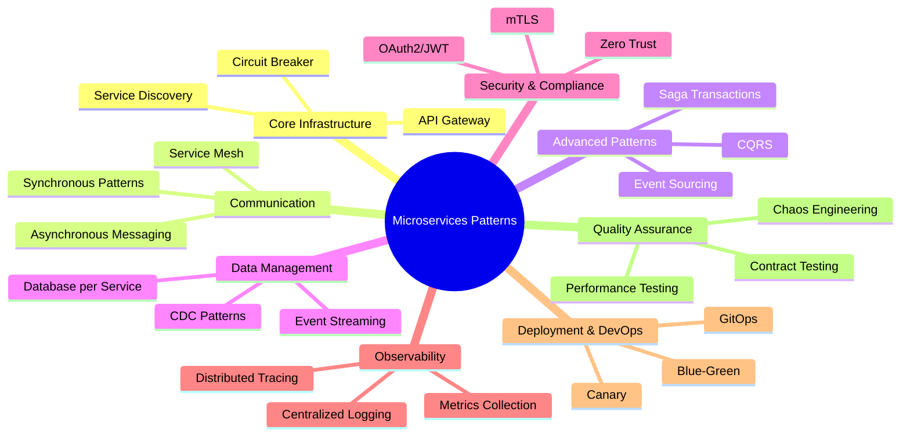
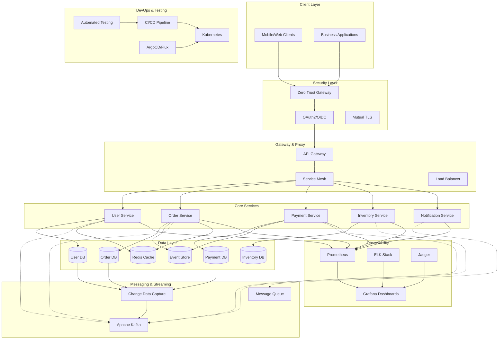

# Complete Microservices Patterns Guide: Expanded Edition

🎉 **Now featuring 12 comprehensive pattern guides with 50+ mermaid diagrams!**

Welcome to the most comprehensive resource hub for microservices patterns! This expanded collection covers everything from core infrastructure patterns to advanced security, observability, and data management strategies.

## 📊 Expanded Pattern Overview

## 🎯 Core Infrastructure Patterns

### 1. API Gateway Pattern

**[📖 Read Full Guide →](./api-gateway-pattern-comprehensive-guide/)**

The API Gateway pattern provides a single entry point for client requests, handling routing, authentication, rate limiting, and request/response transformation.

**Key Topics Covered:**

- ✅ Complete architecture with 5 mermaid diagrams
- ✅ Authentication and authorization flow
- ✅ Rate limiting and throttling mechanisms
- ✅ Service routing and load balancing
- ✅ Backend for Frontend (BFF) pattern
- ✅ Real-world case studies (Netflix, Amazon, Uber)

---

### 2. Service Discovery and Registry Pattern

**[📖 Read Full Guide →](./service-discovery-registry-pattern-guide/)**

Service Discovery enables microservices to find and communicate with each other dynamically without hardcoded endpoints.

**Key Topics Covered:**

- ✅ Client-side vs Server-side discovery
- ✅ Service registry implementation
- ✅ Health checking mechanisms
- ✅ Load balancing strategies
- ✅ Consul, Eureka, and Kubernetes examples

---

### 3. Circuit Breaker and Resilience Patterns

**[📖 Read Full Guide →](./circuit-breaker-resilience-patterns-guide/)**

Building fault-tolerant microservices with circuit breakers, timeouts, retries, and bulkhead isolation patterns.

**Key Topics Covered:**

- ✅ Circuit breaker state machine
- ✅ Timeout and retry patterns with exponential backoff
- ✅ Bulkhead pattern for resource isolation
- ✅ Rate limiting and throttling
- ✅ Resilience4j implementation

---

## 🔄 Communication Patterns

### 4. Microservices Communication Patterns

**[📖 Read Full Guide →](./microservices-communication-patterns-guide/)**

Comprehensive guide to inter-service communication including synchronous, asynchronous, and service mesh patterns.

**Key Topics Covered:**

- ✅ Synchronous communication (REST, GraphQL, gRPC)
- ✅ Asynchronous communication (Message Queues, Pub/Sub)
- ✅ Event Streaming with Kafka
- ✅ Service Mesh communication
- ✅ API versioning strategies

---

## 🎭 Advanced Transaction Patterns

### 5. Saga Pattern for Distributed Transactions

**[📖 Read Full Guide →](./saga-pattern-distributed-transactions-guide/)**

Managing distributed transactions across microservices using choreography and orchestration approaches.

**Key Topics Covered:**

- ✅ Choreography vs Orchestration approaches
- ✅ Compensation logic and rollback strategies
- ✅ State management and persistence
- ✅ Error handling and recovery
- ✅ Real-world implementations (Uber, Banking)

---

### 6. CQRS and Event Sourcing Patterns

**[📖 Read Full Guide →](./cqrs-event-sourcing-patterns-guide/)**

Command Query Responsibility Segregation and Event Sourcing for scalable, auditable, and high-performance systems.

**Key Topics Covered:**

- ✅ CQRS fundamentals and architecture
- ✅ Event Sourcing implementation
- ✅ Event store and projection strategies
- ✅ Event versioning and schema evolution
- ✅ Combined CQRS + Event Sourcing architecture

---

## 🗄️ Data Management Patterns

### 7. Database Patterns for Microservices

**[📖 Read Full Guide →](./database-patterns-microservices-guide/)**

Comprehensive guide to database architecture patterns including Database per Service, data consistency, and polyglot persistence.

**Key Topics Covered:**

- ✅ Database per Service pattern benefits and challenges
- ✅ Shared Database anti-pattern analysis
- ✅ Data consistency patterns (ACID vs BASE)
- ✅ Migration strategies (Strangler Fig for data)
- ✅ Polyglot persistence approach
- ✅ Distributed transaction management

**Mermaid Diagrams:** 6+ detailed diagrams including database architecture, consistency models, and migration strategies

---

### 8. Data Management and Streaming Patterns

**[📖 Read Full Guide →](./data-management-streaming-patterns-guide/)**

Event streaming, Change Data Capture, and real-time data processing patterns for modern microservices architectures.

**Key Topics Covered:**

- ✅ Event streaming architecture with Kafka
- ✅ Change Data Capture (CDC) with Debezium
- ✅ Stream processing with Apache Flink
- ✅ Real-time analytics integration
- ✅ Data lake patterns for microservices
- ✅ Data governance and compliance

**Mermaid Diagrams:** 6 comprehensive diagrams covering streaming architecture, CDC flows, and governance frameworks

---

## 🔒 Security and Compliance

### 9. Security Patterns and Zero Trust Architecture

**[📖 Read Full Guide →](./security-patterns-zero-trust-guide/)**

Enterprise-grade security patterns including Zero Trust, OAuth2, JWT, mTLS, and comprehensive API security.

**Key Topics Covered:**

- ✅ Zero Trust Architecture principles
- ✅ OAuth2/OpenID Connect implementation
- ✅ JWT token management and security
- ✅ Mutual TLS (mTLS) configuration
- ✅ API security patterns (OWASP Top 10 2023)
- ✅ Secret management with Vault/AWS Secrets Manager
- ✅ Compliance frameworks (SOC2, PCI-DSS, GDPR)

**Mermaid Diagrams:** 7 detailed security diagrams including Zero Trust architecture, authentication flows, and compliance frameworks

---

## 📊 Observability and Operations

### 10. Observability and Monitoring Patterns

**[📖 Read Full Guide →](./observability-monitoring-patterns-guide/)**

Complete observability strategy with distributed tracing, metrics collection, centralized logging, and modern monitoring approaches.

**Key Topics Covered:**

- ✅ Three Pillars of Observability (Metrics, Logs, Traces)
- ✅ OpenTelemetry implementation
- ✅ Distributed tracing with Jaeger
- ✅ Prometheus metrics and Grafana dashboards
- ✅ Centralized logging with ELK stack
- ✅ SLI/SLO/SLA definitions and alerting
- ✅ Chaos engineering and resilience testing

**Mermaid Diagrams:** 6+ comprehensive diagrams covering observability architecture, tracing flows, and monitoring pipelines

---

## 🚀 Deployment and DevOps

### 11. Deployment and Release Patterns

**[📖 Read Full Guide →](./deployment-release-patterns-guide/)**

Modern deployment strategies including Blue-Green, Canary, GitOps, and progressive delivery patterns.

**Key Topics Covered:**

- ✅ Blue-Green deployment with zero downtime
- ✅ Canary deployment with Istio service mesh
- ✅ Rolling updates with Kubernetes
- ✅ Feature flags and progressive delivery
- ✅ GitOps patterns with ArgoCD/Flux
- ✅ CI/CD pipeline best practices
- ✅ Database migration strategies

**Mermaid Diagrams:** 6 detailed deployment diagrams including traffic splitting, GitOps workflows, and CI/CD pipelines

---

## 🧪 Quality Assurance

### 12. Testing Patterns for Microservices

**[📖 Read Full Guide →](./testing-patterns-microservices-guide/)**

Comprehensive testing strategies including contract testing, integration testing, and chaos engineering for resilient systems.

**Key Topics Covered:**

- ✅ Testing pyramid for microservices
- ✅ Contract testing with Pact
- ✅ Integration testing with TestContainers
- ✅ Performance testing strategies
- ✅ Chaos engineering with modern tools
- ✅ Test automation and CI/CD integration
- ✅ End-to-end testing approaches

**Mermaid Diagrams:** 5+ testing diagrams including test pyramid, contract flows, and chaos experiment patterns

---

## 📊 Expanded Reference Matrix

| Pattern Category          | Complexity | Implementation Time | Primary Benefit            | Use Case                  |
| ------------------------- | ---------- | ------------------- | -------------------------- | ------------------------- |
| **API Gateway**           | Medium     | 2-3 weeks           | Centralized Management     | Client Entry Point        |
| **Service Discovery**     | Medium     | 1-2 weeks           | Dynamic Routing            | Service Location          |
| **Circuit Breaker**       | Medium     | 1 week              | System Resilience          | Fault Tolerance           |
| **Communication**         | Low-High   | 1-4 weeks           | Flexible Integration       | Service Communication     |
| **Saga Pattern**          | High       | 3-4 weeks           | Data Consistency           | Distributed Transactions  |
| **CQRS + Event Sourcing** | High       | 4-6 weeks           | Performance + Auditability | High-Scale Systems        |
| **Database Patterns**     | Medium     | 2-4 weeks           | Data Independence          | Service Isolation         |
| **Data Streaming**        | High       | 3-5 weeks           | Real-time Processing       | Event-Driven Architecture |
| **Security Patterns**     | High       | 3-6 weeks           | Comprehensive Security     | Zero Trust Architecture   |
| **Observability**         | Medium     | 2-3 weeks           | System Visibility          | Monitoring & Debugging    |
| **Deployment**            | Medium     | 2-4 weeks           | Reliable Releases          | DevOps Automation         |
| **Testing**               | Medium     | 2-3 weeks           | Quality Assurance          | System Reliability        |

## 🎨 Complete Architecture Overview

## 🚀 Enhanced Implementation Roadmap

### Phase 1: Foundation & Security (Weeks 1-4)

1. **Security First** - Zero Trust architecture and OAuth2/JWT
2. **Service Discovery** - Dynamic service location
3. **API Gateway** - Centralized entry point with security
4. **Basic Communication** - REST APIs with authentication

### Phase 2: Resilience & Observability (Weeks 5-8)

1. **Circuit Breaker** - Fault tolerance patterns
2. **Observability Stack** - Metrics, logs, traces
3. **Advanced Communication** - Async patterns and service mesh
4. **Database Patterns** - Service isolation and consistency

### Phase 3: Advanced Patterns (Weeks 9-16)

1. **Data Streaming** - Event-driven architecture
2. **Saga Pattern** - Distributed transaction management
3. **CQRS + Event Sourcing** - Scale and audit capabilities
4. **Advanced Deployment** - Blue-Green, Canary, GitOps

### Phase 4: Quality & Operations (Weeks 17-20)

1. **Testing Strategy** - Contract testing and chaos engineering
2. **Performance Optimization** - Load testing and tuning
3. **Monitoring & Alerting** - SLI/SLO implementation
4. **Compliance** - Security auditing and governance

## 📚 Technology Stack Coverage

Each guide includes practical examples using:

### **Languages & Frameworks**

- TypeScript/JavaScript, Java, Go, Python, C#
- Spring Boot, Express.js, Nest.js, ASP.NET Core

### **Infrastructure & Orchestration**

- Kubernetes, Docker, Istio, Linkerd
- ArgoCD, Flux, GitOps workflows

### **Data & Messaging**

- PostgreSQL, MongoDB, Redis, Elasticsearch
- Apache Kafka, RabbitMQ, AWS SQS, Debezium
- Apache Flink, ClickHouse, Delta Lake

### **Security & Compliance**

- HashiCorp Vault, AWS Secrets Manager
- Keycloak, Auth0, AWS Cognito, Azure AD
- Open Policy Agent (OPA), Gatekeeper

### **Observability & Monitoring**

- OpenTelemetry, Prometheus, Grafana
- Jaeger, Zipkin, ELK Stack
- DataDog, New Relic, PagerDuty

### **Testing & Quality**

- Jest, TestContainers, Pact
- Artillery, K6, Chaos Toolkit
- GitHub Actions, Jenkins, GitLab CI

## 🎯 Quick Start Recommendations

### **For Small Teams (2-5 developers)**

1. Start with [API Gateway](./api-gateway-pattern-comprehensive-guide/)
2. Add [Service Discovery](./service-discovery-registry-pattern-guide/)
3. Implement [Testing Strategies](./testing-patterns-microservices-guide/)
4. Add [Basic Security](./security-patterns-zero-trust-guide/)

### **For Medium Teams (5-15 developers)**

1. Begin with [Security Patterns](./security-patterns-zero-trust-guide/)
2. Implement [Database Patterns](./database-patterns-microservices-guide/)
3. Add [Observability](./observability-monitoring-patterns-guide/)
4. Implement [Deployment Patterns](./deployment-release-patterns-guide/)

### **For Large Teams (15+ developers)**

1. Start with [Zero Trust Security](./security-patterns-zero-trust-guide/)
2. Implement [Data Streaming](./data-management-streaming-patterns-guide/)
3. Add [Advanced Patterns](./saga-pattern-distributed-transactions-guide/)
4. Complete with [CQRS + Event Sourcing](./cqrs-event-sourcing-patterns-guide/)

## 🔄 Continuous Learning

This expanded collection represents the most current best practices as of 2025, covering:

- **50+ Mermaid Diagrams** for visual learning
- **12 Comprehensive Guides** with practical examples
- **Production-Ready Code** in multiple languages
- **Real-World Case Studies** from industry leaders
- **2025-Specific Considerations** including AI/ML integration

### Tags for Discovery

`#microservices` `#architecture` `#patterns` `#security` `#zero-trust` `#observability` `#deployment` `#database-patterns` `#event-sourcing` `#saga-pattern` `#testing` `#data-streaming` `#mermaid-diagrams` `#production-ready`

---

**🚀 Start Your Microservices Journey!** Choose any pattern that matches your current needs and use this comprehensive index to build a complete, production-ready microservices architecture.
