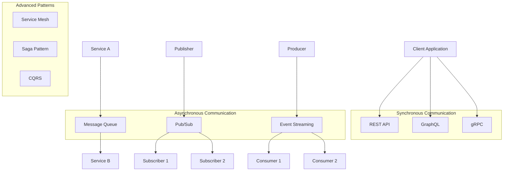
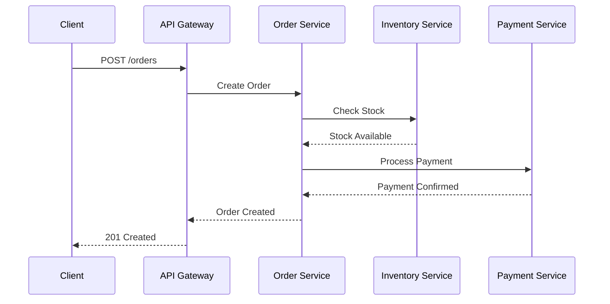
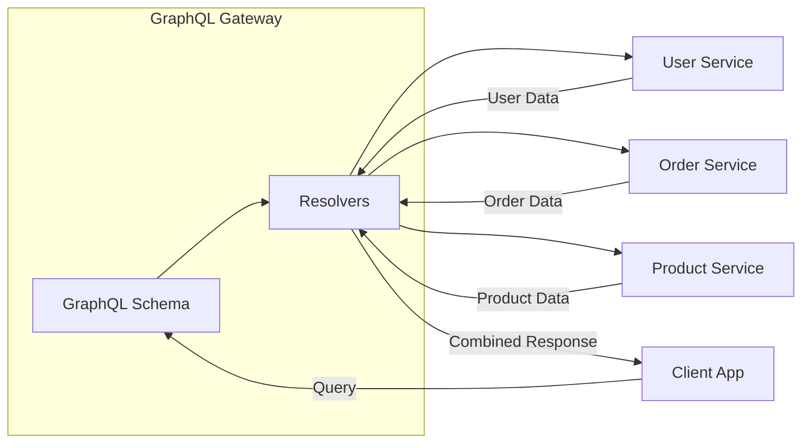
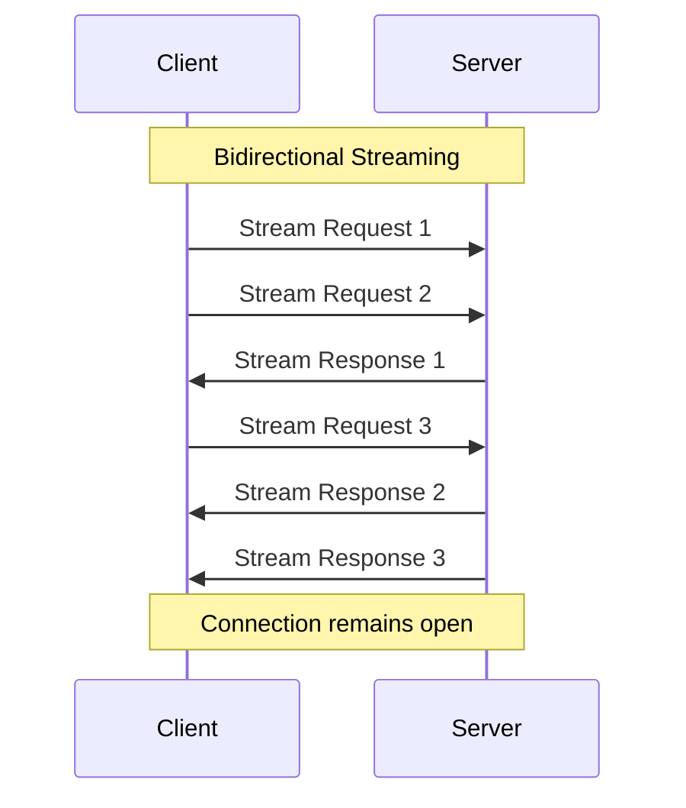
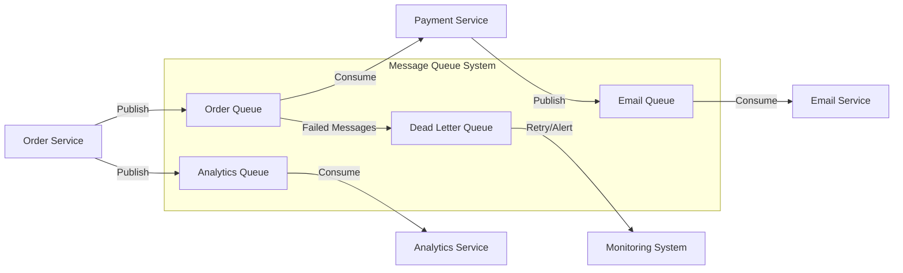
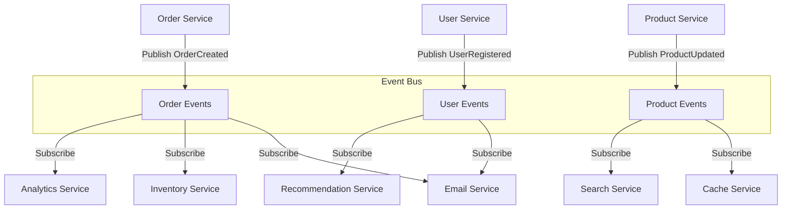
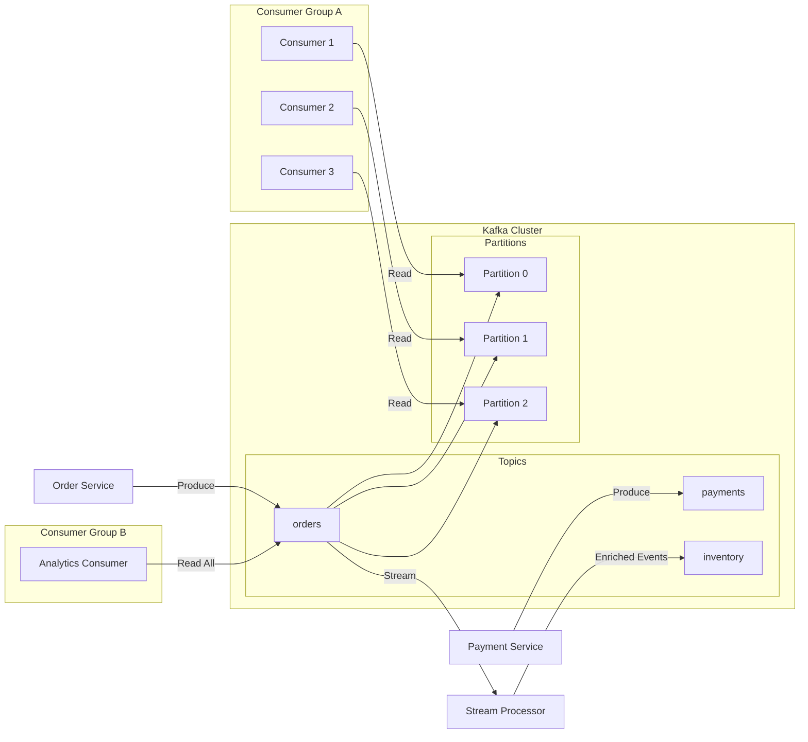
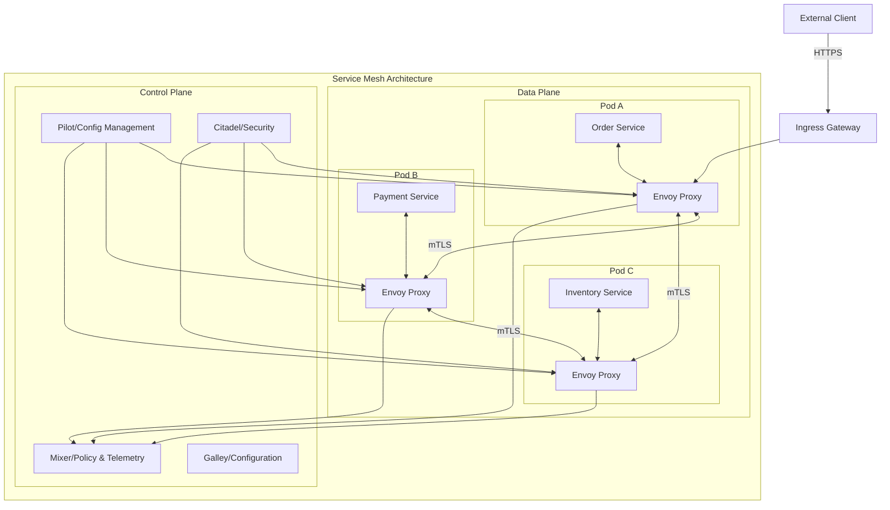
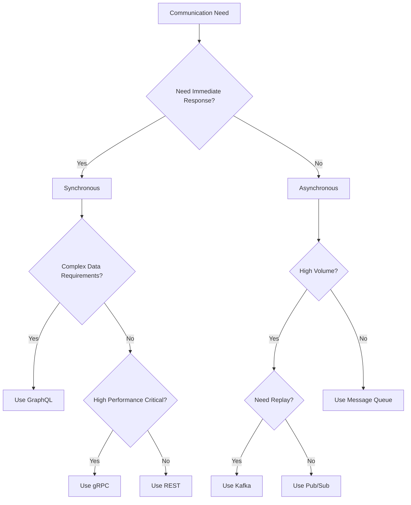

# Microservices Communication Patterns: A Comprehensive Guide

In the world of microservices architecture, effective communication between services is crucial for building scalable, resilient, and maintainable systems. As your application grows from a monolith to a distributed system, choosing the right communication pattern becomes one of the most critical architectural decisions.

## The Inter-Service Communication Challenge

When transitioning from monolithic to microservices architecture, what were once simple method calls become network communications. This shift introduces several challenges:

- **Network Latency**: Every service call now involves network overhead
- **Failure Handling**: Network calls can fail, timeout, or return partial results
- **Data Consistency**: Maintaining consistency across distributed services
- **Service Discovery**: Services need to find and communicate with each other
- **Security**: Inter-service communication must be authenticated and encrypted
- **Versioning**: Services evolve independently, requiring careful version management

## Communication Patterns Overview



## Synchronous Communication Patterns

### 1. REST API (Representational State Transfer)

REST remains the most popular choice for synchronous microservices communication due to its simplicity and wide support.



**Advantages:**

- Simple and well-understood
- Wide tooling support
- Human-readable (JSON/XML)
- Stateless communication
- Cache-friendly

**Disadvantages:**

- Overhead of HTTP protocol
- Limited to request-response pattern
- No built-in streaming support
- Potential for over-fetching or under-fetching data

**Example Implementation:**

```javascript
// Order Service
app.post("/orders", async (req, res) => {
  try {
    // Check inventory
    const stockResponse = await fetch("http://inventory-service/check", {
      method: "POST",
      body: JSON.stringify({ items: req.body.items }),
      headers: { "Content-Type": "application/json" },
    });

    if (!stockResponse.ok) {
      return res.status(400).json({ error: "Insufficient stock" });
    }

    // Process payment
    const paymentResponse = await fetch("http://payment-service/charge", {
      method: "POST",
      body: JSON.stringify({
        amount: req.body.total,
        customerId: req.body.customerId,
      }),
      headers: { "Content-Type": "application/json" },
    });

    if (!paymentResponse.ok) {
      return res.status(400).json({ error: "Payment failed" });
    }

    // Create order
    const order = await createOrder(req.body);
    res.status(201).json(order);
  } catch (error) {
    res.status(500).json({ error: "Internal server error" });
  }
});
```

### 2. GraphQL

GraphQL provides a more flexible approach to API design, allowing clients to request exactly what they need.



**Advantages:**

- Precise data fetching (no over/under-fetching)
- Single endpoint for all queries
- Strong typing with schema
- Built-in documentation
- Efficient for complex data requirements

**Disadvantages:**

- Complexity in implementation
- Caching challenges
- N+1 query problems
- Learning curve for teams

### 3. gRPC (Google Remote Procedure Call)

gRPC offers high-performance, strongly-typed communication with support for streaming.



**Advantages:**

- High performance with HTTP/2
- Strongly typed with Protocol Buffers
- Supports streaming (unary, server, client, bidirectional)
- Language-agnostic code generation
- Built-in authentication and load balancing

**Disadvantages:**

- Not human-readable (binary protocol)
- Limited browser support
- Requires HTTP/2
- Steeper learning curve

**Example Proto Definition:**

```protobuf
syntax = "proto3";

service OrderService {
    // Unary RPC
    rpc CreateOrder(OrderRequest) returns (OrderResponse);

    // Server streaming RPC
    rpc ListOrders(ListOrdersRequest) returns (stream Order);

    // Client streaming RPC
    rpc UploadOrders(stream Order) returns (UploadSummary);

    // Bidirectional streaming RPC
    rpc ProcessOrders(stream OrderRequest) returns (stream OrderStatus);
}

message OrderRequest {
    string customer_id = 1;
    repeated OrderItem items = 2;
    double total_amount = 3;
}

message OrderResponse {
    string order_id = 1;
    string status = 2;
    int64 created_at = 3;
}
```

## Asynchronous Communication Patterns

### 1. Message Queue Pattern

Message queues enable decoupled, reliable communication between services.



**Popular Message Queue Systems:**

- RabbitMQ
- Amazon SQS
- Azure Service Bus
- Redis (with Pub/Sub)

**Advantages:**

- Decoupling of services
- Built-in retry mechanisms
- Load leveling
- Guaranteed delivery options
- Dead letter queue support

**Disadvantages:**

- Added complexity
- Potential message ordering issues
- Debugging challenges
- Additional infrastructure

**Example with RabbitMQ:**

```javascript
// Publisher
const amqp = require("amqplib");

async function publishOrder(order) {
  const connection = await amqp.connect("amqp://localhost");
  const channel = await connection.createChannel();

  await channel.assertQueue("order_queue", { durable: true });

  const message = Buffer.from(JSON.stringify(order));
  channel.sendToQueue("order_queue", message, { persistent: true });

  console.log(" [x] Sent order:", order.id);
  await channel.close();
  await connection.close();
}

// Consumer
async function consumeOrders() {
  const connection = await amqp.connect("amqp://localhost");
  const channel = await connection.createChannel();

  await channel.assertQueue("order_queue", { durable: true });
  channel.prefetch(1); // Process one message at a time

  console.log(" [*] Waiting for orders...");

  channel.consume("order_queue", async msg => {
    const order = JSON.parse(msg.content.toString());

    try {
      await processOrder(order);
      channel.ack(msg); // Acknowledge successful processing
    } catch (error) {
      console.error("Processing failed:", error);
      channel.nack(msg, false, false); // Send to DLQ
    }
  });
}
```

### 2. Publish/Subscribe Pattern

Pub/Sub enables broadcasting messages to multiple interested subscribers.



**Advantages:**

- Complete decoupling
- Dynamic subscribers
- Event-driven architecture
- Scalable fan-out

**Disadvantages:**

- No guaranteed ordering
- Potential for message loss
- Complex debugging
- Subscriber management

### 3. Event Streaming with Apache Kafka

Event streaming provides a distributed, fault-tolerant, and scalable platform for real-time data processing.



**Advantages:**

- High throughput
- Distributed and fault-tolerant
- Message replay capability
- Real-time processing
- Horizontal scalability
- Long-term storage

**Disadvantages:**

- Operational complexity
- Resource intensive
- Learning curve
- Eventual consistency

**Example Kafka Implementation:**

```javascript
// Producer
const { Kafka } = require("kafkajs");

const kafka = new Kafka({
  clientId: "order-service",
  brokers: ["localhost:9092"],
});

const producer = kafka.producer();

async function publishOrderEvent(order) {
  await producer.connect();

  await producer.send({
    topic: "orders",
    messages: [
      {
        key: order.customerId,
        value: JSON.stringify({
          eventType: "OrderCreated",
          orderId: order.id,
          customerId: order.customerId,
          amount: order.amount,
          timestamp: Date.now(),
        }),
        headers: {
          "correlation-id": order.correlationId,
        },
      },
    ],
  });

  await producer.disconnect();
}

// Consumer
const consumer = kafka.consumer({ groupId: "payment-service" });

async function consumeOrderEvents() {
  await consumer.connect();
  await consumer.subscribe({ topic: "orders", fromBeginning: false });

  await consumer.run({
    eachMessage: async ({ topic, partition, message }) => {
      const event = JSON.parse(message.value.toString());

      console.log({
        topic,
        partition,
        offset: message.offset,
        event,
      });

      if (event.eventType === "OrderCreated") {
        await processPayment(event);
      }
    },
  });
}
```

## Service Mesh Communication

Service mesh provides a dedicated infrastructure layer for handling service-to-service communication.



**Popular Service Mesh Solutions:**

- Istio
- Linkerd
- Consul Connect
- AWS App Mesh

**Key Features:**

- **Traffic Management**: Load balancing, circuit breaking, retries
- **Security**: mTLS, authentication, authorization
- **Observability**: Distributed tracing, metrics, logging
- **Policy Enforcement**: Rate limiting, access control

**Advantages:**

- Centralized communication management
- Built-in security (mTLS)
- Advanced traffic management
- Comprehensive observability
- Language-agnostic

**Disadvantages:**

- Added complexity and overhead
- Resource consumption (sidecars)
- Learning curve
- Potential latency

## API Versioning Strategies

### 1. URI Versioning

```
GET /api/v1/users
GET /api/v2/users
```

### 2. Header Versioning

```
GET /api/users
Accept-Version: v1
```

### 3. Content Negotiation

```
GET /api/users
Accept: application/vnd.myapp.v1+json
```

### 4. Query Parameter Versioning

```
GET /api/users?version=1
```

## Performance Comparison

| Pattern         | Latency    | Throughput | Complexity | Use Case                            |
| --------------- | ---------- | ---------- | ---------- | ----------------------------------- |
| REST            | Medium     | Medium     | Low        | General CRUD operations             |
| GraphQL         | Medium     | Medium     | Medium     | Complex data requirements           |
| gRPC            | Low        | High       | Medium     | Internal services, streaming        |
| Message Queue   | High       | Medium     | Medium     | Async processing, decoupling        |
| Event Streaming | Medium     | Very High  | High       | Real-time analytics, event sourcing |
| Service Mesh    | Low-Medium | High       | Very High  | Complex microservices ecosystem     |

## Choosing the Right Pattern

### Use Synchronous Communication When:

- You need immediate response
- The operation is user-facing
- Data consistency is critical
- Simple request-response is sufficient

### Use Asynchronous Communication When:

- Operations can be processed later
- You need to decouple services
- Building event-driven systems
- Handling high-volume data streams

### Pattern Selection Matrix



## Best Practices

### 1. Circuit Breaker Pattern

Implement circuit breakers to handle failures gracefully:

```javascript
class CircuitBreaker {
  constructor(threshold = 5, timeout = 60000) {
    this.threshold = threshold;
    this.timeout = timeout;
    this.failures = 0;
    this.state = "CLOSED";
    this.nextAttempt = Date.now();
  }

  async call(fn) {
    if (this.state === "OPEN") {
      if (Date.now() < this.nextAttempt) {
        throw new Error("Circuit breaker is OPEN");
      }
      this.state = "HALF_OPEN";
    }

    try {
      const result = await fn();
      this.onSuccess();
      return result;
    } catch (error) {
      this.onFailure();
      throw error;
    }
  }

  onSuccess() {
    this.failures = 0;
    this.state = "CLOSED";
  }

  onFailure() {
    this.failures++;
    if (this.failures >= this.threshold) {
      this.state = "OPEN";
      this.nextAttempt = Date.now() + this.timeout;
    }
  }
}
```

### 2. Retry Logic

Implement exponential backoff for retries:

```javascript
async function retryWithExponentialBackoff(fn, maxRetries = 3) {
  let lastError;

  for (let i = 0; i < maxRetries; i++) {
    try {
      return await fn();
    } catch (error) {
      lastError = error;
      const delay = Math.min(1000 * Math.pow(2, i), 10000);
      await new Promise(resolve => setTimeout(resolve, delay));
    }
  }

  throw lastError;
}
```

### 3. Timeout Management

Always set appropriate timeouts:

```javascript
async function callWithTimeout(fn, timeout = 5000) {
  const timeoutPromise = new Promise((_, reject) => {
    setTimeout(() => reject(new Error("Timeout")), timeout);
  });

  return Promise.race([fn(), timeoutPromise]);
}
```

## Conclusion

Choosing the right communication pattern is crucial for building successful microservices architectures. While REST remains popular for its simplicity, modern architectures often require a mix of patterns:

- **REST/GraphQL** for client-facing APIs
- **gRPC** for internal service communication
- **Message Queues** for decoupling and async processing
- **Event Streaming** for real-time data and event sourcing
- **Service Mesh** for managing complex service interactions

The key is to understand your specific requirements and choose patterns that align with your performance, scalability, and complexity needs. Remember that you can—and often should—use multiple patterns within the same architecture, selecting the best tool for each specific job.

As your system evolves, regularly review your communication patterns and be prepared to adapt them based on changing requirements and lessons learned from production experience.
