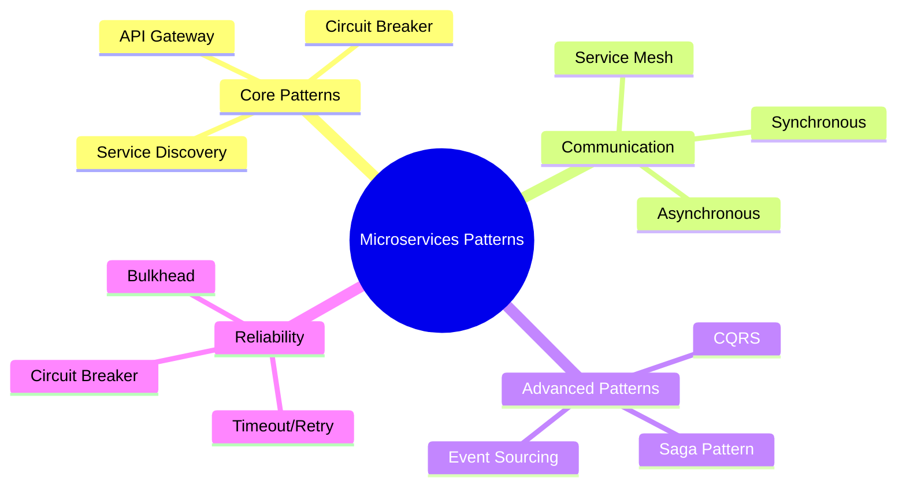
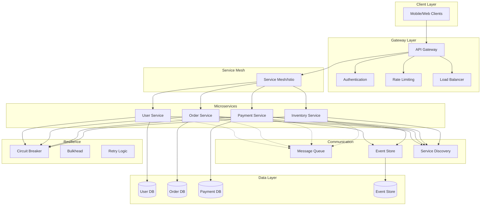
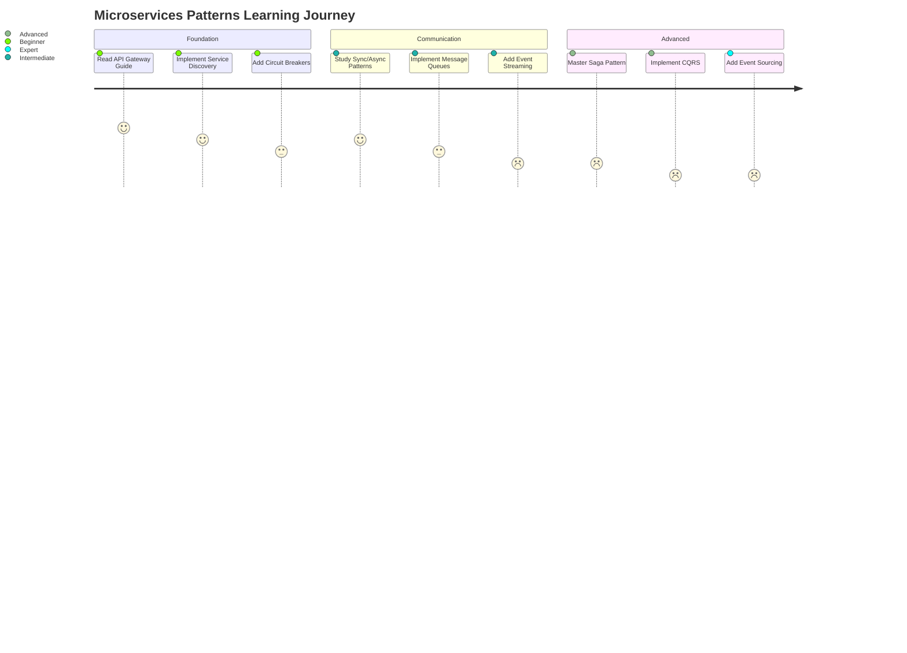

# Complete Microservices Patterns Guide: Your Ultimate Resource Hub

Welcome to your comprehensive resource hub for microservices patterns! This index provides access to detailed guides covering all essential microservices patterns with extensive mermaid diagrams, practical examples, and real-world implementations.

## 📊 Pattern Overview

## 🎯 Core Infrastructure Patterns

### 1. API Gateway Pattern

**[📖 Read Full Guide →](./api-gateway-pattern-comprehensive-guide/)**

The API Gateway pattern provides a single entry point for client requests, handling routing, authentication, rate limiting, and request/response transformation.

**Key Topics Covered:**

- ✅ Complete architecture with 5 mermaid diagrams
- ✅ Authentication and authorization flow
- ✅ Rate limiting and throttling mechanisms
- ✅ Service routing and load balancing
- ✅ Backend for Frontend (BFF) pattern
- ✅ Real-world case studies (Netflix, Amazon, Uber)
- ✅ Production-ready code examples

**Mermaid Diagrams:** 5 detailed diagrams including overall architecture, request flow, and BFF pattern

---

### 2. Service Discovery and Registry Pattern

**[📖 Read Full Guide →](./service-discovery-registry-pattern-guide/)**

Service Discovery enables microservices to find and communicate with each other dynamically without hardcoded endpoints.

**Key Topics Covered:**

- ✅ Client-side vs Server-side discovery
- ✅ Service registry implementation
- ✅ Health checking mechanisms
- ✅ Load balancing strategies
- ✅ Consul, Eureka, and Kubernetes examples

**Mermaid Diagrams:** 7 comprehensive diagrams showing discovery flows, health checks, and comparison matrices

---

### 3. Circuit Breaker and Resilience Patterns

**[📖 Read Full Guide →](./circuit-breaker-resilience-patterns-guide/)**

Building fault-tolerant microservices with circuit breakers, timeouts, retries, and bulkhead isolation patterns.

**Key Topics Covered:**

- ✅ Circuit breaker state machine
- ✅ Timeout and retry patterns with exponential backoff
- ✅ Bulkhead pattern for resource isolation
- ✅ Rate limiting and throttling
- ✅ Resilience4j implementation
- ✅ Migration from Hystrix

**Mermaid Diagrams:** 8+ diagrams including state machines, sequence flows, and combined resilience architecture

---

## 🔄 Communication Patterns

### 4. Microservices Communication Patterns

**[📖 Read Full Guide →](./microservices-communication-patterns-guide/)**

Comprehensive guide to inter-service communication including synchronous, asynchronous, and service mesh patterns.

**Key Topics Covered:**

- ✅ Synchronous communication (REST, GraphQL, gRPC)
- ✅ Asynchronous communication (Message Queues, Pub/Sub)
- ✅ Event Streaming with Kafka
- ✅ Service Mesh communication
- ✅ API versioning strategies
- ✅ Performance comparison and selection guide

**Mermaid Diagrams:** 6 detailed diagrams covering all communication patterns and performance comparisons

---

## 🎭 Advanced Patterns

### 5. Saga Pattern for Distributed Transactions

**[📖 Read Full Guide →](./saga-pattern-distributed-transactions-guide/)**

Managing distributed transactions across microservices using choreography and orchestration approaches.

**Key Topics Covered:**

- ✅ Choreography vs Orchestration approaches
- ✅ Compensation logic and rollback strategies
- ✅ State management and persistence
- ✅ Error handling and recovery
- ✅ Real-world implementations (Uber, Banking)
- ✅ Eventuate Tram and Axon Framework examples

**Mermaid Diagrams:** 5 comprehensive diagrams including saga flows, state machines, and compensation sequences

---

### 6. CQRS and Event Sourcing Patterns

**[📖 Read Full Guide →](./cqrs-event-sourcing-patterns-guide/)**

Command Query Responsibility Segregation and Event Sourcing for scalable, auditable, and high-performance systems.

**Key Topics Covered:**

- ✅ CQRS fundamentals and architecture
- ✅ Event Sourcing implementation
- ✅ Event store and projection strategies
- ✅ Event versioning and schema evolution
- ✅ Combined CQRS + Event Sourcing architecture
- ✅ EventStore and Kafka implementations

**Mermaid Diagrams:** 6 detailed diagrams showing CQRS flow, event sourcing, and projection mechanisms

---

## 📊 Quick Reference Matrix

| Pattern                    | Complexity | Use Case                 | Primary Benefit            |
| -------------------------- | ---------- | ------------------------ | -------------------------- |
| **API Gateway**            | Medium     | Client Entry Point       | Centralized Management     |
| **Service Discovery**      | Medium     | Service Location         | Dynamic Routing            |
| **Circuit Breaker**        | Medium     | Fault Tolerance          | System Resilience          |
| **Communication Patterns** | Low-High   | Service Integration      | Flexible Communication     |
| **Saga Pattern**           | High       | Distributed Transactions | Data Consistency           |
| **CQRS + Event Sourcing**  | High       | High-Scale Systems       | Performance + Auditability |

## 🎨 Visual Architecture Overview

## 🚀 Implementation Roadmap

### Phase 1: Foundation (Weeks 1-2)

1. **Service Discovery** - Set up dynamic service location
2. **API Gateway** - Implement centralized entry point
3. **Basic Communication** - REST APIs with error handling

### Phase 2: Resilience (Weeks 3-4)

1. **Circuit Breaker** - Add fault tolerance
2. **Advanced Communication** - Implement async patterns
3. **Monitoring** - Add observability

### Phase 3: Advanced Patterns (Weeks 5-8)

1. **Saga Pattern** - Distributed transaction management
2. **CQRS + Event Sourcing** - Scale and audit capabilities
3. **Service Mesh** - Advanced communication management

## 📈 Learning Path

## 🛠️ Technology Stack References

Each guide includes practical examples using:

- **Languages**: TypeScript/JavaScript, Java, Go, C#
- **Frameworks**: Spring Boot, Express.js, Nest.js
- **Infrastructure**: Docker, Kubernetes, Istio
- **Databases**: PostgreSQL, MongoDB, Redis
- **Message Brokers**: Apache Kafka, RabbitMQ, AWS SQS
- **Service Discovery**: Consul, Eureka, Kubernetes DNS
- **Monitoring**: Prometheus, Grafana, Jaeger

## 📚 Additional Resources

### Best Practices

- ✅ Error handling and monitoring strategies
- ✅ Security considerations for each pattern
- ✅ Performance optimization techniques
- ✅ Testing strategies for distributed systems

### Real-World Case Studies

- **Netflix**: API Gateway and Circuit Breaker implementations
- **Uber**: Saga pattern for ride booking
- **Amazon**: Event Sourcing for order management
- **LinkedIn**: CQRS for activity feeds

## 🎯 Quick Start Guide

1. **Start Here**: Begin with the [API Gateway Pattern](./api-gateway-pattern-comprehensive-guide/) for a solid foundation
2. **Add Discovery**: Implement [Service Discovery](./service-discovery-registry-pattern-guide/) for dynamic routing
3. **Build Resilience**: Add [Circuit Breakers](./circuit-breaker-resilience-patterns-guide/) for fault tolerance
4. **Scale Communication**: Explore [Communication Patterns](./microservices-communication-patterns-guide/) for your use case
5. **Advanced Features**: Implement [Saga](./saga-pattern-distributed-transactions-guide/) and [CQRS](./cqrs-event-sourcing-patterns-guide/) as needed

## 🔄 Keep Learning

This collection represents current best practices as of 2025. Microservices patterns continue to evolve with new technologies and frameworks. Each guide is regularly updated with the latest approaches and real-world insights.

### Tags for Discovery

`#microservices` `#architecture` `#patterns` `#api-gateway` `#service-discovery` `#circuit-breaker` `#saga-pattern` `#cqrs` `#event-sourcing` `#communication-patterns` `#distributed-systems` `#mermaid-diagrams`

---

**Happy Learning!** 🚀 Start with any pattern that matches your current needs, and use this index to navigate the complete microservices patterns ecosystem.
