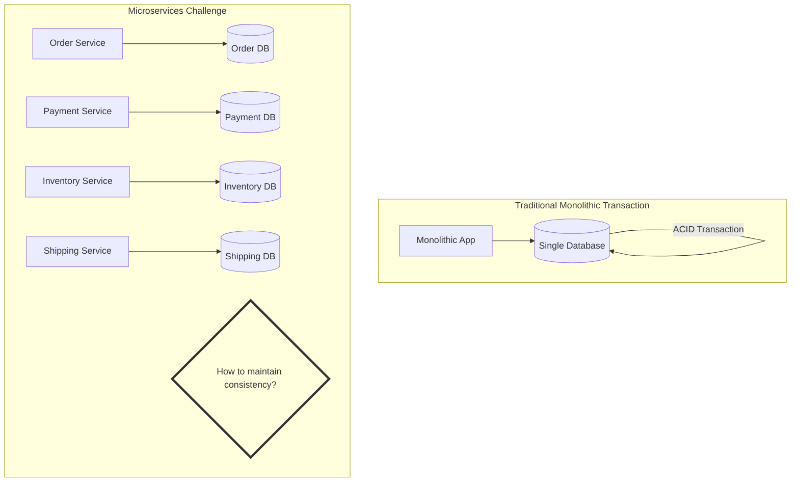
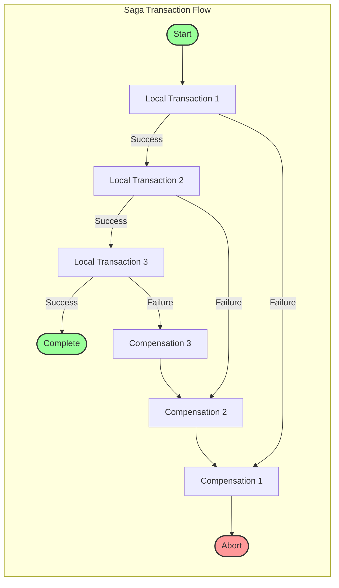
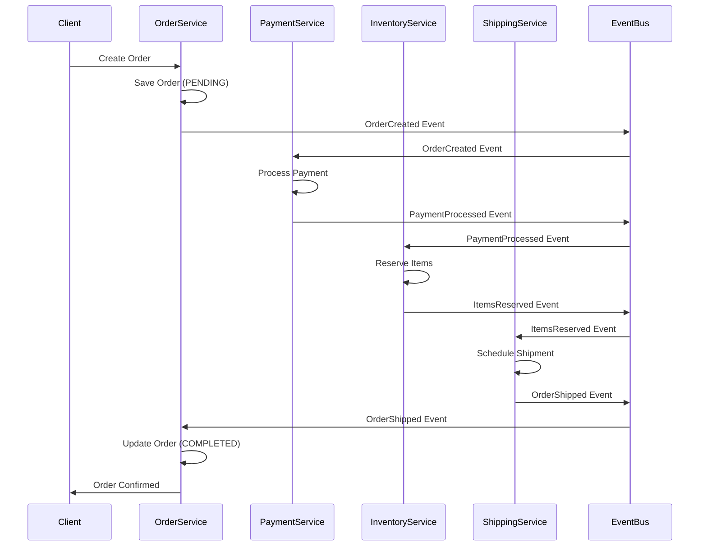
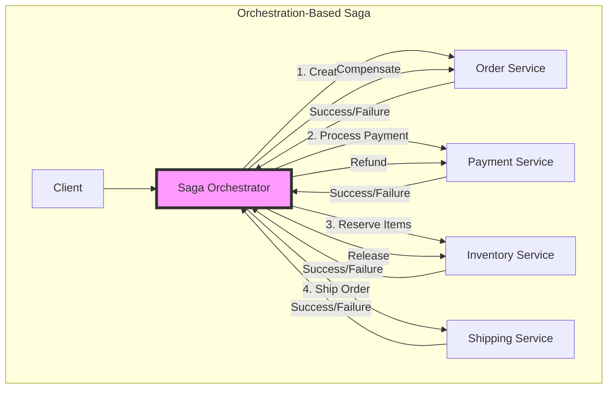
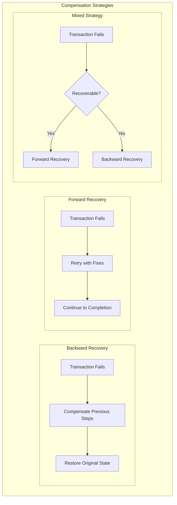
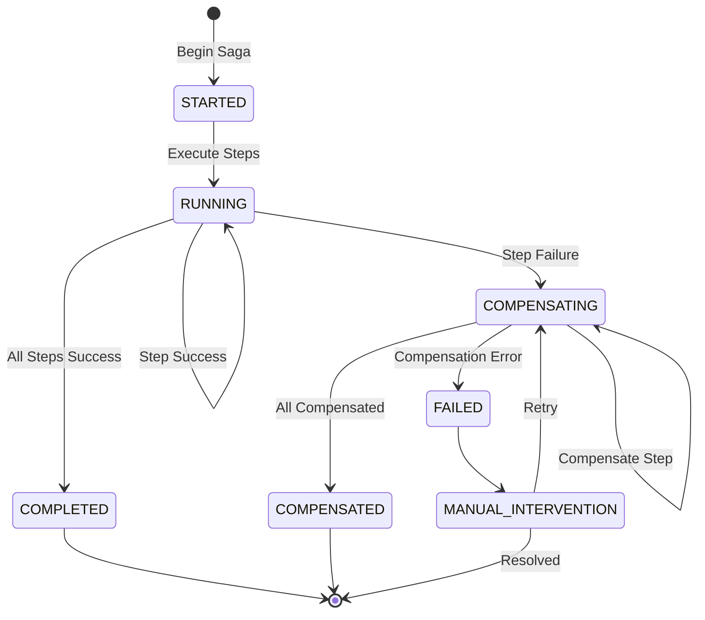
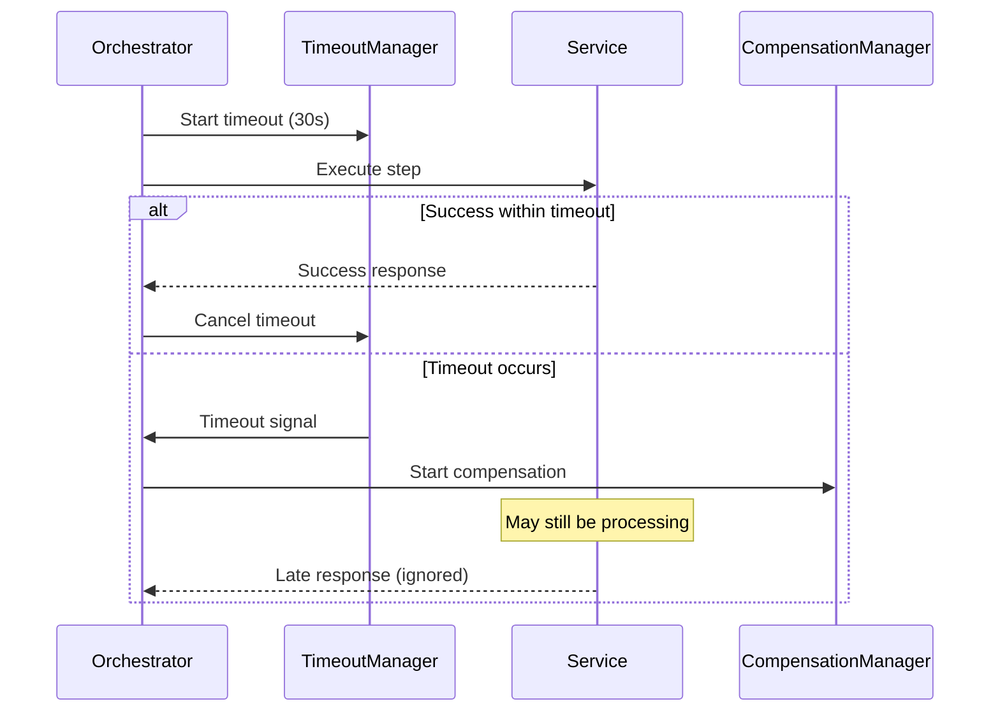

Managing distributed transactions across multiple microservices is one of the most challenging aspects of modern distributed systems. Traditional ACID transactions don't work across service boundaries, and that's where the Saga pattern comes to the rescue. In this comprehensive guide, we'll explore how to implement reliable distributed transactions using the Saga pattern, complete with real-world examples and battle-tested strategies.

## Table of Contents

1. [Introduction](#introduction)
2. [The Challenge of Distributed Transactions](#the-challenge-of-distributed-transactions)
3. [Understanding the Saga Pattern](#understanding-the-saga-pattern)
4. [Choreography-Based Sagas](#choreography-based-sagas)
5. [Orchestration-Based Sagas](#orchestration-based-sagas)
6. [Compensation Logic and Rollback Strategies](#compensation-logic-and-rollback-strategies)
7. [State Management and Persistence](#state-management-and-persistence)
8. [Error Handling and Recovery](#error-handling-and-recovery)
9. [Real-World Implementations](#real-world-implementations)
10. [Best Practices and Common Pitfalls](#best-practices-and-common-pitfalls)
11. [Conclusion](#conclusion)

## Introduction

In the world of microservices, we've traded the simplicity of local ACID transactions for the scalability and flexibility of distributed systems. But this trade-off comes with a significant challenge: how do we maintain data consistency across multiple services when each service has its own database?

The Saga pattern provides an elegant solution by breaking distributed transactions into a series of local transactions, each with its own compensation logic for rollback scenarios. Let's dive deep into how this pattern works and how you can implement it effectively.

## The Challenge of Distributed Transactions

Before we explore the solution, let's understand the problem. Consider an e-commerce order processing system:



In a monolithic architecture, we could wrap all operations in a single database transaction. But in microservices:

- Each service manages its own data
- Network calls between services can fail
- Services can be temporarily unavailable
- Traditional two-phase commit (2PC) is not practical due to its blocking nature

This is where the Saga pattern shines, providing eventual consistency through a coordinated sequence of local transactions.

## Understanding the Saga Pattern

The Saga pattern manages distributed transactions by:

1. **Breaking down the transaction** into multiple local transactions
2. **Executing each local transaction** in sequence or parallel
3. **Compensating for failures** by rolling back completed steps
4. **Ensuring eventual consistency** across all services

Here's a high-level view of how a saga works:



The Saga pattern offers two implementation approaches:

1. **Choreography**: Each service produces and listens to events
2. **Orchestration**: A central coordinator manages the workflow

Let's explore both approaches in detail.

## Choreography-Based Sagas

In choreography-based sagas, services communicate through events without a central coordinator. Each service knows what to do when specific events occur.

### How Choreography Works



### Implementing Choreography-Based Saga

Here's a practical implementation using Node.js and an event-driven architecture:

```javascript
// Order Service
class OrderService {
  constructor(eventBus, orderRepository) {
    this.eventBus = eventBus;
    this.orderRepository = orderRepository;

    // Subscribe to events
    this.eventBus.subscribe(
      "PaymentFailed",
      this.handlePaymentFailed.bind(this)
    );
    this.eventBus.subscribe(
      "ItemsReservationFailed",
      this.handleReservationFailed.bind(this)
    );
    this.eventBus.subscribe("OrderShipped", this.handleOrderShipped.bind(this));
  }

  async createOrder(orderData) {
    try {
      // Create order with PENDING status
      const order = await this.orderRepository.create({
        ...orderData,
        status: "PENDING",
        sagaId: generateSagaId(),
        createdAt: new Date(),
      });

      // Publish event to start the saga
      await this.eventBus.publish("OrderCreated", {
        sagaId: order.sagaId,
        orderId: order.id,
        customerId: order.customerId,
        items: order.items,
        totalAmount: order.totalAmount,
        timestamp: new Date(),
      });

      return order;
    } catch (error) {
      throw new OrderCreationError(error.message);
    }
  }

  async handlePaymentFailed(event) {
    // Compensate by canceling the order
    await this.orderRepository.update(event.orderId, {
      status: "CANCELLED",
      cancelReason: "Payment failed",
      cancelledAt: new Date(),
    });

    // Notify customer
    await this.eventBus.publish("OrderCancelled", {
      sagaId: event.sagaId,
      orderId: event.orderId,
      reason: event.reason,
    });
  }

  async handleOrderShipped(event) {
    // Mark order as completed
    await this.orderRepository.update(event.orderId, {
      status: "COMPLETED",
      shippingId: event.shippingId,
      completedAt: new Date(),
    });
  }
}

// Payment Service
class PaymentService {
  constructor(eventBus, paymentRepository, paymentGateway) {
    this.eventBus = eventBus;
    this.paymentRepository = paymentRepository;
    this.paymentGateway = paymentGateway;

    // Subscribe to events
    this.eventBus.subscribe("OrderCreated", this.handleOrderCreated.bind(this));
    this.eventBus.subscribe(
      "ItemsReservationFailed",
      this.handleReservationFailed.bind(this)
    );
    this.eventBus.subscribe(
      "ShippingFailed",
      this.handleShippingFailed.bind(this)
    );
  }

  async handleOrderCreated(event) {
    try {
      // Process payment
      const paymentResult = await this.paymentGateway.charge({
        customerId: event.customerId,
        amount: event.totalAmount,
        orderId: event.orderId,
      });

      // Save payment record
      const payment = await this.paymentRepository.create({
        sagaId: event.sagaId,
        orderId: event.orderId,
        amount: event.totalAmount,
        transactionId: paymentResult.transactionId,
        status: "COMPLETED",
      });

      // Publish success event
      await this.eventBus.publish("PaymentProcessed", {
        sagaId: event.sagaId,
        orderId: event.orderId,
        paymentId: payment.id,
        items: event.items,
        timestamp: new Date(),
      });
    } catch (error) {
      // Publish failure event
      await this.eventBus.publish("PaymentFailed", {
        sagaId: event.sagaId,
        orderId: event.orderId,
        reason: error.message,
        timestamp: new Date(),
      });
    }
  }

  async handleReservationFailed(event) {
    // Compensate by refunding the payment
    const payment = await this.paymentRepository.findByOrderId(event.orderId);

    if (payment && payment.status === "COMPLETED") {
      await this.paymentGateway.refund({
        transactionId: payment.transactionId,
        amount: payment.amount,
      });

      await this.paymentRepository.update(payment.id, {
        status: "REFUNDED",
        refundedAt: new Date(),
      });
    }
  }
}

// Inventory Service
class InventoryService {
  constructor(eventBus, inventoryRepository) {
    this.eventBus = eventBus;
    this.inventoryRepository = inventoryRepository;

    this.eventBus.subscribe(
      "PaymentProcessed",
      this.handlePaymentProcessed.bind(this)
    );
    this.eventBus.subscribe(
      "ShippingFailed",
      this.handleShippingFailed.bind(this)
    );
  }

  async handlePaymentProcessed(event) {
    try {
      // Reserve inventory items
      const reservations = [];

      for (const item of event.items) {
        const reservation = await this.inventoryRepository.reserveItem({
          sagaId: event.sagaId,
          productId: item.productId,
          quantity: item.quantity,
          orderId: event.orderId,
        });
        reservations.push(reservation);
      }

      // Publish success event
      await this.eventBus.publish("ItemsReserved", {
        sagaId: event.sagaId,
        orderId: event.orderId,
        reservations: reservations.map(r => ({
          productId: r.productId,
          quantity: r.quantity,
          reservationId: r.id,
        })),
        timestamp: new Date(),
      });
    } catch (error) {
      // Publish failure event
      await this.eventBus.publish("ItemsReservationFailed", {
        sagaId: event.sagaId,
        orderId: event.orderId,
        reason: error.message,
        timestamp: new Date(),
      });
    }
  }

  async handleShippingFailed(event) {
    // Compensate by releasing reserved items
    const reservations = await this.inventoryRepository.findByOrderId(
      event.orderId
    );

    for (const reservation of reservations) {
      await this.inventoryRepository.releaseReservation(reservation.id);
    }
  }
}
```

### Choreography Pros and Cons

**Advantages:**

- Loose coupling between services
- No single point of failure
- Services can be developed independently
- Natural fit for event-driven architectures

**Disadvantages:**

- Difficult to understand the overall flow
- Hard to track saga progress
- Testing is complex
- Cyclic dependencies can emerge

## Orchestration-Based Sagas

In orchestration-based sagas, a central coordinator (orchestrator) manages the entire workflow, telling each service what to do and when.

### How Orchestration Works



### Implementing Orchestration-Based Saga

Here's a comprehensive implementation of an orchestration-based saga:

```typescript
// Saga Orchestrator Implementation
interface SagaStep<T> {
  name: string;
  service: any;
  forward: (context: T) => Promise<any>;
  compensate: (context: T, result: any) => Promise<void>;
  retryPolicy?: RetryPolicy;
}

interface RetryPolicy {
  maxAttempts: number;
  backoffMs: number;
  exponential: boolean;
}

class SagaOrchestrator<T> {
  private steps: SagaStep<T>[];
  private stateStore: SagaStateStore;

  constructor(steps: SagaStep<T>[], stateStore: SagaStateStore) {
    this.steps = steps;
    this.stateStore = stateStore;
  }

  async execute(sagaId: string, context: T): Promise<SagaResult> {
    const executedSteps: ExecutedStep[] = [];

    // Load existing state if saga is being resumed
    const existingState = await this.stateStore.load(sagaId);
    if (existingState) {
      executedSteps.push(...existingState.executedSteps);
    }

    try {
      // Execute remaining steps
      for (let i = executedSteps.length; i < this.steps.length; i++) {
        const step = this.steps[i];

        // Save state before executing step
        await this.stateStore.save(sagaId, {
          status: "IN_PROGRESS",
          currentStep: i,
          context,
          executedSteps,
        });

        // Execute step with retry logic
        const result = await this.executeStep(step, context);

        executedSteps.push({
          stepName: step.name,
          result,
          timestamp: new Date(),
        });

        // Update context with step result
        context = { ...context, ...result };
      }

      // Mark saga as completed
      await this.stateStore.save(sagaId, {
        status: "COMPLETED",
        context,
        executedSteps,
        completedAt: new Date(),
      });

      return {
        success: true,
        results: executedSteps,
      };
    } catch (error) {
      // Compensate executed steps in reverse order
      await this.compensate(sagaId, executedSteps, context, error);

      throw new SagaExecutionError(error.message, executedSteps);
    }
  }

  private async executeStep<T>(step: SagaStep<T>, context: T): Promise<any> {
    const retryPolicy = step.retryPolicy || {
      maxAttempts: 3,
      backoffMs: 1000,
      exponential: true,
    };

    let lastError: Error;

    for (let attempt = 1; attempt <= retryPolicy.maxAttempts; attempt++) {
      try {
        return await step.forward(context);
      } catch (error) {
        lastError = error;

        if (attempt < retryPolicy.maxAttempts) {
          const delay = retryPolicy.exponential
            ? retryPolicy.backoffMs * Math.pow(2, attempt - 1)
            : retryPolicy.backoffMs;

          await this.sleep(delay);
        }
      }
    }

    throw lastError!;
  }

  private async compensate(
    sagaId: string,
    executedSteps: ExecutedStep[],
    context: T,
    error: Error
  ): Promise<void> {
    // Update saga status
    await this.stateStore.save(sagaId, {
      status: "COMPENSATING",
      context,
      executedSteps,
      error: error.message,
    });

    // Compensate in reverse order
    for (let i = executedSteps.length - 1; i >= 0; i--) {
      const executedStep = executedSteps[i];
      const step = this.steps.find(s => s.name === executedStep.stepName);

      if (step) {
        try {
          await step.compensate(context, executedStep.result);
        } catch (compensationError) {
          // Log compensation failure but continue
          console.error(
            `Compensation failed for step ${step.name}:`,
            compensationError
          );
        }
      }
    }

    // Mark saga as compensated
    await this.stateStore.save(sagaId, {
      status: "COMPENSATED",
      context,
      executedSteps,
      compensatedAt: new Date(),
    });
  }

  private sleep(ms: number): Promise<void> {
    return new Promise(resolve => setTimeout(resolve, ms));
  }
}

// Order Processing Saga Definition
class OrderProcessingSaga {
  private orchestrator: SagaOrchestrator<OrderContext>;

  constructor(
    orderService: OrderService,
    paymentService: PaymentService,
    inventoryService: InventoryService,
    shippingService: ShippingService,
    stateStore: SagaStateStore
  ) {
    const steps: SagaStep<OrderContext>[] = [
      {
        name: "CreateOrder",
        service: orderService,
        forward: async context => {
          const order = await orderService.createOrder({
            customerId: context.customerId,
            items: context.items,
            totalAmount: context.totalAmount,
          });
          return { orderId: order.id };
        },
        compensate: async (context, result) => {
          if (result?.orderId) {
            await orderService.cancelOrder(result.orderId);
          }
        },
      },
      {
        name: "ProcessPayment",
        service: paymentService,
        forward: async context => {
          const payment = await paymentService.processPayment({
            customerId: context.customerId,
            orderId: context.orderId,
            amount: context.totalAmount,
          });
          return {
            paymentId: payment.id,
            transactionId: payment.transactionId,
          };
        },
        compensate: async (context, result) => {
          if (result?.transactionId) {
            await paymentService.refundPayment(result.transactionId);
          }
        },
        retryPolicy: {
          maxAttempts: 3,
          backoffMs: 2000,
          exponential: true,
        },
      },
      {
        name: "ReserveInventory",
        service: inventoryService,
        forward: async context => {
          const reservations = await inventoryService.reserveItems(
            context.orderId,
            context.items
          );
          return { reservations };
        },
        compensate: async (context, result) => {
          if (result?.reservations) {
            await inventoryService.releaseReservations(result.reservations);
          }
        },
      },
      {
        name: "ScheduleShipping",
        service: shippingService,
        forward: async context => {
          const shipment = await shippingService.scheduleShipment({
            orderId: context.orderId,
            customerId: context.customerId,
            items: context.items,
            address: context.shippingAddress,
          });
          return { shipmentId: shipment.id };
        },
        compensate: async (context, result) => {
          if (result?.shipmentId) {
            await shippingService.cancelShipment(result.shipmentId);
          }
        },
      },
    ];

    this.orchestrator = new SagaOrchestrator(steps, stateStore);
  }

  async processOrder(orderRequest: OrderRequest): Promise<OrderResult> {
    const sagaId = generateSagaId();
    const context: OrderContext = {
      sagaId,
      customerId: orderRequest.customerId,
      items: orderRequest.items,
      totalAmount: calculateTotal(orderRequest.items),
      shippingAddress: orderRequest.shippingAddress,
      timestamp: new Date(),
    };

    try {
      const result = await this.orchestrator.execute(sagaId, context);
      return {
        success: true,
        orderId: context.orderId,
        sagaId,
      };
    } catch (error) {
      return {
        success: false,
        error: error.message,
        sagaId,
      };
    }
  }
}
```

### Orchestration Pros and Cons

**Advantages:**

- Centralized workflow definition
- Easy to understand and monitor
- Simpler testing
- Built-in retry and compensation logic
- Better for complex workflows

**Disadvantages:**

- Single point of failure (orchestrator)
- Tight coupling to orchestrator
- Additional infrastructure component
- Can become a bottleneck

## Compensation Logic and Rollback Strategies

Compensation is the heart of the Saga pattern. It's the mechanism that ensures consistency when things go wrong.

### Designing Effective Compensation



### Implementing Idempotent Compensations

Compensations must be idempotent to handle retries safely:

```javascript
class CompensationManager {
  constructor(compensationStore) {
    this.compensationStore = compensationStore;
  }

  async executeCompensation(
    compensationId: string,
    compensationFn: () => Promise<void>
  ): Promise<void> {
    // Check if compensation was already executed
    const existing = await this.compensationStore.get(compensationId);

    if (existing?.status === 'COMPLETED') {
      console.log(`Compensation ${compensationId} already executed`);
      return;
    }

    // Record compensation attempt
    await this.compensationStore.save(compensationId, {
      status: 'IN_PROGRESS',
      startedAt: new Date()
    });

    try {
      // Execute compensation
      await compensationFn();

      // Mark as completed
      await this.compensationStore.save(compensationId, {
        status: 'COMPLETED',
        completedAt: new Date()
      });
    } catch (error) {
      // Mark as failed
      await this.compensationStore.save(compensationId, {
        status: 'FAILED',
        error: error.message,
        failedAt: new Date()
      });

      throw error;
    }
  }
}

// Example: Idempotent payment refund
class PaymentCompensation {
  async refundPayment(transactionId: string, amount: number): Promise<void> {
    const compensationId = `refund-${transactionId}`;

    await this.compensationManager.executeCompensation(
      compensationId,
      async () => {
        // Check current payment status
        const payment = await this.paymentGateway.getTransaction(transactionId);

        if (payment.status === 'REFUNDED') {
          // Already refunded, nothing to do
          return;
        }

        if (payment.status !== 'COMPLETED') {
          throw new Error(`Cannot refund payment in status: ${payment.status}`);
        }

        // Execute refund
        await this.paymentGateway.refund({
          transactionId,
          amount,
          reason: 'Saga compensation'
        });
      }
    );
  }
}
```

### Compensation Patterns

1. **Semantic Undo**: Reverse the business operation

   ```javascript
   // Forward: Reserve inventory
   await inventory.reserve(productId, quantity);

   // Compensate: Release reservation
   await inventory.release(productId, quantity);
   ```

2. **Synthetic Compensation**: Create a compensating transaction

   ```javascript
   // Forward: Charge customer
   await payment.charge(customerId, amount);

   // Compensate: Issue refund (new transaction)
   await payment.refund(customerId, amount);
   ```

3. **Retry-based Recovery**: Attempt to fix and continue
   ```javascript
   // Forward: Failed due to temporary issue
   try {
     await shipping.scheduleDelivery(orderId);
   } catch (error) {
     if (isTemporaryError(error)) {
       // Retry with exponential backoff
       await retryWithBackoff(() => shipping.scheduleDelivery(orderId));
     } else {
       throw error; // Trigger compensation
     }
   }
   ```

## State Management and Persistence

Saga state management is crucial for handling failures, restarts, and monitoring.

### Saga State Machine



### Implementing Saga State Store

```typescript
// Saga State Store with event sourcing
class SagaStateStore {
  constructor(
    private eventStore: EventStore,
    private snapshotStore: SnapshotStore
  ) {}

  async save(sagaId: string, state: SagaState): Promise<void> {
    // Create state change event
    const event: SagaEvent = {
      sagaId,
      eventType: "SagaStateChanged",
      timestamp: new Date(),
      data: {
        fromStatus: await this.getCurrentStatus(sagaId),
        toStatus: state.status,
        state,
      },
    };

    // Append to event store
    await this.eventStore.append(sagaId, event);

    // Update snapshot for quick reads
    await this.snapshotStore.save(sagaId, state);

    // Publish for monitoring
    await this.publishStateChange(sagaId, state);
  }

  async load(sagaId: string): Promise<SagaState | null> {
    // Try snapshot first
    const snapshot = await this.snapshotStore.get(sagaId);

    if (snapshot) {
      // Check if there are events after snapshot
      const events = await this.eventStore.getEventsAfter(
        sagaId,
        snapshot.version
      );

      if (events.length === 0) {
        return snapshot.state;
      }

      // Rebuild from snapshot + events
      return this.rebuildState(snapshot.state, events);
    }

    // Rebuild from all events
    const allEvents = await this.eventStore.getAllEvents(sagaId);

    if (allEvents.length === 0) {
      return null;
    }

    return this.rebuildState(null, allEvents);
  }

  private rebuildState(
    initialState: SagaState | null,
    events: SagaEvent[]
  ): SagaState {
    let state = initialState || this.getEmptyState();

    for (const event of events) {
      state = this.applyEvent(state, event);
    }

    return state;
  }

  private applyEvent(state: SagaState, event: SagaEvent): SagaState {
    switch (event.eventType) {
      case "SagaStateChanged":
        return event.data.state;

      case "StepExecuted":
        return {
          ...state,
          executedSteps: [...state.executedSteps, event.data.step],
          currentStep: state.currentStep + 1,
        };

      case "CompensationStarted":
        return {
          ...state,
          status: "COMPENSATING",
          compensatingStep: event.data.stepIndex,
        };

      default:
        return state;
    }
  }

  async queryByStatus(status: SagaStatus): Promise<SagaState[]> {
    // Use materialized view for queries
    return await this.snapshotStore.query({
      status,
      active: true,
    });
  }

  async getMetrics(timeRange: TimeRange): Promise<SagaMetrics> {
    const events = await this.eventStore.getEventsByTimeRange(timeRange);

    return {
      total: new Set(events.map(e => e.sagaId)).size,
      completed: events.filter(e => e.data.toStatus === "COMPLETED").length,
      failed: events.filter(e => e.data.toStatus === "FAILED").length,
      avgDuration: this.calculateAvgDuration(events),
    };
  }
}

// Saga monitoring and recovery
class SagaMonitor {
  constructor(
    private stateStore: SagaStateStore,
    private alertService: AlertService
  ) {}

  async checkStuckSagas(): Promise<void> {
    const stuckSagas = await this.stateStore.query({
      status: ["RUNNING", "COMPENSATING"],
      lastUpdateBefore: new Date(Date.now() - 30 * 60 * 1000), // 30 minutes
    });

    for (const saga of stuckSagas) {
      await this.alertService.sendAlert({
        type: "STUCK_SAGA",
        sagaId: saga.sagaId,
        status: saga.status,
        lastUpdate: saga.lastUpdate,
        currentStep: saga.currentStep,
      });
    }
  }

  async autoRecover(): Promise<void> {
    const recoverableSagas = await this.stateStore.query({
      status: "RUNNING",
      autoRecoverable: true,
    });

    for (const saga of recoverableSagas) {
      try {
        // Resume from last successful step
        await this.resumeSaga(saga);
      } catch (error) {
        console.error(`Failed to recover saga ${saga.sagaId}:`, error);
      }
    }
  }
}
```

## Error Handling and Recovery

Robust error handling is essential for production-ready sagas.

### Error Classification and Handling

```typescript
// Error types and handling strategies
enum ErrorType {
  TRANSIENT = "TRANSIENT", // Retry
  BUSINESS = "BUSINESS", // Compensate
  TECHNICAL = "TECHNICAL", // Alert and manual intervention
  TIMEOUT = "TIMEOUT", // Retry with longer timeout
}

class SagaErrorHandler {
  constructor(
    private retryPolicy: RetryPolicy,
    private alertService: AlertService
  ) {}

  async handleError(
    error: Error,
    context: SagaContext,
    step: SagaStep
  ): Promise<ErrorResolution> {
    const errorType = this.classifyError(error);

    switch (errorType) {
      case ErrorType.TRANSIENT:
        return await this.handleTransientError(error, context, step);

      case ErrorType.BUSINESS:
        return { action: "COMPENSATE", reason: error.message };

      case ErrorType.TECHNICAL:
        await this.alertService.sendCriticalAlert({
          sagaId: context.sagaId,
          step: step.name,
          error: error.message,
          stack: error.stack,
        });
        return { action: "HALT", requiresIntervention: true };

      case ErrorType.TIMEOUT:
        return await this.handleTimeout(context, step);

      default:
        return { action: "COMPENSATE", reason: "Unknown error type" };
    }
  }

  private classifyError(error: Error): ErrorType {
    if (
      error.name === "NetworkError" ||
      error.message.includes("ECONNREFUSED")
    ) {
      return ErrorType.TRANSIENT;
    }

    if (
      error.name === "ValidationError" ||
      error.name === "BusinessRuleViolation"
    ) {
      return ErrorType.BUSINESS;
    }

    if (error.name === "TimeoutError") {
      return ErrorType.TIMEOUT;
    }

    return ErrorType.TECHNICAL;
  }

  private async handleTransientError(
    error: Error,
    context: SagaContext,
    step: SagaStep
  ): Promise<ErrorResolution> {
    const attempts = context.retryAttempts?.[step.name] || 0;

    if (attempts < this.retryPolicy.maxAttempts) {
      const delay = this.calculateBackoff(attempts);

      return {
        action: "RETRY",
        delayMs: delay,
        attemptNumber: attempts + 1,
      };
    }

    // Max retries exceeded
    return {
      action: "COMPENSATE",
      reason: `Max retries exceeded: ${error.message}`,
    };
  }

  private calculateBackoff(attempt: number): number {
    const base = this.retryPolicy.initialDelayMs;
    const max = this.retryPolicy.maxDelayMs;

    if (this.retryPolicy.type === "EXPONENTIAL") {
      return Math.min(base * Math.pow(2, attempt), max);
    }

    return base;
  }
}

// Dead letter queue for failed sagas
class SagaDeadLetterQueue {
  constructor(
    private storage: DeadLetterStorage,
    private notificationService: NotificationService
  ) {}

  async send(saga: FailedSaga): Promise<void> {
    // Store failed saga details
    await this.storage.store({
      sagaId: saga.sagaId,
      sagaType: saga.type,
      failedAt: new Date(),
      error: saga.error,
      context: saga.context,
      executedSteps: saga.executedSteps,
      compensatedSteps: saga.compensatedSteps,
    });

    // Notify operations team
    await this.notificationService.notify({
      channel: "operations",
      severity: "HIGH",
      message: `Saga ${saga.sagaId} failed and requires manual intervention`,
      details: {
        sagaType: saga.type,
        error: saga.error.message,
        failedStep: saga.failedStep,
      },
    });
  }

  async retry(sagaId: string): Promise<boolean> {
    const failedSaga = await this.storage.get(sagaId);

    if (!failedSaga) {
      throw new Error(`Saga ${sagaId} not found in DLQ`);
    }

    try {
      // Attempt to resume from failure point
      const orchestrator = this.getOrchestrator(failedSaga.sagaType);
      await orchestrator.resume(sagaId, failedSaga.context);

      // Remove from DLQ on success
      await this.storage.remove(sagaId);

      return true;
    } catch (error) {
      // Update failure count
      await this.storage.updateRetryCount(sagaId);

      return false;
    }
  }
}
```

### Timeout Management



## Real-World Implementations

Let's explore how the Saga pattern is implemented in production systems.

### Example 1: E-commerce Order Processing with Eventuate Tram

```java
// Using Eventuate Tram Saga Framework
@Saga
public class OrderSaga {

  private OrderService orderService;
  private PaymentService paymentService;
  private InventoryService inventoryService;

  @SagaOrchestrationStart
  public CommandMessageBuilder start(OrderSagaData data) {
    return CommandMessageBuilder
      .withCommand(new CreateOrderCommand(data.getOrderDetails()))
      .withTarget(OrderService.class)
      .build();
  }

  @SagaOrchestrationEnd
  public void onOrderCreated(OrderCreatedEvent event, OrderSagaData data) {
    data.setOrderId(event.getOrderId());
  }

  @SagaOrchestrationCommand
  public CommandMessageBuilder processPayment(OrderSagaData data) {
    return CommandMessageBuilder
      .withCommand(new ProcessPaymentCommand(
        data.getOrderId(),
        data.getCustomerId(),
        data.getTotalAmount()
      ))
      .withTarget(PaymentService.class)
      .build();
  }

  @SagaOrchestrationCompensation
  public CommandMessageBuilder cancelOrder(OrderSagaData data) {
    return CommandMessageBuilder
      .withCommand(new CancelOrderCommand(data.getOrderId()))
      .withTarget(OrderService.class)
      .build();
  }

  // Define the saga flow
  @Override
  public SagaDefinition<OrderSagaData> getSagaDefinition() {
    return SagaBuilder
      .forSaga(OrderSaga.class, OrderSagaData.class)
      .startingWith(this::start)
        .onSuccessInvoke(this::processPayment)
          .onSuccess(PaymentProcessedEvent.class, this::onPaymentProcessed)
          .onFailureCompensateWith(this::cancelOrder)
        .step()
          .invokeParticipant(this::reserveInventory)
          .onSuccess(InventoryReservedEvent.class, this::onInventoryReserved)
          .onFailureCompensateWith(this::releaseInventory)
        .step()
          .invokeParticipant(this::scheduleShipping)
          .onSuccess(ShippingScheduledEvent.class, this::onShippingScheduled)
          .onFailureCompensateWith(this::cancelShipping)
      .build();
  }
}
```

### Example 2: Banking Transaction with Axon Framework

```java
@Saga
@ProcessingGroup("BankTransferSaga")
public class BankTransferSaga {

  @Autowired
  private transient CommandGateway commandGateway;

  private String transferId;
  private String sourceAccountId;
  private String destinationAccountId;
  private BigDecimal amount;
  private SagaState state = SagaState.STARTED;

  @StartSaga
  @SagaEventHandler(associationProperty = "transferId")
  public void handle(TransferInitiatedEvent event) {
    this.transferId = event.getTransferId();
    this.sourceAccountId = event.getSourceAccountId();
    this.destinationAccountId = event.getDestinationAccountId();
    this.amount = event.getAmount();

    // Debit source account
    commandGateway.send(new DebitAccountCommand(
      sourceAccountId,
      amount,
      transferId
    ));
  }

  @SagaEventHandler(associationProperty = "transferId")
  public void handle(AccountDebitedEvent event) {
    state = SagaState.DEBITED;

    // Credit destination account
    commandGateway.send(new CreditAccountCommand(
      destinationAccountId,
      amount,
      transferId
    ));
  }

  @SagaEventHandler(associationProperty = "transferId")
  public void handle(AccountCreditedEvent event) {
    state = SagaState.COMPLETED;

    // Mark transfer as completed
    commandGateway.send(new CompleteTransferCommand(transferId));
  }

  @SagaEventHandler(associationProperty = "transferId")
  public void handle(AccountDebitFailedEvent event) {
    // No compensation needed - debit failed
    commandGateway.send(new FailTransferCommand(
      transferId,
      event.getReason()
    ));
  }

  @SagaEventHandler(associationProperty = "transferId")
  public void handle(AccountCreditFailedEvent event) {
    // Compensate by reversing the debit
    commandGateway.send(new ReverseDebitCommand(
      sourceAccountId,
      amount,
      transferId,
      "Credit failed: " + event.getReason()
    ));
  }

  @EndSaga
  @SagaEventHandler(associationProperty = "transferId")
  public void handle(TransferCompletedEvent event) {
    // Saga completed successfully
  }

  @EndSaga
  @SagaEventHandler(associationProperty = "transferId")
  public void handle(TransferFailedEvent event) {
    // Saga failed and compensated
  }
}
```

### Example 3: Custom Implementation for Ride-Sharing

```typescript
// Real-world ride booking saga implementation
class RideBookingSaga {
  private readonly steps = {
    findDriver: {
      execute: async (context: RideContext) => {
        const drivers = await this.driverService.findNearbyDrivers({
          location: context.pickupLocation,
          radius: 5000, // 5km
          vehicleType: context.vehicleType,
        });

        if (drivers.length === 0) {
          throw new NoDriversAvailableError();
        }

        // Select best driver based on rating and distance
        const driver = this.selectOptimalDriver(drivers, context);

        // Reserve driver
        await this.driverService.reserveDriver(driver.id, context.rideId);

        return { driverId: driver.id, estimatedArrival: driver.eta };
      },

      compensate: async (context: RideContext, result: any) => {
        if (result?.driverId) {
          await this.driverService.releaseDriver(result.driverId);
        }
      },
    },

    calculateFare: {
      execute: async (context: RideContext) => {
        const fare = await this.pricingService.calculateFare({
          distance: context.estimatedDistance,
          duration: context.estimatedDuration,
          surgeMultiplier: await this.getSurgeMultiplier(
            context.pickupLocation
          ),
          vehicleType: context.vehicleType,
        });

        // Hold amount on payment method
        const hold = await this.paymentService.createHold({
          customerId: context.customerId,
          amount: fare.total,
          paymentMethodId: context.paymentMethodId,
        });

        return { fare, holdId: hold.id };
      },

      compensate: async (context: RideContext, result: any) => {
        if (result?.holdId) {
          await this.paymentService.releaseHold(result.holdId);
        }
      },
    },

    notifyDriver: {
      execute: async (context: RideContext) => {
        await this.notificationService.notifyDriver({
          driverId: context.driverId,
          rideId: context.rideId,
          pickup: context.pickupLocation,
          destination: context.destination,
          customerName: context.customerName,
          fare: context.fare,
        });

        // Wait for driver acceptance (with timeout)
        const accepted = await this.waitForDriverAcceptance(
          context.driverId,
          context.rideId,
          30000 // 30 seconds timeout
        );

        if (!accepted) {
          throw new DriverDidNotAcceptError();
        }

        return { acceptedAt: new Date() };
      },

      compensate: async (context: RideContext) => {
        // Notify driver of cancellation
        await this.notificationService.notifyDriverCancellation({
          driverId: context.driverId,
          rideId: context.rideId,
        });
      },
    },

    createRide: {
      execute: async (context: RideContext) => {
        const ride = await this.rideService.create({
          id: context.rideId,
          customerId: context.customerId,
          driverId: context.driverId,
          pickup: context.pickupLocation,
          destination: context.destination,
          fare: context.fare,
          status: "CONFIRMED",
          estimatedArrival: context.estimatedArrival,
        });

        // Start tracking
        await this.trackingService.startTracking(ride.id);

        return { ride };
      },

      compensate: async (context: RideContext) => {
        await this.rideService.cancel(context.rideId);
        await this.trackingService.stopTracking(context.rideId);
      },
    },
  };

  async bookRide(request: RideRequest): Promise<RideResponse> {
    const sagaId = generateId();
    const context: RideContext = {
      sagaId,
      rideId: generateId(),
      customerId: request.customerId,
      pickupLocation: request.pickup,
      destination: request.destination,
      vehicleType: request.vehicleType,
      paymentMethodId: request.paymentMethodId,
      timestamp: new Date(),
    };

    const saga = new SagaExecutor(this.steps, this.stateStore);

    try {
      const result = await saga.execute(sagaId, context);

      // Send confirmation to customer
      await this.notificationService.notifyCustomer({
        customerId: context.customerId,
        message: "Ride confirmed",
        ride: result.ride,
        driver: result.driver,
      });

      return {
        success: true,
        rideId: context.rideId,
        driver: result.driver,
        estimatedArrival: result.estimatedArrival,
        fare: result.fare,
      };
    } catch (error) {
      // Handle specific errors
      if (error instanceof NoDriversAvailableError) {
        return {
          success: false,
          error: "No drivers available in your area",
        };
      }

      throw error;
    }
  }
}
```

## Best Practices and Common Pitfalls

### Best Practices

1. **Design for Idempotency**

   - All operations should be idempotent
   - Use unique identifiers for deduplication
   - Store operation results for repeated requests

2. **Implement Comprehensive Monitoring**

   ```typescript
   // Saga metrics collection
   class SagaMetrics {
     private metrics: MetricsClient;

     recordSagaStart(sagaType: string, sagaId: string) {
       this.metrics.increment(`saga.${sagaType}.started`);
       this.metrics.gauge(`saga.${sagaType}.active`, 1);
     }

     recordStepExecution(sagaType: string, step: string, duration: number) {
       this.metrics.histogram(
         `saga.${sagaType}.step.${step}.duration`,
         duration
       );
     }

     recordSagaCompletion(
       sagaType: string,
       duration: number,
       status: "success" | "failed"
     ) {
       this.metrics.increment(`saga.${sagaType}.${status}`);
       this.metrics.histogram(`saga.${sagaType}.total_duration`, duration);
       this.metrics.gauge(`saga.${sagaType}.active`, -1);
     }
   }
   ```

3. **Use Semantic Locking**

   ```typescript
   // Prevent concurrent modifications
   class SemanticLock {
     async acquireLock(
       resourceId: string,
       sagaId: string,
       ttl: number = 30000
     ) {
       const lockKey = `lock:${resourceId}`;
       const acquired = await this.redis.set(
         lockKey,
         sagaId,
         "NX", // Only set if not exists
         "PX", // Expire after milliseconds
         ttl
       );

       if (!acquired) {
         const currentHolder = await this.redis.get(lockKey);
         throw new ResourceLockedException(resourceId, currentHolder);
       }

       return () => this.releaseLock(resourceId, sagaId);
     }

     async releaseLock(resourceId: string, sagaId: string) {
       // Use Lua script to ensure atomic check-and-delete
       const script = `
         if redis.call("get", KEYS[1]) == ARGV[1] then
           return redis.call("del", KEYS[1])
         else
           return 0
         end
       `;

       await this.redis.eval(script, 1, `lock:${resourceId}`, sagaId);
     }
   }
   ```

4. **Handle Partial Failures Gracefully**

   - Design compensations that can handle partial state
   - Log all compensation attempts
   - Alert on compensation failures

5. **Version Your Sagas**

   ```typescript
   // Support multiple saga versions during migration
   class VersionedSagaOrchestrator {
     private versions = new Map<string, SagaDefinition>();

     register(version: string, definition: SagaDefinition) {
       this.versions.set(version, definition);
     }

     async execute(sagaId: string, version: string, context: any) {
       const definition = this.versions.get(version);
       if (!definition) {
         throw new Error(`Saga version ${version} not found`);
       }

       return await definition.execute(sagaId, context);
     }
   }
   ```

### Common Pitfalls to Avoid

1. **Synchronous Choreography**

   - Don't make services wait for responses in choreography
   - Use asynchronous events for loose coupling

2. **Missing Timeout Handling**

   - Always set timeouts for external calls
   - Implement timeout-based compensations

3. **Ignoring Duplicate Events**

   - Events can be delivered multiple times
   - Implement deduplication logic

4. **Complex Compensation Logic**

   - Keep compensations simple and focused
   - Avoid compensations that can fail

5. **Lack of Observability**
   - Implement distributed tracing
   - Log all state transitions
   - Monitor saga duration and success rates

### Performance Optimization

1. **Parallel Step Execution**

   ```typescript
   // Execute independent steps in parallel
   class ParallelSagaExecutor {
     async executeParallelSteps(steps: ParallelStep[], context: SagaContext) {
       const results = await Promise.allSettled(
         steps.map(step => this.executeStep(step, context))
       );

       const failures = results.filter(r => r.status === "rejected");
       if (failures.length > 0) {
         // Compensate successful steps
         const successfulSteps = results
           .map((r, i) => ({ result: r, step: steps[i] }))
           .filter(({ result }) => result.status === "fulfilled");

         await this.compensateSteps(successfulSteps, context);

         throw new ParallelExecutionError(failures);
       }

       return results.map(r => (r as PromiseFulfilledResult<any>).value);
     }
   }
   ```

2. **Caching and Memoization**

   - Cache frequently accessed data
   - Memoize expensive calculations
   - Use read replicas for queries

3. **Batch Processing**
   - Group similar operations
   - Process multiple sagas in batches
   - Use bulk APIs where available

## Conclusion

The Saga pattern is a powerful solution for managing distributed transactions in microservices architectures. By breaking complex transactions into manageable steps with compensation logic, it provides a way to maintain data consistency while preserving the benefits of service autonomy.

Key takeaways:

1. **Choose the Right Approach**: Use choreography for simple workflows and orchestration for complex ones
2. **Design for Failure**: Always implement comprehensive compensation logic
3. **Maintain Observability**: Monitor, log, and trace everything
4. **Keep It Simple**: Complex sagas are hard to maintain and debug
5. **Test Thoroughly**: Include failure scenarios in your testing

Whether you're building an e-commerce platform, a financial system, or any distributed application requiring coordinated transactions, the Saga pattern provides a battle-tested approach to maintaining consistency in a distributed world.

Remember: distributed systems are inherently complex, but with patterns like Saga, we can build reliable, scalable systems that handle failures gracefully and maintain business invariants across service boundaries.
