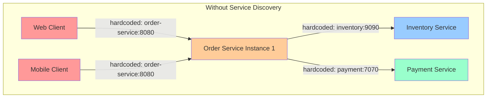
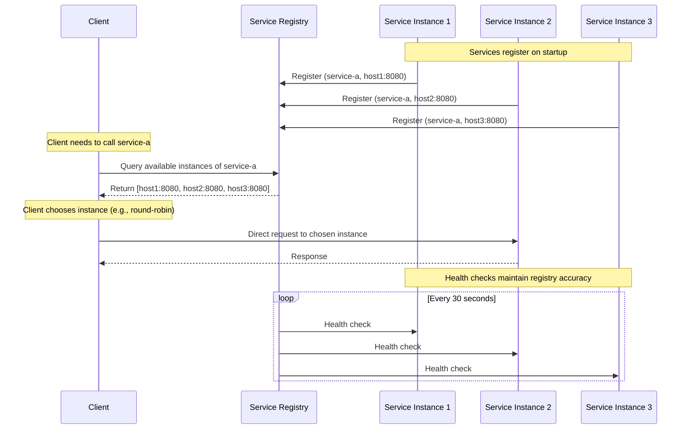
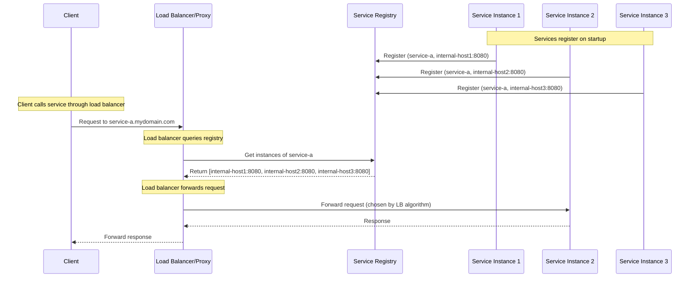
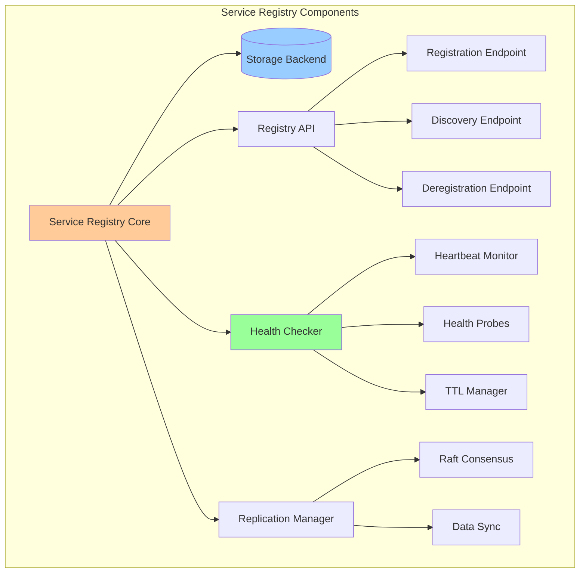
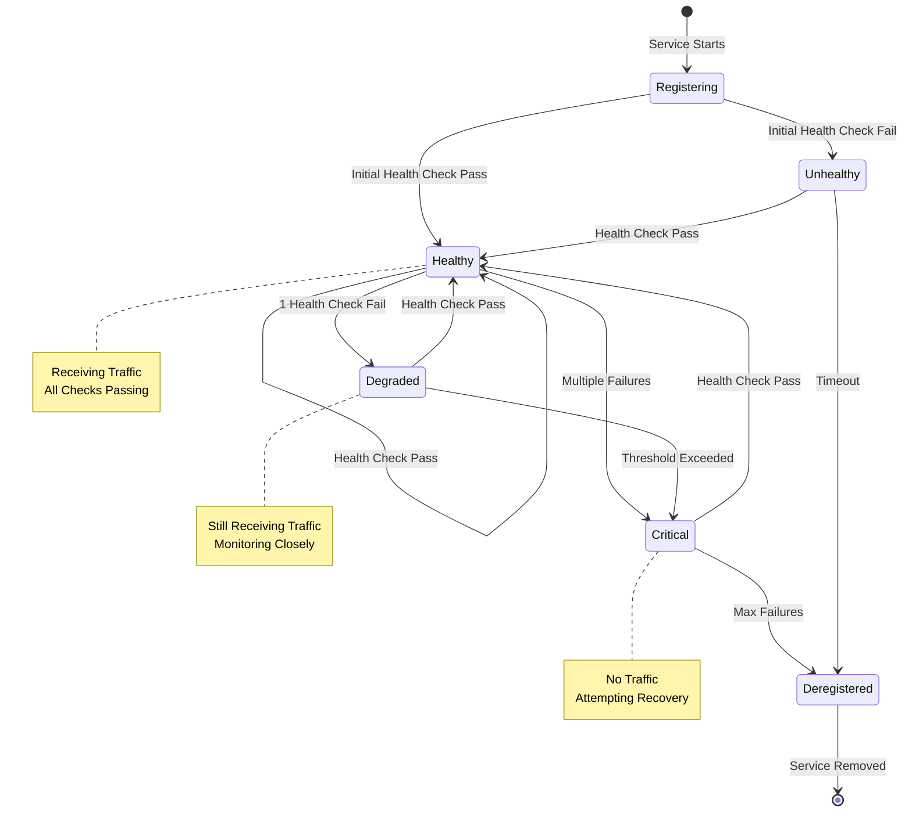
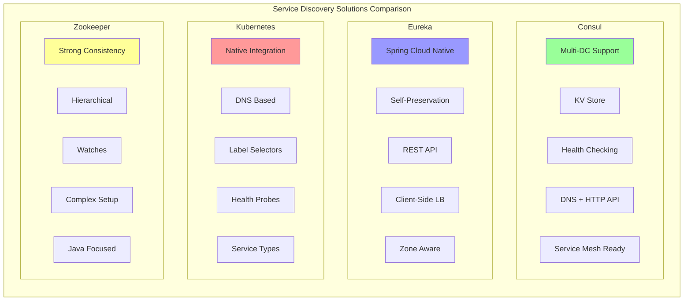

## Introduction: The Challenge of Dynamic Service Communication

In the world of microservices, services are born, live, and die dynamically. They scale up during peak loads, move across hosts during deployments, and disappear during failures. In this constantly shifting landscape, how do services find and communicate with each other?

Traditional approaches of hardcoding hostnames and ports break down quickly in such dynamic environments. This is where the Service Discovery pattern comes to the rescue, providing a robust solution for services to dynamically locate and communicate with each other.

## Understanding Service Discovery

Service Discovery is a pattern that enables services to find and communicate with each other without hard-coding hostname and port information. At its core, it consists of three main components:

1. **Service Registry**: A central database storing service instances, locations, and metadata
2. **Service Registration**: Mechanisms for services to register themselves when they start up
3. **Service Discovery**: Methods for clients to find available service instances

### The Problem It Solves

Consider a simple e-commerce system with the following challenges:



Problems with this approach:

- Single points of failure
- No load balancing
- Manual configuration updates
- No health checking
- Difficult to scale or move services

## Client-Side vs Server-Side Discovery

There are two primary approaches to implementing service discovery:

### Client-Side Discovery Pattern

In client-side discovery, the client is responsible for determining the network locations of available service instances and load balancing requests across them.



**Advantages:**

- Simple architecture
- Client controls load balancing strategy
- No additional network hops
- Lower latency

**Disadvantages:**

- Clients must implement discovery logic
- Language-specific client libraries needed
- More complex client code

### Server-Side Discovery Pattern

In server-side discovery, clients make requests via a load balancer, which queries the service registry and forwards requests to available instances.



**Advantages:**

- Simpler clients
- Centralized load balancing logic
- Language agnostic
- Easy to add features (caching, retry, circuit breaking)

**Disadvantages:**

- Additional network hop
- Load balancer can become bottleneck
- More infrastructure to manage

## Service Registry Implementation

The service registry is the heart of the service discovery pattern. Let's explore how different systems implement this critical component.

### Key Features of a Service Registry



### Essential Registry Operations

1. **Service Registration**

   ```json
   POST /v1/agent/service/register
   {
     "ID": "order-service-node1",
     "Name": "order-service",
     "Tags": ["primary", "v1.0.0"],
     "Address": "192.168.1.10",
     "Port": 8080,
     "Check": {
       "HTTP": "http://192.168.1.10:8080/health",
       "Interval": "10s"
     }
   }
   ```

2. **Service Discovery**
   ```json
   GET /v1/catalog/service/order-service
   [
     {
       "ID": "order-service-node1",
       "Service": "order-service",
       "Tags": ["primary", "v1.0.0"],
       "Address": "192.168.1.10",
       "Port": 8080,
       "Status": "passing"
     },
     {
       "ID": "order-service-node2",
       "Service": "order-service",
       "Tags": ["secondary", "v1.0.0"],
       "Address": "192.168.1.11",
       "Port": 8080,
       "Status": "passing"
     }
   ]
   ```

## Health Checking Mechanisms

Health checking is crucial for maintaining an accurate service registry. Services that are registered but unhealthy should not receive traffic.



### Types of Health Checks

1. **HTTP Health Checks**

   ```go
   // Simple HTTP health endpoint
   func healthHandler(w http.ResponseWriter, r *http.Request) {
       // Check database connection
       if err := db.Ping(); err != nil {
           w.WriteHeader(http.StatusServiceUnavailable)
           json.NewEncoder(w).Encode(map[string]string{
               "status": "unhealthy",
               "reason": "database unavailable",
           })
           return
       }

       // Check other dependencies
       if !checkRedisConnection() {
           w.WriteHeader(http.StatusServiceUnavailable)
           json.NewEncoder(w).Encode(map[string]string{
               "status": "degraded",
               "reason": "cache unavailable",
           })
           return
       }

       w.WriteHeader(http.StatusOK)
       json.NewEncoder(w).Encode(map[string]string{
           "status": "healthy",
           "version": "1.0.0",
           "uptime": getUptime(),
       })
   }
   ```

2. **TCP Health Checks**

   - Simple connection test
   - Lower overhead than HTTP
   - Good for non-HTTP services

3. **Script-Based Health Checks**
   - Custom health validation logic
   - Can check complex conditions
   - Useful for legacy systems

## Load Balancing Strategies

Once services are discovered, load balancing ensures requests are distributed effectively across instances.

```mermaid
graph TD
    subgraph "Load Balancing Strategies"
        Client[Client Request]

        Client --> LB{Load Balancer}

        LB -->|Round Robin| RR[1→2→3→1→2→3]
        LB -->|Weighted| W[1(50%)→2(30%)→3(20%)]
        LB -->|Least Connections| LC[Choose Least Busy]
        LB -->|Random| R[Random Selection]
        LB -->|IP Hash| IP[Consistent by Client IP]
        LB -->|Response Time| RT[Fastest Response]

        RR --> Instances1[Service Instances]
        W --> Instances2[Service Instances]
        LC --> Instances3[Service Instances]
        R --> Instances4[Service Instances]
        IP --> Instances5[Service Instances]
        RT --> Instances6[Service Instances]
    end

    style Client fill:#ff9999
    style LB fill:#ffcc99
```

### Advanced Load Balancing Features

1. **Circuit Breaking Integration**

   ```yaml
   # Resilience4j configuration with service discovery
   resilience4j:
     circuitbreaker:
       instances:
         order-service:
           registerHealthIndicator: true
           slidingWindowSize: 10
           failureRateThreshold: 50
           waitDurationInOpenState: 10s
   ```

2. **Adaptive Load Balancing**

   - Monitors response times
   - Adjusts traffic based on performance
   - Prevents overloading slow instances

3. **Zone-Aware Load Balancing**
   - Prefers instances in same availability zone
   - Falls back to cross-zone only when necessary
   - Reduces latency and network costs

## Practical Examples

### Example 1: Consul Implementation

Consul provides a complete service discovery solution with built-in health checking and KV store.

```go
// Service Registration with Consul
package main

import (
    "fmt"
    "github.com/hashicorp/consul/api"
    "net/http"
)

func registerService() error {
    config := api.DefaultConfig()
    client, err := api.NewClient(config)
    if err != nil {
        return err
    }

    registration := &api.AgentServiceRegistration{
        ID:      "order-service-1",
        Name:    "order-service",
        Port:    8080,
        Address: "192.168.1.100",
        Tags:    []string{"v1", "primary"},
        Check: &api.AgentServiceCheck{
            HTTP:                           "http://192.168.1.100:8080/health",
            Interval:                       "10s",
            Timeout:                        "3s",
            DeregisterCriticalServiceAfter: "30s",
        },
    }

    return client.Agent().ServiceRegister(registration)
}

// Service Discovery
func discoverService(serviceName string) ([]*api.ServiceEntry, error) {
    config := api.DefaultConfig()
    client, err := api.NewClient(config)
    if err != nil {
        return nil, err
    }

    // Query for healthy instances only
    services, _, err := client.Health().Service(serviceName, "", true, nil)
    return services, err
}

// Client-side load balancing
type ServiceClient struct {
    serviceName string
    instances   []*api.ServiceEntry
    current     int
}

func (sc *ServiceClient) GetNextEndpoint() string {
    if len(sc.instances) == 0 {
        return ""
    }

    // Simple round-robin
    instance := sc.instances[sc.current]
    sc.current = (sc.current + 1) % len(sc.instances)

    return fmt.Sprintf("http://%s:%d",
        instance.Service.Address,
        instance.Service.Port)
}
```

### Example 2: Netflix Eureka with Spring Cloud

Eureka provides a REST-based service registry with Spring Cloud integration.

```java
// Application.java - Eureka Server
@SpringBootApplication
@EnableEurekaServer
public class EurekaServerApplication {
    public static void main(String[] args) {
        SpringApplication.run(EurekaServerApplication.class, args);
    }
}

// OrderService.java - Service Registration
@SpringBootApplication
@EnableEurekaClient
@RestController
public class OrderServiceApplication {

    @Value("${spring.application.name}")
    private String appName;

    @Autowired
    private EurekaClient eurekaClient;

    @GetMapping("/health")
    public ResponseEntity<Map<String, String>> health() {
        Map<String, String> status = new HashMap<>();
        status.put("status", "UP");
        status.put("service", appName);
        return ResponseEntity.ok(status);
    }

    public static void main(String[] args) {
        SpringApplication.run(OrderServiceApplication.class, args);
    }
}

// Client with Load Balancing
@Component
public class InventoryServiceClient {

    @Autowired
    private RestTemplate restTemplate;

    @LoadBalanced
    @Bean
    public RestTemplate restTemplate() {
        return new RestTemplate();
    }

    public Inventory checkInventory(String productId) {
        // Eureka + Ribbon handles service discovery and load balancing
        String url = "http://inventory-service/api/inventory/" + productId;
        return restTemplate.getForObject(url, Inventory.class);
    }
}
```

### Example 3: Kubernetes Native Service Discovery

Kubernetes provides built-in service discovery through DNS and service objects.

```yaml
# order-service-deployment.yaml
apiVersion: apps/v1
kind: Deployment
metadata:
  name: order-service
  labels:
    app: order-service
spec:
  replicas: 3
  selector:
    matchLabels:
      app: order-service
  template:
    metadata:
      labels:
        app: order-service
        version: v1.0.0
    spec:
      containers:
        - name: order-service
          image: mycompany/order-service:1.0.0
          ports:
            - containerPort: 8080
          livenessProbe:
            httpGet:
              path: /health
              port: 8080
            initialDelaySeconds: 30
            periodSeconds: 10
          readinessProbe:
            httpGet:
              path: /ready
              port: 8080
            initialDelaySeconds: 5
            periodSeconds: 5
---
# order-service-service.yaml
apiVersion: v1
kind: Service
metadata:
  name: order-service
  labels:
    app: order-service
spec:
  selector:
    app: order-service
  ports:
    - port: 80
      targetPort: 8080
      protocol: TCP
  type: ClusterIP
---
# Client can discover using DNS
# http://order-service.default.svc.cluster.local
```

```go
// Go client using Kubernetes DNS
package main

import (
    "fmt"
    "net/http"
    "os"
)

func callOrderService() (*http.Response, error) {
    // Kubernetes DNS provides service discovery
    // Format: <service-name>.<namespace>.svc.cluster.local
    namespace := os.Getenv("NAMESPACE")
    if namespace == "" {
        namespace = "default"
    }

    url := fmt.Sprintf("http://order-service.%s.svc.cluster.local/api/orders", namespace)
    return http.Get(url)
}

// Using Kubernetes client-go for advanced discovery
import (
    "context"
    "k8s.io/client-go/kubernetes"
    "k8s.io/client-go/rest"
    metav1 "k8s.io/apimachinery/pkg/apis/meta/v1"
)

func discoverEndpoints() ([]string, error) {
    config, err := rest.InClusterConfig()
    if err != nil {
        return nil, err
    }

    clientset, err := kubernetes.NewForConfig(config)
    if err != nil {
        return nil, err
    }

    endpoints, err := clientset.CoreV1().
        Endpoints("default").
        Get(context.TODO(), "order-service", metav1.GetOptions{})

    if err != nil {
        return nil, err
    }

    var addresses []string
    for _, subset := range endpoints.Subsets {
        for _, addr := range subset.Addresses {
            for _, port := range subset.Ports {
                addresses = append(addresses,
                    fmt.Sprintf("%s:%d", addr.IP, port.Port))
            }
        }
    }

    return addresses, nil
}
```

## Comparison of Service Discovery Solutions



### Decision Matrix

| Feature               | Consul     | Eureka     | Kubernetes | Zookeeper  |
| --------------------- | ---------- | ---------- | ---------- | ---------- |
| **Ease of Setup**     | ⭐⭐⭐⭐   | ⭐⭐⭐⭐⭐ | ⭐⭐⭐     | ⭐⭐       |
| **Multi-DC Support**  | ⭐⭐⭐⭐⭐ | ⭐⭐       | ⭐⭐⭐     | ⭐⭐⭐     |
| **Health Checking**   | ⭐⭐⭐⭐⭐ | ⭐⭐⭐⭐   | ⭐⭐⭐⭐   | ⭐⭐⭐     |
| **Consistency Model** | ⭐⭐⭐⭐   | ⭐⭐⭐     | ⭐⭐⭐     | ⭐⭐⭐⭐⭐ |
| **Language Support**  | ⭐⭐⭐⭐⭐ | ⭐⭐⭐     | ⭐⭐⭐⭐⭐ | ⭐⭐⭐     |
| **Cloud Native**      | ⭐⭐⭐⭐   | ⭐⭐⭐     | ⭐⭐⭐⭐⭐ | ⭐⭐       |
| **Service Mesh**      | ⭐⭐⭐⭐⭐ | ⭐⭐       | ⭐⭐⭐⭐   | ⭐         |

## Best Practices for Service Discovery

### 1. Implement Comprehensive Health Checks

```go
type HealthChecker struct {
    checks []HealthCheck
}

type HealthCheck interface {
    Name() string
    Check() error
}

func (hc *HealthChecker) RunChecks() HealthStatus {
    status := HealthStatus{
        Status: "healthy",
        Checks: make(map[string]CheckResult),
    }

    for _, check := range hc.checks {
        result := CheckResult{Name: check.Name()}
        if err := check.Check(); err != nil {
            result.Status = "unhealthy"
            result.Error = err.Error()
            status.Status = "unhealthy"
        } else {
            result.Status = "healthy"
        }
        status.Checks[check.Name()] = result
    }

    return status
}
```

### 2. Use Caching Wisely

```go
type ServiceCache struct {
    cache sync.Map
    ttl   time.Duration
}

type CachedService struct {
    Instances []ServiceInstance
    CachedAt  time.Time
}

func (sc *ServiceCache) GetService(name string) ([]ServiceInstance, bool) {
    if cached, ok := sc.cache.Load(name); ok {
        cs := cached.(CachedService)
        if time.Since(cs.CachedAt) < sc.ttl {
            return cs.Instances, true
        }
        sc.cache.Delete(name)
    }
    return nil, false
}
```

### 3. Handle Failures Gracefully

```go
func DiscoverWithFallback(serviceName string) ([]ServiceInstance, error) {
    // Try primary discovery method
    instances, err := primaryDiscovery.Discover(serviceName)
    if err == nil && len(instances) > 0 {
        return instances, nil
    }

    // Fallback to cache
    if cached, ok := cache.Get(serviceName); ok {
        log.Warn("Using cached instances due to discovery failure")
        return cached, nil
    }

    // Last resort: static configuration
    if static := config.GetStaticEndpoints(serviceName); len(static) > 0 {
        log.Warn("Using static configuration")
        return static, nil
    }

    return nil, fmt.Errorf("service discovery failed for %s", serviceName)
}
```

### 4. Monitor Service Discovery Metrics

```go
var (
    discoveryRequests = prometheus.NewCounterVec(
        prometheus.CounterOpts{
            Name: "service_discovery_requests_total",
            Help: "Total number of service discovery requests",
        },
        []string{"service", "method"},
    )

    discoveryLatency = prometheus.NewHistogramVec(
        prometheus.HistogramOpts{
            Name: "service_discovery_duration_seconds",
            Help: "Service discovery request duration",
        },
        []string{"service", "method"},
    )

    healthyInstances = prometheus.NewGaugeVec(
        prometheus.GaugeOpts{
            Name: "service_instances_healthy",
            Help: "Number of healthy service instances",
        },
        []string{"service"},
    )
)
```

## Common Pitfalls and How to Avoid Them

### 1. Not Handling Registry Failures

**Problem**: Service registry becomes unavailable, bringing down the entire system.

**Solution**: Implement fallback mechanisms and caching:

```go
type ResilientDiscovery struct {
    primary   ServiceDiscovery
    fallback  ServiceDiscovery
    cache     *ServiceCache
    circuit   *CircuitBreaker
}
```

### 2. Ignoring Network Partitions

**Problem**: Split-brain scenarios where different parts of the system have different views.

**Solution**: Use consensus protocols and implement conflict resolution:

```yaml
consul:
  raft:
    protocol: 3
    heartbeat_timeout: 1000ms
    election_timeout: 1000ms
    snapshot_interval: 30s
```

### 3. Overlooking Security

**Problem**: Service discovery exposes internal topology to potential attackers.

**Solution**: Implement authentication and encryption:

```go
// TLS for service communication
tlsConfig := &tls.Config{
    Certificates: []tls.Certificate{cert},
    ClientAuth:   tls.RequireAndVerifyClientCert,
    ClientCAs:    caCertPool,
}
```

## Future of Service Discovery

### Service Mesh Integration

Modern service meshes like Istio and Linkerd are abstracting service discovery behind sophisticated proxies:

```yaml
# Istio VirtualService
apiVersion: networking.istio.io/v1beta1
kind: VirtualService
metadata:
  name: order-service
spec:
  hosts:
    - order-service
  http:
    - match:
        - headers:
            version:
              exact: v2
      route:
        - destination:
            host: order-service
            subset: v2
    - route:
        - destination:
            host: order-service
            subset: v1
          weight: 90
        - destination:
            host: order-service
            subset: v2
          weight: 10
```

### Edge Computing and IoT

Service discovery is evolving to handle:

- Geo-distributed services
- Mobile and intermittent connectivity
- Resource-constrained devices
- Edge-to-cloud communication

## Conclusion

Service Discovery is a fundamental pattern for building resilient microservices architectures. Whether you choose client-side or server-side discovery, Consul, Eureka, or Kubernetes-native solutions, the key is to:

1. Implement robust health checking
2. Plan for failure scenarios
3. Monitor discovery operations
4. Choose the right tool for your infrastructure
5. Consider future scalability needs

As systems become more distributed and dynamic, service discovery will continue to evolve, but the core principle remains: services need a reliable way to find and communicate with each other in an ever-changing environment.

## Further Reading

- [Consul Documentation](https://www.consul.io/docs)
- [Spring Cloud Netflix](https://spring.io/projects/spring-cloud-netflix)
- [Kubernetes Service Discovery](https://kubernetes.io/docs/concepts/services-networking/service/)
- [Service Mesh Comparison](https://servicemesh.io/)
- [CAP Theorem and Service Discovery](https://martin.kleppmann.com/2015/05/11/please-stop-calling-databases-cp-or-ap.html)

---

_Have questions or experiences with service discovery? Share your thoughts in the comments below or reach out on Twitter [@anubhavgain](https://twitter.com/anubhavgain)._
