## Table of Contents

## Introduction

Microsoft Copilot represents a paradigm shift in how AI assistants integrate into enterprise workflows. This comprehensive guide explores Copilot's architecture, security framework, and implementation strategies for organizations looking to leverage AI while maintaining security and compliance standards.

## Core Concepts and Vision

Microsoft Copilot is built on foundational principles that guide its development and deployment:

```mermaid
graph TB
    subgraph "Microsoft Copilot Core"
        A[Microsoft Copilot]
        A --> B[Core Purpose]
        A --> C[Key Characteristics]
        A --> D[Underlying Principles]
        A --> E[Future Vision]
    end
    
    subgraph "Core Purpose"
        B --> B1[Helping People<br/>Achieve More]
        B --> B2[Unleashing<br/>Human Ambition]
        B --> B3[Democratizing AI]
        B --> B4[Transforming<br/>Work & Life]
    end
    
    subgraph "Key Characteristics"
        C --> C1[AI Companion]
        C --> C2[Trusted Advisor]
        C --> C3[World-Class Coach]
        C --> C4[Personal Assistant]
        C --> C5[Personalized]
        C --> C6[Proactive<br/>Future State]
    end
    
    subgraph "Underlying Principles"
        D --> D1[Built on Trust]
        D --> D2[Privacy & Security]
        D --> D3[Continuous<br/>Improvement]
        D --> D4[User Feedback<br/>Driven]
    end
    
    subgraph "Future Vision"
        E --> E1[Rich Memory]
        E --> E2[Adapting to<br/>Individuals]
        E --> E3[Customizable<br/>Appearance]
        E --> E4[Multi-Modal<br/>Interactions]
    end
    
    style A fill:#0078d4,color:#fff
    style B1 fill:#40e0d0,color:#000
    style C1 fill:#ff6b6b,color:#fff
    style D1 fill:#4ecdc4,color:#000
    style E1 fill:#f7b731,color:#000
```

## Functionality and Features

Microsoft Copilot offers comprehensive capabilities across development and productivity domains:

```mermaid
graph TB
    subgraph "Copilot Capabilities"
        A[Microsoft Copilot<br/>Functionality]
        A --> B[For Developers]
        A --> C[General Assistance<br/>& Productivity]
    end
    
    subgraph "Developer Features"
        B --> B1[Code Completion<br/>GitHub Integration]
        B --> B2[Chat &<br/>Multi-file Edits]
        B --> B3[AI Agents]
        B --> B4[Agent Mode<br/>VS Code]
        B --> B5[Code Review<br/>Agent]
        B --> B6[Agent Factory<br/>Foundry]
        B --> B7[Multi-Agent<br/>Framework]
        B --> B8[Dev Tools<br/>Eval, Fine-tuning]
        B --> B9[App Building<br/>GitHub Spark]
    end
    
    subgraph "Productivity Features"
        C --> C1[Question Answering<br/>& Information]
        C --> C2[Task Structuring]
        C --> C3[Advice & Support]
        C --> C4[Enhanced Search]
        C --> C5[Personalized<br/>Podcasts]
        C --> C6[Shopping<br/>Assistance]
        C --> C7[Copilot Vision<br/>Image Understanding]
        C --> C8[Deep Research<br/>& Reporting]
        C --> C9[Practical Tasks<br/>Forms, Letters]
        C --> C10[Collaborative Writing<br/>Copilot Pages]
        C --> C11[PC Control]
        C --> C12[M365 Integration<br/>Analyst Agents]
        C --> C13[Custom Agents<br/>Copilot Studio]
        C --> C14[Communication<br/>Improvement]
        C --> C15[Problem Solving<br/>& Unblocking]
        C --> C16[Facilitating<br/>Learning]
    end
    
    style A fill:#0078d4,color:#fff
    style B1 fill:#24292e,color:#fff
    style C1 fill:#107c10,color:#fff
```

## Technical Architecture

### High-Level Architecture

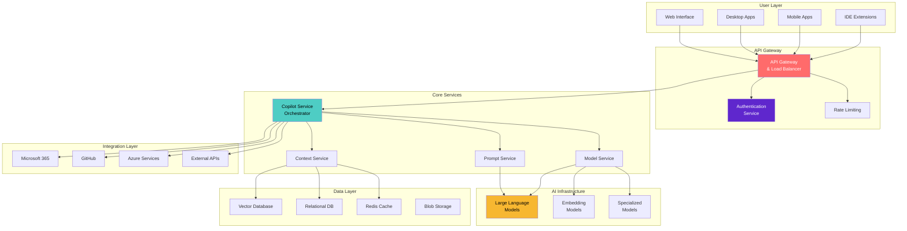

### Data Flow Architecture

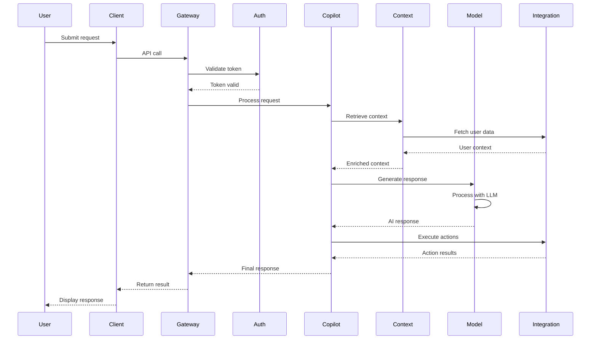

## Security Framework

Security is paramount in Microsoft Copilot's design:

```mermaid
graph TB
    subgraph "Security Architecture"
        A[Security Framework]
        A --> B[Authentication<br/>& Access]
        A --> C[Data Protection]
        A --> D[Compliance<br/>& Governance]
        A --> E[Implementation<br/>Security]
    end
    
    subgraph "Auth & Access"
        B --> B1[Multi-factor<br/>Authentication]
        B --> B2[Role-based<br/>Access Control]
        B --> B3[Zero Trust<br/>Security Model]
        B --> B4[Session Management<br/>& Timeouts]
        B --> B5[Conditional<br/>Access]
    end
    
    subgraph "Data Protection"
        C --> C1[Encryption<br/>Transit & Rest]
        C --> C2[Data Sovereignty<br/>Controls]
        C --> C3[Information Rights<br/>Management]
        C --> C4[DLP Integration]
        C --> C5[Secure Prompt<br/>Handling]
        C --> C6[Data Residency]
    end
    
    subgraph "Compliance"
        D --> D1[Audit Logging<br/>& Monitoring]
        D --> D2[Regulatory<br/>Compliance]
        D --> D3[Risk Assessment<br/>Framework]
        D --> D4[AI Ethics &<br/>Responsible Use]
        D --> D5[Privacy Controls]
    end
    
    subgraph "Implementation"
        E --> E1[Secure API<br/>Management]
        E --> E2[Container<br/>Security]
        E --> E3[Threat Detection<br/>& Response]
        E --> E4[Vulnerability<br/>Management]
        E --> E5[Secure Development<br/>Lifecycle]
    end
    
    style A fill:#dc3545,color:#fff
    style B1 fill:#28a745,color:#fff
    style C1 fill:#17a2b8,color:#fff
    style D2 fill:#ffc107,color:#000
```

### Zero Trust Architecture

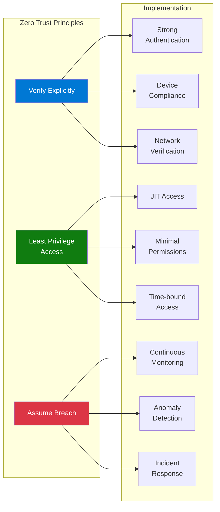

## Enterprise Integration Architecture

### Integration Patterns

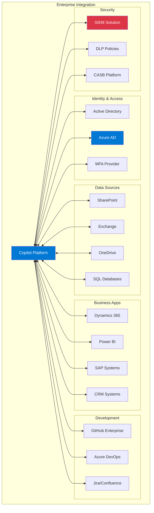

### Deployment Architecture

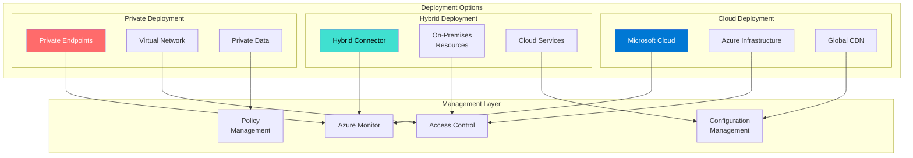

## Implementation Guide

### Phase 1: Assessment and Planning

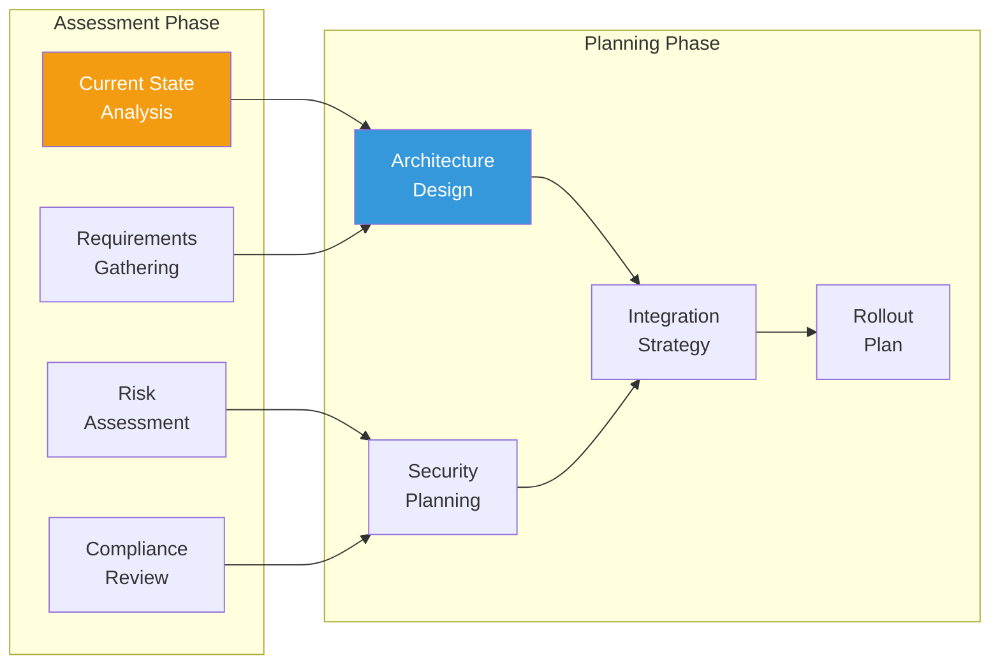

### Phase 2: Technical Implementation

```yaml
# Example Copilot Configuration
copilot:
  deployment:
    type: "enterprise"
    region: "eastus"
    compliance: ["GDPR", "HIPAA", "SOC2"]
  
  security:
    authentication:
      provider: "AzureAD"
      mfa: required
      conditional_access: enabled
    
    data_protection:
      encryption_at_rest: "AES-256"
      encryption_in_transit: "TLS 1.3"
      data_residency: "US"
    
    dlp:
      enabled: true
      policies:
        - name: "PII Protection"
          action: "block"
          conditions:
            - "credit_card"
            - "ssn"
            - "passport"
    
  integration:
    microsoft_365:
      enabled: true
      services: ["SharePoint", "Exchange", "Teams"]
    
    github:
      enabled: true
      enterprise_server: "github.company.com"
      auth_method: "oauth"
    
    custom_connectors:
      - name: "SAP Integration"
        endpoint: "https://sap.company.com/api"
        auth: "certificate"
      - name: "Salesforce"
        endpoint: "https://company.my.salesforce.com"
        auth: "oauth2"
  
  monitoring:
    azure_monitor:
      enabled: true
      workspace_id: "xxxx-xxxx-xxxx"
    
    metrics:
      - "request_count"
      - "response_time"
      - "error_rate"
      - "token_usage"
    
    alerts:
      - metric: "error_rate"
        threshold: 0.05
        action: "email"
      - metric: "response_time"
        threshold: 2000
        action: "ticket"
```

### Phase 3: Security Configuration

```powershell
# PowerShell script for Copilot security configuration

# Set up conditional access policy
$policy = New-AzureADMSConditionalAccessPolicy `
    -DisplayName "Copilot Access Policy" `
    -State "Enabled" `
    -Conditions @{
        Applications = @{
            IncludeApplications = @("Copilot-App-ID")
        }
        Users = @{
            IncludeGroups = @("Copilot-Users")
            ExcludeGroups = @("Copilot-Admins")
        }
        Locations = @{
            IncludeLocations = @("AllTrusted")
            ExcludeLocations = @("Restricted-Countries")
        }
    } `
    -GrantControls @{
        Operator = "AND"
        BuiltInControls = @("Mfa", "CompliantDevice")
    }

# Configure DLP policy
$dlpPolicy = New-DlpCompliancePolicy `
    -Name "Copilot DLP Policy" `
    -ExchangeLocation "All" `
    -SharePointLocation "All" `
    -TeamsLocation "All" `
    -Mode "Enable"

# Set up audit logging
Set-AdminAuditLogConfig `
    -UnifiedAuditLogIngestionEnabled $true `
    -AdminAuditLogEnabled $true `
    -AdminAuditLogCmdlets @("*Copilot*")

# Configure data retention
Set-RetentionCompliancePolicy `
    -Name "Copilot Data Retention" `
    -RetentionDuration "Days" `
    -RetentionDurationDisplayHint "365"
```

## Monitoring and Observability

### Monitoring Architecture

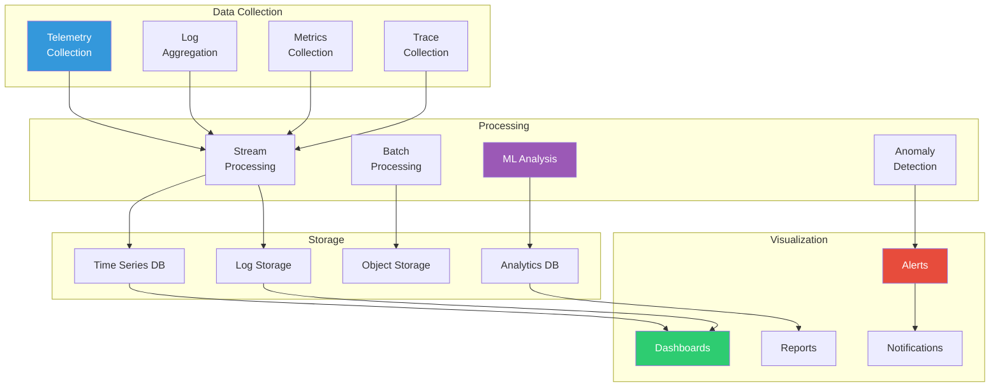

### Key Metrics and KPIs

```yaml
# Copilot Monitoring Metrics
metrics:
  performance:
    - name: "response_time_p95"
      threshold: 2000ms
      alert: true
    - name: "throughput"
      threshold: 1000 req/s
      alert: false
    - name: "error_rate"
      threshold: 0.01
      alert: true
  
  usage:
    - name: "daily_active_users"
      threshold: null
      alert: false
    - name: "requests_per_user"
      threshold: 1000
      alert: true
    - name: "feature_adoption"
      threshold: 0.7
      alert: false
  
  security:
    - name: "failed_auth_attempts"
      threshold: 10
      alert: true
    - name: "dlp_violations"
      threshold: 0
      alert: true
    - name: "anomalous_behavior"
      threshold: 5
      alert: true
  
  ai_quality:
    - name: "response_accuracy"
      threshold: 0.95
      alert: true
    - name: "user_satisfaction"
      threshold: 0.9
      alert: true
    - name: "harmful_content_blocked"
      threshold: 0.999
      alert: true
```

## Best Practices

### Security Best Practices

1. **Identity and Access Management**
   ```yaml
   iam_best_practices:
     - Enable MFA for all users
     - Implement conditional access policies
     - Use privileged identity management
     - Regular access reviews
     - Just-in-time access provisioning
   ```

2. **Data Protection**
   ```yaml
   data_protection:
     - Classify and label sensitive data
     - Implement DLP policies
     - Enable encryption everywhere
     - Regular data audits
     - Secure data disposal procedures
   ```

3. **Monitoring and Response**
   ```yaml
   monitoring:
     - Real-time security monitoring
     - Automated threat response
     - Regular security assessments
     - Incident response planning
     - Continuous compliance monitoring
   ```

### Integration Best Practices

1. **API Management**
   ```yaml
   api_management:
     - Use API gateways
     - Implement rate limiting
     - Version your APIs
     - Monitor API usage
     - Secure API keys
   ```

2. **Data Integration**
   ```yaml
   data_integration:
     - Use standardized connectors
     - Implement data validation
     - Handle errors gracefully
     - Monitor data quality
     - Respect data sovereignty
   ```

### Operational Best Practices

1. **Change Management**
   ```yaml
   change_management:
     - Gradual rollout strategy
     - User training programs
     - Clear communication plans
     - Feedback mechanisms
     - Success metrics tracking
   ```

2. **Performance Optimization**
   ```yaml
   optimization:
     - Cache frequently used data
     - Optimize prompt engineering
     - Implement request batching
     - Use content delivery networks
     - Regular performance tuning
   ```

## Compliance Considerations

### Regulatory Compliance Matrix

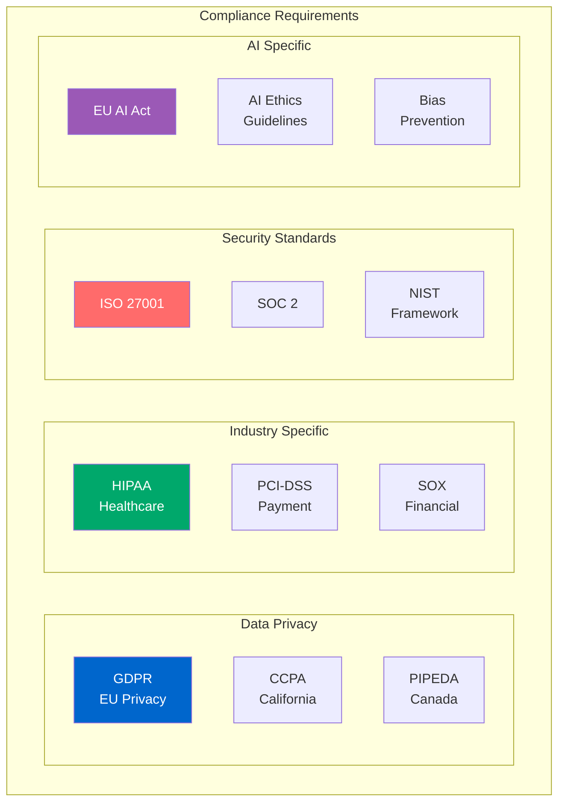

### Compliance Implementation

```yaml
# Compliance Configuration
compliance:
  gdpr:
    enabled: true
    requirements:
      - data_minimization: true
      - purpose_limitation: true
      - consent_management: true
      - right_to_erasure: true
      - data_portability: true
    
  hipaa:
    enabled: true
    requirements:
      - access_controls: "role-based"
      - audit_controls: "comprehensive"
      - integrity_controls: "enabled"
      - transmission_security: "TLS 1.3"
      - encryption: "AES-256"
    
  ai_governance:
    transparency:
      - model_documentation: required
      - decision_explainability: enabled
      - bias_monitoring: continuous
    
    accountability:
      - human_oversight: required
      - appeal_process: defined
      - impact_assessments: quarterly
```

## Troubleshooting Guide

### Common Issues and Solutions

1. **Authentication Failures**
   ```bash
   # Check Azure AD connectivity
   Test-AzureADConnectivity
   
   # Verify token validation
   Get-AzureADServicePrincipal -Filter "DisplayName eq 'Copilot'"
   
   # Review conditional access policies
   Get-AzureADMSConditionalAccessPolicy | Where-Object {$_.DisplayName -like "*Copilot*"}
   ```

2. **Performance Issues**
   ```yaml
   performance_diagnostics:
     - Check network latency
     - Review resource utilization
     - Analyze query patterns
     - Optimize caching strategy
     - Scale infrastructure
   ```

3. **Integration Problems**
   ```powershell
   # Test connectivity
   Test-NetConnection -ComputerName "api.copilot.microsoft.com" -Port 443
   
   # Verify API permissions
   Get-AzureADServicePrincipalOAuth2PermissionGrant
   
   # Check integration logs
   Get-WinEvent -LogName "Application" | Where-Object {$_.Message -like "*Copilot*"}
   ```

## Future Roadmap

### Upcoming Features

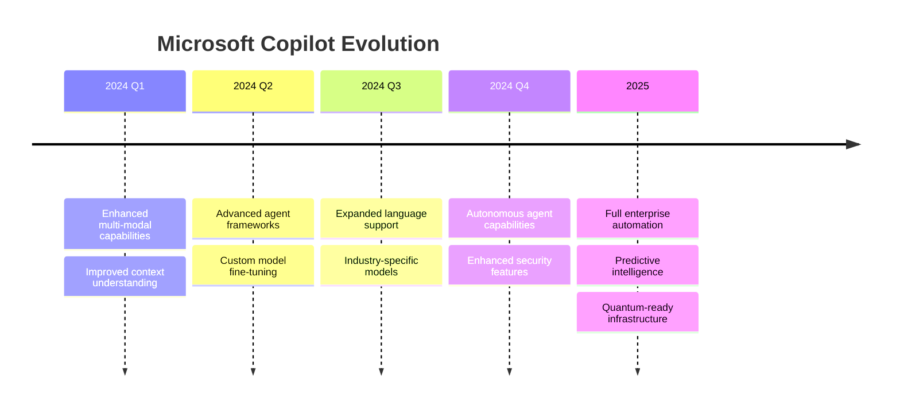

## Cost Optimization

### Cost Management Strategy

```yaml
cost_optimization:
  usage_monitoring:
    - Track token consumption
    - Monitor API calls
    - Analyze user patterns
    - Identify inefficiencies
  
  optimization_techniques:
    - Implement caching
    - Use appropriate model sizes
    - Batch operations
    - Schedule non-critical tasks
  
  budget_controls:
    - Set spending limits
    - Alert on anomalies
    - Regular cost reviews
    - Optimize licensing
```

## Conclusion

Microsoft Copilot represents a comprehensive AI platform that requires careful planning for enterprise deployment. Key considerations include:

1. **Security First**: Implement robust security controls at every layer
2. **Compliance Ready**: Ensure regulatory requirements are met
3. **Integration Focused**: Plan for seamless integration with existing systems
4. **User-Centric**: Prioritize user experience and adoption
5. **Continuously Evolving**: Stay updated with new features and capabilities

Success with Copilot requires a balance between innovation and control, enabling AI capabilities while maintaining enterprise security and compliance standards. Organizations that thoughtfully implement these architectural patterns and security frameworks will be best positioned to leverage AI for competitive advantage while managing risks effectively.