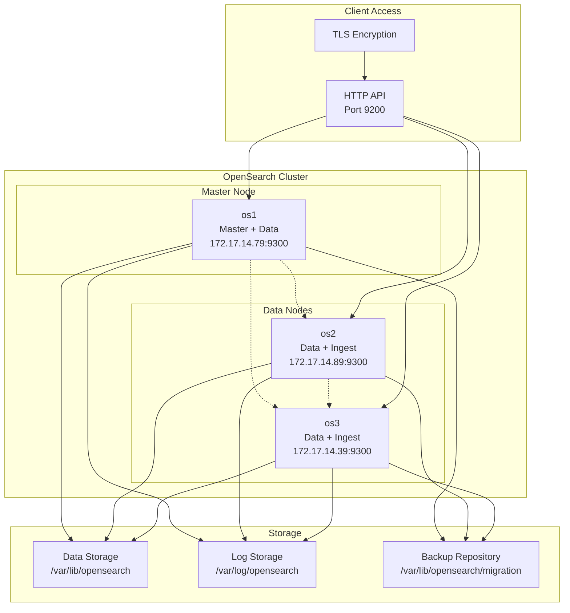

# OpenSearch Cluster Configuration: Master and Data Node Setup Guide

This comprehensive guide covers the configuration of a production-ready OpenSearch cluster with proper node roles, security settings, and performance optimizations. The configuration shown here demonstrates a three-node cluster setup with one master node and two data nodes.

## Overview

OpenSearch is a powerful, open-source search and analytics engine that evolved from Elasticsearch. Setting up a properly configured cluster is essential for high availability, performance, and security in production environments.

## Basic Cluster Configuration

### Master Node Configuration (os1)

The master node is responsible for cluster management, node coordination, and maintaining cluster state. Here's the configuration for the primary master node:

```yaml
# Basic cluster configuration
cluster.name: opensearch-cluster
node.name: os1
node.roles: [cluster_manager, data]
network.host: 0.0.0.0
http.port: 9200
transport.port: 9300

# Discovery settings
discovery.seed_hosts:
  ["172.17.14.79:9300", "172.17.14.89:9300", "172.17.14.39:9300"]
cluster.initial_master_nodes: ["os1"]

# Repo for Migration
path.repo: /var/lib/opensearch/migration

# Memory and path settings
bootstrap.memory_lock: true
path.data: /var/lib/opensearch
path.logs: /var/log/opensearch

# Performance settings
indices.memory.index_buffer_size: 5%
thread_pool.write.queue_size: 200
thread_pool.search.queue_size: 500
```

### Data Node Configuration (os2 & os3)

Data nodes handle the actual storage and search operations. Here's the configuration for data nodes:

```yaml
# Basic cluster configuration
cluster.name: opensearch-cluster
node.name: os2 # Change to os3 for the third node
node.roles: [data, ingest]
network.host: 0.0.0.0
http.port: 9200
transport.port: 9300

# Discovery settings
discovery.seed_hosts:
  ["172.17.14.79:9300", "172.17.14.89:9300", "172.17.14.39:9300"]
cluster.initial_master_nodes: ["os1"]

# Repo for opensearch migration
path.repo: /var/lib/opensearch/migration

# Memory and path settings
bootstrap.memory_lock: true
path.data: /var/lib/opensearch
path.logs: /var/log/opensearch

# Performance settings
indices.memory.index_buffer_size: 5%
thread_pool.write.queue_size: 200
thread_pool.search.queue_size: 500

# Node Configuration
node.max_local_storage_nodes: 3
```

## Security Configuration

### TLS/SSL Configuration

Security is paramount in production OpenSearch deployments. The following configuration enables TLS encryption for both transport and HTTP layers:

```yaml
# Security Configuration
plugins.security.ssl.transport.pemcert_filepath: certs/node.pem
plugins.security.ssl.transport.pemkey_filepath: certs/node-key.pem
plugins.security.ssl.transport.pemtrustedcas_filepath: certs/root-ca.pem
plugins.security.ssl.transport.enforce_hostname_verification: false
plugins.security.ssl.transport.resolve_hostname: false

plugins.security.ssl.http.enabled: true
plugins.security.ssl.http.pemcert_filepath: certs/node.pem
plugins.security.ssl.http.pemkey_filepath: certs/node-key.pem
plugins.security.ssl.http.pemtrustedcas_filepath: certs/root-ca.pem

plugins.security.allow_unsafe_democertificates: false
plugins.security.allow_default_init_securityindex: true
```

### Node Authentication

Proper node authentication ensures only authorized nodes can join the cluster:

```yaml
# List all nodes DN (Distinguished Names)
plugins.security.nodes_dn:
  - "CN=opensearch-1,OU=Invinsense,O=Invinsense,L=Ahmedabad,C=IN"
  - "CN=opensearch-2,OU=Invinsense,O=Invinsense,L=Ahmedabad,C=IN"
  - "CN=opensearch-3,OU=Invinsense,O=Invinsense,L=Ahmedabad,C=IN"

plugins.security.authcz.admin_dn:
  - "CN=admin,OU=Invinsense,O=Invinsense,L=Ahmedabad,C=IN"
  - "CN=opensearch-1,OU=Invinsense,O=Invinsense,L=Ahmedabad,C=IN"
```

### Audit and Monitoring Configuration

```yaml
plugins.security.audit.type: internal_opensearch
plugins.security.enable_snapshot_restore_privilege: true
plugins.security.check_snapshot_restore_write_privileges: true
plugins.security.restapi.roles_enabled:
  ["all_access", "security_rest_api_access"]
```

## System Indices Configuration

System indices are special indices used by OpenSearch plugins and features. Proper configuration ensures these indices are protected and managed correctly:

```yaml
# System indices configuration
plugins.security.system_indices.enabled: true
plugins.security.system_indices.indices:
  [
    ".plugins-ml-*",
    ".opendistro-alerting-*",
    ".opendistro-anomaly-*",
    ".opendistro-reports-*",
    ".opensearch-notifications-*",
    ".opensearch-notebooks",
    ".opensearch-observability",
    ".ql-datasources",
    ".opendistro-asynchronous-search-*",
    ".replication-metadata-store",
    ".opensearch-knn-models",
    ".geospatial-ip2geo-data*",
    ".plugins-flow-framework-*",
  ]
```

## Performance Optimization

### Memory Settings

Proper memory configuration is crucial for performance:

```yaml
# Memory optimization
bootstrap.memory_lock: true
indices.memory.index_buffer_size: 5%
```

**Important**: Set `ES_HEAP_SIZE` environment variable to 50% of available RAM (maximum 32GB).

### Thread Pool Configuration

Optimize thread pools for your workload:

```yaml
# Thread pool optimization
thread_pool.write.queue_size: 200
thread_pool.search.queue_size: 500
```

### Index Buffer Configuration

Control memory usage for indexing operations:

```yaml
# Index buffer settings
indices.memory.index_buffer_size: 5%
indices.memory.min_index_buffer_size: 48mb
indices.memory.max_index_buffer_size: 512mb
```

## Cluster Architecture Diagram



## Installation and Setup

### Prerequisites

```bash
# System requirements
# - Java 11 or later
# - Minimum 4GB RAM per node
# - Sufficient disk space for data and logs

# Install OpenSearch
wget https://artifacts.opensearch.org/releases/bundle/opensearch/2.x.x/opensearch-2.x.x-linux-x64.tar.gz
tar -xzf opensearch-2.x.x-linux-x64.tar.gz
```

### Directory Setup

```bash
# Create necessary directories
sudo mkdir -p /var/lib/opensearch
sudo mkdir -p /var/log/opensearch
sudo mkdir -p /var/lib/opensearch/migration
sudo mkdir -p /etc/opensearch/certs

# Set proper ownership
sudo chown -R opensearch:opensearch /var/lib/opensearch
sudo chown -R opensearch:opensearch /var/log/opensearch
sudo chown -R opensearch:opensearch /etc/opensearch
```

### Certificate Setup

Generate certificates for secure communication:

```bash
# Generate root CA
openssl genrsa -out root-ca-key.pem 2048
openssl req -new -x509 -sha256 -key root-ca-key.pem -out root-ca.pem -days 3650

# Generate node certificates
openssl genrsa -out node-key.pem 2048
openssl req -new -key node-key.pem -out node.csr
openssl x509 -req -in node.csr -CA root-ca.pem -CAkey root-ca-key.pem -CAcreateserial -sha256 -out node.pem -days 3650

# Generate admin certificate
openssl genrsa -out admin-key.pem 2048
openssl req -new -key admin-key.pem -out admin.csr
openssl x509 -req -in admin.csr -CA root-ca.pem -CAkey root-ca-key.pem -CAcreateserial -sha256 -out admin.pem -days 3650
```

## Cluster Management

### Health Checks

```bash
# Check cluster health
curl -k -u admin:password https://localhost:9200/_cluster/health?pretty

# Check node status
curl -k -u admin:password https://localhost:9200/_cat/nodes?v

# View cluster settings
curl -k -u admin:password https://localhost:9200/_cluster/settings?pretty
```

### Common Management Tasks

```bash
# List all indices
curl -k -u admin:password https://localhost:9200/_cat/indices?v

# Check cluster stats
curl -k -u admin:password https://localhost:9200/_cluster/stats?pretty

# Monitor thread pools
curl -k -u admin:password https://localhost:9200/_cat/thread_pool?v
```

## Migration and Backup

### Snapshot Configuration

The cluster is configured with a shared repository for backups:

```yaml
path.repo: /var/lib/opensearch/migration
```

### Creating Snapshots

```bash
# Register snapshot repository
curl -k -u admin:password -X PUT "https://localhost:9200/_snapshot/backup_repo" -H 'Content-Type: application/json' -d'
{
  "type": "fs",
  "settings": {
    "location": "/var/lib/opensearch/migration"
  }
}'

# Create snapshot
curl -k -u admin:password -X PUT "https://localhost:9200/_snapshot/backup_repo/snapshot_1" -H 'Content-Type: application/json' -d'
{
  "indices": "*",
  "ignore_unavailable": true,
  "include_global_state": false
}'
```

## Troubleshooting

### Common Issues

1. **Split Brain Prevention**: Always use odd number of master-eligible nodes
2. **Memory Issues**: Ensure `bootstrap.memory_lock: true` and adequate heap size
3. **Network Configuration**: Verify firewall rules allow traffic on ports 9200 and 9300
4. **Certificate Issues**: Check certificate paths and permissions

### Diagnostic Commands

```bash
# Check if memory locking is working
curl -k -u admin:password https://localhost:9200/_nodes/stats/process?pretty

# Verify security plugin status
curl -k -u admin:password https://localhost:9200/_plugins/_security/authinfo?pretty

# Check cluster allocation
curl -k -u admin:password https://localhost:9200/_cluster/allocation/explain?pretty
```

## Best Practices

### Production Recommendations

1. **Separate Master Nodes**: Use dedicated master nodes in large clusters
2. **Data Redundancy**: Configure at least 1 replica for each index
3. **Monitoring**: Implement comprehensive monitoring and alerting
4. **Backup Strategy**: Regular automated snapshots
5. **Security Hardening**: Regular certificate rotation and access reviews

### Performance Tuning

1. **JVM Settings**: Optimize heap size and garbage collection
2. **Index Settings**: Configure appropriate refresh intervals
3. **Shard Management**: Balance primary and replica shards
4. **Hardware**: Use SSD storage for better I/O performance

This configuration provides a solid foundation for a production OpenSearch cluster with proper security, performance optimization, and high availability features.
